## Capítulo IV: Product Design

### 4.1. Style Guidelines

En la siguiente sección se establecen las directrices de estilo que garantizan una presentación visual consistente y profesional en todos los artefactos del proyecto. Para lograrlo, el equipo ha creado un repositorio central de diseño dentro de la organización de GitHub.

Para lograrlo, el equipo ha creado un repositorio central de diseño dentro de la organización de GitHub bajo la carpeta:

/design-system/

Este repositorio contiene la paleta de colores oficial, tipografías, iconos, componentes UI reutilizables, guías de espaciado, assets gráficos y documentación de uso. El objetivo principal es mantener una experiencia unificada entre la Landing Page, la Web Application (Panel de Control) y la experiencia móvil, facilitando el trabajo colaborativo y asegurando que tanto los mecánicos/administradores como los clientes finales perciban la misma calidad, confianza y profesionalismo en la marca.

#### 4.1.1. General Style Guidelines

 Las decisiones generales de estilo se basan en los valores de marca de AutoService: confianza, profesionalismo, transparencia y modernidad tecnológica aplicada al sector automotriz. 

Branding y tono de comunicación

 • Tono: Profesional, claro, cercano y orientado a soluciones. Se evita lenguaje técnico excesivo para el cliente final, pero se mantiene rigor y precisión en la interfaz del taller.  • Personalidad de marca: Confiable, ordenada, moderna y empática.  • Valores visuales: Orden, claridad visual, jerarquía y un toque de dinamismo controlado que transmite progreso y control del servicio. 

  <table style="margin: auto; width: 100%; border-collapse: collapse; border: 1px solid #ddd;">
    <thead>
      <tr style="background-color: #f2f2f2;">
        <th style="padding: 12px; border: 1px solid #ddd; text-align: left;">Color</th>
        <th style="padding: 12px; border: 1px solid #ddd; text-align: center;">Hex</th>
        <th style="padding: 12px; border: 1px solid #ddd; text-align: left;">Significado y Justificación</th>
        <th style="padding: 12px; border: 1px solid #ddd; text-align: left;">Ejemplo de uso en la interfaz</th>
        <th style="padding: 12px; border: 1px solid #ddd; text-align: center;">Imagen</th>
      </tr>
    </thead>
    <tbody>
      <tr>
        <td style="padding: 12px; border: 1px solid #ddd; font-weight: bold;">Primary Blue</td>
        <td style="padding: 12px; border: 1px solid #ddd; font-family: monospace; text-align: center;">#0A2540</td>
        <td style="padding: 12px; border: 1px solid #ddd;">Representa confianza, profesionalismo y autoridad. Azul profundo que transmite estabilidad y seriedad, cualidades esenciales en un servicio técnico automotriz. Genera sensación de seguridad tanto para mecánicos como para clientes.</td>
        <td style="padding: 12px; border: 1px solid #ddd;">Sidebar izquierdo, navbar, botones principales (CTA), encabezados del Panel de Control.</td>
        <td style="padding: 12px; border: 1px solid #ddd; text-align: center;"></td>
      </tr>
      <tr>
        <td style="padding: 12px; border: 1px solid #ddd; font-weight: bold;">Secondary Teal</td>
        <td style="padding: 12px; border: 1px solid #ddd; font-family: monospace; text-align: center;">#00BFA5</td>
        <td style="padding: 12px; border: 1px solid #ddd;">Simboliza progreso, eficiencia y modernidad. El turquesa verdoso evoca movimiento positivo y finalización exitosa. Ideal para indicar avance y estados positivos.</td>
        <td style="padding: 12px; border: 1px solid #ddd;">Barra de progreso, badges “En curso”, indicadores de avance en tareas.</td>
        <td style="padding: 12px; border: 1px solid #ddd; text-align: center;"></td>
      </tr>
      <tr>
        <td style="padding: 12px; border: 1px solid #ddd; font-weight: bold;">Accent Orange</td>
        <td style="padding: 12px; border: 1px solid #ddd; font-family: monospace; text-align: center;">#FF6B00</td>
        <td style="padding: 12px; border: 1px solid #ddd;">Representa atención y urgencia. Color energético que capta la atención sin generar ansiedad. Reservado para elementos que requieren acción inmediata.</td>
        <td style="padding: 12px; border: 1px solid #ddd;">Notificaciones de alta prioridad, alertas</td>
        <td style="padding: 12px; border: 1px solid #ddd; text-align: center;"></td>
      </tr>
      <tr>
        <td style="padding: 12px; border: 1px solid #ddd; font-weight: bold;">Neutral Gray</td>
        <td style="padding: 12px; border: 1px solid #ddd; font-family: monospace; text-align: center;">#F4F4F5</td>
        <td style="padding: 12px; border: 1px solid #ddd;">Proporciona calma, orden y fondo limpio. Reduce la fatiga visual y permite que los elementos importantes resalten.</td>
        <td style="padding: 12px; border: 1px solid #ddd;">Fondo general del dashboard, tarjetas KPI y contenedores secundarios.</td>
        <td style="padding: 12px; border: 1px solid #ddd; text-align: center;"></td>
      </tr>
      <tr>
        <td style="padding: 12px; border: 1px solid #ddd; font-weight: bold;">Dark Gray</td>
        <td style="padding: 12px; border: 1px solid #ddd; font-family: monospace; text-align: center;">#1F2937</td>
        <td style="padding: 12px; border: 1px solid #ddd;">Color para texto secundario. Ofrece alto contraste con fondos claros garantizando excelente legibilidad.</td>
        <td style="padding: 12px; border: 1px solid #ddd;">Cuerpo de texto, descripciones y etiquetas secundarias.</td>
        <td style="padding: 12px; border: 1px solid #ddd; text-align: center;"></td>
      </tr>
      <tr>
        <td style="padding: 12px; border: 1px solid #ddd; font-weight: bold;">Success Green</td>
        <td style="padding: 12px; border: 1px solid #ddd; font-family: monospace; text-align: center;">#10B981</td>
        <td style="padding: 12px; border: 1px solid #ddd;">Transmite éxito y completitud. Verde moderno que refuerza la sensación de logro al finalizar un servicio.</td>
        <td style="padding: 12px; border: 1px solid #ddd;">Badges “Completado” y confirmaciones exitosas.</td>
        <td style="padding: 12px; border: 1px solid #ddd; text-align: center;"></td>
      </tr>
      <tr>
        <td style="padding: 12px; border: 1px solid #ddd; font-weight: bold;">White</td>
        <td style="padding: 12px; border: 1px solid #ddd; font-family: monospace; text-align: center;">#FFFFFF</td>
        <td style="padding: 12px; border: 1px solid #ddd;">Representa claridad y espacio. Se usa como fondo principal de tarjetas y modales para maximizar legibilidad y dar sensación de orden.</td>
        <td style="padding: 12px; border: 1px solid #ddd;">Tarjetas KPI, modales y secciones principales.</td>
        <td style="padding: 12px; border: 1px solid #ddd; text-align: center;"></td>
      </tr>
    </tbody>
  </table>

 
Tipografía

 El sistema tipográfico se basa en dos familias principales con una escala tipográfica coherente (Base Value: 16 px, Scale: 1.25): 

 Heading (títulos): Poppins (Semi-Bold / Bold)
  • h1 - Título: 61 px (3.813 rem)  • h2– Subtítulo: 49 px (3.063 rem)  • h3 – Base Título: 39 px (2.438 rem) •	h4: 31 px (1.938 rem)  • h5: 25 px  

Espaciado e iconografía

 • Sistema de espaciado basado en múltiplos de 8 px (8, 16, 24, 32, 40, 48, 64 px, etc.).  • Bordes redondeados: 8 px y 16 px.  • Sombras suaves para profundidad visual.  • Iconografía: Librería Lucide Icons (24 px base). 

#### 4.1.2. Web Style Guidelines

 Estas directrices definen los estándares visuales y de interacción específicos para las interfaces web (Landing Page y Web Application). Se han aplicado de forma consistente en el Panel de Control (versión desktop) y en todas las vistas administrativas. 

Layout y estructura

 • Sistema de grid de 12 columnas con contenedor máximo de 1280 px.  • Sidebar fijo a la izquierda (240 px) para navegación principal.  • Área de contenido principal con padding lateral de 24 px.  • Tarjetas con fondo blanco, borde de 1 px (#E5E7EB), border-radius de 16 px y shadow sutil. 

Componentes principales

• Botones primarios: Fondo #0A2540, texto blanco, hover más oscuro, border-radius 8 px, altura mínima 48 px.  • Botones secundarios: Borde #0A2540, fondo transparente, texto oscuro.  • Tarjetas de métricas (KPI): Fondo blanco, ícono grande en la parte superior, números destacados en Poppins Bold.  • Tablas de vehículos: Encabezados con fondo #F8FAFC, filas con hover #F1F5F9, progress bars con color Secondary Teal.  • Estados de vehículos: Badges con border-radius completo, padding 4 px / 12 px y colores según estado (En proceso → teal, Pendiente → naranja, Completado → verde).  • Search bar: Fondo #F8FAFC, borde redondeado, ícono de lupa a la izquierda.  •	Usuario / Avatar: Círculo en la esquina superior derecha con foto y nombre. 

Tipografía en web

• Títulos de sección: Poppins Semi-Bold (h1–h3).  • Texto de tarjetas y tablas: Inter Regular 16 px.  • Todos los tamaños se expresan en rem para mantener accesibilidad y escalabilidad.

Consistencia visual

Todos los componentes siguen estrictamente el Design System alojado en /design-system/. La paleta, tipografía y espaciados se mantienen idénticos en todas las vistas web, garantizando una experiencia unificada entre la Landing Page y la Web Application.

### 4.2. Information Architecture

Esta sección detalla cómo se organiza, etiqueta y estructura la información dentro de la plataforma AutoService para garantizar que los diferentes segmentos de usuario puedan navegar intuitivamente. El objetivo es minimizar el esfuerzo cognitivo tanto del personal del taller al gestionar operaciones como del cliente final al consultar el estado de su vehículo.

Para AutoService, se han implementado diversos sistemas de organización que responden a las necesidades operativas y de consulta del negocio:

#### 4.2.1. Organization Systems

  <ul>
    <li>
      <strong>Jerarquía Visual (Visual Hierarchy):</strong> Se aplica principalmente en el Dashboard Administrativo, donde los indicadores críticos (KPIs) como el número de vehículos en proceso, ingresos del día y órdenes pendientes se presentan en la parte superior con un diseño destacado para una rápida interpretación.
    </li>
    <li>
      <strong>Organización Secuencial (Step-by-step):</strong> Se utiliza estrictamente en el flujo de creación de una Orden de Trabajo y en el registro de servicios. El sistema guía al mecánico a través de pasos lógicos: Información del cliente &gt; Datos del vehículo &gt; Diagnóstico inicial &gt; Asignación de tareas y costos.
    </li>
    <li>
      <strong>Esquema Cronológico:</strong> Se emplea en el Historial de Servicios de cada vehículo. Los registros se organizan del más reciente al más antiguo, permitiendo que tanto el taller como el dueño del auto visualicen la evolución del mantenimiento en el tiempo.
    </li>
    <li>
      <strong>Categorización según Audiencia:</strong> La estructura se divide en dos grandes rutas de acceso:
      <ul>
        <li><strong>Panel Operativo (B2B):</strong> Orientado a mecánicos y administradores para la gestión de flota, personal y facturación.</li>
        <li><strong>Portal de Seguimiento (B2C):</strong> Una interfaz simplificada para el propietario del vehículo, centrada únicamente en el progreso y transparencia del servicio actual.</li>
      </ul>
    </li>
  </ul>

#### 4.2.2. Labeling Systems

  El sistema de etiquetado utiliza términos técnicos automotrices estandarizados en inglés para mantener la consistencia con las convenciones de desarrollo del proyecto.

<ul style="text-align: justify;">
  <li>
    <strong>Etiquetas de Navegación (Sidebar/Navbar):</strong>
    <ul>
      <li>Dashboard: Vista general de métricas.</li>
      <li>Vehicles: Listado y gestión de unidades.</li>
      <li>Work Orders: Control de servicios activos.</li>
      <li>Staff: Gestión del personal mecánico.</li>
      <li>Billing: Generación de comprobantes y pagos.</li>
    </ul>
  </li>

  <li>
    <strong>Etiquetas de Acción (Botones/CTAs):</strong>
    <ul>
      <li>Register Vehicle: Iniciar registro de unidad.</li>
      <li>Update Status: Cambiar etapa del servicio (Pending, In Process, Ready).</li>
      <li>Generate Invoice: Crear comprobante de pago.</li>
      <li>Track My Vehicle: Acceso para el cliente final.</li>
    </ul>
  </li>

  <li>
    <strong>Etiquetas de Estado:</strong>
    <ul>
      <li>Diagnostic: Etapa de revisión inicial.</li>
      <li>In Repair: Ejecución de tareas mecánicas.</li>
      <li>Ready for Pickup: Vehículo listo para entrega.</li>
    </ul>
  </li>
</ul>

#### 4.2.3. SEO Tags and Meta Tags

  A continuación, se definen los metadatos estratégicos para el posicionamiento y la identidad de la plataforma tanto en la Landing Page como en la Aplicación Web:

<table style="width: 100%; border-collapse: collapse; text-align: justify;">
  <thead>
    <tr style="background-color: #f2f2f2;">
      <th style="border: 1px solid #ddd; padding: 8px;">Página</th>
      <th style="border: 1px solid #ddd; padding: 8px;">Title Tag</th>
      <th style="border: 1px solid #ddd; padding: 8px;">Meta Description</th>
      <th style="border: 1px solid #ddd; padding: 8px;">Keywords</th>
      <th style="border: 1px solid #ddd; padding: 8px;">Author</th>
    </tr>
  </thead>
  <tbody>
    <tr>
      <td style="border: 1px solid #ddd; padding: 8px;">Landing Page</td>
      <td style="border: 1px solid #ddd; padding: 8px;">AutoService - Digital Management for Workshops</td>
      <td style="border: 1px solid #ddd; padding: 8px;">
        Optimiza tu taller mecánico con seguimiento en tiempo real, gestión de órdenes y transparencia para el cliente.
      </td>
      <td style="border: 1px solid #ddd; padding: 8px;">
        workshop software, mechanic SaaS, vehicle tracking, taller digital, gestión automotriz
      </td>
      <td style="border: 1px solid #ddd; padding: 8px;">InnovaTech Studio</td>
    </tr>
    <tr>
      <td style="border: 1px solid #ddd; padding: 8px;">Web Application (Dashboard)</td>
      <td style="border: 1px solid #ddd; padding: 8px;">AutoService</td>
      <td style="border: 1px solid #ddd; padding: 8px;">
        Panel de control operativo para gestión integral de servicios automotrices.
      </td>
      <td style="border: 1px solid #ddd; padding: 8px;">app, workshop, management, ERP, automotive.</td>
      <td style="border: 1px solid #ddd; padding: 8px;">InnovaTech Studio</td>
    </tr>
  </tbody>
</table>

#### 4.2.4. Searching Systems

  Para evitar que los usuarios se pierdan ante grandes volúmenes de datos, se han definido los siguientes mecanismos de búsqueda y filtrado:

<ul style="text-align: justify;">
  <li>
    <strong>Búsqueda Global por Placa (License Plate):</strong> El buscador principal permite localizar rápidamente cualquier vehículo en el sistema ingresando el número de placa, lo cual redirige al detalle de su Orden de Trabajo activa.
  </li>
  <li>
    <strong>Filtros de Estado en Tiempo Real:</strong> En el listado de órdenes, el usuario puede filtrar por "Pending", "In Process" o "Completed" para priorizar las tareas del día.
  </li>
  <li>
    <strong>Filtros por Rango de Fechas:</strong> Aplicable en la sección de reportes financieros y de productividad para analizar el desempeño del taller en periodos específicos.
  </li>
  <li>
    <strong>Presentación de Resultados:</strong> Los datos se muestran en formato de tarjetas (cards) o tablas interactivas con resaltado de sintaxis para los estados críticos.
  </li>
</ul>

#### 4.2.5. Navigation Systems

  El sistema de navegación está diseñado para ser consistente entre la Landing Page y la Aplicación, guiando al usuario hacia sus objetivos finales:

<ul style="text-align: justify;">
  <li>
    <strong>Navegación Global (Navbar):</strong> Presente en la Landing Page para dirigir a los usuarios potenciales a las secciones de beneficios, precios y el acceso al sistema (Login).
  </li>
  <li>
    <strong>Navegación Vertical (Sidebar):</strong> Menú lateral persistente en la Web Application que permite el tránsito rápido entre los módulos operativos (Vehicles, Staff, Orders).
  </li>
  <li>
    <strong>Breadcrumbs (Migas de Pan):</strong> Utilizadas en las vistas de detalle (ej: Work Orders &gt; Order #1234 &gt; Task Update) para que el usuario siempre sepa en qué nivel de la jerarquía se encuentra.
  </li>
  <li>
    <strong>Navegación Contextual (CTAs):</strong> Enlaces directos desde el Dashboard hacia las acciones más frecuentes, como "Add New Vehicle" o "View Pending Tasks".
  </li>
</ul>

### 4.3. Landing Page UI Design

#### 4.3.1. Landing Page Wireframe

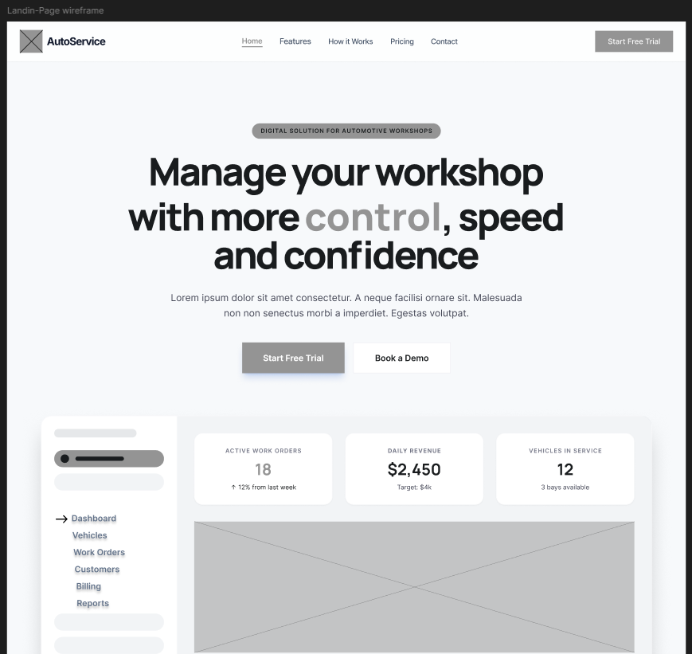
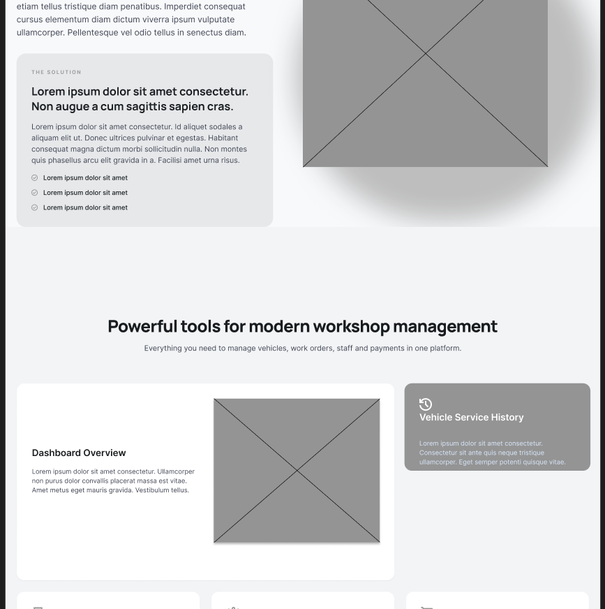
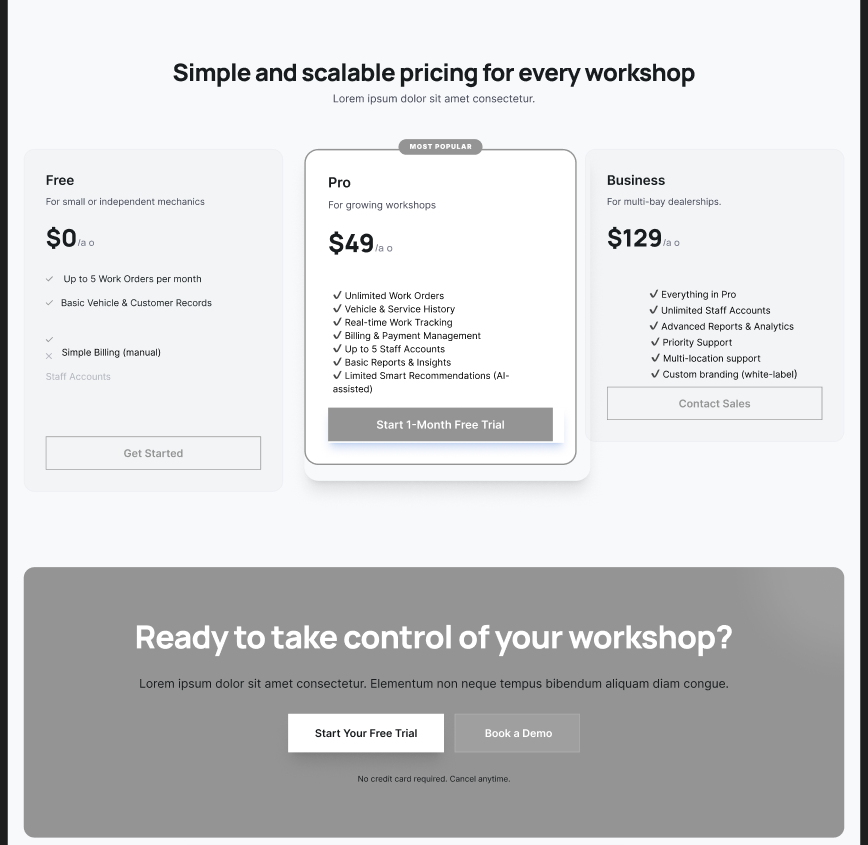

#### 4.3.2. Landing Page Mock-up

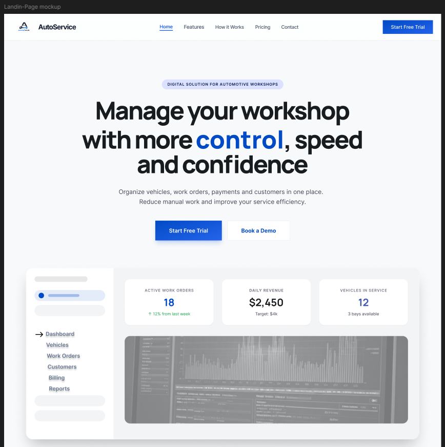
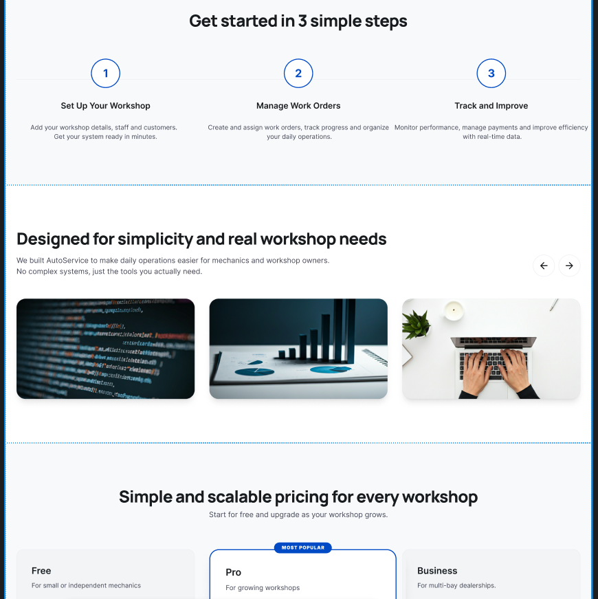
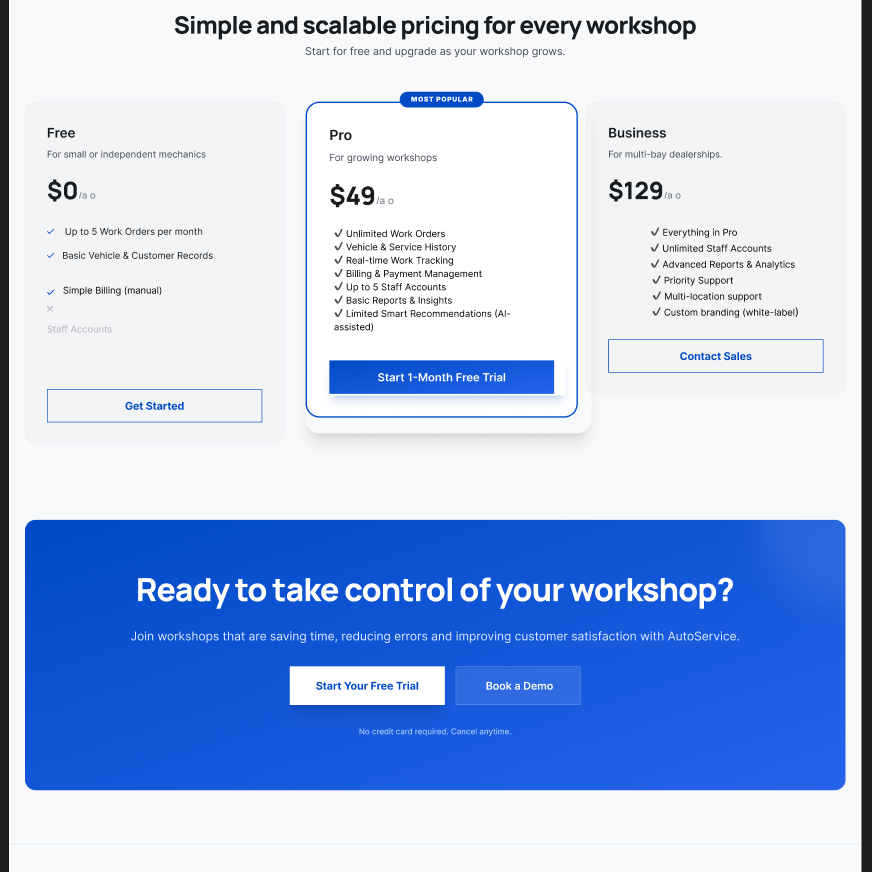

### 4.4. Web Applications UX/UI Design

#### 4.4.1. Web Applications Wireframes

En esta sección se presentan los wireframes desarrollados para AutoService, los cuales representan la estructura base de las interfaces antes de la aplicación del diseño visual final. Estos wireframes permiten definir la organización del contenido, la jerarquía de la información y los flujos de navegación, asegurando una experiencia de usuario clara y eficiente.

Se desarrollaron wireframes tanto para el flujo del administrador como para el cliente, considerando sus diferentes objetivos dentro del sistema.

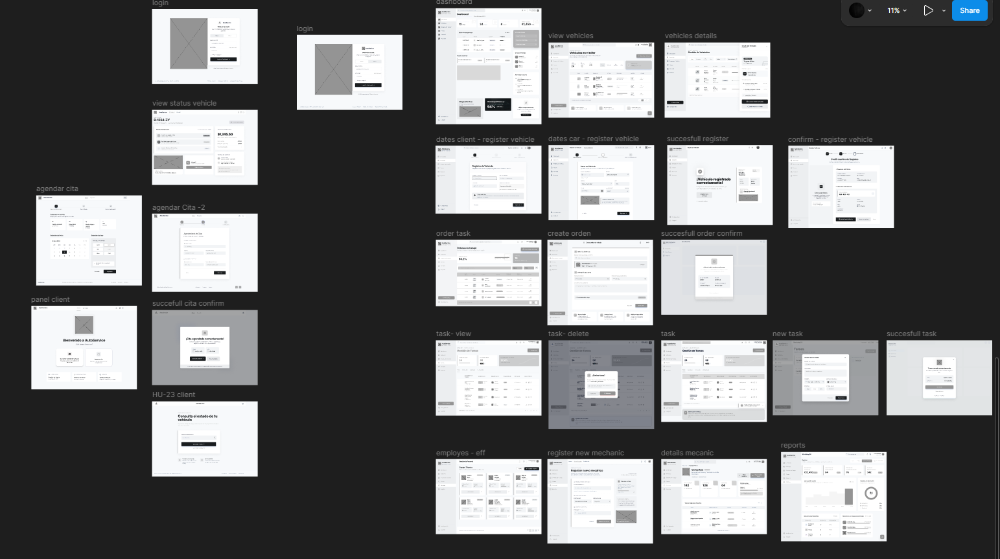

Trabajo hecho en figma - link: <a href="https://www.figma.com/design/rOJ6k8HLfI85lI8Xsik6TN/AUTOSERVICE-AW?node-id=2562-14849&t=wWO9xK4PqrC4tToK-1">https://www.figma.com/design/rOJ6k8HLfI85lI8Xsik6TN/AUTOSERVICE-AW?node-id=2562-14849&t=wWO9xK4PqrC4tToK-1</a>

1. Principios de Diseño

Contraste:
Aunque los wireframes no incluyen color, se utilizó contraste mediante tamaños, pesos visuales y jerarquía de elementos para destacar acciones principales como botones y títulos.

Repetición:
Se mantuvo consistencia en la disposición de componentes como formularios, listas y botones, permitiendo que el usuario reconozca patrones de interacción a lo largo de las distintas pantallas.

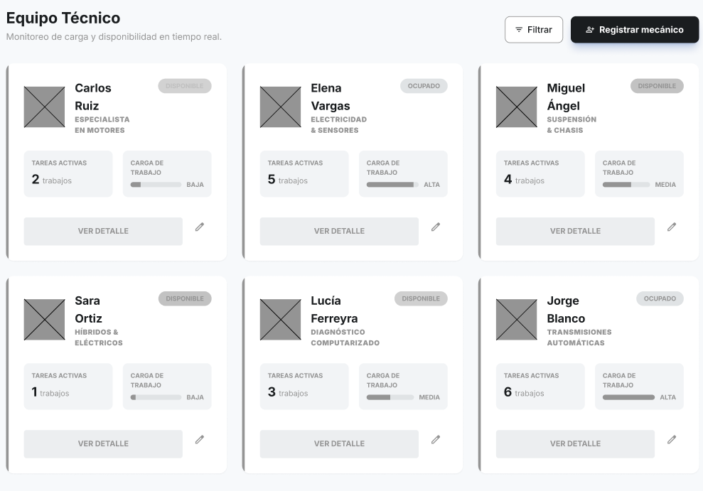

Alineación:
Los elementos fueron organizados siguiendo estructuras de grilla, garantizando orden y facilitando la lectura. Esto es evidente en pantallas como el dashboard y los formularios de registro.

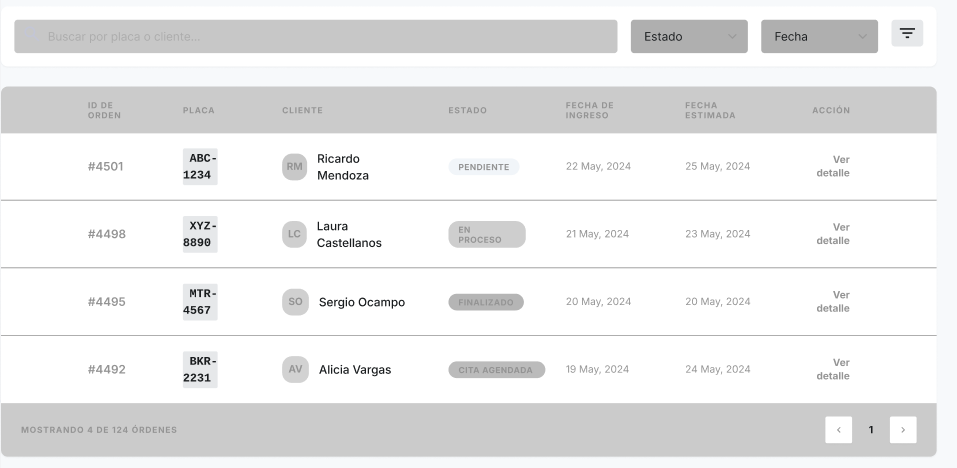

Proximidad:
Se agruparon elementos relacionados, como campos de formularios o información del vehículo, para mejorar la comprensión y reducir la carga cognitiva del usuario.

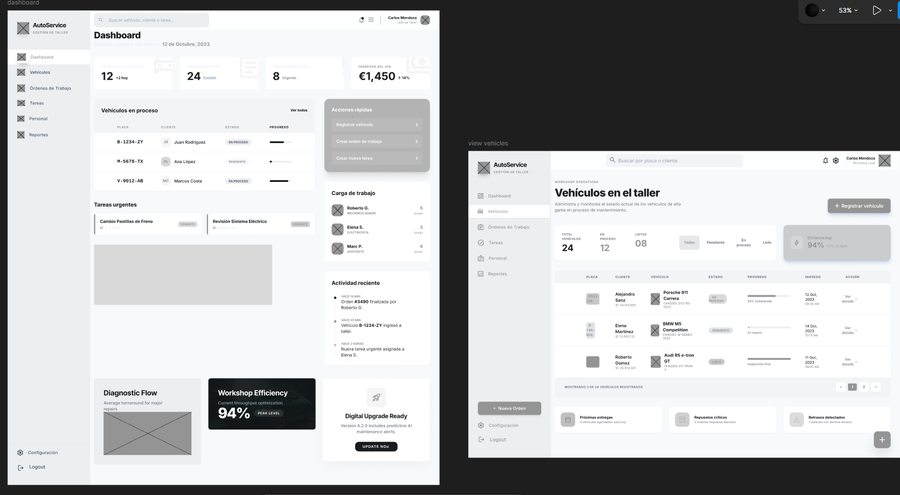

2. Elementos de Diseño Utilizados
- Formularios estructurados (registro de vehículo, datos del cliente)
- Tablas y listas (vehículos, órdenes de trabajo)
- Botones de acción (primarios y secundarios)
- Contenedores o secciones (cards)
- Menú de navegación lateral (sidebar)
- Indicadores de progreso y estados

Estos elementos fueron definidos de manera genérica para posteriormente ser estilizados en los mock-ups.

3. Diseño Inclusivo
- Distribución clara de elementos para facilitar la comprensión
- Formularios simples con campos bien organizados
- Navegación predecible y consistente
- Reducción de pasos innecesarios en los flujos

Esto permite que el sistema sea fácil de usar incluso para usuarios con poca experiencia digital.

4. Arquitectura de Información

Los wireframes evidencian una arquitectura clara basada en los flujos del sistema:

Panel Administrador:
- Dashboard como punto de entrada
- Navegación lateral persistente
- Módulos organizados por funcionalidad (vehículos, órdenes, tareas, personal, reportes)

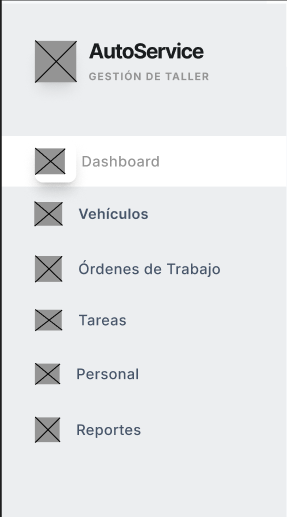

Flujo de Registro de Vehículo:
- Proceso dividido en pasos (stepper)
- Separación de datos del cliente y del vehículo

Panel Cliente:
- Interfaz simplificada con acciones principales
- Flujo directo para consultar estado o agendar cita

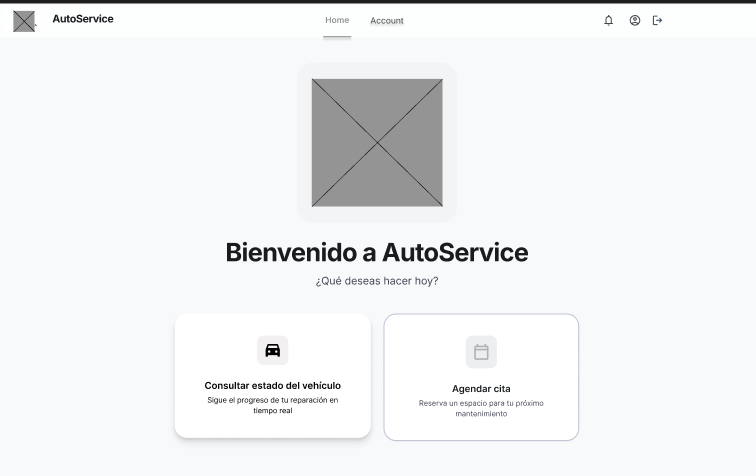

Los wireframes sirvieron como base estructural para el desarrollo de los mock-ups, donde posteriormente se incorporaron elementos visuales como color, tipografía e identidad gráfica. Gracias a esta fase previa, se logró validar la organización de la información y los flujos antes de avanzar al diseño de alta fidelidad.

#### 4.4.2. Web Applications Wireflow Diagrams

<table>
  <tr>
    <td class="header">User Persona</td>
    <td>Cliente - dueño del vehículo</td>
    <td class="header">Número</td>
    <td>1</td>
  </tr>
  <tr>
    <td class="header">User Goal</td>
    <td colspan="3" class="italic bold">
      Ingresar al sistema, visualizar y consultar el estado de mi vehículo mediante un código de seguimiento, para conocer el progreso del servicio, el diagnóstico y la fecha estimada de entrega sin necesidad de contactar directamente al taller.
    </td>
  </tr>
  <tr>
    <td class="header">Happy path</td>
    <td colspan="3">
      El usuario accede a la plataforma del taller e inicia sesión desde la pantalla de login ingresando sus credenciales. Tras una autenticación exitosa, es dirigido al panel principal del cliente, donde puede visualizar las opciones disponibles.

Desde el panel, el usuario selecciona la opción “Consultar estado del vehículo”, lo que lo redirige a la pantalla de consulta. En esta vista, el usuario ingresa el código de seguimiento o identificador del servicio asociado a su vehículo.
Una vez ingresado el código, el usuario hace clic en “Consultar estado”. El sistema valida la información y, si es correcta, muestra la pantalla de estado del vehículo.

En esta pantalla, el usuario puede visualizar el detalle completo del servicio, incluyendo:
<li>Estado actual del mantenimiento (por ejemplo, en proceso)</li>
<li>Lista de tareas realizadas o pendientes</li>
<li>Tiempo estimado de entrega</li>
<li>Costo estimado total</li>
<li>Información adicional relevante del servicio</li>

Con esta información, el usuario obtiene visibilidad clara y en tiempo real sobre el progreso de su vehículo sin necesidad de hacer llamada directa con el taller.
    </td>
  </tr>
</table>

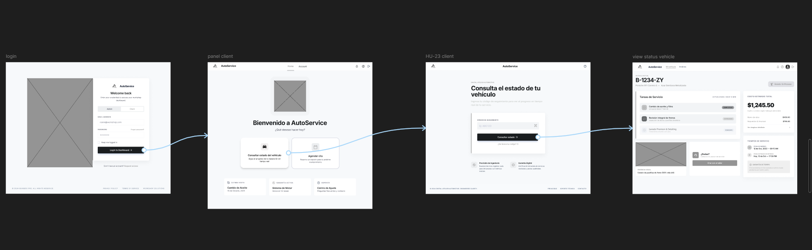
Wireflow Diagram - 1  
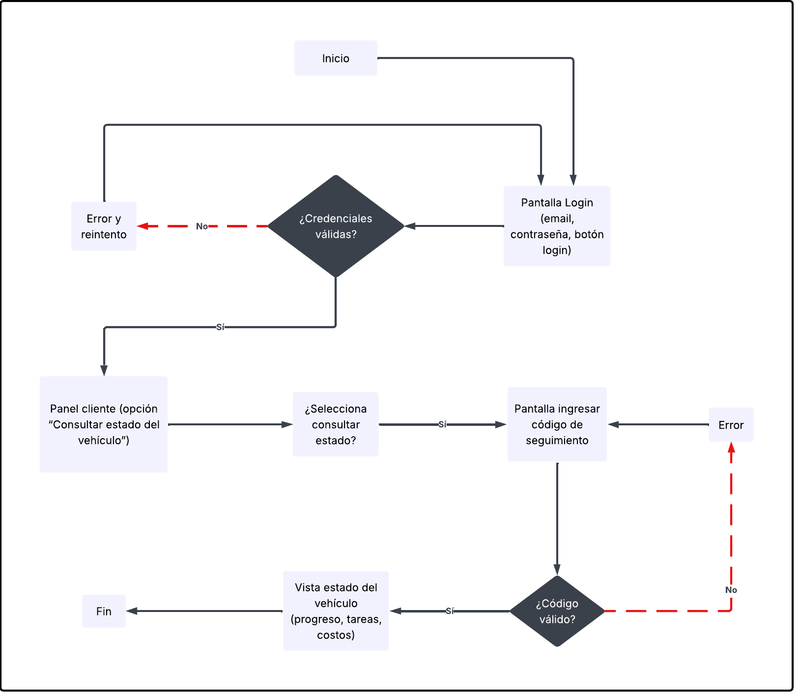

<table>
  <tr>
    <td class="header">User Persona</td>
    <td>Cliente - dueño del vehículo</td>
    <td class="header">Número</td>
    <td>2</td>
  </tr>
  <tr>
    <td class="header">User Goal</td>
    <td colspan="3" class="italic bold">
     Agendar cita de mantenimiento para un vehículo, para seleccionar una fecha y hora disponible de manera rápida y asegurar la atención en el taller sin necesidad de coordinación manual
    </td>
  </tr>
  <tr>
    <td class="header">Happy path</td>
    <td colspan="3">
    El usuario accede a la plataforma del taller e inicia sesión desde la pantalla de login ingresando sus credenciales. Una vez autenticado correctamente, es redirigido al panel principal del cliente, donde visualiza las opciones disponibles.

Desde este panel, el usuario selecciona la opción “Agendar cita”, lo que lo lleva al flujo de programación. En la siguiente pantalla, el usuario elige el tipo de servicio requerido (por ejemplo, cambio de aceite, diagnóstico o mantenimiento general). Luego, selecciona una fecha disponible en el calendario y una hora dentro de los horarios habilitados. Tras completar esta selección, hace clic en “Siguiente”.

En el siguiente paso, el usuario visualiza el formulario de agendamiento de citas, donde se muestran o completa sus datos personales y la información del vehículo. Revisa que toda la información sea correcta y continúa seleccionando “Siguiente”.

Finalmente, el sistema procesa la solicitud y muestra una pantalla de confirmación exitosa, indicando que la cita ha sido agendada correctamente, junto con el detalle de la fecha y hora seleccionadas. Con esto, el usuario asegura su atención en el taller sin necesidad de coordinación manual adicional.
    </td>
  </tr>
</table>

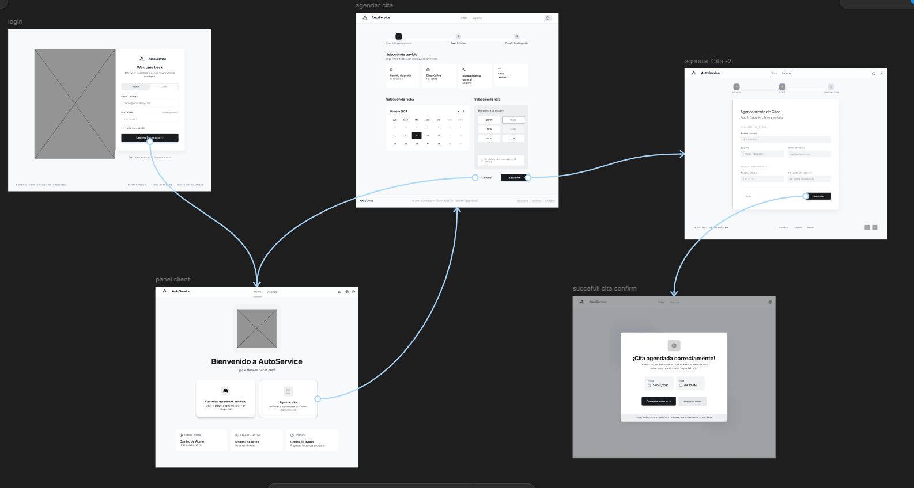
Wireflow Diagram - 2  
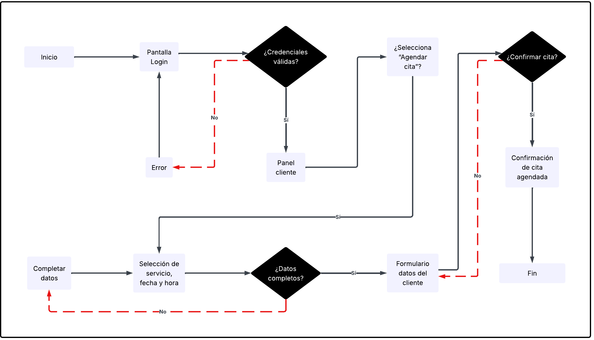

<table>
  <tr>
    <td class="header">User Persona</td>
    <td>Administrador - dueño del taller</td>
    <td class="header">Número</td>
    <td>3</td>
  </tr>
  <tr>
    <td class="header">User Goal</td>
    <td colspan="3" class="italic bold">
     Registro y gestion de tareas de servicio para los vehículos, asignando mecánicos y manteniendo el control del estado de los trabajos en curso.
    </td>
  </tr>
  <tr>
    <td class="header">Happy path</td>
    <td colspan="3">
<ol>
<li>Inicio de sesión: 
El administrador ingresa sus credenciales en la pantalla de login.</li>
<li>Acceso al dashboard: 
El sistema valida la información y lo redirige al dashboard principal.</li>
<li>Navegación a gestión de tareas: 
El administrador accede a la sección “Gestión de Tareas” desde el menú o accesos directos.</li>
<li>Visualización del listado de tareas
El sistema muestra las tareas existentes con sus estados y detalles relevantes.</li>
<li>Inicio de creación de tarea: 
El administrador hace clic en el botón “Crear tarea”.</li>
<li>Despliegue del modal de creación: 
El sistema muestra una ventana modal con el formulario para registrar la nueva tarea.</li>
<li>Ingreso de información: 
El administrador completa los campos requeridos, por ejemplo:
Nombre o descripción de la tarea
Vehículo asociado, 
Prioridad, 
Posible asignación (mecánico o responsable), </li>
<li>Confirmación de creación: 
El administrador hace clic en “Crear tarea”.</li>
<li>Procesamiento de la solicitud: 
El sistema valida los datos y registra la nueva tarea en la base de datos.</li>
<li>Feedback de éxito: 
Se muestra un mensaje/modal indicando que la tarea fue creada correctamente.</li>
<li>Actualización del listado: 
El sistema regresa a la vista de tareas y actualiza la lista mostrando la nueva tarea creada.</li>
</ol>
    </td>
  </tr>
</table>

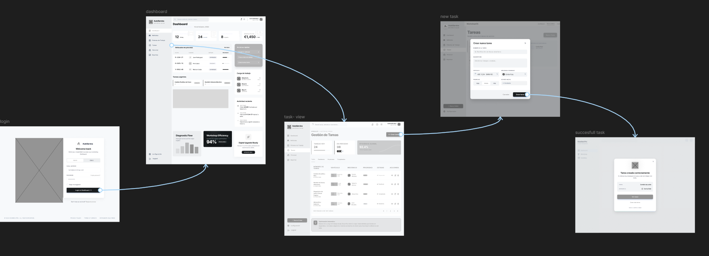
Wireflow Diagram - 3  
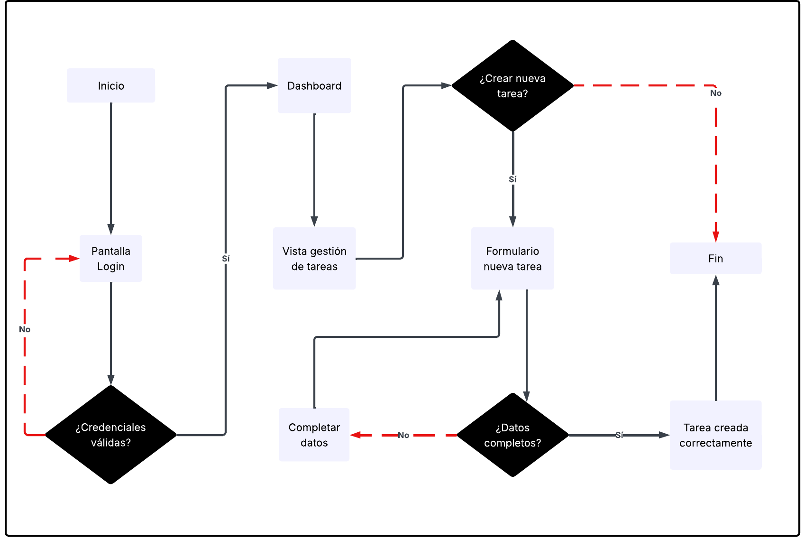

<table>
  <tr>
    <td class="header">User Persona</td>
    <td>Administrador - dueño del taller</td>
    <td class="header">Número</td>
    <td>4</td>
  </tr>
  <tr>
    <td class="header">User Goal</td>
    <td colspan="3" class="italic bold">
   Registrar un vehículo nuevo en el sistema de manera rápida y sin errores, asegurando que la información ingresada sea válida y quede almacenada correctamente.
    </td>
  </tr>
  <tr>
    <td class="header">Happy path</td>
    <td colspan="3">
<ol>
<li>Inicio de sesión: 
El administrador accede al sistema ingresando sus credenciales desde la pantalla de login.</li>
<li>Acceso al dashboard: 
Tras autenticarse, el sistema lo redirige al dashboard donde visualiza el estado general del taller.</li>
<li>Navegación a vehículos: 
El administrador accede a la sección “Vehículos en el taller”.</li>
<li>Inicio de registro: 
Hace clic en la acción “Registrar vehículo” para iniciar el proceso.</li>
<li>Ingreso de datos del cliente: 
El sistema muestra el formulario correspondiente.
El administrador completa la información del cliente (nombre, contacto, etc.) y continúa.</li>
<li>Ingreso de datos del vehículo: 
El sistema presenta el siguiente paso del formulario.
El administrador ingresa los datos del vehículo (marca, modelo, año, placa, etc.) y avanza.</li>
<li>Revisión y confirmación: 
El sistema muestra una pantalla de resumen con toda la información ingresada (cliente + vehículo).
El administrador valida que los datos sean correctos.</li>
<li>Confirmación del registro: 
El administrador hace clic en “Registrar vehículo”.</li>
<li>Procesamiento de la información: 
El sistema guarda los datos en la base de datos de forma segura.</li>
<li>Feedback de éxito: 
Se muestra una pantalla de confirmación indicando que el vehículo fue registrado correctamente.</li>
<li>Continuidad de flujo: 
El administrador puede optar por:
Registrar otro vehículo, 
Volver al listado de vehículos</li>
</ol>
    </td>
  </tr>
</table>

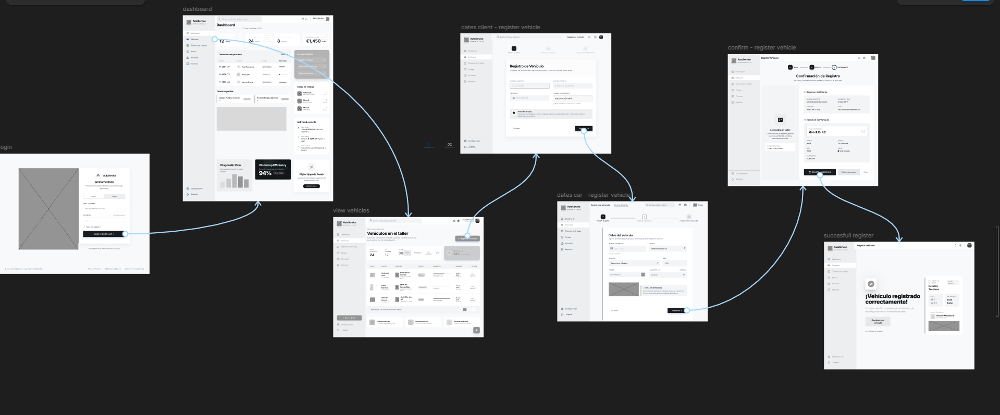
Wireflow Diagram - 4  
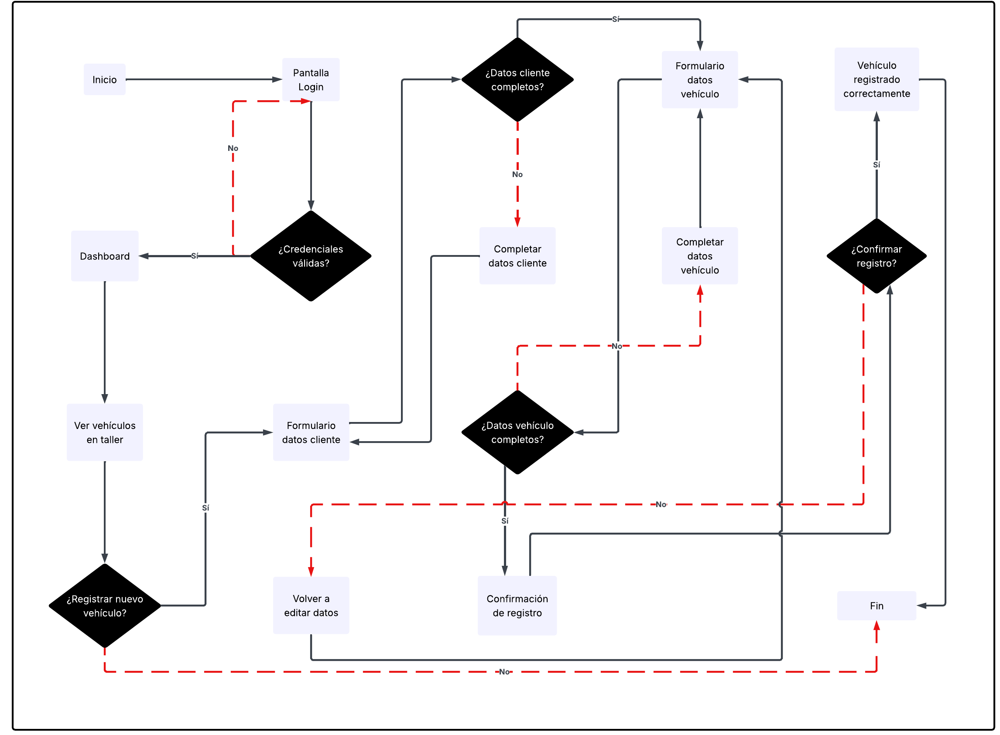

<table>
  <tr>
    <td class="header">User Persona</td>
    <td>Administrador - dueño del taller</td>
    <td class="header">Número</td>
    <td>5</td>
  </tr>
  <tr>
    <td class="header">User Goal</td>
    <td colspan="3" class="italic bold">
   Eliminar una tarea registrada en el sistema de forma segura, asegurando que el usuario confirme la acción antes de que la información sea eliminada definitivamente.
    </td>
  </tr>
  <tr>
    <td class="header">Happy path</td>
    <td colspan="3">
    <ol>
<li>Inicio de sesión
El administrador accede al sistema ingresando sus credenciales válidas desde la pantalla de login.
<li>Acceso al dashboard</li>
Tras autenticarse correctamente, el sistema lo redirige al dashboard principal, donde puede visualizar un resumen general del estado del taller.</li>
<li>Navegación a gestión de tareas
El administrador selecciona la opción “Gestión de Tareas” desde el menú lateral o desde un acceso directo en el dashboard.</li>
<li>Visualización del listado de tareas
El sistema muestra la lista de tareas registradas con información relevante (vehículo, estado, prioridad, etc.).</li>
<li>Selección de tarea a eliminar
El administrador identifica la tarea que desea eliminar y hace clic en el icono o acción de “Eliminar” correspondiente.</li>
<li>Despliegue de modal de confirmación
El sistema presenta una ventana modal solicitando confirmación, indicando que la acción es irreversible.</li>
<li>Confirmación de la acción
El administrador confirma la eliminación haciendo clic en el botón de “Eliminar”.</li>
<li>Procesamiento de la solicitud
El sistema elimina la tarea de forma segura de la base de datos.</li>
<li>Feedback al usuario
El sistema muestra un mensaje de éxito indicando que la tarea fue eliminada correctamente.</li>
<li>Actualización del listado
La lista de tareas se actualiza automáticamente, reflejando la eliminación sin necesidad de recargar la página.</li>
</ol>
    </td>
  </tr>
</table>

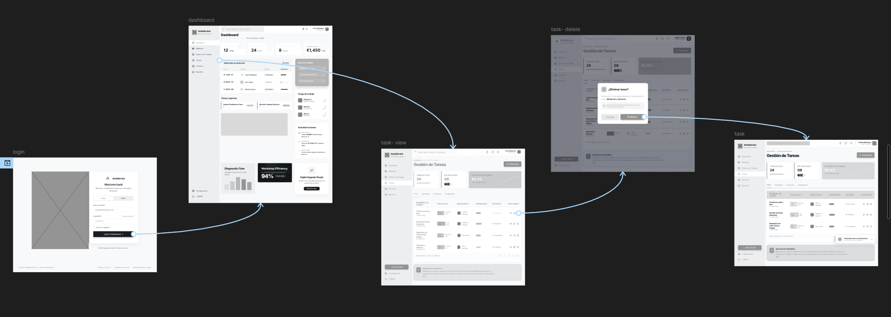
Wireflow Diagram - 5  
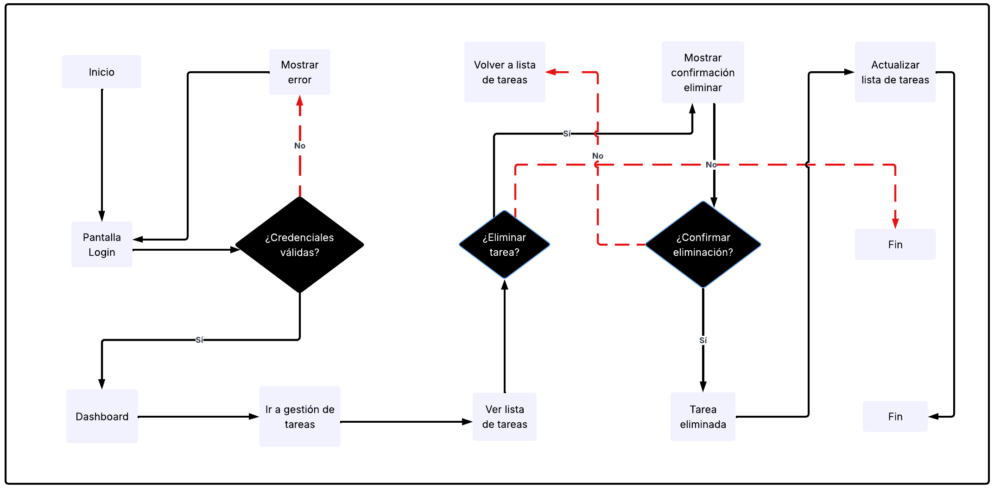

<table>
  <tr>
    <td class="header">User Persona</td>
    <td>Administrador - dueño del taller</td>
    <td class="header">Número</td>
    <td>6</td>
  </tr>
  <tr>
    <td class="header">User Goal</td>
    <td colspan="3" class="italic bold">
    Registrar un nuevo mecánico en el sistema, asegurando que sus datos sean ingresados correctamente para su posterior asignación a tareas dentro del taller.
    </td>
  </tr>
  <tr>
    <td class="header">Happy path</td>
    <td colspan="3">
   El usuario ingresa al sistema desde la pantalla de login proporcionando sus credenciales. El sistema valida la información y, al ser correcta, le permite acceder al dashboard principal, donde puede visualizar métricas generales del taller como carga de trabajo, vehículos en proceso y actividad reciente.
Desde el menú lateral, el administrador navega a la sección de “Gestión de personal”. En esta vista se muestra un listado de mecánicos con información resumida como nombre, especialidad y estado. Esto le permite tener una visión rápida del equipo disponible.
El administrador decide agregar un nuevo mecánico y selecciona la opción correspondiente. El sistema lo dirige a una pantalla con un formulario de registro. Allí, el administrador completa los campos requeridos, incluyendo datos personales, información de contacto y especialidades técnicas.
Una vez que todos los campos obligatorios están completos, el administrador confirma el registro. El sistema procesa la información, valida los datos y guarda correctamente el nuevo mecánico en la base de datos.
Finalmente, el administrador es redirigido nuevamente al listado de personal, donde puede ver al nuevo mecánico agregado. Con esto, el flujo concluye al haber incorporado exitosamente un nuevo miembro al equipo del taller.
    </td>
  </tr>
</table>

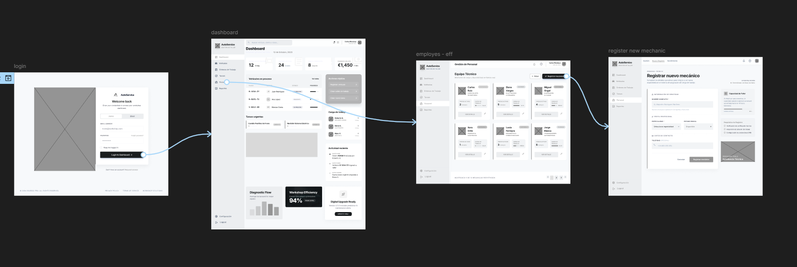
Wireflow Diagram - 6  
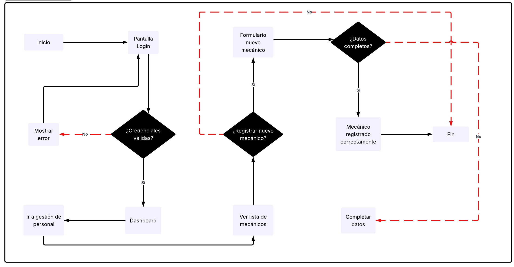

<table>
  <tr>
    <td class="header">User Persona</td>
    <td>Administrador - dueño del taller</td>
    <td class="header">Número</td>
    <td>7</td>
  </tr>
  <tr>
    <td class="header">User Goal</td>
    <td colspan="3" class="italic bold">
     Visualizar y consultar el detalle de los vehículos registrados en el sistema para dar seguimiento a su estado y gestionar la operación del taller.
    </td>
  </tr>
  <tr>
    <td class="header">Happy path</td>
    <td colspan="3">
    El usuario ingresa al sistema desde la pantalla de login introduciendo sus credenciales válidas. Al autenticarse correctamente, accede al dashboard donde puede ver un resumen general de la operación del taller.
Desde el menú principal, navega a la sección “Vehículos en el taller”, donde se muestra un listado con todos los vehículos registrados y su estado actual. El administrador revisa la lista y selecciona un vehículo específico para consultar más información.
Al hacer clic, se abre el detalle del vehículo, donde puede visualizar datos relevantes como cliente, diagnóstico, estado del servicio y progreso del trabajo. Desde esta vista, el administrador puede tomar acciones como generar una orden de trabajo o continuar con la gestión del vehículo.
El flujo finaliza cuando el administrador obtiene la información necesaria y realiza la acción deseada para dar seguimiento al vehículo.
    </td>
  </tr>
</table>

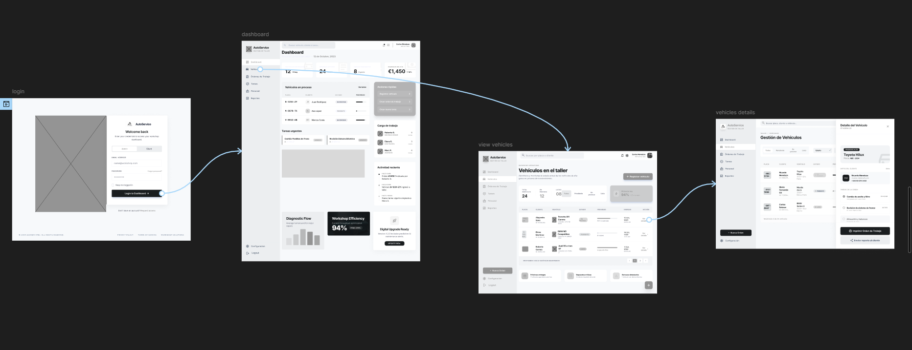

Wireflow Diagram - 7
  
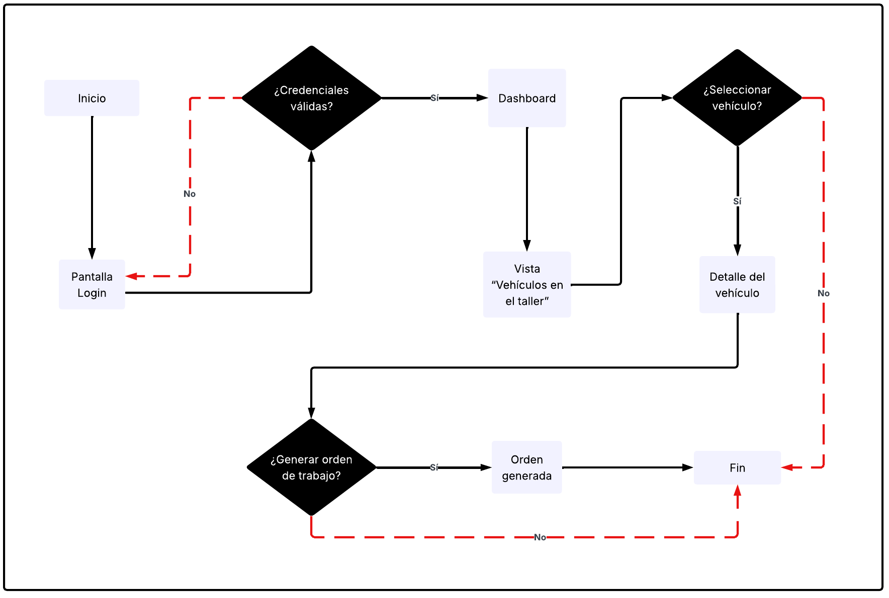

#### 4.4.3. Web Applications Mock-ups

El diseño de la aplicación se ha desarrollado bajo un enfoque desktop, considerando una resolución base de 1440px claramente incluido el responsive. Se ha priorizado la claridad visual, la eficiencia en la interacción y la reducción de la carga cognitiva del usuario.

Asimismo, se han diferenciado claramente dos tipos de usuarios: Administrador (staff del taller): enfocado en gestión operativa y el cliente: enfocado en consulta rápida y acciones simples.
Esta segmentación permitió diseñar experiencias específicas según las necesidades de cada tipo de usuario.

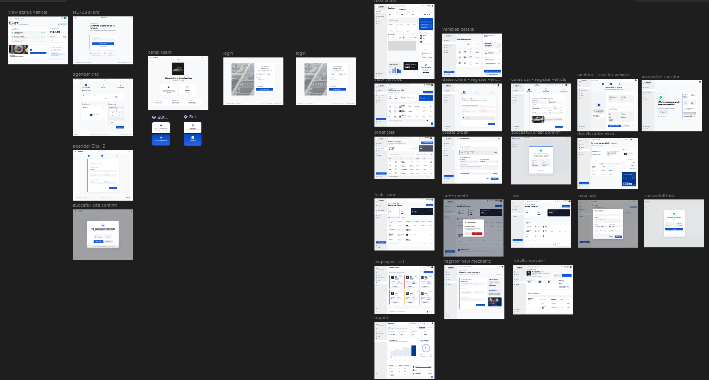
URL del trabajo en Figma: 
[Link del trabajo](https://www.figma.com/design/rOJ6k8HLfI85lI8Xsik6TN/AUTOSERVICE-AW?node-id=2084-72&t=apoFHJV5bqtx999h-1)

1. Principios de Diseño

Durante el desarrollo de los mock-ups se aplicaron los siguientes principios fundamentales:

<table>
  <tr>
    <td>
      <strong>Contraste:</strong> 
      El contraste fue utilizado para guiar la atención del usuario hacia los elementos más importantes de cada interfaz. Por ejemplo, los botones de acción primaria, como “Registrar vehículo”, “Crear orden” o “Consultar estado”, emplean un gradiente azul (#004AC6 – #2563EB), diferenciándose claramente de los elementos secundarios. Asimismo, los estados del sistema (Pendiente, En proceso, Completado) se representan mediante colores diferenciados acompañados de etiquetas textuales, lo que permite identificar rápidamente el estado sin depender únicamente del color. Esto mejora tanto la legibilidad como la accesibilidad. 
      
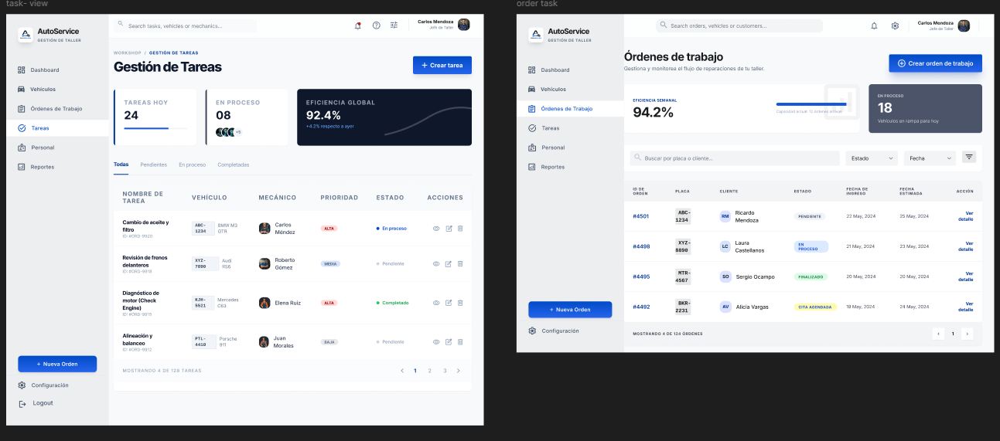

    </td>
  </tr>

  <tr>
    <td>
      <strong>Repetición:</strong> 
      La repetición se utilizó para generar consistencia visual y familiaridad a lo largo de toda la aplicación. Componentes como botones, tarjetas (cards), tablas, etiquetas de estado, barras de progreso y modales mantienen el mismo estilo, tamaño y comportamiento en todas las vistas. Por ejemplo, el mismo estilo de botones y etiquetas de estado se reutiliza en los módulos de Vehículos, Órdenes de trabajo, Tareas y Personal, permitiendo que el usuario reconozca patrones de interacción sin necesidad de reaprender. Además, se mantiene un único sistema de íconos con el mismo estilo visual (línea, grosor, tamaño), reforzando la coherencia del diseño. 
      
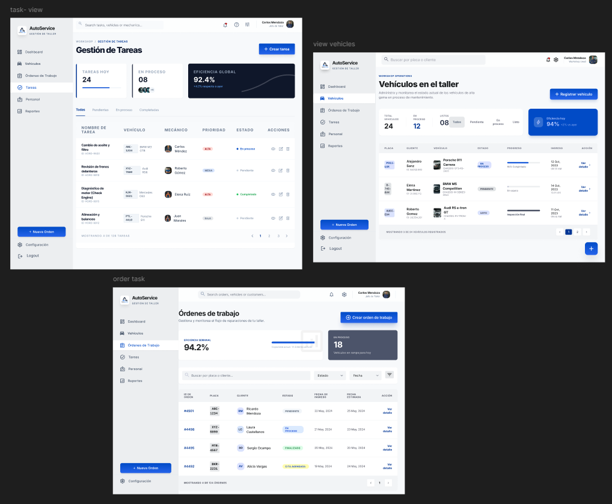

    </td>
  </tr>

  <tr>
    <td>
      <strong>Alineación:</strong> 
      La alineación fue aplicada mediante el uso de estructuras basadas en grid en el figma, garantizando orden y organización visual. Los elementos se distribuyen de manera consistente, ya sea en layouts con sidebar (panel administrador) o en layouts centrados (panel cliente). En pantallas como la Lista de vehículos o Órdenes de trabajo, las tablas presentan una alineación clara de columnas, lo que facilita la lectura de datos. En formularios, los campos están alineados verticalmente, permitiendo un flujo de lectura natural. Esta alineación contribuye a una interfaz más limpia, profesional y fácil de usar 
      
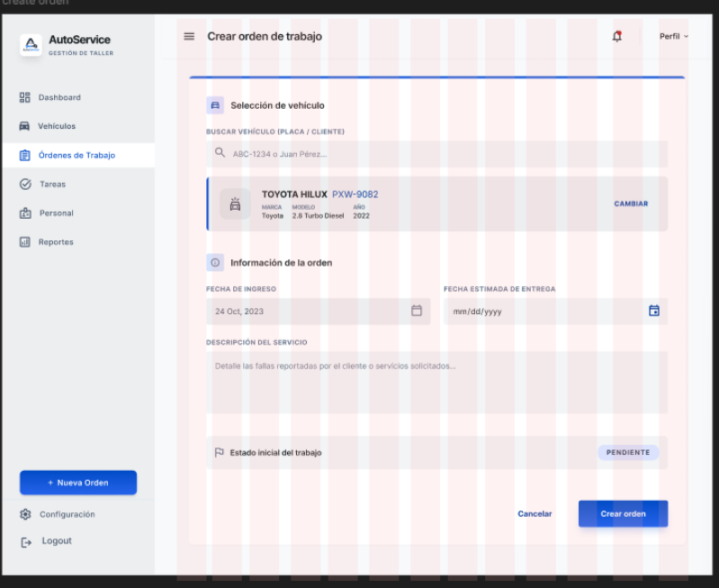

    </td>
  </tr>

  <tr>
    <td>
      <strong>Proximidad:</strong> 
      El principio de proximidad se utilizó para agrupar elementos relacionados y separar aquellos que cumplen funciones distintas. Esto reduce la carga cognitiva y mejora la comprensión de la interfaz. Por ejemplo, en la pantalla de Detalle del vehículo, la información se organiza en secciones claras: datos del cliente, datos del vehículo, orden de trabajo, tareas y progreso. Cada grupo está contenido en tarjetas (cards), lo que facilita la identificación de cada bloque de información. En el caso del cliente, en el Panel principal, los botones de acción (“Consultar estado” y “Agendar cita”) se agrupan visualmente, permitiendo una toma de decisión rápida
      
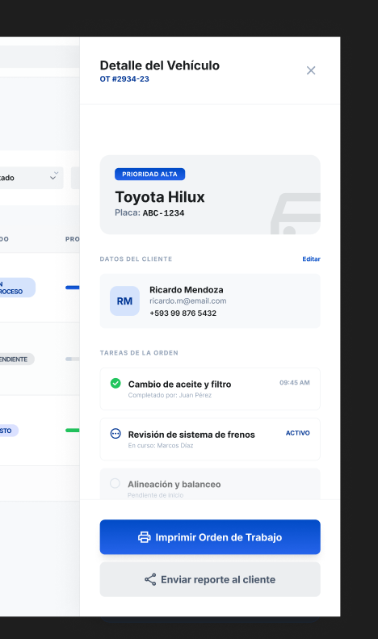

    </td>
  </tr>
</table>
2. Elementos de Diseño

Los mock-ups incorporan elementos de diseño modernos y reutilizables, propios de aplicaciones web tipo SaaS, los cuales fueron seleccionados para mejorar la interacción y la claridad visual:

- Botones: utilizados para acciones primarias y secundarias, con estados visuales (hover, focus, disabled) que brindan retroalimentación inmediata al usuario.

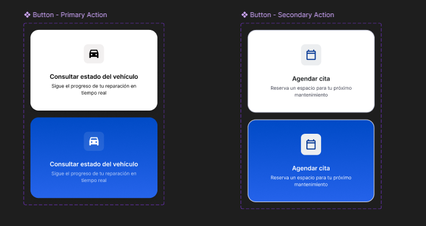

- Tarjetas (Cards): empleadas para agrupar información relacionada, especialmente en informacion de tecnicos, dashboards y vistas de detalle.

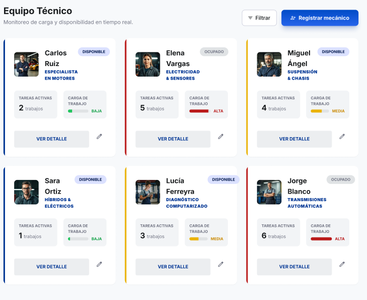

- Tablas: utilizadas para mostrar grandes volúmenes de datos estructurados (vehículos, órdenes, tareas), optimizando la escaneabilidad.
- Etiquetas de estado (Tags): permiten identificar rápidamente el estado de procesos (pendiente, en proceso, completado).
Barras de progreso: representan visualmente el avance de un servicio o conjunto de tareas.

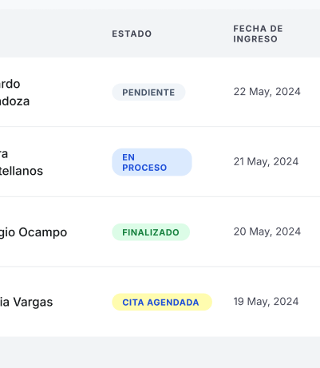

- Modales: utilizados para acciones rápidas como crear, editar o confirmar eliminación, evitando cambios de contexto innecesarios.

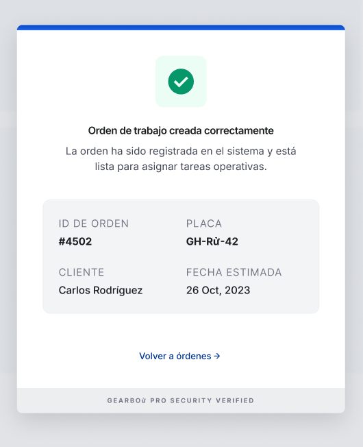

3. Diseño Inclusivo

El sistema fue desarrollado considerando principios de accesibilidad e inclusión:
Uso de texto claro y no técnico, especialmente en el módulo cliente
No dependencia exclusiva del color (uso de íconos + etiquetas)
Tamaños adecuados de botones y campos para facilitar la interacción
Contrastes adecuados para garantizar legibilidad
Formularios con etiquetas visibles y validaciones claras

Esto permite que la aplicación sea usable por un público amplio, incluyendo usuarios no técnicos.

4. Information Architecture
<table>
<tr>
<td>
Se definió una arquitectura clara y jerárquica basada en los flujos de usuario:
Panel Administrador:
- Dashboard
- Vehículos
- Órdenes de trabajo
- Tareas
- Personal
- Reportes
</td>
<td> 
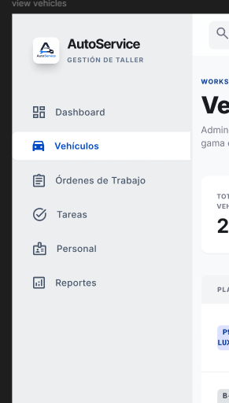
</td>
</tr>

<tr>
<td>
Esta estructura permite una navegación lógica y eficiente para la gestión del taller.

Panel Cliente:
Panel principal (hub de acciones)
- Consulta de estado del vehículo
- Agendamiento de citas

Se priorizó una arquitectura minimalista, reduciendo opciones para facilitar la toma de decisiones.
</td>
<td>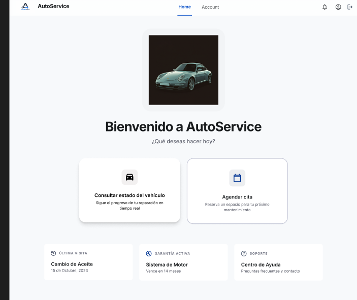</td>
</tr>
<table>

5. Design System

Se estableció un Design System consistente que incluye:

- Paleta de colores con énfasis en azul (#004AC6, #2563EB)
- Tipografía jerarquizada (títulos, subtítulos, cuerpo)
- Sistema de espaciado basado en múltiplos de 8px
- Componentes reutilizables (botones, inputs, cards, tablas)
- Uso consistente de un único set de íconos

Este sistema garantiza coherencia visual, escalabilidad y mantenibilidad del producto.

6. Heuristicas de Usabilidad

- Visibilidad del estado del sistema: El sistema mantiene informado al usuario sobre lo que está ocurriendo en todo momento.
En el Dashboard, se muestran métricas en tiempo real (vehículos en proceso, tareas pendientes).
En el Detalle del vehículo, se presenta el progreso mediante barras y estados visibles.
En el módulo cliente, el estado del vehículo (Pendiente, En proceso, Listo) se muestra de forma clara e inmediata.

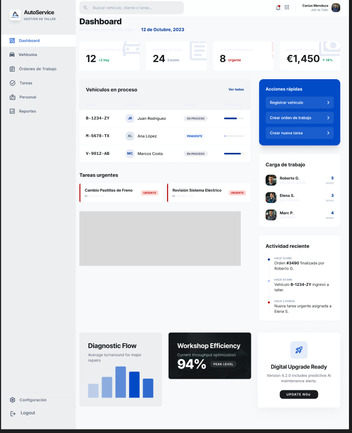

- Correspondencia entre el sistema y el mundo real: Se utiliza lenguaje comprensible y cercano al usuario.

Términos como “Vehículo”, “Tareas”, “Mecánico” y “Orden de trabajo” reflejan el contexto real de un taller.
En el módulo cliente, se evita el uso de lenguaje técnico, facilitando la comprensión.

- Control y libertad del usuario: El usuario puede deshacer o cancelar acciones fácilmente.
En formularios como “Registrar vehículo” o “Crear orden”, se incluye el botón “Cancelar”.
En la eliminación de tareas, se implementa un modal de confirmación para evitar errores.

- Prevencio de errores: Se diseñaron mecanismos para evitar errores antes de que ocurran.
Validaciones en formularios (campos obligatorios, formatos correctos).
Confirmación antes de eliminar tareas (HU-17).
Restricción de acciones sin datos completos (ej. no crear orden sin vehículo).

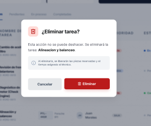

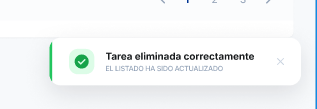

Los mock-ups desarrollados para reflejan una aplicación coherente, usable y alineada a estándares profesionales de diseño UX/UI. Se evidencia la correcta integración entre funcionalidad, estética y experiencia de usuario, logrando una solución clara tanto para la gestión interna del taller como para la interacción con clientes.

#### 4.4.4. Web Applications User Flow Diagrams

<table>
  <tr>
    <td class="header">User Persona</td>
    <td>Cliente - propietario del vehículo</td>
    <td class="header">Número</td>
    <td>1</td>
  </tr>
  <tr>
    <td class="header">User Goal</td>
    <td colspan="3" class="italic bold">
    Ingresar al sistema, visualizar y consultar el estado de mi vehículo mediante un código de seguimiento, para conocer el progreso del servicio, el diagnóstico y la fecha estimada de entrega sin necesidad de contactar directamente al taller.
    </td>
  </tr>
  <tr>
    <td class="header">Happy path</td>
    <td colspan="3">
    El usuario accede a la pantalla de inicio de sesión de la aplicación AutoService. Ingresa sus credenciales y presiona el botón “Login” para autenticarse en el sistema.
    Una vez dentro, el usuario es dirigido a la pantalla principal (dashboard), donde se le presentan distintas opciones. Para cumplir su objetivo, selecciona la opción “Consultar estado del vehículo”.
    El sistema lo redirige a la pantalla de consulta, donde se le solicita ingresar un código único asociado a su servicio. El usuario introduce el código y presiona el botón “Consultar estado”.
    Finalmente, el sistema muestra la pantalla de resultados, donde el usuario puede visualizar en tiempo real el estado de su vehículo, incluyendo detalles de las tareas realizadas, el progreso del servicio, costos asociados y tiempos estimados.
    </td>
  </tr>
  <tr>
    <td class="header">Unhappy Paths</td>
    <td colspan="3">
    Si el usuario ingresa credenciales incorrectas en la pantalla de inicio de sesión, el sistema muestra un mensaje de error y solicita reintentar el acceso.
    En la pantalla de consulta, si el usuario ingresa un código inválido o inexistente, el sistema despliega una notificación indicando que el código no es válido y permite volver a intentarlo.
    Si ocurre un problema de conexión o el sistema no puede recuperar la información, se muestra un mensaje de error indicando la imposibilidad de obtener el estado del vehículo en ese momento, sugiriendo intentar más tarde. 
    Consideraciones:
    <ul>
    <li>El usuario debe estar previamente registrado para poder acceder al sistema.</li>
    <li>El código de consulta debe ser válido y estar asociado a un servicio activo.</li>
    <li>La información mostrada depende de la disponibilidad y actualización en tiempo real del sistema.</li></ul>
    </td>
  </tr>
</table>

User flow - 1
 

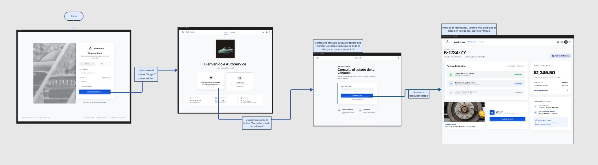

<table>
  <tr>
    <td class="header">User Persona</td>
    <td>Cliente - propietario del vehículo</td>
    <td class="header">Número</td>
    <td>2</td>
  </tr>
  <tr>
    <td class="header">User Goal</td>
    <td colspan="3" class="italic bold">
      Agendar una cita para el servicio de su vehículo de manera rápida y sencilla, seleccionando fecha, hora y proporcionando sus datos personales.
    </td>
  </tr>
  <tr>
    <td class="header">Happy path</td>
    <td colspan="3">
    El usuario accede a la pantalla de inicio de sesión de la plataforma AutoService. Ingresa sus credenciales y presiona el botón “Login” para acceder al sistema.
Una vez autenticado, el usuario es dirigido al dashboard principal, donde visualiza distintas opciones disponibles. Para cumplir su objetivo, selecciona la opción “Agendar cita”.
El sistema lo redirige a la pantalla de agendamiento, donde el usuario debe completar un formulario inicial seleccionando información clave como la fecha, la hora y el tipo de servicio requerido. Una vez completados estos campos, presiona el botón “Siguiente”.
En la siguiente pantalla, el usuario ingresa sus datos personales, incluyendo nombre, teléfono, correo electrónico y la información del vehículo (placa, marca y modelo). Luego de completar el formulario, presiona nuevamente el botón “Siguiente”.
Finalmente, el sistema muestra una pantalla de confirmación indicando que la cita ha sido agendada correctamente, junto con un resumen de los datos ingresados (fecha y hora). El usuario puede optar por consultar el estado del servicio o volver al inicio.
    </td>
  </tr>
  <tr>
    <td class="header">Unhappy Paths</td>
    <td colspan="3">
    Si el usuario ingresa credenciales incorrectas al iniciar sesión, el sistema muestra un mensaje de error y solicita reintentar.
Si el usuario no completa los campos obligatorios en el formulario de agendamiento (fecha, hora o tipo de servicio), el sistema impide avanzar y resalta los campos faltantes.
En caso de seleccionar una fecha u horario no disponible, el sistema notifica al usuario y le solicita elegir otra opción válida.
Si el uszario deja incompletos los datos personales o ingresa información inválida (por ejemplo, correo con formato incorrecto), el sistema muestra mensajes de validación antes de permitir continuar.
Si ocurre un error en el sistema al momento de confirmar la cita, se muestra un mensaje indicando que no fue posible completar la operación y se sugiere intentar nuevamente.
    </td>
  </tr>
</table>

User flow - 2
 

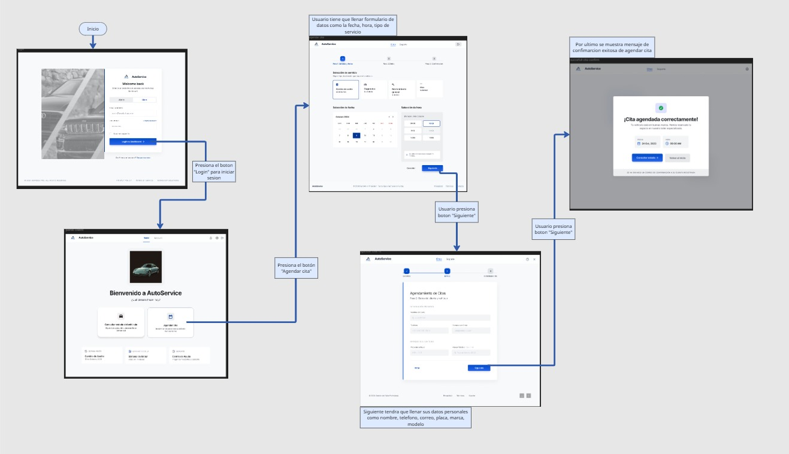

<table>
  <tr>
    <td class="header">User Persona</td>
    <td>Administrador - dueño del taller</td>
    <td class="header">Número</td>
    <td>3</td>
  </tr>
  <tr>
    <td class="header">User Goal</td>
    <td colspan="3" class="italic bold">
      Registro y gestion de tareas de servicio para los vehículos, asignando mecánicos y manteniendo el control del estado de los trabajos en curso.
    </td>
  </tr>
  <tr>
    <td class="header">Happy path</td>
    <td colspan="3">
El flujo inicia cuando el administrador accede a la plataforma AutoService mediante la pantalla de inicio de sesión. Ingresa sus credenciales y presiona el botón “Login” para acceder al sistema.
Una vez autenticado, es dirigido al dashboard principal, donde puede visualizar un resumen de la operación del taller, incluyendo métricas, vehículos en proceso y estado general de los servicios.
Desde el menú de navegación, el administrador selecciona la opción de “Tareas” para acceder al panel de gestión. En esta sección se muestra un listado con todas las tareas registradas, junto con información relevante como vehículo asociado, mecánico asignado, estado y progreso.
Para crear una nueva tarea, el administrador presiona el botón “Crear tarea”. El sistema despliega un formulario donde debe ingresar los detalles de la tarea, como el tipo de servicio, descripción, vehículo asociado y el mecánico responsable.
Una vez completado el formulario, el administrador confirma la acción presionando nuevamente el botón “Crear tarea”. Finalmente, el sistema muestra un mensaje de confirmación indicando que la tarea ha sido creada correctamente, y esta pasa a formar parte del listado de tareas activas.
    </td>
  </tr>
  <tr>
    <td class="header">Unhappy Paths</td>
    <td colspan="3">
    Si el administrador ingresa credenciales incorrectas al iniciar sesión, el sistema muestra un mensaje de error y solicita reintentar el acceso.
Si intenta crear una tarea sin completar los campos obligatorios del formulario, el sistema resalta los campos faltantes e impide continuar hasta que la información sea válida.
En caso de seleccionar un vehículo o mecánico no disponible o no registrado en el sistema, se muestra un mensaje indicando el problema y se solicita corregir la información.
Si ocurre un error del sistema al momento de guardar la tarea, se notifica al usuario que la acción no pudo completarse y se sugiere intentar nuevamente.
    </td>
  </tr>
</table>

User flow - 3
 

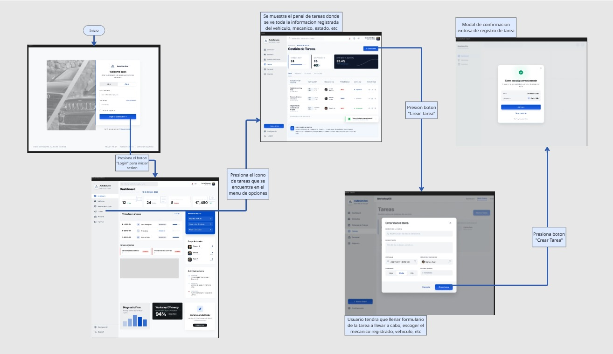

<table>
  <tr>
    <td class="header">User Persona</td>
    <td>Administrador - dueño del taller</td>
    <td class="header">Número</td>
    <td>4</td>
  </tr>
  <tr>
    <td class="header">User Goal</td>
    <td colspan="3" class="italic bold">
      Registrar un vehículo nuevo en el sistema de manera rápida y sin errores, asegurando que la información ingresada sea válida y quede almacenada correctamente.
    </td>
  </tr>
  <tr>
    <td class="header">Happy path</td>
    <td colspan="3">
     El usuario accede a la plataforma e ingresa sus credenciales en la pantalla de inicio de sesión. Una vez autenticado, es redirigido al dashboard principal, donde puede visualizar un resumen general del sistema.
Desde el dashboard, el usuario selecciona el módulo de vehículos, lo que despliega el panel con el listado de vehículos registrados. En esta vista, el usuario identifica y presiona el botón de “Registrar vehículo” para iniciar el proceso de registro.
A continuación, el sistema muestra un formulario donde el usuario debe ingresar la información básica del vehículo (por ejemplo, VIN, marca, modelo, año, entre otros). Una vez completados los campos requeridos, el usuario presiona el botón “Siguiente”.
En la siguiente pantalla, el usuario revisa y complementa los datos del vehículo, incluyendo información adicional y visual (como una imagen referencial). Posteriormente, vuelve a presionar “Siguiente” para avanzar.
El sistema presenta una pantalla de confirmación donde el usuario puede validar toda la información ingresada. Si los datos son correctos, el usuario presiona el botón “Registrar vehículo”.
Finalmente, el sistema procesa la solicitud y muestra un mensaje de confirmación indicando que el vehículo ha sido registrado correctamente.
    </td>
  </tr>
  <tr>
    <td class="header">Unhappy Paths</td>
    <td colspan="3">
Si el usuario ingresa datos inválidos al iniciar sesión, el sistema muestra un mensaje de error y solicita corregirlos.
Durante el registro, si el usuario omite información requerida o ingresa datos incorrectos (por ejemplo, un VIN inválido), el sistema resalta los campos con error e impide avanzar hasta corregirlos.
Si existe inconsistencia en la información ingresada, el sistema muestra mensajes de validación antes de permitir continuar.
El usuario puede abandonar el flujo antes de finalizar el registro, regresando al listado de vehículos sin guardar cambios.
    </td>
  </tr>
</table>

User flow - 4
 

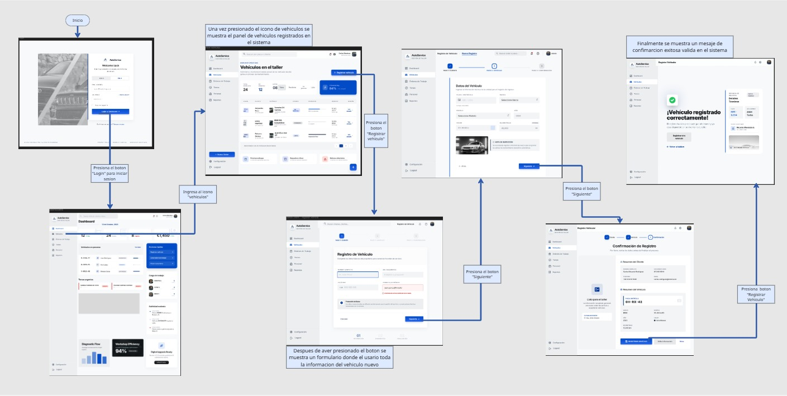

<table>
  <tr>
    <td class="header">User Persona</td>
    <td>Administrador - dueño del taller</td>
    <td class="header">Número</td>
    <td>5</td>
  </tr>
  <tr>
    <td class="header">User Goal</td>
    <td colspan="3" class="italic bold">
    Eliminar una tarea registrada en el sistema de forma segura, asegurando que el usuario confirme la acción antes de que la información sea eliminada definitivamente.
    </td>
  </tr>
  <tr>
    <td class="header">Happy path</td>
    <td colspan="3">
    El usuario accede a la plataforma e inicia sesión con sus credenciales. Tras una autenticación exitosa, es dirigido al dashboard principal, donde puede visualizar un resumen de la actividad del sistema.
Desde el menú lateral, el usuario selecciona el módulo de tareas, lo que lo lleva a la pantalla de gestión de tareas. En esta vista se presenta un listado con las tareas registradas, incluyendo información relevante como nombre de la tarea, vehículo asociado, mecánico asignado y estado actual.
El usuario identifica la tarea que desea eliminar y selecciona el ícono de eliminación (representado por un basurero). Esta acción activa un modal de confirmación que solicita validar la intención de eliminar la tarea.
Si el usuario confirma la acción presionando el botón “Eliminar”, el sistema procesa la solicitud y elimina la tarea del listado. Finalmente, se muestra un mensaje de confirmación (toast) en la interfaz indicando que la eliminación se realizó correctamente.
    </td>
  </tr>
  <tr>
    <td class="header">Unhappy Paths</td>
    <td colspan="3">
    Si el usuario falla al iniciar sesión, el sistema muestra un error y solicita corregir los datos.
Si el usuario decide no eliminar la tarea y cierra el modal o presiona “Cancelar”, el sistema mantiene la tarea sin cambios.
Si ocurre un problema técnico durante la eliminación, el sistema muestra un mensaje de error y la tarea permanece en el listado.
    </td>
  </tr>
</table>

User flow - 5
 

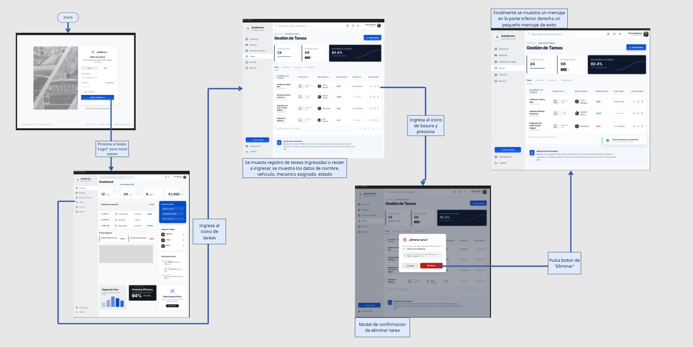

<table>
  <tr>
    <td class="header">User Persona</td>
    <td>Administrador - dueño del taller</td>
    <td class="header">Número</td>
    <td>6</td>
  </tr>
  <tr>
    <td class="header">User Goal</td>
    <td colspan="3" class="italic bold">
    Registrar un nuevo mecánico en el sistema, asegurando que sus datos sean ingresados correctamente para su posterior asignación a tareas dentro del taller.
    </td>
  </tr>
  <tr>
    <td class="header">Happy path</td>
    <td colspan="3">
    El flujo inicia cuando el usuario accede a la plataforma e ingresa sus credenciales en la pantalla de inicio de sesión. Tras una autenticación exitosa, el sistema lo redirige al dashboard principal, donde se muestra un resumen general de la operación.
Desde el menú lateral, el usuario selecciona el módulo de personal. Esta acción despliega el panel de gestión de personal, donde se visualiza el listado de mecánicos registrados en el taller, incluyendo información relevante de cada uno.
En esta pantalla, el usuario presiona el botón “Registrar mecánico” para iniciar el proceso de registro. A continuación, el sistema muestra un formulario en el que el usuario debe ingresar los datos correspondientes del nuevo mecánico, tales como información personal, datos de contacto y otros campos requeridos.
Una vez completado el formulario, el usuario procede a registrar al mecánico en el sistema. El sistema valida la información ingresada y, si todo es correcto, completa el registro, incorporando al nuevo mecánico dentro del listado de personal disponible.
    </td>
  </tr>
  <tr>
    <td class="header">Unhappy Paths</td>
    <td colspan="3">
    Credenciales incorrectas:
Si el usuario no logra iniciar sesión, el sistema muestra un mensaje de error solicitando la corrección de los datos.
<li>Campos obligatorios incompletos:</li>
  Si el usuario omite información requerida en el formulario, el sistema resalta los campos faltantes e impide continuar.
<li>Datos inválidos:</li>
  Si se ingresan datos incorrectos (por ejemplo, formato inválido en correo o teléfono), el sistema muestra mensajes de validación.
<li>Cancelación del proceso:</li>
  El usuario puede abandonar el registro antes de completarlo, regresando al listado sin guardar cambios.
<li>Error del sistema al registrar:</li>
  Si ocurre un fallo durante el registro, el sistema notifica el error y permite reintentar la acción.
    </td>
  </tr>
</table>

User flow - 6
 

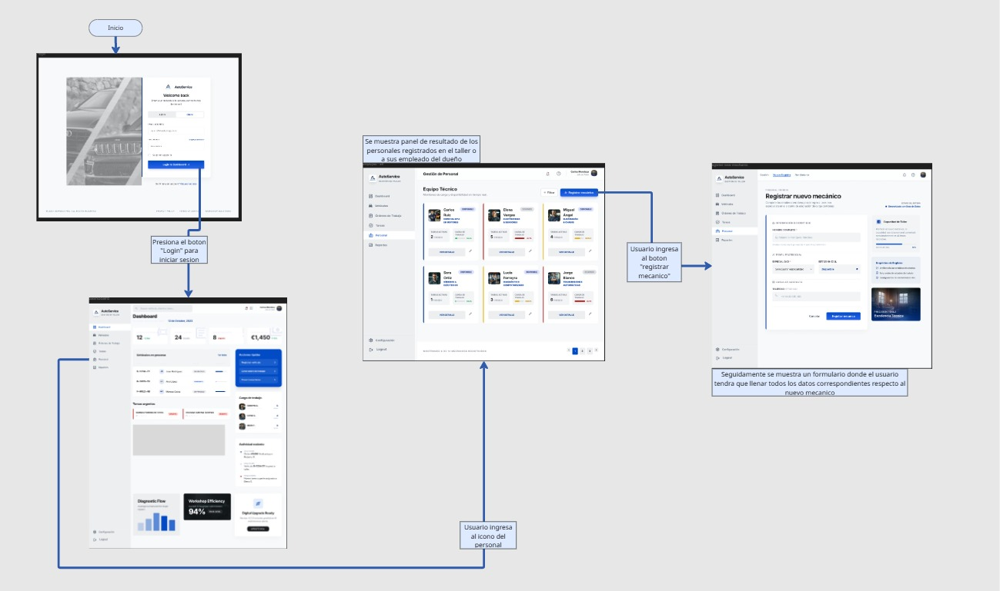

<table>
  <tr>
    <td class="header">User Persona</td>
    <td>Administrador - dueño del taller</td>
    <td class="header">Número</td>
    <td>7</td>
  </tr>
  <tr>
    <td class="header">User Goal</td>
    <td colspan="3" class="italic bold">
    El administrador desea visualizar y consultar el detalle de los vehículos registrados en el sistema para dar seguimiento a su estado y gestionar la operación del taller.
    </td>
  </tr>
  <tr>
    <td class="header">Happy path</td>
    <td colspan="3">
    El usuario accede al sistema a través de la pantalla de inicio de sesión. El administrador ingresa sus credenciales y presiona el botón “Login” para autenticarse correctamente.
Una vez dentro, el sistema muestra el Dashboard principal, donde el usuario puede visualizar un resumen general de la operación del taller. Desde esta vista, el administrador selecciona el ícono o sección de “Vehículos”.
Al ingresar, se despliega el panel de vehículos registrados, donde se presenta una lista con información relevante (cliente, modelo, estado, etc.). El usuario puede explorar esta lista y seleccionar un vehículo específico presionando el botón “Ver detalle”.
Finalmente, el sistema muestra la vista de detalle del vehículo, donde el administrador puede consultar información completa, como datos del cliente, estado del servicio y acciones disponibles (por ejemplo, impresión de orden de trabajo o envío de reporte).
    </td>
  </tr>
  <tr>
    <td class="header">Unhappy Paths</td>
    <td colspan="3">
<li>Credenciales incorrectas: Si el usuario ingresa datos inválidos en el login, el sistema muestra un mensaje de error y solicita reintentar.</li>
<li>Sin vehículos registrados: Si no existen vehículos en el sistema, se muestra un estado vacío con un mensaje informativo y una posible acción para registrar un nuevo vehículo.</li>
<li>Error de carga de datos: Si ocurre un fallo al cargar la lista o el detalle de vehículos, el sistema notifica el error y permite reintentar la acción.</li>
<li>Acceso no autorizado: Si el usuario no cuenta con permisos adecuados, el sistema restringe el acceso a ciertas funcionalidades o vistas.</li>
    </td>
  </tr>
</table>

User flow - 7
 

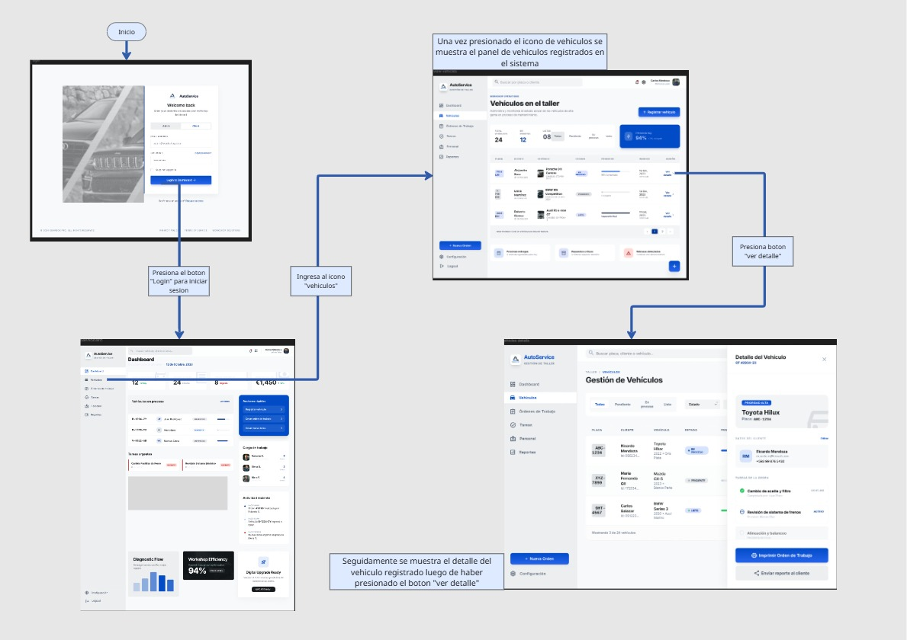

URL de trabajo para los User Flow en miro: 
[URL_aqui](https://miro.com/welcomeonboard/OE91Y1ZRRmR2R3lrOVJQZCtSRWZGL0d0NEduaC9SMHZYbWNQYjlpYjlzMXRiMHNaZ2JIaGVCMzE0bmw3U1N4MVRoaXhhd0FMUjJERzlUZVgvYXl4RXpSa0pvV09sVWYzaHkvMnNmemc4MWZGVVpoL3RiTWJXbms5UzhsdnQ1Y0p3VHhHVHd5UWtSM1BidUtUYmxycDRnPT0hdjE=?share_link_id=686324343058)

### 4.5. Web Applications Prototyping

En esta sección se presenta el prototipo interactivo de la aplicación web AutoService, desarrollado para entornos desktop y mobile, el cual simula la navegación y las principales interacciones del sistema. El prototipo permite evidenciar los flujos definidos en los User Flow Diagrams, así como la correcta implementación de la arquitectura de información y el sistema de navegación propuesto.

Se han considerado criterios clave de interacción, como la claridad en la navegación, la reducción de la carga cognitiva, el uso de retroalimentación inmediata y la consistencia en los componentes. Asimismo, se diferencian dos experiencias de usuario: el panel administrador, con navegación estructurada y orientada a la gestión operativa, y el flujo del cliente, diseñado de forma minimalista para facilitar acciones específicas como la consulta del estado del vehículo y el agendamiento de citas.

El video adjunto demuestra los principales flujos de interacción, evidenciando cómo los usuarios navegan por el sistema, ejecutan tareas clave y reciben retroalimentación del sistema, validando así la usabilidad y coherencia del diseño propuesto.

<strong>Web Applications Prototyping</strong>

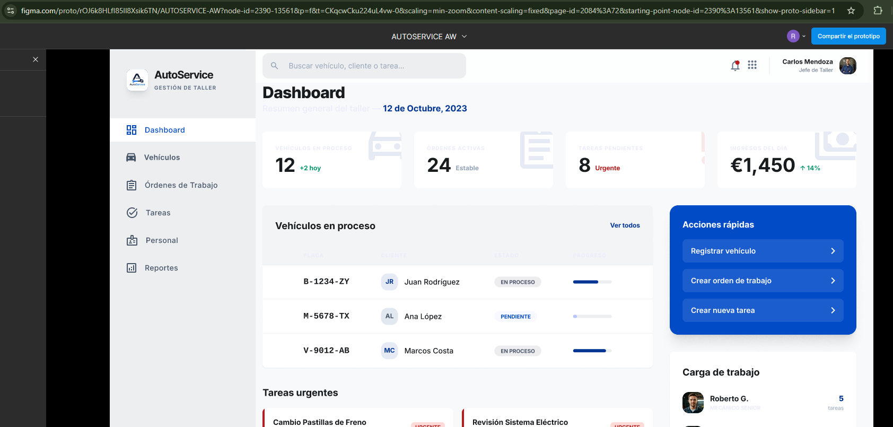

Url de video: <a href="https://upcedupe-my.sharepoint.com/:v:/g/personal/u20241d185_upc_edu_pe/IQA1Ayp44N2tTZ3f8Qg06ivwAWceAwrAwbUt4oEaa1BBGXw?e=EAr9YX">https://upcedupe-my.sharepoint.com/:v:/g/personal/u20241d185_upc_edu_pe/IQA1Ayp44N2tTZ3f8Qg06ivwAWceAwrAwbUt4oEaa1BBGXw?e=EAr9YX</a>

<strong>Mobile Applications Prototyping</strong>

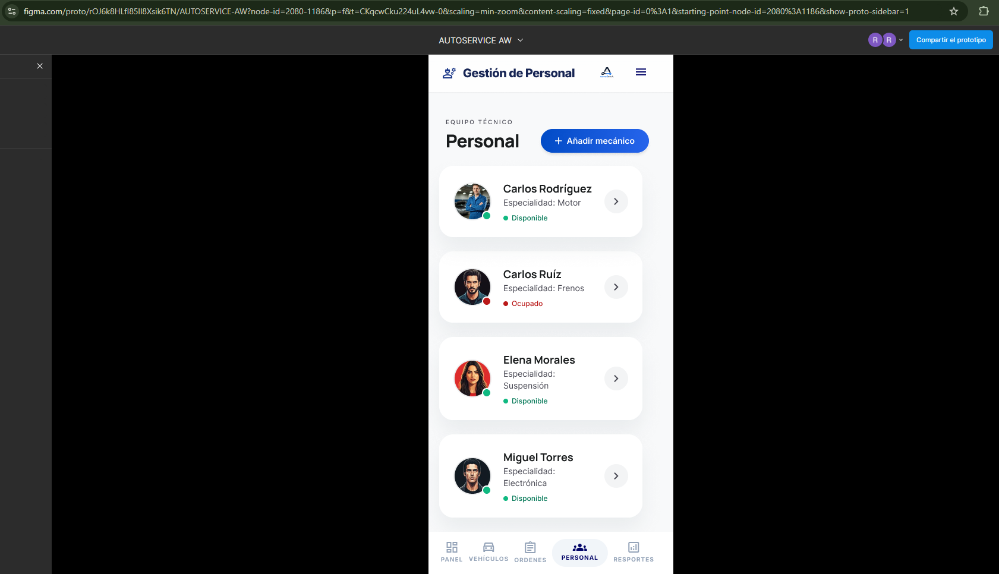

Url de video: <a href="https://upcedupe-my.sharepoint.com/:v:/g/personal/u20241d185_upc_edu_pe/IQAkMAYXAVMXRqIAboIE6jKsAUqumaok8m0tsxRc5iGhvkY?e=MmRJh3">https://upcedupe-my.sharepoint.com/:v:/g/personal/u20241d185_upc_edu_pe/IQAkMAYXAVMXRqIAboIE6jKsAUqumaok8m0tsxRc5iGhvkY?e=MmRJh3</a>

### 4.6. Domain-Driven Software Architecture

La arquitectura de software de AutoService se fundamenta en los principios de Domain-Driven Design (DDD), permitiendo una traducción directa entre las necesidades operativas del negocio automotriz y la estructura del sistema técnico. Mediante la aplicación del Modelo C4, representamos la arquitectura en distintos niveles de abstracción, asegurando que la solución sea escalable, mantenible y esté estrictamente alineada con los contextos delimitados identificados durante el proceso de EventStorming.

#### 4.6.1. Design-Level EventStorming

Para profundizar en la lógica de AutoService<, realizamos una sesión de Design-Level Event Storming. Esta técnica nos permitió transitar desde una visión general del negocio hacia un modelo técnico detallado, identificando los procesos críticos, las reglas de negocio y los límites de los módulos que compondrán nuestra arquitectura orientada a servicios.

<b>Step 1: Collect Domain Events (Big Picture)</b>

En esta fase inicial, realizamos una lluvia de ideas para identificar todos los Domain Events relevantes en el ciclo de vida del taller, desde el registro de la cuenta hasta el procesamiento de comprobantes. Los eventos se redactaron en tiempo pasado, enfocándonos exclusivamente en hechos significativos para el negocio sin preocuparnos por el orden cronológico.

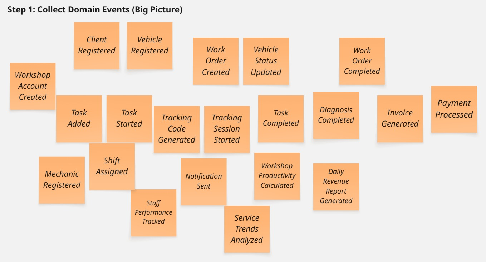

<b>Step 2: Refine Domain Events</b>

Organizamos los eventos identificados en una línea de tiempo horizontal para establecer el flujo lógico de la plataforma. Durante este proceso, refinamos la secuencia y detectamos eventos faltantes, como la generación automática de códigos de seguimiento y el disparo de notificaciones, asegurando una narrativa coherente de la experiencia del usuario.

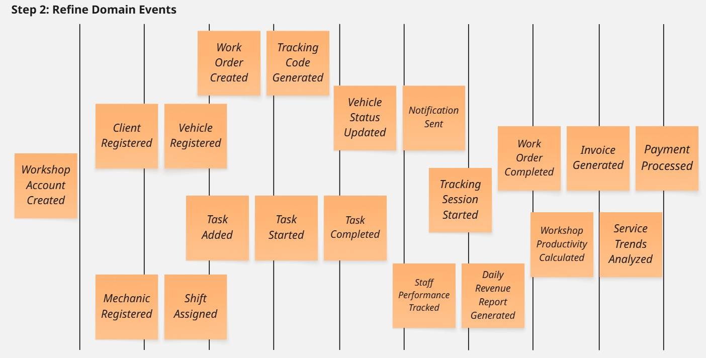

<b>Step 3: Track Causes (Process Modelling)</b>

En este paso, modelamos la causalidad de cada evento introduciendo <b>Actors</b> (quién realiza la acción), <b>Commands</b> (la acción ejecutada), <b>External Systems</b> y <b>Policies</b> (reglas automáticas). Esto nos permitió visualizar cómo interactúan los mecánicos y clientes con el sistema y qué procesos se disparan automáticamente tras un cambio de estado.

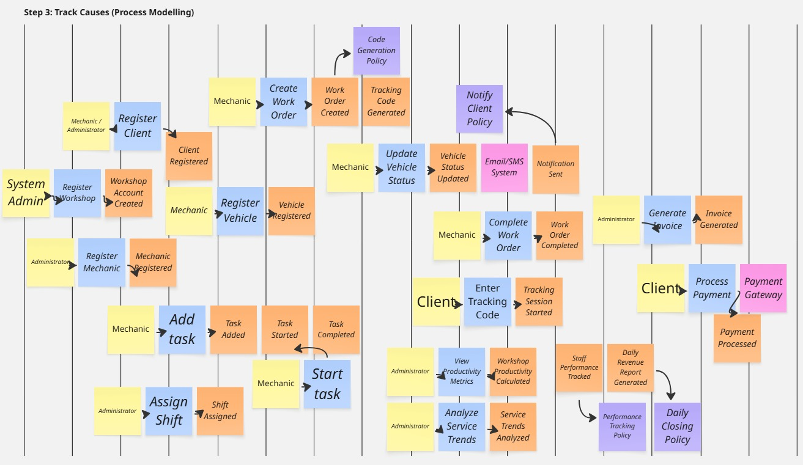

<b>Step 4: Find Aggregates & Bounded Contexts (Software Modelling)</b>

Finalmente, agrupamos los comandos y eventos alrededor de sus <b>Aggregates</b> (entidades principales de datos) para definir los <b>Bounded Contexts</b>. Esta segmentación estratégica establece los límites de responsabilidad para nuestro API RESTful, identificando módulos clave como <i>Workshop Operations</i>, <i>Staff Management</i> y <i>Billing</i>.

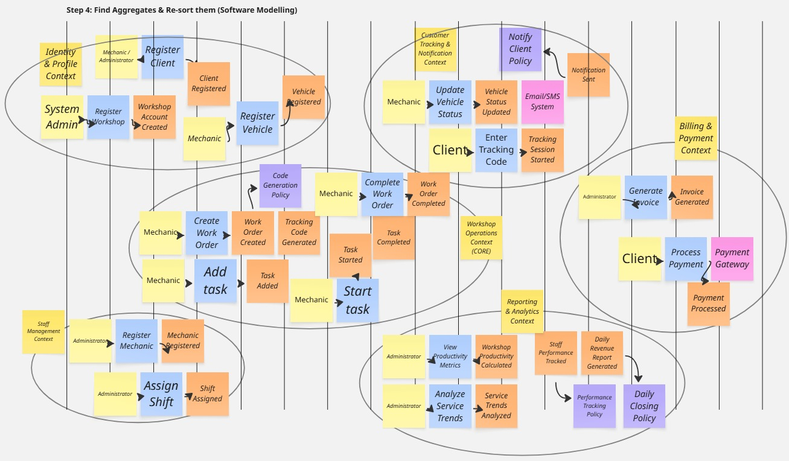

#### 4.6.2. Software Architecture Context Diagram

El diagrama de contexto representa el nivel más alto de abstracción de la solución AutoService Platform. Este diagrama permite visualizar cómo el sistema interactúa con su entorno, identificando a los actores principales: el Mecánico/Administrador, quien gestiona las operaciones del taller, y el Cliente Final, quien realiza el seguimiento de sus vehículos. Asimismo, se muestra la interacción con sistemas externos esenciales como el Messaging Service, encargado del envío automatizado de notificaciones de estado y comprobantes electrónicos de pago.

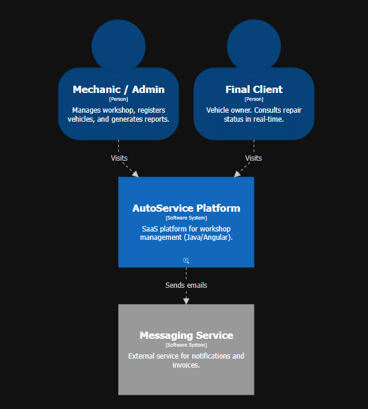

#### 4.6.3. Software Architecture Container Diagrams

A nivel de contenedores, la solución se descompone en aplicaciones independientes que colaboran para ofrecer la funcionalidad completa de la plataforma. Siguiendo un enfoque de arquitectura desacoplada, se han definido los siguientes contenedores:

<ul style="text-align: justify;">
<li><strong>Landing Page:</strong> Desarrollada con HTML5, CSS3 y JavaScript, se encarga de proveer información del producto y captar nuevos talleres hacia el modelo SaaS.</li>
<li><strong>Web Application (SPA):</strong> Construida con Angular y TypeScript, actúa como la interfaz principal donde los administradores gestionan el taller y los clientes finales consultan el progreso de sus reparaciones.</li>
<li><strong>API RESTful:</strong> Constituye el núcleo de la lógica de negocio, implementado con Java y el framework Spring Boot. Centraliza todas las reglas de dominio y expone servicios web mediante el intercambio de JSON.</li>
<li><strong>Database:</strong> Una instancia de PostgreSQL encargada de la persistencia segura y relacional de la información de clientes, vehículos, órdenes, staff y facturación.</li>
</ul>

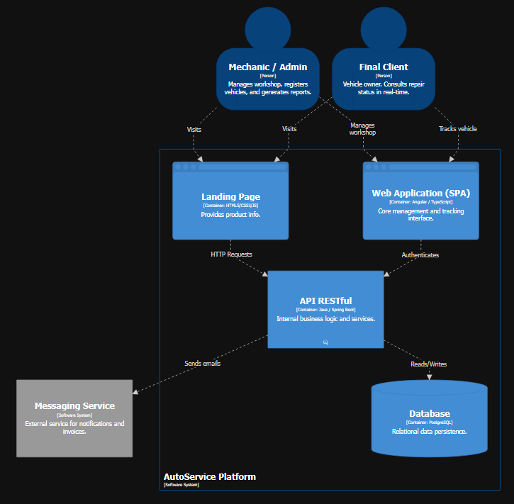

#### 4.6.4. Software Architecture Components Diagrams

Este diagrama profundiza en el contenedor API RESTful para exponer los bloques estructurales internos que implementan los casos de uso definidos en el dominio. La lógica interna se organiza a través de componentes especializados:

<ul style="text-align: justify;">
<li><strong>IAM Component:</strong> Basado en Spring Security, este componente gestiona la identidad, autenticación y autorización mediante tokens JWT, protegiendo el acceso a los recursos del sistema.</li>
<li><strong>Workshop Service:</strong> Componente encargado de la orquestación de servicios de taller, incluyendo la gestión de flota, registro de vehículos y el control de las órdenes de trabajo.</li>
<li><strong>Tracking Service:</strong> Servicio dedicado a procesar y proveer la información de seguimiento en tiempo real, permitiendo a los clientes visualizar el avance de sus reparaciones.</li>
<li><strong>Billing Service:</strong> Gestiona la lógica de facturación para la generación de boletas y facturas electrónicas, integrándose con el servicio de mensajería para el envío de comprobantes.</li>
<li><strong>Reporting Service:</strong> Componente analítico que procesa los datos operativos para calcular métricas de productividad del staff y generar reportes financieros detallados para los administradores.</li>
</ul>

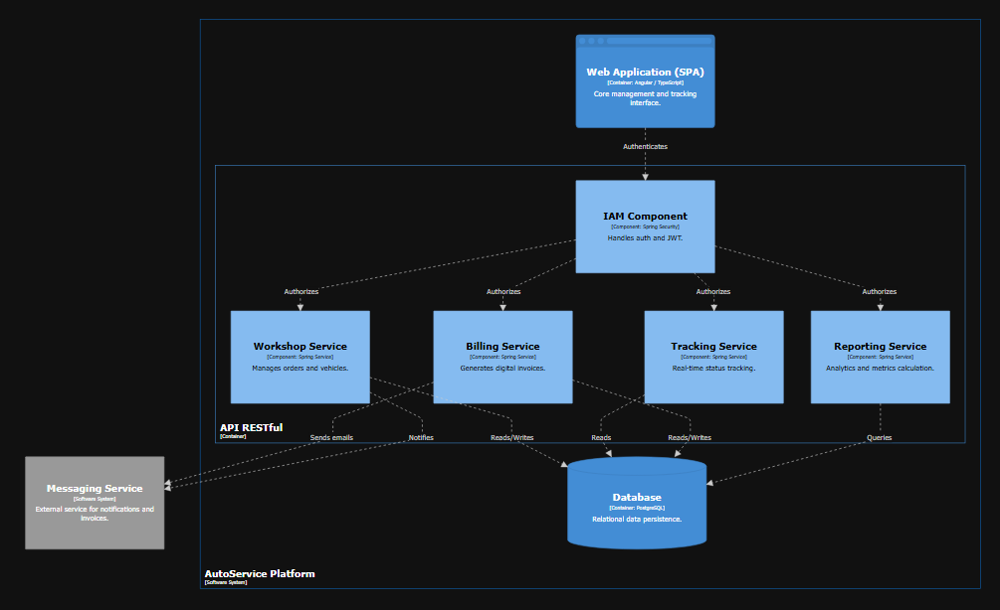

### 4.7. Software Object-Oriented Design

  En esta sección se presenta el diseño orientado a objetos del sistema <strong>AutoService</strong>, 
  alineado con los principios de <strong>Domain-Driven Design (DDD)</strong> y 
  <strong>Clean Architecture</strong>.

  Los diagramas de clases modelan la estructura estática de cada 
  <strong>Bounded Context</strong> identificado en el <strong>Event Storming</strong>, 
  asegurando una clara separación de responsabilidades, alta cohesión y bajo acoplamiento.

<table>
  <thead>
    <tr>
      <th>Característica</th>
      <th>Descripción</th>
    </tr>
  </thead>
  <tbody>
    <tr>
      <td>Notación UML Estándar</td>
      <td align="justify">Se utiliza la sintaxis oficial de diagramas de clases.</td>
    </tr>
    <tr>
      <td>Visibilidad (Scope)</td>
      <td align="justify">- private, + public, # protected – encapsulamiento.</td>
    </tr>
    <tr>
      <td>Tipos de Datos Java</td>
      <td align="justify">UUID, String, LocalDateTime, BigDecimal, boolean, int, enum – tipado nativo Java.</td>
    </tr>
    <tr>
      <td>Relaciones Explícitas</td>
      <td align="justify">Nombre de rol, dirección de navegación y multiplicidad (1, 0..1, *).</td>
    </tr>
    <tr>
      <td>Optimización para Persistencia</td>
      <td align="justify">Entidades consolidadas para mapeo directo al modelo relacional de 16 tablas (JPA/Hibernate).</td>
    </tr>
    <tr>
      <td>Patrones y Principios</td>
      <td align="justify">SOLID (SRP, DIP), Repository, Factory, Strategy, Domain Events.</td>
    </tr>
  </tbody>
</table>

#### 4.7.1. Class Diagrams

##### Diagrama de Clases General - AutoService

##### Identity & Profile Context

###### Responsabilidades Principales
- Autenticación de usuarios mediante credenciales seguras (hash de contraseñas)
- Gestión de roles y asignación a usuarios
- Control de acceso multi-tenant mediante **WorkshopId**
- Auditoría de asignación de roles (fecha de asignación)

###### Reglas de Negocio Clave
- Cada usuario pertenece a un único taller (**WorkshopId**), asegurando aislamiento multi-tenant
- Los roles disponibles son: **Admin**, **Mechanic**, **Client**
- Un usuario puede tener múltiples roles simultáneamente
- La asignación de roles registra la fecha para trazabilidad
- Solo usuarios activos (**IsActive = true**) pueden autenticarse

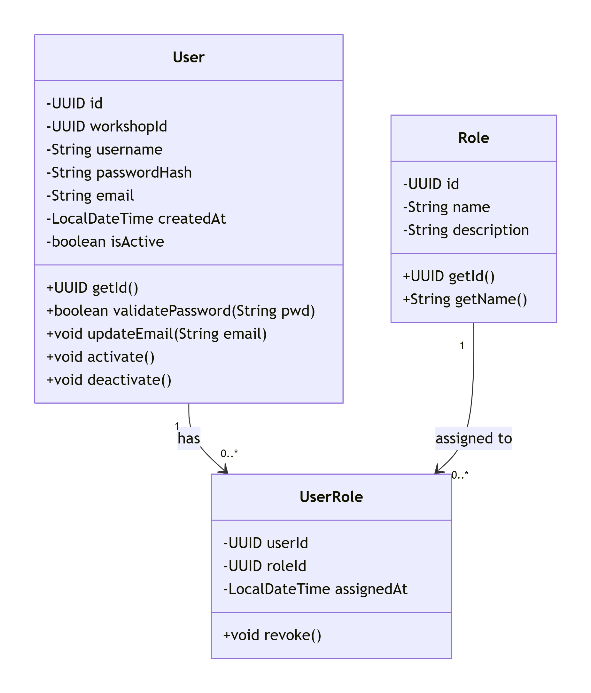

##### Workshop Operations Context (Core Domain)

###### Responsabilidades Principales
- Gestión del ciclo de vida completo de las órdenes de trabajo
- Registro y mantenimiento de información de clientes y vehículos
- Desglose operativo de servicios en tareas asignables a mecánicos
- Seguimiento del estado de servicios y auditoría de cambios
- Generación de códigos de seguimiento para transparencia al cliente

###### Reglas de Negocio Clave
- Cada orden de trabajo debe estar asociada a un vehículo y un taller
- Los vehículos deben tener un único propietario (cliente) registrado
- El estado de la orden sigue un flujo definido: **PENDING → IN_PROGRESS → COMPLETED → DELIVERED** (con soporte para **CANCELLED**)
- Cada cambio de estado se registra en **StatusHistory** para auditoría
- Cada orden genera un código de seguimiento único para consulta del cliente
- El monto total de la orden se calcula a partir de los costos de sus tareas

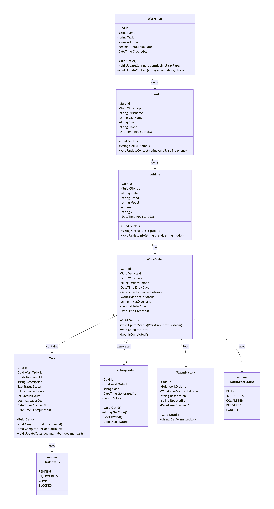

##### Staff Management Context (Supporting Domain)

###### Responsabilidades Principales
- Registro y gestión de información laboral de mecánicos
- Asignación y control de turnos de trabajo
- Validación de conflictos de horarios
- Cálculo de métricas laborales (ingresos semanales)
- Verificación de disponibilidad del personal técnico

###### Reglas de Negocio Clave
- Cada mecánico está asociado a un usuario del sistema (**UserId**) para autenticación
- Un mecánico pertenece a un único taller (**WorkshopId**)
- Los turnos de un mismo mecánico no pueden superponerse en el tiempo (**IsOverlapping()**)
- El estado **IsActive** determina si el mecánico está disponible para asignación
- Los tipos de turno son: **MORNING**, **AFTERNOON**, **NIGHT**, **OVERTIME**

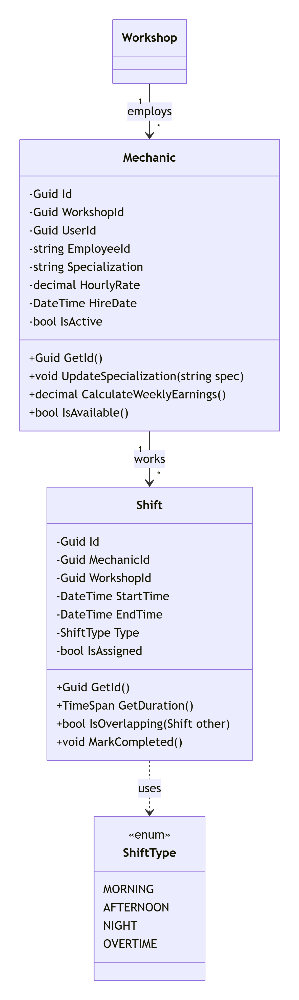

##### Billing & Payment Context (Supporting Domain)

###### Responsabilidades Principales
- Generación de facturas y comprobantes fiscales
- Cálculo de subtotales, impuestos y totales
- Gestión de ítems detallados por factura
- Registro de pagos con múltiples métodos
- Procesamiento y seguimiento de transacciones
- Soporte para cancelación y reembolsos

###### Reglas de Negocio Clave
- Cada factura puede estar asociada a una orden de trabajo (relación opcional **0..1**)
- Los totales se calculan automáticamente a partir de los ítems y la tasa de impuesto
- Una factura puede recibir un solo pago (relación **0..1**), simplificando el modelo
- Se soportan múltiples métodos de pago: **efectivo**, **tarjeta crédito/débito**, **transferencia**
- Los pagos tienen un ciclo de vida: **PENDING → PROCESSING → COMPLETED / FAILED**
- Las facturas pueden estar en estado: **DRAFT**, **ISSUED**, **PAID**, **CANCELLED** o **OVERDUE**

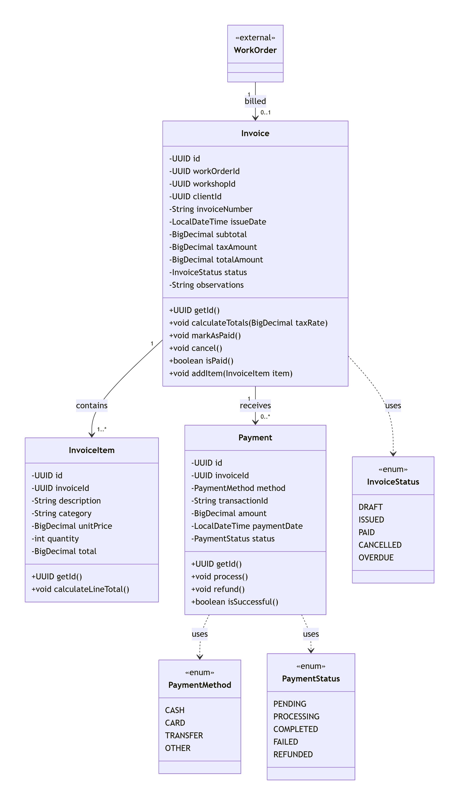

##### Customer Tracking & Notification Context (Supporting Domain)

###### Responsabilidades Principales
- Registro de notificaciones enviadas a clientes
- Envío de notificaciones a través de múltiples canales (Email, SMS, Push, WhatsApp)
- Seguimiento del estado de entrega de notificaciones
- Trazabilidad completa de la comunicación por cliente y orden de trabajo
- Soporte para notificaciones automáticas basadas en eventos del sistema

###### Reglas de Negocio Clave
- Cada notificación se registra antes de ser enviada, garantizando trazabilidad
- Las notificaciones se vinculan al cliente destinatario (**ClientId**)
- Opcionalmente, una notificación puede asociarse a una orden de trabajo (**WorkOrderId**)
- Los tipos de notificación incluyen: **actualización de estado**, **orden completada**, **pago recibido** y **recordatorios**
- El sistema soporta múltiples canales: **Email**, **SMS**, **Push Notification** y **WhatsApp**
- El ciclo de vida de una notificación es: **PENDING → SENT → DELIVERED / FAILED**

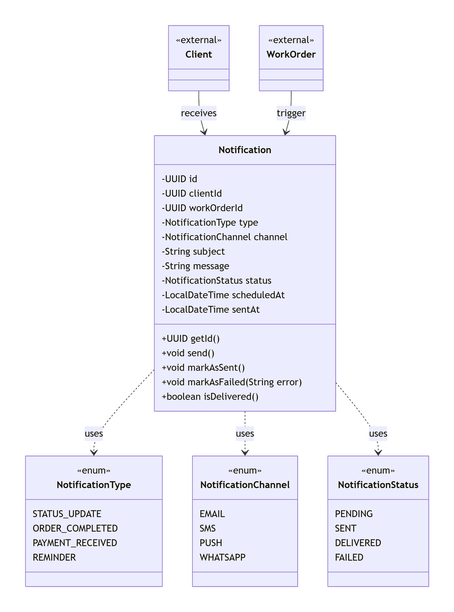

##### Reporting & Analytics Context (Supporting Domain)

###### Responsabilidades Principales
- Generación de reportes bajo demanda o programada
- Almacenamiento de metadata de reportes generados (tipo, rango de fechas, URL del archivo)
- Exportación de reportes en múltiples formatos (PDF, Excel)
- Trazabilidad de quién generó cada reporte y cuándo

###### Regla de Negocio Clave
- Los reportes pueden generarse por rango de fechas personalizado
- Cada reporte está asociado a un taller específico (**WorkshopId**)
- Los tipos de reporte disponibles son: ingresos diarios, productividad semanal, resumen mensual y desempeño de mecánicos
- Los reportes generados se almacenan como archivos (PDF/Excel) con una URL de acceso
- La lógica de cálculo de métricas se ejecuta al momento de generar el reporte, consultando datos en vivo

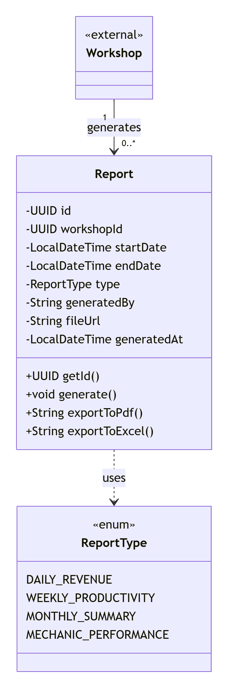

### 4.8. Database Design

En esta sección se presenta el diseño de la base de datos relacional para el <strong>AutoService</strong>, alineado con los <strong>Bounded Contexts</strong> identificados en el análisis de <strong>Domain-Driven Design (DDD)</strong> y optimizado para cumplir con el alcance del proyecto.

#### Características Principales del Diseño

  <table>
    <thead>
      <tr>
        <th scope="col">Característica</th>
        <th scope="col">Descripción</th>
      </tr>
    </thead>
    <tbody>
      <tr>
        <td>Motor de Base de Datos</td>
        <td style="text-align: justify;">
          PostgreSQL 15+ / SQL Server 2019+ (según configuración del entorno).
        </td>
      </tr>
      <tr>
        <td>Normalización</td>
        <td style="text-align: justify;">
          Tercera Forma Normal (3NF) para eliminar redundancias y garantizar integridad referencial.
        </td>
      </tr>
      <tr>
        <td>Claves Primarias</td>
        <td style="text-align: justify;">
          Todas las tablas utilizan Guid/UUID como clave primaria para escalabilidad distribuida y evitar conflictos en entornos multi-tenant.
        </td>
      </tr>
      <tr>
        <td>Claves Foráneas</td>
        <td style="text-align: justify;">
          Relaciones explícitas con restricciones ON DELETE CASCADE o ON DELETE RESTRICT según la lógica de negocio y preservación de datos históricos.
        </td>
      </tr>
      <tr>
        <td>Índices</td>
        <td style="text-align: justify;">
          Índices en columnas de búsqueda frecuente (Plate, Email, OrderNumber, StatusEnum, WorkshopId) para optimizar consultas.
        </td>
      </tr>
      <tr>
        <td>Soft Delete</td>
        <td style="text-align: justify;">
          Columna IsActive o IsArchived en entidades críticas para preservación histórica sin eliminación física.
        </td>
      </tr>
      <tr>
        <td>Auditoría Básica</td>
        <td style="text-align: justify;">
          Columnas CreatedAt, UpdatedAt en tablas transaccionales para trazabilidad temporal.
        </td>
      </tr>
      <tr>
        <td>Enumeraciones</td>
        <td style="text-align: justify;">
          Campos INT con valores controlados para estados (WorkOrderStatus, PaymentStatus) garantizando consistencia de datos a nivel de aplicación.
        </td>
      </tr>
      <tr>
        <td>Multi-tenancy</td>
        <td style="text-align: justify;">
          Columna WorkshopId en tablas operativas para aislamiento lógico entre talleres (modelo SaaS), con políticas de Row-Level Security (RLS) opcionales.
        </td>
      </tr>
    </tbody>
  </table>

#### 4.8.1. Database Diagrams

##### Diagrama de Base de Datos General - AutoService

##### Identity & Profile Context
Este contexto gestiona la autenticación, autorización y configuración multi-tenant del sistema.

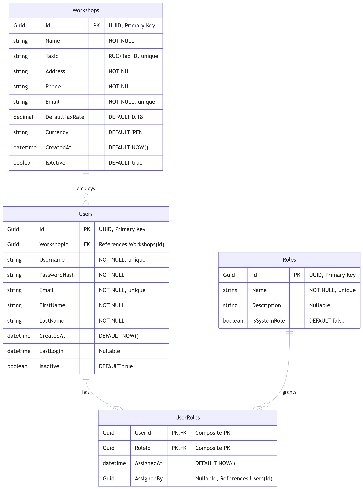

##### Workshop Operations Context (Core Domain)
El núcleo del negocio: gestión de órdenes de trabajo, tareas y seguimiento.

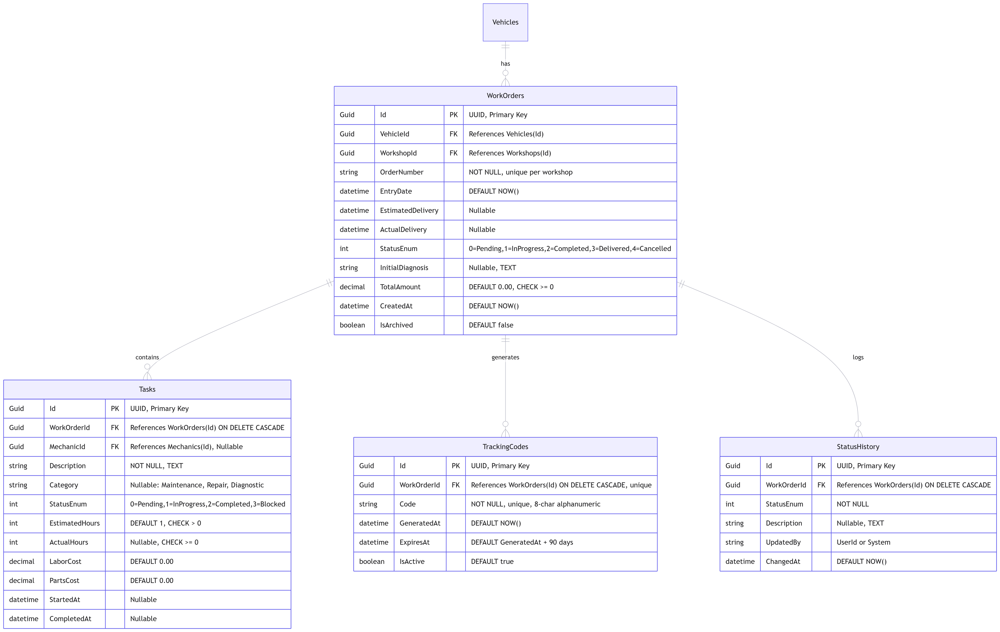

##### Staff Management Context (Supporting Domain)
Administra el personal técnico, sus turnos y disponibilidad operativa.

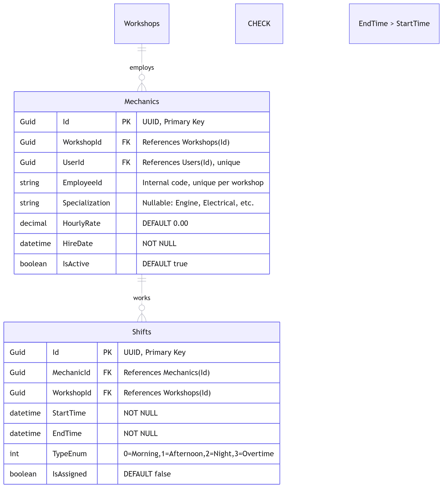

##### Billing & Payment Context (Supporting Domain)
Gestiona la facturación, comprobantes y registro de transacciones económicas.

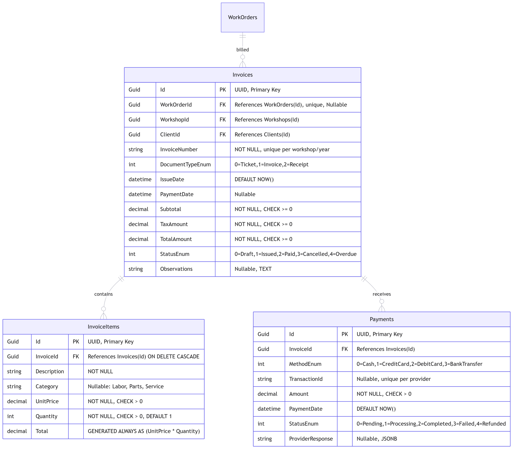

##### Customer Tracking & Notification Context (Supporting Domain)
Facilita la comunicación proactiva con el cliente final y el seguimiento externo.

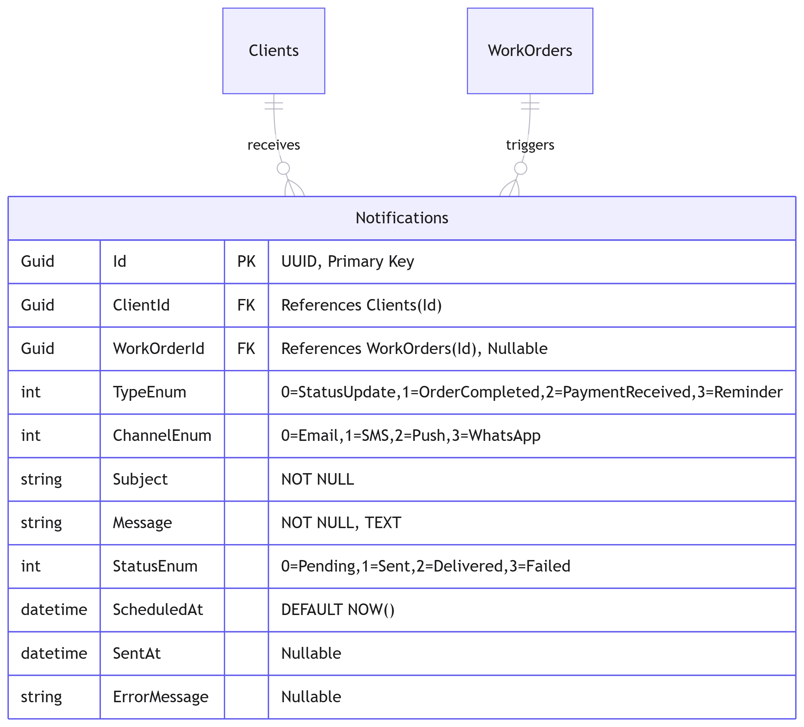

##### Reporting & Analytics Context (Supporting Domain)
El contexto de Reporting se alimenta de las siguientes tablas operativas distribuidas en otros Bounded Contexts como Customer & Assets Context
Gestiona la información de clientes propietarios y sus vehículos registrados.

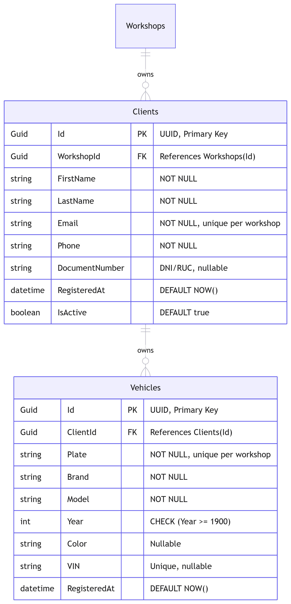

