## Capítulo V: Product Implementation, Validation & Deployment

### 5.1. Software Configuration Management

<p align="justify">
  La siguiente tabla presenta las herramientas, plataformas y guías empleadas para la configuración del entorno de desarrollo del proyecto <strong>AutoService</strong>, el cual tiene como objetivo digitalizar y optimizar la gestión de talleres automotrices mediante una solución web basada en arquitectura distribuida.
  
  Cada herramienta ha sido seleccionada considerando su compatibilidad con tecnologías open-source, su capacidad de integración y su uso en entornos profesionales de desarrollo de software.
</p>

<table>
  <thead>
    <tr>
      <th>Proceso</th>
      <th>Recurso o plataforma</th>
      <th>Finalidad</th>
      <th>Medio de acceso o Enlace</th>
    </tr>
  </thead>
  <tbody>
    <tr>
      <td>Especificación de requisitos</td>
      <td>Convenciones Gherkin</td>
      <td>Definir criterios de aceptación claros para funcionalidades del sistema</td>
      <td><a href="https://cucumber.io/docs/gherkin/" target="_blank">Guía Gherkin</a></td>
    </tr>
    <tr>
      <td>Frontend Web Application</td>
      <td>Angular Framework</td>
      <td>Desarrollar la interfaz web dinámica del sistema AutoService</td>
      <td><a href="https://angular.io/" target="_blank">Angular</a></td>
    </tr>
    <tr>
      <td>Backend REST API</td>
      <td>Spring Boot</td>
      <td>Implementar servicios RESTful para la gestión de citas, clientes y servicios automotrices</td>
      <td><a href="https://spring.io/projects/spring-boot" target="_blank">Spring Boot</a></td>
    </tr>
    <tr>
      <td>Desarrollo Landing Page</td>
      <td>Visual Studio Code</td>
      <td>Editar y programar el código del Landing Page y frontend</td>
      <td><a href="https://code.visualstudio.com/" target="_blank">Visual Studio Code</a></td>
    </tr>
    <tr>
      <td>Control de versiones</td>
      <td>Git & GitHub</td>
      <td>Gestionar versiones y colaboración del equipo</td>
      <td><a href="https://github.com/" target="_blank">GitHub</a></td>
    </tr>
    <tr>
      <td>Diseño UX/UI</td>
      <td>Figma</td>
      <td>Diseñar wireframes, mockups y prototipos del sistema</td>
      <td><a href="https://figma.com" target="_blank">Figma</a></td>
    </tr>
    <tr>
      <td>Gestión del proyecto</td>
      <td>Trello</td>
      <td>Organizar backlog, tareas y seguimiento de sprints</td>
      <td><a href="https://trello.com" target="_blank">Trello</a></td>
    </tr>
    <tr>
      <td>Documentación API</td>
      <td>Swagger (OpenAPI)</td>
      <td>Documentar endpoints REST del sistema</td>
      <td><a href="https://swagger.io/" target="_blank">Swagger</a></td>
    </tr>
    <tr>
      <td>Modelado UX</td>
      <td>UXPressia</td>
      <td>Construir User Personas, Journey Maps y análisis UX</td>
      <td><a href="https://uxpressia.com/" target="_blank">UXPressia</a></td>
    </tr>
  </tbody>
</table>


#### 5.1.2. Source Code Management
<p align="justify">
  Para el desarrollo del proyecto AutoService, el equipo utiliza GitHub como plataforma principal de control de versiones, permitiendo gestionar de manera eficiente el código fuente tanto del Landing Page, como de la Web Application (Angular) y los Web Services (Spring Boot).
  
  Se ha adoptado el modelo GitFlow como estrategia principal de trabajo, lo que permite estructurar el desarrollo de manera ordenada y escalable. Este enfoque resulta especialmente adecuado para el proyecto, ya que involucra múltiples componentes (frontend, backend y landing page) que evolucionan en paralelo.
  
  La estructura de ramas implementada incluye:
</p>

- **main**: contiene la versión estable y desplegada del sistema AutoService  
- **develop**: integra los avances en desarrollo antes de pasar a producción  
- **feature/**: desarrollo de funcionalidades específicas (ej. gestión de citas, autenticación)  
- **hotfix/**: correcciones urgentes en producción  

<p align="justify">
  Cada funcionalidad es desarrollada en una rama independiente, lo que permite mantener el aislamiento de cambios y evitar conflictos. La integración se realiza mediante Pull Requests, los cuales son revisados por el equipo antes de ser fusionados.
  
  Adicionalmente, se implementa la convención de Conventional Commits para estandarizar los mensajes de confirmación:
</p>

- **feat**: nuevas funcionalidades (ej. creación de citas)  
- **fix**: corrección de errores  
- **docs**: cambios en documentación  
- **refactor**: mejoras internas sin alterar funcionalidad  
- **style**: cambios de formato  
- **test**: pruebas  

<p align="justify">
  Asimismo, se utiliza versionado semántico (Semantic Versioning) bajo el esquema MAJOR.MINOR.PATCH, lo cual permite gestionar de manera clara la evolución del sistema.
  
  Este enfoque garantiza una gestión organizada, colaborativa y escalable del proyecto AutoService.
</p>

#### 5.1.3. Source Code Style Guide & Conventions
<p align="justify">
  Con el propósito de garantizar la calidad, mantenibilidad y escalabilidad del sistema AutoService, se han establecido lineamientos de codificación aplicables a todos los componentes del proyecto, incluyendo el Landing Page (HTML, CSS, JavaScript), la Web Application (Angular) y el Backend (Spring Boot).
  
  Estos lineamientos permiten mantener consistencia en el desarrollo colaborativo, facilitar la lectura del código y asegurar su evolución a lo largo del tiempo. Como estándar general, todo el código fuente, nombres de variables, clases, métodos, archivos y documentación técnica se redacta en idioma inglés, alineándose con prácticas internacionales de desarrollo de software.
</p>

  **HTML Conventions**

<p align="justify">
Para la estructura del frontend se empleará HTML5 semántico, que prioriza la correcta organización del contenido y la accesibilidad.
</p>

<p align="justify">
Las principales convenciones adoptadas son:
</p>

- Uso de etiquetas semánticas como &lt;header&gt;, &lt;nav&gt;, &lt;main&gt;, &lt;section&gt; y &lt;footer&gt;
- Nombres de etiquetas y atributos en minúsculas
- Inclusión obligatoria del atributo alt en imágenes
- Uso de metadatos esenciales (&lt;title&gt;, &lt;meta&gt;)
- Evitar estilos inline

Ejemplo:

```html
<section class="hero-section">
  
</section>
  ```

  **CSS Conventions**

<p align="justify">
  Para la hoja de estilos se seguirá una estructura modular y escalable, enfocada en la reutilización de componentes.
  - Uso de nomenclatura kebab-case.
  - Aplicación de metodología BEM.
  - Diseño responsive (mobile-first).
  - Uso de variables CSS en :root.
  - Uso de unidades relativas (rem, %, vh, vw).

  ``` CSS
  :root {
  --primary-color: #1e3a8a;
  --secondary-color: #64748b;
  }

  .main-header {
    padding: 1rem;
    background-color: var(--primary-color);
  }
  ```

  **JavaScript Conventions**

  Para la lógica del lado del cliente se adoptarán lineamientos orientados a la claridad, reutilización y mantenimiento del código.
  Se aplicarán las siguientes convenciones:
  - Uso de camelCase para variables y funciones.
  - Declaración con const y let (evitando var).
  - Código separado por módulos.
  - Uso de addEventListener().

  Ejemplo:
  ``` JavaScript
  const contactButton = document.querySelector("#contact-button");

  function handleContactClick() {
    console.log("Contact button clicked");
  }

  contactButton.addEventListener("click", handleContactClick);
  ```

  **Angular Conventions**

  Se utiliza como el framework principal para el desarrollo de la Web Application, es decir, la interfaz con la que interactúan los usuarios del sistema, como administradores de talleres y clientes. Su función es permitir la construcción de una aplicación web dinámica, moderna y altamente interactiva, capaz de consumir los servicios proporcionados por el backend desarrollado en Spring Boot.

  Se aplicarán las siguientes convenciones:

  - Uso de TypeScript.
  - Arquitectura basada en componentes.
  - Separación en modules, services y models.
  - camelCase para variables y métodos.
  - PascalCase para clases.
    
  Ejemplo:
  ``` angular
  export class AppointmentService {

    getAppointments() {
      return [];
    }
  }
  ```

  **Spring Boot Conventions**

  Para la definición de criterios de aceptación y pruebas funcionales se utilizará el lenguaje Gherkin, que sigue una estructura orientada al negocio.
  Las convenciones definidas son:
  - Uso de PascalCase para clases.
  - Uso de camelCase para variables y métodos.
  - Arquitectura en capas: Controllers, Services, Repositories, Models.
  - Uso de anotaciones REST.

  Ejemplo:

  ``` sprint boot
  @RestController
  @RequestMapping("/api/appointments")
  public class AppointmentController {

      @GetMapping
      public List<Appointment> getAllAppointments() {
          return new ArrayList<>();
      }
  }
  ```

  **Gherkin Conventions (User Stories & Testing)**

  Se utiliza como un lenguaje estructurado para definir las funcionalidades del sistema desde la perspectiva del usuario, permitiendo describir de manera clara y comprensible los comportamientos esperados de la aplicación. Su uso se integra principalmente en la redacción de User Stories y criterios de aceptación, facilitando la comunicación entre los miembros del equipo técnico y los stakeholders no técnicos, como usuarios finales o evaluadores del proyecto.

    - Uso de Given - When - Then.
    - Lenguaje entendible para negocio.
    - Escenarios claros.

  Ejemplo:

  ``` gherkin
  Feature: Appointment Management

  Escenario: Creación de cita exitosa
    Dado que el usuario ha iniciado sesión en AutoService, 
    cuando el usuario programa una nueva cita de servicio, 
    entonces el sistema guarda la cita correctamente.
  ```

  **Coding Principles Adopted**

  De manera transversal, el equipo aplicará los siguientes principios:
  - Readbility First: código fácil de leer y entender.
  - Consistency: mantener el mismo estilo en toda la solución.
  - Modularity: separación clara de responsabilidades.
  - Scalability: estructura preparada para crecimiento futuro.
  - Maintainability: facilidad para futuras modificaciones.
</p>


#### 5.1.4. Software Deployment Configuration
<p align="justify">
Para la configuración del despliegue del sistema AutoService, se ha definido una estrategia que contempla la publicación independiente de cada uno de sus componentes: el Landing Page, la Web Application desarrollada en Angular y el Backend basado en servicios REST con Spring Boot. Esta separación responde a la arquitectura distribuida del proyecto, permitiendo una mayor escalabilidad, mantenibilidad y facilidad de integración entre las distintas capas del sistema.
</p>

**Landing Page Deployment - HTML, CSS and JavaScript**

**Source Repository Setup**
<p align="justify">
  En el caso específico del Landing Page, se utilizará un repositorio remoto alojado en GitHub, en el cual se almacenarán todos los archivos fuente correspondientes a la interfaz web estática. Este componente cumple la función de presentar la propuesta de valor de AutoService y servir como punto de entrada para los usuarios hacia la plataforma.
  
  Dado que el Landing Page ha sido desarrollado con HTML, CSS y JavaScript, es indispensable que el archivo principal <strong>index.html</strong> permanezca en la raíz del repositorio, ya que este será utilizado como punto de inicio durante el proceso de despliegue. Asimismo, los archivos complementarios como hojas de estilo, scripts e imágenes se organizarán en directorios específicos, con el fin de mantener una estructura clara, facilitar el mantenimiento del código y permitir futuras actualizaciones del sistema.
  
  Ejemplo:
  ```
  /
  |---index.html
  |---css/
  |    |__ styles.css
  |---js/
  |    |__ main.js
  |---assets/
        |__ images/
  ```
</p>

**Deployment Process (GitHub Pages)**
<p align="justify">
  La publicación del sitio se realizará mediante el servicio GitHub Pages, el cual permite desplegar sitios estáticos directamente desde el repositorio.
  Para habilitar el despliegue, se seguirán los siguientes pasos:
  - Acceder al repositorio del proyecto en GitHub
  - Ingresar a la sección Settings
  - Seleccionar la opción Pages
  - Configurar la rama main como fuente de despliegue
  - Definir la carpeta raíz (root) como directorio de publicación
  - Guardar la configuración
  Una vez configurado, GitHub Pages generará automáticamente el sitio web.
</p>

**Published Access**
<p align="justify">
  El Landing Page estará disponible mediante una URL pública con la siguiente estructura:
  
  ```
  https://<usernanme>.github.io/<repository-name>/
  ```

  Este enlace corresponderá a la versión oficial publicada del producto.
</p>

**Frontend Deployment (Angular)**
<p align="justify">
  La aplicación web desarrollada en Angular será desplegada en plataformas cloud como Firebase Hosting o Vercel, permitiendo alta disponibilidad y tiempos de respuesta óptimos.

  Proceso:
  - Generación de build de producción:

  ```
  ng build --prod
  ```

  - Despliegue en plataforma cloud seleccionada
</p>

**Backend Deployment (Spring Boot)**

<p align="justify">
  El backend del sistema será desplegado en servicios cloud como Render, Railway o AWS, permitiendo la ejecución continua de la API REST.

  Proceso:

  - Compilación del proyecto y generación del archivo .jar
  - Configuración de variables de entorno
  - Despliegue en servidor cloud

</p>

**System Integration**

<p align="justify">
  La Web Application se comunica con el backend mediante peticiones HTTP a través de una API REST, permitiendo la gestión de citas, clientes y servicios automotrices en tiempo real.

  Ejemplo:

  **Request:**

  ```
    GET /api/appointments
  ```

  **Respuesta (JSON):**

  ```
    json
    [
      {
        "id": 1,
        "clientName": "Juan Perez",
        "service": "Cambio de aceite",
        "date": "2026-04-20"
      }
    ]
  ```
</p>

**Updates System**

<p align="justify">
  Cada modificación realizada en el repositorio principal genera una nueva versión del sistema. Al actualizar la rama principal, los cambios pueden ser desplegados automáticamente o de forma manual, garantizando que la versión publicada se mantenga sincronizada con el código fuente más reciente.
</p>

### 5.2. Landing Page, Services & Applications Implementation

#### 5.2.1. Sprint 1

##### 5.2.1.1. Sprint Planning 1

<div align="center">
  <table style="margin: auto; width: 100%; border-collapse: collapse; text-align: left;">
    <thead>
      <tr>
        <th colspan="2" style="text-align: center; background-color: #f2f2f2; font-size: 1.2em; padding: 10px; border: 1px solid #ddd;">Sprint #1</th>
      </tr>
    </thead>
    <tbody>
      <tr>
        <td colspan="2" style="background-color: #fafafa; font-weight: bold; text-align: center; padding: 10px; border: 1px solid #ddd;">Sprint Planning Background</td>
      </tr>
      <tr>
        <td style="width: 30%; font-weight: bold; padding: 10px; border: 1px solid #ddd;">Date</td>
        <td style="padding: 10px; border: 1px solid #ddd;">2026-04-08</td>
      </tr>
      <tr>
        <td style="font-weight: bold; padding: 10px; border: 1px solid #ddd;">Time</td>
        <td style="padding: 10px; border: 1px solid #ddd;">10:00 AM</td>
      </tr>
      <tr>
        <td style="font-weight: bold; padding: 10px; border: 1px solid #ddd;">Location</td>
        <td style="padding: 10px; border: 1px solid #ddd;">Reunión presencial en la UPC. (Pabellón L, piso 4, cubículo 11)</td>
      </tr>
      <tr>
        <td style="font-weight: bold; padding: 10px; border: 1px solid #ddd;">Prepared By</td>
        <td style="padding: 10px; border: 1px solid #ddd;">Sanchez Cuadrado, Juan Antonio</td>
      </tr>
      <tr>
        <td style="font-weight: bold; padding: 10px; border: 1px solid #ddd;">Attendees (to planning meeting)</td>
        <td style="padding: 10px; border: 1px solid #ddd;">Aguilar Aguayo, Jeferson Renzo / López Monroy, Rodrigo Alfredo / Luis Miranda, Diego Andres / Mamani Vilca, Alan Jaivi / Sanchez Cuadrado, Juan Antonio</td>
      </tr>
      <tr>
        <td style="font-weight: bold; padding: 10px; border: 1px solid #ddd;">Sprint 0 Review Summary</td>
        <td style="padding: 10px; border: 1px solid #ddd;">Al ser la iteración inicial del proyecto, no existe un Sprint previo para revisar. El equipo se enfocó en el setup inicial de herramientas, creación de la organización en GitHub y configuración del espacio de trabajo en Jira Software.</td>
      </tr>
      <tr>
        <td style="font-weight: bold; padding: 10px; border: 1px solid #ddd;">Sprint 0 Retrospective Summary</td>
        <td style="padding: 10px; border: 1px solid #ddd;">Al ser el primer ciclo, no hay retrospectiva previa. Sin embargo, el equipo acordó como norma de trabajo el uso estricto de Feature Branching para el control de versiones y la comunicación constante ante bloqueos técnicos.</td>
      </tr>
      <tr>
        <td colspan="2" style="background-color: #fafafa; font-weight: bold; text-align: center; padding: 10px; border: 1px solid #ddd;">Sprint Goal & User Stories</td>
      </tr>
      <tr>
        <td style="font-weight: bold; padding: 10px; border: 1px solid #ddd;">Sprint 1 Goal</td>
        <td style="padding: 10px; border: 1px solid #ddd;">
          <strong>Our focus is on</strong> deploying the official Landing Page and establishing the core software architecture and database design.<br><br>
          <strong>We believe it delivers</strong> a solid online presence for early user acquisition and a reliable technical foundation for the development team.<br><br>
          <strong>This will be confirmed when</strong> the Landing Page is publicly accessible via a web link with responsive design, and the C4 Model diagrams along with the Database Entity-Relationship diagram are fully documented and approved.
        </td>
      </tr>
      <tr>
        <td style="font-weight: bold; padding: 10px; border: 1px solid #ddd;">Sprint 1 Velocity</td>
        <td style="padding: 10px; border: 1px solid #ddd;">27 Story Points</td>
      </tr>
      <tr>
        <td style="font-weight: bold; padding: 10px; border: 1px solid #ddd;">Sum of Story Points</td>
        <td style="padding: 10px; border: 1px solid #ddd;">27 Story Points (US-01: 3, US-02: 2, US-03: 1, US-04: 3, TS-01: 5, TS-04: 3, TS-10: 5, TS-11: 5).</td>
      </tr>
    </tbody>
  </table>
</div>

##### 5.2.1.2. Aspect Leaders and Collaborators

En el presente Sprint 1, el alcance funcional y técnico se ha dividido en tres aspectos principales para garantizar una entrega eficiente:
1. Landing Page (Frontend): Desarrollo de la interfaz gráfica e identidad visual.
2. Architecture & Database: Diseño de diagramas C4 y modelado relacional de la base de datos.
3. DevOps & Deployment: Configuración de repositorios, CI/CD básico y hosting estático.

<div align="center">
  <table style="margin: auto; width: 100%; border-collapse: collapse; text-align: center;">
    <thead>
      <tr style="background-color: #f2f2f2;">
        <th style="padding: 10px; border: 1px solid #ddd; text-align: left;">Team Member (Last Name, First Name)</th>
        <th style="padding: 10px; border: 1px solid #ddd;">GitHub Username</th>
        <th style="padding: 10px; border: 1px solid #ddd;">Landing Page (Frontend)<br><small>Leader (L) / Collaborator (C)</small></th>
        <th style="padding: 10px; border: 1px solid #ddd;">Architecture & Database<br><small>Leader (L) / Collaborator (C)</small></th>
        <th style="padding: 10px; border: 1px solid #ddd;">DevOps & Deployment<br><small>Leader (L) / Collaborator (C)</small></th>
      </tr>
    </thead>
    <tbody>
      <tr>
        <td style="padding: 10px; border: 1px solid #ddd; text-align: left;">Aguilar Aguayo, Jeferson Renzo</td>
        <td style="padding: 10px; border: 1px solid #ddd;">jefersomblan</td>
        <td style="padding: 10px; border: 1px solid #ddd; color: #1976d2;">C</td>
        <td style="padding: 10px; border: 1px solid #ddd; color: #1976d2;">C</td>
        <td style="padding: 10px; border: 1px solid #ddd; color: #1976d2;">C</td>
      </tr>
      <tr>
        <td style="padding: 10px; border: 1px solid #ddd; text-align: left;">López Monroy, Rodrigo Alfredo</td>
        <td style="padding: 10px; border: 1px solid #ddd;">rodrigolopezu</td>
        <td style="padding: 10px; border: 1px solid #ddd; color: #1976d2;">C</td>
        <td style="padding: 10px; border: 1px solid #ddd; color: #1976d2;">C</td>
        <td style="padding: 10px; border: 1px solid #ddd; font-weight: bold; color: #2e7d32;">L</td>
      </tr>
      <tr>
        <td style="padding: 10px; border: 1px solid #ddd; text-align: left;">Luis Miranda, Diego Andres</td>
        <td style="padding: 10px; border: 1px solid #ddd;">andrewdmr</td>
        <td style="padding: 10px; border: 1px solid #ddd; font-weight: bold; color: #2e7d32;">L</td>
        <td style="padding: 10px; border: 1px solid #ddd; color: #1976d2;">C</td>
        <td style="padding: 10px; border: 1px solid #ddd; color: #1976d2;">C</td>
      </tr>
      <tr>
        <td style="padding: 10px; border: 1px solid #ddd; text-align: left;">Mamani Vilca, Alan Jaivi</td>
        <td style="padding: 10px; border: 1px solid #ddd;">alanmamaniv</td>
        <td style="padding: 10px; border: 1px solid #ddd; color: #1976d2;">C</td>
        <td style="padding: 10px; border: 1px solid #ddd; font-weight: bold; color: #2e7d32;">L</td>
        <td style="padding: 10px; border: 1px solid #ddd; color: #1976d2;">C</td>
      </tr>
      <tr>
        <td style="padding: 10px; border: 1px solid #ddd; text-align: left;">Sanchez Cuadrado, Juan Antonio</td>
        <td style="padding: 10px; border: 1px solid #ddd;">juanasc05</td>
        <td style="padding: 10px; border: 1px solid #ddd; color: #1976d2;">C</td>
        <td style="padding: 10px; border: 1px solid #ddd; font-weight: bold; color: #2e7d32;">L</td>
        <td style="padding: 10px; border: 1px solid #ddd; color: #1976d2;">C</td>
      </tr>
    </tbody>
  </table>
</div>

##### 5.2.1.3. Sprint Backlog 1

El presente Sprint Backlog detalla la descomposición técnica de las historias de usuario y técnicas seleccionadas para la primera iteración. El objetivo principal de este Sprint es establecer la presencia web inicial mediante la Landing Page y sentar las bases arquitectónicas del sistema. A continuación, se presenta la captura de nuestro tablero en Jira Software, seguida de la tabla de control de estado con la distribución de los Work-Items.

<div align="center">


</div>

<div align="center">
  <table style="margin: auto; width: 100%; border-collapse: collapse; text-align: left; font-size: 13px; border: 1px solid #ddd;">
    <thead>
      <tr style="background-color: #e0e0e0; font-weight: bold;">
        <th style="padding: 10px; text-align: center; border: 1px solid #ddd;">Sprint #</th>
        <th colspan="7" style="padding: 10px; text-align: left; border: 1px solid #ddd;">1</th>
      </tr>
      <tr style="background-color: #f2f2f2;">
        <th colspan="2" style="text-align: center; border: 1px solid #ddd; padding: 10px;">User Story</th>
        <th colspan="6" style="text-align: center; border: 1px solid #ddd; padding: 10px;">Work-Item / Task</th>
      </tr>
      <tr style="background-color: #fafafa; text-align: center;">
        <th style="border: 1px solid #ddd; padding: 5px; width: 6%;">Id</th>
        <th style="border: 1px solid #ddd; padding: 5px; width: 15%;">Title</th>
        <th style="border: 1px solid #ddd; padding: 5px; width: 6%;">Id</th>
        <th style="border: 1px solid #ddd; padding: 5px; width: 15%;">Title</th>
        <th style="border: 1px solid #ddd; padding: 5px; width: 30%;">Description</th>
        <th style="border: 1px solid #ddd; padding: 5px; width: 8%;">Estimation (Hours)</th>
        <th style="border: 1px solid #ddd; padding: 5px; width: 12%;">Assigned To</th>
        <th style="border: 1px solid #ddd; padding: 5px; width: 8%;">Status</th>
      </tr>
    </thead>
    <tbody>
      <tr>
        <td rowspan="2" style="border: 1px solid #ddd; padding: 8px; vertical-align: middle; text-align: center; font-weight: bold;">US-01</td>
        <td rowspan="2" style="border: 1px solid #ddd; padding: 8px; vertical-align: middle;">Visualizar landing page</td>
        <td style="border: 1px solid #ddd; padding: 8px; text-align: center;">WI-01</td>
        <td style="border: 1px solid #ddd; padding: 8px;">Diseño inicial</td>
        <td style="border: 1px solid #ddd; padding: 8px;"><i>Diseñar wireframes y mockup inicial de la estructura web.</i></td>
        <td style="border: 1px solid #ddd; padding: 8px; text-align: center;">4</td>
        <td style="border: 1px solid #ddd; padding: 8px;">Luis, Diego</td>
        <td style="border: 1px solid #ddd; padding: 8px; text-align: center; font-weight: bold; color: #2aac2a;">Done</td>
      </tr>
      <tr>
        <td style="border: 1px solid #ddd; padding: 8px; text-align: center;">WI-02</td>
        <td style="border: 1px solid #ddd; padding: 8px;">Setup Frontend</td>
        <td style="border: 1px solid #ddd; padding: 8px;"><i>Configurar proyecto base utilizando React y Tailwind CSS.</i></td>
        <td style="border: 1px solid #ddd; padding: 8px; text-align: center;">3</td>
        <td style="border: 1px solid #ddd; padding: 8px;">López, Rodrigo</td>
        <td style="border: 1px solid #ddd; padding: 8px; text-align: center; font-weight: bold; color: #2aac2a;">Done</td>
      </tr>
      <tr>
        <td rowspan="2" style="border: 1px solid #ddd; padding: 8px; vertical-align: middle; text-align: center; font-weight: bold;">US-02</td>
        <td rowspan="2" style="border: 1px solid #ddd; padding: 8px; vertical-align: middle;">Visualizar beneficios del sistema</td>
        <td style="border: 1px solid #ddd; padding: 8px; text-align: center;">WI-03</td>
        <td style="border: 1px solid #ddd; padding: 8px;">Redacción Copy</td>
        <td style="border: 1px solid #ddd; padding: 8px;"><i>Redactar y estructurar el contenido (copy) explicativo.</i></td>
        <td style="border: 1px solid #ddd; padding: 8px; text-align: center;">2</td>
        <td style="border: 1px solid #ddd; padding: 8px;">Sanchez, Juan</td>
        <td style="border: 1px solid #ddd; padding: 8px; text-align: center; font-weight: bold; color: #2aac2a;">Done</td>
      </tr>
      <tr>
        <td style="border: 1px solid #ddd; padding: 8px; text-align: center;">WI-04</td>
        <td style="border: 1px solid #ddd; padding: 8px;">Componente Cards</td>
        <td style="border: 1px solid #ddd; padding: 8px;"><i>Desarrollar los componentes de tarjetas para beneficios.</i></td>
        <td style="border: 1px solid #ddd; padding: 8px; text-align: center;">4</td>
        <td style="border: 1px solid #ddd; padding: 8px;">Mamani, Alan</td>
        <td style="border: 1px solid #ddd; padding: 8px; text-align: center; font-weight: bold; color: #2aac2a;">Done</td>
      </tr>
      <tr>
        <td rowspan="2" style="border: 1px solid #ddd; padding: 8px; vertical-align: middle; text-align: center; font-weight: bold;">US-03</td>
        <td rowspan="2" style="border: 1px solid #ddd; padding: 8px; vertical-align: middle;">Acceder a la plataforma desde CTA</td>
        <td style="border: 1px solid #ddd; padding: 8px; text-align: center;">WI-05</td>
        <td style="border: 1px solid #ddd; padding: 8px;">Botones CTA</td>
        <td style="border: 1px solid #ddd; padding: 8px;"><i>Maquetar los botones de llamado a la acción.</i></td>
        <td style="border: 1px solid #ddd; padding: 8px; text-align: center;">2</td>
        <td style="border: 1px solid #ddd; padding: 8px;">Luis, Diego</td>
        <td style="border: 1px solid #ddd; padding: 8px; text-align: center; font-weight: bold; color: #2aac2a;">Done</td>
      </tr>
      <tr>
        <td style="border: 1px solid #ddd; padding: 8px; text-align: center;">WI-06</td>
        <td style="border: 1px solid #ddd; padding: 8px;">Enrutamiento React</td>
        <td style="border: 1px solid #ddd; padding: 8px;"><i>Configurar el enrutamiento base hacia vistas futuras.</i></td>
        <td style="border: 1px solid #ddd; padding: 8px; text-align: center;">3</td>
        <td style="border: 1px solid #ddd; padding: 8px;">Aguilar, Jeferson</td>
        <td style="border: 1px solid #ddd; padding: 8px; text-align: center; font-weight: bold; color: #2aac2a;">Done</td>
      </tr>
      <tr>
        <td rowspan="2" style="border: 1px solid #ddd; padding: 8px; vertical-align: middle; text-align: center; font-weight: bold;">US-04</td>
        <td rowspan="2" style="border: 1px solid #ddd; padding: 8px; vertical-align: middle;">Visualizar landing responsive</td>
        <td style="border: 1px solid #ddd; padding: 8px; text-align: center;">WI-07</td>
        <td style="border: 1px solid #ddd; padding: 8px;">Media Queries</td>
        <td style="border: 1px solid #ddd; padding: 8px;"><i>Aplicar clases utilitarias para ajuste a móviles y tablets.</i></td>
        <td style="border: 1px solid #ddd; padding: 8px; text-align: center;">4</td>
        <td style="border: 1px solid #ddd; padding: 8px;">Aguilar, Jeferson</td>
        <td style="border: 1px solid #ddd; padding: 8px; text-align: center; font-weight: bold; color: #2aac2a;">Done</td>
      </tr>
      <tr>
        <td style="border: 1px solid #ddd; padding: 8px; text-align: center;">WI-08</td>
        <td style="border: 1px solid #ddd; padding: 8px;">Testing UI</td>
        <td style="border: 1px solid #ddd; padding: 8px;"><i>Realizar validaciones de renderizado en pantallas.</i></td>
        <td style="border: 1px solid #ddd; padding: 8px; text-align: center;">2</td>
        <td style="border: 1px solid #ddd; padding: 8px;">Aguilar, Jeferson</td>
        <td style="border: 1px solid #ddd; padding: 8px; text-align: center; font-weight: bold; color: #2aac2a;">Done</td>
      </tr>
      <tr>
        <td rowspan="3" style="border: 1px solid #ddd; padding: 8px; vertical-align: middle; text-align: center; font-weight: bold;">TS-01</td>
        <td rowspan="3" style="border: 1px solid #ddd; padding: 8px; vertical-align: middle;">Definir arquitectura del sistema</td>
        <td style="border: 1px solid #ddd; padding: 8px; text-align: center;">WI-09</td>
        <td style="border: 1px solid #ddd; padding: 8px;">Context Diagram</td>
        <td style="border: 1px solid #ddd; padding: 8px;"><i>Diseñar Context Diagram bajo el modelo C4.</i></td>
        <td style="border: 1px solid #ddd; padding: 8px; text-align: center;">3</td>
        <td style="border: 1px solid #ddd; padding: 8px;">Mamani, Alan</td>
        <td style="border: 1px solid #ddd; padding: 8px; text-align: center; font-weight: bold; color: #2aac2a;">Done</td>
      </tr>
      <tr>
        <td style="border: 1px solid #ddd; padding: 8px; text-align: center;">WI-10</td>
        <td style="border: 1px solid #ddd; padding: 8px;">Container Diagram</td>
        <td style="border: 1px solid #ddd; padding: 8px;"><i>Diseñar Container Diagram bajo el modelo C4.</i></td>
        <td style="border: 1px solid #ddd; padding: 8px; text-align: center;">4</td>
        <td style="border: 1px solid #ddd; padding: 8px;">Sanchez, Juan</td>
        <td style="border: 1px solid #ddd; padding: 8px; text-align: center; font-weight: bold; color: #2aac2a;">Done</td>
      </tr>
      <tr>
        <td style="border: 1px solid #ddd; padding: 8px; text-align: center;">WI-11</td>
        <td style="border: 1px solid #ddd; padding: 8px;">Event Storming</td>
        <td style="border: 1px solid #ddd; padding: 8px;"><i>Elaborar el Design-Level Event Storming.</i></td>
        <td style="border: 1px solid #ddd; padding: 8px; text-align: center;">4</td>
        <td style="border: 1px solid #ddd; padding: 8px;">Mamani, Alan</td>
        <td style="border: 1px solid #ddd; padding: 8px; text-align: center; font-weight: bold; color: #2aac2a;">Done</td>
      </tr>
      <tr>
        <td rowspan="2" style="border: 1px solid #ddd; padding: 8px; vertical-align: middle; text-align: center; font-weight: bold;">TS-04</td>
        <td rowspan="2" style="border: 1px solid #ddd; padding: 8px; vertical-align: middle;">Diseñar modelo de base de datos</td>
        <td style="border: 1px solid #ddd; padding: 8px; text-align: center;">WI-12</td>
        <td style="border: 1px solid #ddd; padding: 8px;">Modelo Conceptual</td>
        <td style="border: 1px solid #ddd; padding: 8px;"><i>Identificar entidades y relaciones de negocio.</i></td>
        <td style="border: 1px solid #ddd; padding: 8px; text-align: center;">3</td>
        <td style="border: 1px solid #ddd; padding: 8px;">Sanchez, Juan</td>
        <td style="border: 1px solid #ddd; padding: 8px; text-align: center; font-weight: bold; color: #2aac2a;">Done</td>
      </tr>
      <tr>
        <td style="border: 1px solid #ddd; padding: 8px; text-align: center;">WI-13</td>
        <td style="border: 1px solid #ddd; padding: 8px;">Diagrama Lógico ER</td>
        <td style="border: 1px solid #ddd; padding: 8px;"><i>Elaborar el Diagrama Entidad-Relación de la BD.</i></td>
        <td style="border: 1px solid #ddd; padding: 8px; text-align: center;">5</td>
        <td style="border: 1px solid #ddd; padding: 8px;">Mamani, Alan</td>
        <td style="border: 1px solid #ddd; padding: 8px; text-align: center; font-weight: bold; color: #2aac2a;">Done</td>
      </tr>
      <tr>
        <td rowspan="2" style="border: 1px solid #ddd; padding: 8px; vertical-align: middle; text-align: center; font-weight: bold;">TS-10</td>
        <td rowspan="2" style="border: 1px solid #ddd; padding: 8px; vertical-align: middle;">Configurar entorno de desarrollo</td>
        <td style="border: 1px solid #ddd; padding: 8px; text-align: center;">WI-14</td>
        <td style="border: 1px solid #ddd; padding: 8px;">Configuración Git</td>
        <td style="border: 1px solid #ddd; padding: 8px;"><i>Definir estructura de repositorio y flujo de ramas.</i></td>
        <td style="border: 1px solid #ddd; padding: 8px; text-align: center;">3</td>
        <td style="border: 1px solid #ddd; padding: 8px;">López, Rodrigo</td>
        <td style="border: 1px solid #ddd; padding: 8px; text-align: center; font-weight: bold; color: #2aac2a;">Done</td>
      </tr>
      <tr>
        <td style="border: 1px solid #ddd; padding: 8px; text-align: center;">WI-15</td>
        <td style="border: 1px solid #ddd; padding: 8px;">Definir guía de estilos de código</td>
        <td style="border: 1px solid #ddd; padding: 8px;"><i>Code style guide and conventions.</i></td>
        <td style="border: 1px solid #ddd; padding: 8px; text-align: center;">5</td>
        <td style="border: 1px solid #ddd; padding: 8px;">Aguilar, Jeferson</td>
        <td style="border: 1px solid #ddd; padding: 8px; text-align: center; font-weight: bold; color: #2aac2a;">Done</td>
      </tr>
      <tr>
        <td rowspan="2" style="border: 1px solid #ddd; padding: 8px; vertical-align: middle; text-align: center; font-weight: bold;">TS-11</td>
        <td rowspan="2" style="border: 1px solid #ddd; padding: 8px; vertical-align: middle;">Desplegar aplicación</td>
        <td style="border: 1px solid #ddd; padding: 8px; text-align: center;">WI-16</td>
        <td style="border: 1px solid #ddd; padding: 8px;">Hosting de la landing page</td>
        <td style="border: 1px solid #ddd; padding: 8px;"><i>Configurar el servicio de hosting estático para la Landing Page.</i></td>
        <td style="border: 1px solid #ddd; padding: 8px; text-align: center;">4</td>
        <td style="border: 1px solid #ddd; padding: 8px;">López, Rodrigo</td>
        <td style="border: 1px solid #ddd; padding: 8px; text-align: center; font-weight: bold; color: #2aac2a;">Done</td>
      </tr>
      <tr>
        <td style="border: 1px solid #ddd; padding: 8px; text-align: center;">WI-17</td>
        <td style="border: 1px solid #ddd; padding: 8px;">Pruebas de acceso</td>
        <td style="border: 1px solid #ddd; padding: 8px;"><i>Verificar el acceso público al enlace.</i></td>
        <td style="border: 1px solid #ddd; padding: 8px; text-align: center;">2</td>
        <td style="border: 1px solid #ddd; padding: 8px;">Aguilar, Jeferson</td>
        <td style="border: 1px solid #ddd; padding: 8px; text-align: center; font-weight: bold; color: #2aac2a;">Done</td>
      </tr>
    </tbody>
  </table>
</div>

##### 5.2.1.4. Development Evidence for Sprint Review

<p align="justify">
Durante el Sprint 1, el equipo completó la base estratégica y técnica del proyecto, abarcando desde la definición del perfil de la startup hasta el diseño detallado del producto en los Capítulos I al IV. En cuanto a la implementación técnica, los esfuerzos se centraron en el diseño de mockups de alta fidelidad, el despliegue de la versión inicial de la Landing Page y la configuración de los entornos de desarrollo para la implementación de la Web Application y el RESTful API en los siguientes sprints.<br><br>
En la siguiente tabla se presentan commits que representan hitos clave del desarrollo de este sprint:
</p>

<table style="width: 100%; border-collapse: collapse; text-align: justify;">
  <thead>
    <tr style="background-color: #f2f2f2;">
      <th style="border: 1px solid #ddd; padding: 8px;">Repository</th>
      <th style="border: 1px solid #ddd; padding: 8px;">Branch</th>
      <th style="border: 1px solid #ddd; padding: 8px;">Commit Id</th>
      <th style="border: 1px solid #ddd; padding: 8px;">Commit Message</th>
      <th style="border: 1px solid #ddd; padding: 8px;">Commit Message Body</th>
      <th style="border: 1px solid #ddd; padding: 8px;">Commited on (Date)</th>
    </tr>
  </thead>
  <tbody>
    <tr>
      <td style="border: 1px solid #ddd; padding: 8px;"><code>InnovaTechStudio/AutoService-729-OS</code></td>
      <td style="border: 1px solid #ddd; padding: 8px;"><code>main</code></td>
      <td style="border: 1px solid #ddd; padding: 8px;"><code>43a3a61</code></td>
      <td style="border: 1px solid #ddd; padding: 8px;">chore:</td>
      <td style="border: 1px solid #ddd; padding: 8px;">initial project setup</td>
      <td style="border: 1px solid #ddd; padding: 8px;">12/04/2026</td>
    </tr>
    <tr>
      <td style="border: 1px solid #ddd; padding: 8px;"><code>InnovaTechStudio/AutoService-729-OS</code></td>
      <td style="border: 1px solid #ddd; padding: 8px;"><code>feature/capitulo-1</code></td>
      <td style="border: 1px solid #ddd; padding: 8px;"><code>a8c043e</code></td>
      <td style="border: 1px solid #ddd; padding: 8px;">docs:</td>
      <td style="border: 1px solid #ddd; padding: 8px;">add solution profile</td>
      <td style="border: 1px solid #ddd; padding: 8px;">12/04/2026</td>
    </tr>
    <tr>
      <td style="border: 1px solid #ddd; padding: 8px;"><code>InnovaTechStudio/AutoService-729-OS</code></td>
      <td style="border: 1px solid #ddd; padding: 8px;"><code>feature/chapter-3</code></td>
      <td style="border: 1px solid #ddd; padding: 8px;"><code>25b600f</code></td>
      <td style="border: 1px solid #ddd; padding: 8px;">docs:</td>
      <td style="border: 1px solid #ddd; padding: 8px;">add product backlog table and jira evidence</td>
      <td style="border: 1px solid #ddd; padding: 8px;">12/04/2026</td>
    </tr>
    <tr>
      <td style="border: 1px solid #ddd; padding: 8px;"><code>InnovaTechStudio/AutoService-729-OS</code></td>
      <td style="border: 1px solid #ddd; padding: 8px;"><code>feature/chapter-5</code></td>
      <td style="border: 1px solid #ddd; padding: 8px;"><code>3815e12</code></td>
      <td style="border: 1px solid #ddd; padding: 8px;">docs:</td>
      <td style="border: 1px solid #ddd; padding: 8px;">add sprint 1 backlog table</td>
      <td style="border: 1px solid #ddd; padding: 8px;">12/04/2026</td>
    </tr>
    <tr>
      <td style="border: 1px solid #ddd; padding: 8px;"><code>InnovaTechStudio/AutoService-729-OS</code></td>
      <td style="border: 1px solid #ddd; padding: 8px;"><code>feature/chapter-2/interview-struct</code></td>
      <td style="border: 1px solid #ddd; padding: 8px;"><code>e262f08</code></td>
      <td style="border: 1px solid #ddd; padding: 8px;">docs:</td>
      <td style="border: 1px solid #ddd; padding: 8px;">add chapter-2 intervier record,1,2,3 and interview design</td>
      <td style="border: 1px solid #ddd; padding: 8px;">14/04/2026</td>
    </tr>
    <tr>
      <td style="border: 1px solid #ddd; padding: 8px;"><code>InnovaTechStudio/AutoService-729-OS</code></td>
      <td style="border: 1px solid #ddd; padding: 8px;"><code>feature/information-architecture-and-ddd</code></td>
      <td style="border: 1px solid #ddd; padding: 8px;"><code>d1e9556</code></td>
      <td style="border: 1px solid #ddd; padding: 8px;">docs:</td>
      <td style="border: 1px solid #ddd; padding: 8px;">add event storming section and c4 diagrams</td>
      <td style="border: 1px solid #ddd; padding: 8px;">16/04/2026</td>
    </tr>
    <tr>
      <td style="border: 1px solid #ddd; padding: 8px;"><code>InnovaTechStudio/AutoService-729-OS</code></td>
      <td style="border: 1px solid #ddd; padding: 8px;"><code>feature/chapter-2-requirements-analysis</code></td>
      <td style="border: 1px solid #ddd; padding: 8px;"><code>03e330c</code></td>
      <td style="border: 1px solid #ddd; padding: 8px;">docs:</td>
      <td style="border: 1px solid #ddd; padding: 8px;">add user task matrix for Chapter 2 needfinding section</td>
      <td style="border: 1px solid #ddd; padding: 8px;">17/04/2026</td>
    </tr>
    <tr>
      <td style="border: 1px solid #ddd; padding: 8px;"><code>InnovaTechStudio/AutoService-729-OS</code></td>
      <td style="border: 1px solid #ddd; padding: 8px;"><code>feature/chapter-4-design-diagrams</code></td>
      <td style="border: 1px solid #ddd; padding: 8px;"><code>a1e4b4f</code></td>
      <td style="border: 1px solid #ddd; padding: 8px;">docs:</td>
      <td style="border: 1px solid #ddd; padding: 8px;">add database design diagram for Chapter 4</td>
      <td style="border: 1px solid #ddd; padding: 8px;">19/04/2026</td>
    </tr>
    <tr>
      <td style="border: 1px solid #ddd; padding: 8px;"><code>InnovaTechStudio/AutoService-729-OS</code></td>
      <td style="border: 1px solid #ddd; padding: 8px;"><code>feature/chapter-4-design-diagrams</code></td>
      <td style="border: 1px solid #ddd; padding: 8px;"><code>0f7718c</code></td>
      <td style="border: 1px solid #ddd; padding: 8px;">docs:</td>
      <td style="border: 1px solid #ddd; padding: 8px;">add class diagrams for Chapter 4 object-oriented design</td>
      <td style="border: 1px solid #ddd; padding: 8px;">19/04/2026</td>
    </tr>
    <tr>
      <td style="border: 1px solid #ddd; padding: 8px;"><code>InnovaTechStudio/AutoService-landing</code></td>
      <td style="border: 1px solid #ddd; padding: 8px;"><code>feature/landing-base</code></td>
      <td style="border: 1px solid #ddd; padding: 8px;"><code>5c2cdfa</code></td>
      <td style="border: 1px solid #ddd; padding: 8px;">feat:</td>
      <td style="border: 1px solid #ddd; padding: 8px;">redesign landing page visual system</td>
      <td style="border: 1px solid #ddd; padding: 8px;">19/04/2026</td>
    </tr>
  </tbody>
</table>

##### 5.2.1.5. Execution Evidence for Sprint Review

<p align="justify">
En esta sección se presenta la evidencia de la ejecución del producto lograda durante el Sprint 1. El resultado principal de esta iteración es la primera versión funcional de la Landing Page de AutoService, desarrollada con HTML5, CSS3 y JavaScript. Esta interfaz presenta de forma clara el modelo de negocio, las herramientas principales de la plataforma y los planes de suscripción disponibles. Se ha verificado que la navegación interactiva (scroll suave y menú hamburguesa) sea fluida y que el diseño sea completamente adaptable (responsive web design) para garantizar una correcta experiencia de usuario tanto en navegadores de escritorio como en dispositivos móviles.
</p>

<div align="center">
  <h5>Vista Principal de la Landing Page (Hero Section y Navegación)</h5>
  
  
  <h5>Sección de Características y Planes de Suscripción</h5>
  

  <h5>Video de presentación y ejecución de la Landing Page</h5>
  
  
</div>

<p align="justify">
Para ilustrar la visualización y las interacciones logradas en este Sprint, se adjunta el enlace a un video demostrativo. En este registro se evidencia el funcionamiento de los componentes clave, la adaptabilidad del diseño en distintas resoluciones y la coherencia visual con los lineamientos de UI establecidos en el Capítulo IV del proyecto. 
</p>

URL video de ejecución de la Landing Page: <code>https://upcedupe-my.sharepoint.com/personal/u202421866_upc_edu_pe/_layouts/15/stream.aspx?id=%2Fpersonal%2Fu202421866%5Fupc%5Fedu%5Fpe%2FDocuments%2Flanding%2Devidence%2Emp4&nav=eyJyZWZlcnJhbEluZm8iOnsicmVmZXJyYWxBcHAiOiJPbmVEcml2ZUZvckJ1c2luZXNzIiwicmVmZXJyYWxBcHBQbGF0Zm9ybSI6IldlYiIsInJlZmVycmFsTW9kZSI6InZpZXciLCJyZWZlcnJhbFZpZXciOiJNeUZpbGVzTGlua0NvcHkifX0&ga=1&referrer=StreamWebApp%2EWeb&referrerScenario=AddressBarCopied%2Eview%2E1a416f63%2D5442%2D4400%2Db740%2D7fb6621fa42f</code>.

---

##### 5.2.1.6. Services Documentation Evidence for Sprint Review

<p align="justify">
Durante el Sprint 1, la implementación del contenedor central <b>API RESTful</b> (Backend) de AutoService fue programada estratégicamente para el siguiente sprint. Sin embargo, como parte del alcance funcional y técnico de este primer entregable, se integró y documentó el uso de un Web Service de terceros para habilitar la interactividad de la Landing Page.
</p>

<p align="justify">
Se implementó <b>EmailJS</b>, un servicio basado en la nube que permite el envío de correos electrónicos transaccionales mediante peticiones HTTP directamente desde el cliente (Client-side). Esto permite conectar el formulario de contacto de la Landing Page con la bandeja de entrada del equipo, asegurando la comunicación inmediata sin necesidad de desplegar un servidor intermedio.
</p>

<table style="width: 100%; border-collapse: collapse; text-align: justify; margin-bottom: 1.5em;">
  <thead>
    <tr style="background-color: #f2f2f2;">
      <th style="border: 1px solid #ddd; padding: 8px; text-align: center;">Servicio (Endpoint)</th>
      <th style="border: 1px solid #ddd; padding: 8px; text-align: center;">Método</th>
      <th style="border: 1px solid #ddd; padding: 8px; text-align: center;">Descripción</th>
      <th style="border: 1px solid #ddd; padding: 8px; text-align: center;">Payload / Parámetros</th>
    </tr>
  </thead>
  <tbody>
    <tr>
      <td style="border: 1px solid #ddd; padding: 8px; text-align: center;"><code>https://api.emailjs.com/api/v1.0/email/send</code></td>
      <td style="border: 1px solid #ddd; padding: 8px; text-align: center;"><strong>POST</strong></td>
      <td style="border: 1px solid #ddd; padding: 8px;">Procesa y envía los datos del formulario de contacto hacia el correo electrónico configurado por el equipo.</td>
      <td style="border: 1px solid #ddd; padding: 8px;"><code>service_id</code>, <code>template_id</code>, <code>user_id</code> (Public Key), <code>template_params</code> (nombre, email, mensaje)</td>
    </tr>
  </tbody>
</table>

<p align="justify">
A continuación, se adjunta la evidencia visual de la configuración de este servicio y la interacción exitosa utilizando datos de muestra enviados desde el formulario en producción:
</p>

<div align="center">
  <h5 style="margin-bottom: 0.5em;">Evidencia 1: Configuración del Servicio y Template en EmailJS</h5>
  
  
  <h5 style="margin-bottom: 0.5em;">Evidencia 2: Interacción exitosa (Correo de prueba recibido)</h5>
  
</div>

---

##### 5.2.1.7. Software Deployment Evidence for Sprint Review

<p align="justify">
En esta sección se detallan los procesos realizados para el despliegue de la solución durante el Sprint 1. El objetivo principal fue poner en producción la versión inicial de la Landing Page, permitiendo que el modelo de negocio de AutoService sea accesible para los interesados y potenciales clientes desde cualquier navegador.
</p>

<p align="justify">
Para el despliegue, se utilizó <b>GitHub Pages</b>, aprovechando su integración nativa con el repositorio de código fuente. El proceso consistió en los siguientes pasos estratégicos:
</p>

<ol style="text-align: justify;">
  <li><strong>Configuración del Entorno:</strong> Se configuró el repositorio específico para la Landing Page, asegurando que el archivo <code>index.html</code> se encuentre en la raíz para su correcto reconocimiento.</li>
  <li><strong>Activación del Servicio:</strong> Se habilitó GitHub Pages desde los ajustes del repositorio, seleccionando la rama <code>main</code> como fuente de despliegue.</li>
  <li><strong>Automatización (CI/CD):</strong> Se validó el flujo de trabajo automático mediante GitHub Actions, el cual dispara un nuevo despliegue cada vez que se realiza un merge a la rama principal.</li>
</ol>

<div align="center">

  <h5>Evidencia 1: Configuración de GitHub Pages en el Repositorio</h5>
    
  <h5>Evidencia 2: Workflow para la Landing Page</h5>
    
  <h5>Evidencia 3: Visualización de la Landing Page en Producción</h5>
    

</div><p align="justify">

La Landing Page se encuentra actualmente operativa en la siguiente URL: <code>https://innovatechstudio.github.io/Autoservice-landing-page/</code>.
</p>

---

##### 5.2.1.8. Team Collaboration Insights during Sprint

<p align="justify">
Durante el Sprint 1, el equipo mantuvo un flujo de trabajo altamente colaborativo y organizado, aplicando estrictamente la estrategia de control de versiones GitFlow. Para asegurar la calidad y revisión por pares, todo el desarrollo de la arquitectura, investigación de UX/UI y codificación de la Landing Page se trabajó en ramas independientes (<i>feature branches</i>). La integración del trabajo se realizó exclusivamente mediante <b>Pull Requests</b> hacia la rama <code>develop</code>, lo que fomentó la comunicación y revisión conjunta antes de consolidar los avances.
</p>

<p align="justify">
A continuación, se presentan los analíticos extraídos de GitHub (Insights) que evidencian la participación equitativa y constante de todos los miembros del equipo (<i>Aspect Leaders</i> y <i>Collaborators</i>) tanto en el repositorio principal de documentación como en el de la Landing Page.
</p>

<div align="center">
  <h5>Evidencia 1: Gráfico de Contribuciones por Miembro del Equipo</h5>
  
  
  <h5>Evidencia 2: Resumen de Actividad del Sprint (GitHub Pulse)</h5>
  

  <h5>Evidencia 3: Gestión Colaborativa mediante Pull Requests</h5>
  
</div>

<p align="justify">
Como demuestran las gráficas y el resumen de actividad, la carga de trabajo se distribuyó de manera eficiente, logrando que el 100% de los integrantes registre commits significativos (alineados a <i>Conventional Commits</i>), gestione integraciones (Merges) y participe activamente en las fases de análisis, diseño e implementación temprana del producto.
</p>

#### 5.2.2. Sprint 2

##### 5.2.2.1. Sprint Planning 2

<div align="center">
  <table style="margin: auto; width: 100%; border-collapse: collapse; text-align: left;">
    <thead>
      <tr>
        <th colspan="2" style="text-align: center; background-color: #f2f2f2; font-size: 1.2em; padding: 10px; border: 1px solid #ddd;">Sprint #2</th>
      </tr>
    </thead>
    <tbody>
      <tr>
        <td colspan="2" style="background-color: #fafafa; font-weight: bold; text-align: center; padding: 10px; border: 1px solid #ddd;">Sprint Planning Background</td>
      </tr>
      <tr>
        <td style="width: 30%; font-weight: bold; padding: 10px; border: 1px solid #ddd;">Date</td>
        <td style="padding: 10px; border: 1px solid #ddd;">2026-04-29</td>
      </tr>
      <tr>
        <td style="font-weight: bold; padding: 10px; border: 1px solid #ddd;">Time</td>
        <td style="padding: 10px; border: 1px solid #ddd;">10:00 AM</td>
      </tr>
      <tr>
        <td style="font-weight: bold; padding: 10px; border: 1px solid #ddd;">Location</td>
        <td style="padding: 10px; border: 1px solid #ddd;">Reunión presencial en la UPC. (Pabellón I, piso 5, cubículo 4)</td>
      </tr>
      <tr>
        <td style="font-weight: bold; padding: 10px; border: 1px solid #ddd;">Prepared By</td>
        <td style="padding: 10px; border: 1px solid #ddd;">Mamani Vilca, Alan Jaivi</td>
      </tr>
      <tr>
        <td style="font-weight: bold; padding: 10px; border: 1px solid #ddd;">Attendees (to planning meeting)</td>
        <td style="padding: 10px; border: 1px solid #ddd;">Aguilar Aguayo, Jeferson Renzo / López Monroy, Rodrigo Alfredo / Luis Miranda, Diego Andres / Mamani Vilca, Alan Jaivi / Sanchez Cuadrado, Juan Antonio</td>
      </tr>
      <tr>
        <td style="font-weight: bold; padding: 10px; border: 1px solid #ddd;">Sprint 1 Review Summary</td>
        <td style="padding: 10px; border: 1px solid #ddd;">Durante el Sprint 1, el equipo logró desplegar exitosamente la Landing Page oficial de AutoService, además de completar la documentación técnica relacionada con la arquitectura del sistema, diagramas C4 y diseño de base de datos. También se configuró el flujo de trabajo colaborativo utilizando GitHub, GitFlow y GitHub Pages para el despliegue continuo del producto.</td>
      </tr>
      <tr>
        <td style="font-weight: bold; padding: 10px; border: 1px solid #ddd;">Sprint 1 Retrospective Summary</td>
        <td style="padding: 10px; border: 1px solid #ddd;">El equipo identificó como principal fortaleza la correcta distribución de tareas y la integración continua mediante Pull Requests. Asimismo, se acordó mejorar la coordinación entre frontend y backend para las siguientes iteraciones, priorizando la definición temprana de contratos de datos y estructuras de consumo de APIs para reducir retrabajos e inconsistencias.</td>
      </tr>
      <tr>
        <td colspan="2" style="background-color: #fafafa; font-weight: bold; text-align: center; padding: 10px; border: 1px solid #ddd;">Sprint Goal & User Stories</td>
      </tr>
      <tr>
        <td style="font-weight: bold; padding: 10px; border: 1px solid #ddd;">Sprint 2 Goal</td>
        <td style="padding: 10px; border: 1px solid #ddd;">
          <strong>Our focus is on</strong> developing the first functional version of the AutoService frontend application connected to a Fake API environment.<br><br>
          <strong>We believe it delivers</strong> an interactive and testable prototype that allows administrators and customers to interact with vehicle tracking, work orders and authentication functionalities before integrating the final backend services.<br><br>
          <strong>This will be confirmed when</strong> the frontend application successfully consumes mock API endpoints, displays dynamic information correctly, and allows navigation between the main modules of the system with responsive behavior.
        </td>
      </tr>
      <tr>
        <td style="font-weight: bold; padding: 10px; border: 1px solid #ddd;">Sprint 2 Velocity</td>
        <td style="padding: 10px; border: 1px solid #ddd;">36 Story Points</td>
      </tr>
      <tr>
        <td style="font-weight: bold; padding: 10px; border: 1px solid #ddd;">Sum of Story Points</td>
        <td style="padding: 10px; border: 1px solid #ddd;">
          36 Story Points (US-05: 5, US-06: 5, US-07: 1, US-08: 3, US-09: 5, US-10: 2, US-23: 3, US-24: 3, TS-02: 5, TS-03: 3, TS-08: 3, TS-09: 3).
        </td>
      </tr>
    </tbody>
  </table>
</div>

##### 5.2.2.2. Aspect Leaders and Collaborators

En el presente Sprint 2, el alcance funcional y técnico se ha dividido en tres aspectos principales para garantizar una entrega eficiente:
1. Frontend Development: Desarrollo de las principales interfaces y componentes del sistema.
2. Fake API Development: Implementación y configuración de la Fake API para pruebas e integración.
3. Frontend Deployment: Configuración y despliegue del frontend en un entorno accesible públicamente.

<div align="center">
  <table style="margin: auto; width: 100%; border-collapse: collapse; text-align: center;">
    <thead>
      <tr style="background-color: #f2f2f2;">
        <th style="padding: 10px; border: 1px solid #ddd; text-align: left;">Team Member (Last Name, First Name)</th>
        <th style="padding: 10px; border: 1px solid #ddd;">GitHub Username</th>
        <th style="padding: 10px; border: 1px solid #ddd;">Frontend Development<br><small>Leader (L) / Collaborator (C)</small></th>
        <th style="padding: 10px; border: 1px solid #ddd;">Fake API Development<br><small>Leader (L) / Collaborator (C)</small></th>
        <th style="padding: 10px; border: 1px solid #ddd;">Frontend Deployment<br><small>Leader (L) / Collaborator (C)</small></th>
      </tr>
    </thead>
    <tbody>
      <tr>
        <td style="padding: 10px; border: 1px solid #ddd; text-align: left;">Aguilar Aguayo, Jeferson Renzo</td>
        <td style="padding: 10px; border: 1px solid #ddd;">jefersomblan</td>
        <td style="padding: 10px; border: 1px solid #ddd; color: #1976d2;">C</td>
        <td style="padding: 10px; border: 1px solid #ddd; font-weight: bold; color: #1976d2;">C</td>
        <td style="padding: 10px; border: 1px solid #ddd; color: #1976d2;">C</td>
      </tr>
      <tr>
        <td style="padding: 10px; border: 1px solid #ddd; text-align: left;">López Monroy, Rodrigo Alfredo</td>
        <td style="padding: 10px; border: 1px solid #ddd;">rodrigolopezu</td>
        <td style="padding: 10px; border: 1px solid #ddd; font-weight: bold; color: #2e7d32;">L</td>
        <td style="padding: 10px; border: 1px solid #ddd; color: #1976d2;">C</td>
        <td style="padding: 10px; border: 1px solid #ddd; font-weight: bold; color: #2e7d32;">L</td>
      </tr>
      <tr>
        <td style="padding: 10px; border: 1px solid #ddd; text-align: left;">Luis Miranda, Diego Andres</td>
        <td style="padding: 10px; border: 1px solid #ddd;">andrewdmr</td>
        <td style="padding: 10px; border: 1px solid #ddd; font-weight: bold; color: #2e7d32;">L</td>
        <td style="padding: 10px; border: 1px solid #ddd; color: #1976d2;">C</td>
        <td style="padding: 10px; border: 1px solid #ddd; color: #1976d2;">C</td>
      </tr>
      <tr>
        <td style="padding: 10px; border: 1px solid #ddd; text-align: left;">Mamani Vilca, Alan Jaivi</td>
        <td style="padding: 10px; border: 1px solid #ddd;">alanmamaniv</td>
        <td style="padding: 10px; border: 1px solid #ddd; color: #1976d2;">C</td>
        <td style="padding: 10px; border: 1px solid #ddd; font-weight: bold; color: #2e7d32;">L</td>
        <td style="padding: 10px; border: 1px solid #ddd; color: #1976d2;">C</td>
      </tr>
      <tr>
        <td style="padding: 10px; border: 1px solid #ddd; text-align: left;">Sanchez Cuadrado, Juan Antonio</td>
        <td style="padding: 10px; border: 1px solid #ddd;">juanasc05</td>
        <td style="padding: 10px; border: 1px solid #ddd; color: #1976d2;">C</td>
        <td style="padding: 10px; border: 1px solid #ddd; color: #2e7d32;">L</td>
        <td style="padding: 10px; border: 1px solid #ddd; color: #1976d2;">C</td>
      </tr>
    </tbody>
  </table>
</div>

##### 5.2.2.3. Sprint Backlog 2

El presente Sprint Backlog detalla la descomposición técnica de las historias de usuario seleccionadas para la segunda iteración del proyecto. El objetivo principal de este Sprint es desarrollar la primera versión funcional del Frontend, integrarlo con una Fake API y desplegar la aplicación para pruebas funcionales y validación temprana. A continuación, se presenta la captura de nuestro tablero en Jira Software, seguida de la tabla de control de estado con la distribución de los Work-Items.

</div>

<div align="center">
  <table style="margin: auto; width: 100%; border-collapse: collapse; text-align: left; font-size: 13px; border: 1px solid #ddd;">
    <thead>
      <tr style="background-color: #e0e0e0; font-weight: bold;">
        <th style="padding: 10px; text-align: center; border: 1px solid #ddd;">Sprint #</th>
        <th colspan="7" style="padding: 10px; text-align: left; border: 1px solid #ddd;">2</th>
      </tr>
      <tr style="background-color: #f2f2f2;">
        <th colspan="2" style="text-align: center; border: 1px solid #ddd; padding: 10px;">User Story</th>
        <th colspan="6" style="text-align: center; border: 1px solid #ddd; padding: 10px;">Work-Item / Task</th>
      </tr>
      <tr style="background-color: #fafafa; text-align: center;">
        <th style="border: 1px solid #ddd; padding: 5px; width: 6%;">Id</th>
        <th style="border: 1px solid #ddd; padding: 5px; width: 15%;">Title</th>
        <th style="border: 1px solid #ddd; padding: 5px; width: 6%;">Id</th>
        <th style="border: 1px solid #ddd; padding: 5px; width: 15%;">Title</th>
        <th style="border: 1px solid #ddd; padding: 5px; width: 30%;">Description</th>
        <th style="border: 1px solid #ddd; padding: 5px; width: 8%;">Estimation (Hours)</th>
        <th style="border: 1px solid #ddd; padding: 5px; width: 12%;">Assigned To</th>
        <th style="border: 1px solid #ddd; padding: 5px; width: 8%;">Status</th>
      </tr>
    </thead>
    <tbody>
      <tr>
        <td rowspan="2" style="border: 1px solid #ddd; padding: 8px; text-align: center; font-weight: bold;">US-08</td>
        <td rowspan="2" style="border: 1px solid #ddd; padding: 8px;">Registrar vehículo</td>
        <td style="border: 1px solid #ddd; padding: 8px; text-align: center;">WI-18</td>
        <td style="border: 1px solid #ddd; padding: 8px;">Formulario de registro</td>
        <td style="border: 1px solid #ddd; padding: 8px;"><i>Implementar formulario para registrar vehículos en el sistema.</i></td>
        <td style="border: 1px solid #ddd; padding: 8px; text-align: center;">5</td>
        <td style="border: 1px solid #ddd; padding: 8px;">Luis, Diego</td>
        <td style="border: 1px solid #ddd; padding: 8px; text-align: center; color: #2aac2a; font-weight: bold;">Done</td>
      </tr>
      <tr>
        <td style="border: 1px solid #ddd; padding: 8px; text-align: center;">WI-19</td>
        <td style="border: 1px solid #ddd; padding: 8px;">Persistencia Fake API</td>
        <td style="border: 1px solid #ddd; padding: 8px;"><i>Conectar formulario de registro con endpoints simulados.</i></td>
        <td style="border: 1px solid #ddd; padding: 8px; text-align: center;">4</td>
        <td style="border: 1px solid #ddd; padding: 8px;">Mamani, Alan</td>
        <td style="border: 1px solid #ddd; padding: 8px; text-align: center; color: #2aac2a; font-weight: bold;">Done</td>
      </tr>
      <tr>
        <td rowspan="2" style="border: 1px solid #ddd; padding: 8px; text-align: center; font-weight: bold;">US-09</td>
        <td rowspan="2" style="border: 1px solid #ddd; padding: 8px;">Crear orden de trabajo</td>
        <td style="border: 1px solid #ddd; padding: 8px; text-align: center;">WI-20</td>
        <td style="border: 1px solid #ddd; padding: 8px;">Vista de órdenes</td>
        <td style="border: 1px solid #ddd; padding: 8px;"><i>Desarrollar interfaz para creación de órdenes de trabajo.</i></td>
        <td style="border: 1px solid #ddd; padding: 8px; text-align: center;">6</td>
        <td style="border: 1px solid #ddd; padding: 8px;">Aguilar, Jeferson</td>
        <td style="border: 1px solid #ddd; padding: 8px; text-align: center; color: #2aac2a; font-weight: bold;">Done</td>
      </tr>
      <tr>
        <td style="border: 1px solid #ddd; padding: 8px; text-align: center;">WI-21</td>
        <td style="border: 1px solid #ddd; padding: 8px;">Servicio de órdenes</td>
        <td style="border: 1px solid #ddd; padding: 8px;"><i>Implementar lógica de comunicación con Fake API.</i></td>
        <td style="border: 1px solid #ddd; padding: 8px; text-align: center;">5</td>
        <td style="border: 1px solid #ddd; padding: 8px;">López, Rodrigo</td>
        <td style="border: 1px solid #ddd; padding: 8px; text-align: center; color: #2aac2a; font-weight: bold;">Done</td>
      </tr>
      <tr>
        <td rowspan="2" style="border: 1px solid #ddd; padding: 8px; text-align: center; font-weight: bold;">US-10</td>
        <td rowspan="2" style="border: 1px solid #ddd; padding: 8px;">Visualizar vehículos en el taller</td>
        <td style="border: 1px solid #ddd; padding: 8px; text-align: center;">WI-22</td>
        <td style="border: 1px solid #ddd; padding: 8px;">Tabla de vehículos</td>
        <td style="border: 1px solid #ddd; padding: 8px;"><i>Mostrar listado dinámico de vehículos activos.</i></td>
        <td style="border: 1px solid #ddd; padding: 8px; text-align: center;">4</td>
        <td style="border: 1px solid #ddd; padding: 8px;">Luis, Diego</td>
        <td style="border: 1px solid #ddd; padding: 8px; text-align: center; color: #2aac2a; font-weight: bold;">Done</td>
      </tr>
      <tr>
        <td style="border: 1px solid #ddd; padding: 8px; text-align: center;">WI-23</td>
        <td style="border: 1px solid #ddd; padding: 8px;">Consumo de datos</td>
        <td style="border: 1px solid #ddd; padding: 8px;"><i>Consumir información desde JSON Server.</i></td>
        <td style="border: 1px solid #ddd; padding: 8px; text-align: center;">3</td>
        <td style="border: 1px solid #ddd; padding: 8px;">Sanchez, Juan</td>
        <td style="border: 1px solid #ddd; padding: 8px; text-align: center; color: #2aac2a; font-weight: bold;">Done</td>
      </tr>
      <tr>
        <td rowspan="2" style="border: 1px solid #ddd; padding: 8px; text-align: center; font-weight: bold;">US-23</td>
        <td rowspan="2" style="border: 1px solid #ddd; padding: 8px;">Ingresar código de seguimiento</td>
        <td style="border: 1px solid #ddd; padding: 8px; text-align: center;">WI-24</td>
        <td style="border: 1px solid #ddd; padding: 8px;">Pantalla de tracking</td>
        <td style="border: 1px solid #ddd; padding: 8px;"><i>Crear vista para ingreso de código de seguimiento.</i></td>
        <td style="border: 1px solid #ddd; padding: 8px; text-align: center;">4</td>
        <td style="border: 1px solid #ddd; padding: 8px;">Aguilar, Jeferson</td>
        <td style="border: 1px solid #ddd; padding: 8px; text-align: center; color: #2aac2a; font-weight: bold;">Done</td>
      </tr>
      <tr>
        <td style="border: 1px solid #ddd; padding: 8px; text-align: center;">WI-25</td>
        <td style="border: 1px solid #ddd; padding: 8px;">Validación de código</td>
        <td style="border: 1px solid #ddd; padding: 8px;"><i>Implementar validación básica de búsqueda de órdenes.</i></td>
        <td style="border: 1px solid #ddd; padding: 8px; text-align: center;">2</td>
        <td style="border: 1px solid #ddd; padding: 8px;">Mamani, Alan</td>
        <td style="border: 1px solid #ddd; padding: 8px; text-align: center; color: #2aac2a; font-weight: bold;">Done</td>
      </tr>
      <tr>
        <td rowspan="2" style="border: 1px solid #ddd; padding: 8px; text-align: center; font-weight: bold;">US-24</td>
        <td rowspan="2" style="border: 1px solid #ddd; padding: 8px;">Visualizar estado del vehículo</td>
        <td style="border: 1px solid #ddd; padding: 8px; text-align: center;">WI-26</td>
        <td style="border: 1px solid #ddd; padding: 8px;">Vista estado del vehículo</td>
        <td style="border: 1px solid #ddd; padding: 8px;"><i>Mostrar estado actual y progreso del servicio.</i></td>
        <td style="border: 1px solid #ddd; padding: 8px; text-align: center;">5</td>
        <td style="border: 1px solid #ddd; padding: 8px;">Luis, Diego</td>
        <td style="border: 1px solid #ddd; padding: 8px; text-align: center; color: #2aac2a; font-weight: bold;">Done</td>
      </tr>
      <tr>
        <td style="border: 1px solid #ddd; padding: 8px; text-align: center;">WI-27</td>
        <td style="border: 1px solid #ddd; padding: 8px;">Integración tracking API</td>
        <td style="border: 1px solid #ddd; padding: 8px;"><i>Conectar datos de seguimiento con Fake API.</i></td>
        <td style="border: 1px solid #ddd; padding: 8px; text-align: center;">4</td>
        <td style="border: 1px solid #ddd; padding: 8px;">López, Rodrigo</td>
        <td style="border: 1px solid #ddd; padding: 8px; text-align: center; color: #2aac2a; font-weight: bold;">Done</td>
      </tr>
      <tr>
        <td rowspan="2" style="border: 1px solid #ddd; padding: 8px; text-align: center; font-weight: bold;">TS-02</td>
        <td rowspan="2" style="border: 1px solid #ddd; padding: 8px;">Implementar API REST</td>
        <td style="border: 1px solid #ddd; padding: 8px; text-align: center;">WI-28</td>
        <td style="border: 1px solid #ddd; padding: 8px;">Configuración JSON Server</td>
        <td style="border: 1px solid #ddd; padding: 8px;"><i>Levantar servidor Fake API para pruebas del frontend.</i></td>
        <td style="border: 1px solid #ddd; padding: 8px; text-align: center;">3</td>
        <td style="border: 1px solid #ddd; padding: 8px;">Mamani, Alan</td>
        <td style="border: 1px solid #ddd; padding: 8px; text-align: center; color: #2aac2a; font-weight: bold;">Done</td>
      </tr>
      <tr>
        <td style="border: 1px solid #ddd; padding: 8px; text-align: center;">WI-29</td>
        <td style="border: 1px solid #ddd; padding: 8px;">Definición de endpoints</td>
        <td style="border: 1px solid #ddd; padding: 8px;"><i>Definir rutas y recursos necesarios para el sistema.</i></td>
        <td style="border: 1px solid #ddd; padding: 8px; text-align: center;">4</td>
        <td style="border: 1px solid #ddd; padding: 8px;">Sanchez, Juan</td>
        <td style="border: 1px solid #ddd; padding: 8px; text-align: center; color: #2aac2a; font-weight: bold;">Done</td>
      </tr>
      <tr>
        <td rowspan="2" style="border: 1px solid #ddd; padding: 8px; text-align: center; font-weight: bold;">TS-11</td>
        <td rowspan="2" style="border: 1px solid #ddd; padding: 8px;">Desplegar aplicación</td>
        <td style="border: 1px solid #ddd; padding: 8px; text-align: center;">WI-30</td>
        <td style="border: 1px solid #ddd; padding: 8px;">Deploy frontend</td>
        <td style="border: 1px solid #ddd; padding: 8px;"><i>Publicar el frontend en entorno cloud para pruebas.</i></td>
        <td style="border: 1px solid #ddd; padding: 8px; text-align: center;">4</td>
        <td style="border: 1px solid #ddd; padding: 8px;">López, Rodrigo</td>
        <td style="border: 1px solid #ddd; padding: 8px; text-align: center; color: #2aac2a; font-weight: bold;">Done</td>
      </tr>
      <tr>
        <td style="border: 1px solid #ddd; padding: 8px; text-align: center;">WI-31</td>
        <td style="border: 1px solid #ddd; padding: 8px;">Validación de despliegue</td>
        <td style="border: 1px solid #ddd; padding: 8px;"><i>Realizar pruebas funcionales sobre el entorno desplegado.</i></td>
        <td style="border: 1px solid #ddd; padding: 8px; text-align: center;">2</td>
        <td style="border: 1px solid #ddd; padding: 8px;">Aguilar, Jeferson</td>
        <td style="border: 1px solid #ddd; padding: 8px; text-align: center; color: #2aac2a; font-weight: bold;">Done</td>
      </tr>
    </tbody>
  </table>
</div>

##### 5.2.2.4. Development Evidence for Sprint Review

<p align="justify">
Durante el Sprint 2, el equipo se enfocó en la implementación funcional de la Web Application utilizando Angular y TypeScript, integrando nuevas vistas, componentes y funcionalidades relacionadas con la gestión operativa del taller automotriz. Asimismo, se consolidó la arquitectura frontend mediante buenas prácticas como el uso de documentación TSDoc, configuración centralizada de entornos y diseño responsive para múltiples dispositivos.<br><br>
Entre los principales avances del sprint se encuentran el desarrollo de dashboards administrativos, vistas de órdenes de trabajo, seguimiento de vehículos, integración de pagos en línea, componentes reutilizables y mejoras en la experiencia de usuario. Además, se realizaron tareas de refactorización y despliegue para garantizar compatibilidad con entornos productivos y servicios backend desplegados en la nube.<br><br>
En la siguiente tabla se presentan commits que representan hitos clave del desarrollo de este sprint:
</p>

<table style="width: 100%; border-collapse: collapse; text-align: justify;">
  <thead>
    <tr style="background-color: #f2f2f2;">
      <th style="border: 1px solid #ddd; padding: 8px;">Repository</th>
      <th style="border: 1px solid #ddd; padding: 8px;">Branch</th>
      <th style="border: 1px solid #ddd; padding: 8px;">Commit Id</th>
      <th style="border: 1px solid #ddd; padding: 8px;">Commit Message</th>
      <th style="border: 1px solid #ddd; padding: 8px;">Commit Message Body</th>
      <th style="border: 1px solid #ddd; padding: 8px;">Commited on (Date)</th>
    </tr>
  </thead>
  <tbody>
    <tr>
      <td style="border: 1px solid #ddd; padding: 8px;">
        <code>InnovaTechStudio/AutoService-729-OS-Frontend</code>
      </td>
      <td style="border: 1px solid #ddd; padding: 8px;">
        <code>feature/angular-frontend</code>
      </td>
      <td style="border: 1px solid #ddd; padding: 8px;">
        <code>deaa98d</code>
      </td>
      <td style="border: 1px solid #ddd; padding: 8px;">
        feat:
      </td>
      <td style="border: 1px solid #ddd; padding: 8px;">
        implement admin dashboard view
      </td>
      <td style="border: 1px solid #ddd; padding: 8px;">
        11/05/2026
      </td>
    </tr>
    <tr>
      <td style="border: 1px solid #ddd; padding: 8px;">
        <code>InnovaTechStudio/AutoService-729-OS-Frontend</code>
      </td>
      <td style="border: 1px solid #ddd; padding: 8px;">
        <code>feature/angular-frontend</code>
      </td>
      <td style="border: 1px solid #ddd; padding: 8px;">
        <code>20a83ee</code>
      </td>
      <td style="border: 1px solid #ddd; padding: 8px;">
        feat:
      </td>
      <td style="border: 1px solid #ddd; padding: 8px;">
        implement task management view
      </td>
      <td style="border: 1px solid #ddd; padding: 8px;">
        11/05/2026
      </td>
    </tr>
    <tr>
      <td style="border: 1px solid #ddd; padding: 8px;">
        <code>InnovaTechStudio/AutoService-729-OS-Frontend</code>
      </td>
      <td style="border: 1px solid #ddd; padding: 8px;">
        <code>feature/angular-frontend</code>
      </td>
      <td style="border: 1px solid #ddd; padding: 8px;">
        <code>7605c12</code>
      </td>
      <td style="border: 1px solid #ddd; padding: 8px;">
        feat:
      </td>
      <td style="border: 1px solid #ddd; padding: 8px;">
        implement work order management views
      </td>
      <td style="border: 1px solid #ddd; padding: 8px;">
        11/05/2026
      </td>
    </tr>
    <tr>
      <td style="border: 1px solid #ddd; padding: 8px;">
        <code>InnovaTechStudio/AutoService-729-OS-Frontend</code>
      </td>
      <td style="border: 1px solid #ddd; padding: 8px;">
        <code>feature/us-27-us-42-us-44</code>
      </td>
      <td style="border: 1px solid #ddd; padding: 8px;">
        <code>6532717</code>
      </td>
      <td style="border: 1px solid #ddd; padding: 8px;">
        feat:
      </td>
      <td style="border: 1px solid #ddd; padding: 8px;">
        implement operational workflow improvements
      </td>
      <td style="border: 1px solid #ddd; padding: 8px;">
        11/05/2026
      </td>
    </tr>
    <tr>
      <td style="border: 1px solid #ddd; padding: 8px;">
        <code>InnovaTechStudio/AutoService-729-OS-Frontend</code>
      </td>
      <td style="border: 1px solid #ddd; padding: 8px;">
        <code>feature/customer-tracking</code>
      </td>
      <td style="border: 1px solid #ddd; padding: 8px;">
        <code>3bf7a27</code>
      </td>
      <td style="border: 1px solid #ddd; padding: 8px;">
        feat(customer-trust):
      </td>
      <td style="border: 1px solid #ddd; padding: 8px;">
        implement responsive tracking view layout
      </td>
      <td style="border: 1px solid #ddd; padding: 8px;">
        11/05/2026
      </td>
    </tr>
    <tr>
      <td style="border: 1px solid #ddd; padding: 8px;">
        <code>InnovaTechStudio/AutoService-729-OS-Frontend</code>
      </td>
      <td style="border: 1px solid #ddd; padding: 8px;">
        <code>feature/customer-payment</code>
      </td>
      <td style="border: 1px solid #ddd; padding: 8px;">
        <code>3ca1fa6</code>
      </td>
      <td style="border: 1px solid #ddd; padding: 8px;">
        feat(customer-trust):
      </td>
      <td style="border: 1px solid #ddd; padding: 8px;">
        implement and integrate online payment modal
      </td>
      <td style="border: 1px solid #ddd; padding: 8px;">
        11/05/2026
      </td>
    </tr>
    <tr>
      <td style="border: 1px solid #ddd; padding: 8px;">
        <code>InnovaTechStudio/AutoService-729-OS-Frontend</code>
      </td>
      <td style="border: 1px solid #ddd; padding: 8px;">
        <code>feature/designUI-adminP2</code>
      </td>
      <td style="border: 1px solid #ddd; padding: 8px;">
        <code>921899b</code>
      </td>
      <td style="border: 1px solid #ddd; padding: 8px;">
        feat:
      </td>
      <td style="border: 1px solid #ddd; padding: 8px;">
        add components, responsive design and authentication views
      </td>
      <td style="border: 1px solid #ddd; padding: 8px;">
        11/05/2026
      </td>
    </tr>
    <tr>
      <td style="border: 1px solid #ddd; padding: 8px;">
        <code>InnovaTechStudio/AutoService-729-OS-Frontend</code>
      </td>
      <td style="border: 1px solid #ddd; padding: 8px;">
        <code>develop</code>
      </td>
      <td style="border: 1px solid #ddd; padding: 8px;">
        <code>f54ffa7</code>
      </td>
      <td style="border: 1px solid #ddd; padding: 8px;">
        feat:
      </td>
      <td style="border: 1px solid #ddd; padding: 8px;">
        add tsdoc documentation to frontend TypeScript files
      </td>
      <td style="border: 1px solid #ddd; padding: 8px;">
        11/05/2026
      </td>
    </tr>
    <tr>
      <td style="border: 1px solid #ddd; padding: 8px;">
        <code>InnovaTechStudio/AutoService-729-OS-Frontend</code>
      </td>
      <td style="border: 1px solid #ddd; padding: 8px;">
        <code>develop</code>
      </td>
      <td style="border: 1px solid #ddd; padding: 8px;">
        <code>4439b5d</code>
      </td>
      <td style="border: 1px solid #ddd; padding: 8px;">
        refactor:
      </td>
      <td style="border: 1px solid #ddd; padding: 8px;">
        replace localhost API URLs with environment config
      </td>
      <td style="border: 1px solid #ddd; padding: 8px;">
        12/05/2026
      </td>
    </tr>
    <tr>
      <td style="border: 1px solid #ddd; padding: 8px;">
        <code>InnovaTechStudio/AutoService-729-OS-Frontend</code>
      </td>
      <td style="border: 1px solid #ddd; padding: 8px;">
        <code>main</code>
      </td>
      <td style="border: 1px solid #ddd; padding: 8px;">
        <code>78a6227</code>
      </td>
      <td style="border: 1px solid #ddd; padding: 8px;">
        merge:
      </td>
      <td style="border: 1px solid #ddd; padding: 8px;">
        merge develop branch into main for production deployment
      </td>
      <td style="border: 1px solid #ddd; padding: 8px;">
        12/05/2026
      </td>
    </tr>

  </tbody>
</table>

##### 5.2.2.5. Execution Evidence for Sprint Review

<p align="justify">
En esta sección se presenta la evidencia de ejecución correspondiente al Sprint 2. Durante esta iteración, el equipo logró implementar la primera versión funcional del Frontend Web Application de AutoService utilizando Angular, TypeScript y Angular Material. El sistema desarrollado incorpora módulos orientados a la gestión operativa de talleres automotrices, incluyendo dashboards administrativos, gestión de órdenes de trabajo, seguimiento de vehículos, coordinación de tareas mecánicas y visualización responsive para distintos dispositivos.<br><br>

Asimismo, se integraron componentes reutilizables, mejoras visuales de interfaz de usuario, configuraciones de entorno para consumo de APIs desplegadas en la nube y funcionalidades relacionadas con la experiencia del cliente, como seguimiento del servicio y pagos en línea. Se verificó el correcto funcionamiento de las vistas implementadas, la navegación entre módulos y la adaptabilidad responsive del sistema tanto en navegadores de escritorio como en dispositivos móviles.
</p>

<div align="center">

  <h5>Dashboard Administrativo y Gestión Operacional</h5>
  

  <h5>Vista de Órdenes de Trabajo y Gestión de Tareas</h5>
  

  <h5>Seguimiento de Vehículos y Modal de Pago Online</h5>
  

  <h5>Video de presentación y ejecución del Frontend Web Application</h5>
  

</div>

<p align="justify">
Para evidenciar las funcionalidades implementadas durante este Sprint, se adjunta un video demostrativo donde se muestra la ejecución de los principales módulos del frontend. En el registro se aprecia la navegación entre vistas, la interacción con componentes dinámicos, el diseño responsive y la integración visual siguiendo los lineamientos de arquitectura y diseño establecidos en los capítulos previos del proyecto.
</p>

URL video de ejecución del Frontend Web Application: 
<code>https://your-demo-video-link.com</code>.

##### 5.2.2.6. Services Documentation Evidence for Sprint Review

<p align="justify">
Durante el Sprint 2, el equipo implementó y desplegó la primera versión funcional del contenedor <b>RESTful API</b> de AutoService utilizando <b>JSON Server</b> como Fake API. La solución fue desplegada en una máquina virtual con <b>Ubuntu Linux</b> alojada en <b>Google Cloud Platform (GCP)</b>, permitiendo centralizar los datos del sistema y habilitar la integración en línea con la aplicación frontend desarrollada en Angular.
</p>

<p align="justify">
La API fue diseñada para simular el comportamiento de un backend real mediante operaciones CRUD completas utilizando los verbos HTTP principales (<code>GET</code>, <code>POST</code>, <code>PATCH</code> y <code>DELETE</code>). Durante este Sprint, se desarrollaron y consumieron múltiples endpoints relacionados con la gestión operativa del taller automotriz, incluyendo talleres, clientes, vehículos, mecánicos, órdenes de trabajo y tareas.
</p>

<p align="justify">
El despliegue de esta Fake API permitió desacoplar completamente el frontend de datos locales mockeados y facilitó las pruebas colaborativas entre los integrantes del equipo mediante una infraestructura accesible públicamente.
</p>

<p align="justify">
URL base desplegada del servicio:
</p>

<div align="center">

<code>https://autoservice-api.ddns.net/</code>

</div>

<br>

<table style="width: 100%; border-collapse: collapse; text-align: justify; margin-bottom: 1.5em;">
  <thead>
    <tr style="background-color: #f2f2f2;">
      <th style="border: 1px solid #ddd; padding: 8px; text-align: center;">Endpoint</th>
      <th style="border: 1px solid #ddd; padding: 8px; text-align: center;">HTTP Verbs</th>
      <th style="border: 1px solid #ddd; padding: 8px; text-align: center;">Descripción</th>
      <th style="border: 1px solid #ddd; padding: 8px; text-align: center;">Parámetros / Body</th>
      <th style="border: 1px solid #ddd; padding: 8px; text-align: center;">Ejemplo de Response</th>
    </tr>
  </thead>

  <tbody>
    <tr>
      <td style="border: 1px solid #ddd; padding: 8px;">
        <code>/workshops</code>
      </td>
      <td style="border: 1px solid #ddd; padding: 8px; text-align: center;">
        GET, POST, PATCH, DELETE
      </td>
      <td style="border: 1px solid #ddd; padding: 8px;">
        Gestiona la información de talleres registrados en el sistema.
      </td>
      <td style="border: 1px solid #ddd; padding: 8px;">
        <code>{ "name", "email", "password" }</code>
      </td>
      <td style="border: 1px solid #ddd; padding: 8px;">
        <code>{ "id":"WS-1","name":"AutoTaller Surco" }</code>
      </td>
    </tr>
    <tr>
      <td style="border: 1px solid #ddd; padding: 8px;">
        <code>/customers</code>
      </td>
      <td style="border: 1px solid #ddd; padding: 8px; text-align: center;">
        GET, POST, PATCH, DELETE
      </td>
      <td style="border: 1px solid #ddd; padding: 8px;">
        Permite registrar y consultar clientes asociados a talleres.
      </td>
      <td style="border: 1px solid #ddd; padding: 8px;">
        <code>{ "fullName", "dni", "email", "phone" }</code>
      </td>
      <td style="border: 1px solid #ddd; padding: 8px;">
        <code>{ "id":"C-1","fullName":"Juan Pérez" }</code>
      </td>
    </tr>
    <tr>
      <td style="border: 1px solid #ddd; padding: 8px;">
        <code>/vehicles</code>
      </td>
      <td style="border: 1px solid #ddd; padding: 8px; text-align: center;">
        GET, POST, PATCH, DELETE
      </td>
      <td style="border: 1px solid #ddd; padding: 8px;">
        Gestiona la información de vehículos ingresados al taller.
      </td>
      <td style="border: 1px solid #ddd; padding: 8px;">
        <code>{ "plate", "brand", "model", "year" }</code>
      </td>
      <td style="border: 1px solid #ddd; padding: 8px;">
        <code>{ "id":"V-1","plate":"ABC-123","brand":"Toyota" }</code>
      </td>
    </tr>
    <tr>
      <td style="border: 1px solid #ddd; padding: 8px;">
        <code>/mechanics</code>
      </td>
      <td style="border: 1px solid #ddd; padding: 8px; text-align: center;">
        GET, POST, PATCH, DELETE
      </td>
      <td style="border: 1px solid #ddd; padding: 8px;">
        Administra los mecánicos registrados y sus especialidades.
      </td>
      <td style="border: 1px solid #ddd; padding: 8px;">
        <code>{ "fullName", "specialty", "maxCapacity" }</code>
      </td>
      <td style="border: 1px solid #ddd; padding: 8px;">
        <code>{ "id":"M-1","specialty":"Mecánica General" }</code>
      </td>
    </tr>
    <tr>
      <td style="border: 1px solid #ddd; padding: 8px;">
        <code>/work-orders</code>
      </td>
      <td style="border: 1px solid #ddd; padding: 8px; text-align: center;">
        GET, POST, PATCH, DELETE
      </td>
      <td style="border: 1px solid #ddd; padding: 8px;">
        Gestiona las órdenes de trabajo y su estado operativo.
      </td>
      <td style="border: 1px solid #ddd; padding: 8px;">
        <code>{ "trackingCode", "description", "status" }</code>
      </td>
      <td style="border: 1px solid #ddd; padding: 8px;">
        <code>{ "id":"WO-1","status":"En Proceso" }</code>
      </td>
    </tr>
    <tr>
      <td style="border: 1px solid #ddd; padding: 8px;">
        <code>/tasks</code>
      </td>
      <td style="border: 1px solid #ddd; padding: 8px; text-align: center;">
        GET, POST, PATCH, DELETE
      </td>
      <td style="border: 1px solid #ddd; padding: 8px;">
        Gestiona tareas asignadas a mecánicos dentro de órdenes de trabajo.
      </td>
      <td style="border: 1px solid #ddd; padding: 8px;">
        <code>{ "description", "status", "mechanicId" }</code>
      </td>
      <td style="border: 1px solid #ddd; padding: 8px;">
        <code>{ "id":"T-1","status":"Completada" }</code>
      </td>
    </tr>

  </tbody>
</table>

<p align="justify">
Para validar el correcto funcionamiento de los servicios implementados, el equipo realizó pruebas de interacción utilizando el navegador y peticiones HTTP desde el frontend Angular desplegado. Asimismo, se verificó la conectividad remota entre la aplicación cliente y la máquina virtual de GCP mediante variables de entorno centralizadas para la URL base del API.
</p>

<p align="justify">
A continuación, se presentan evidencias visuales relacionadas con la infraestructura desplegada, el funcionamiento del JSON Server y el consumo de datos desde el frontend:
</p>

<div align="center">

  <h5 style="margin-bottom: 0.5em;">
    Evidencia 1: Máquina virtual Ubuntu desplegada en Google Cloud Platform
  </h5>

  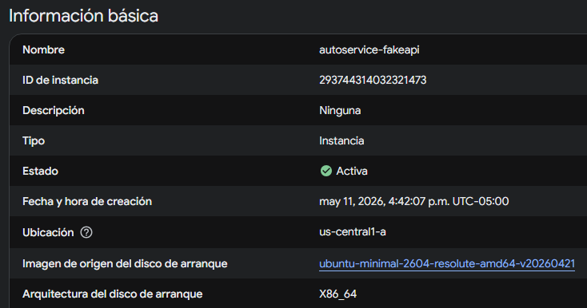

  <h5 style="margin-bottom: 0.5em;">
    Evidencia 2: JSON Server ejecutándose con recursos REST disponibles
  </h5>

  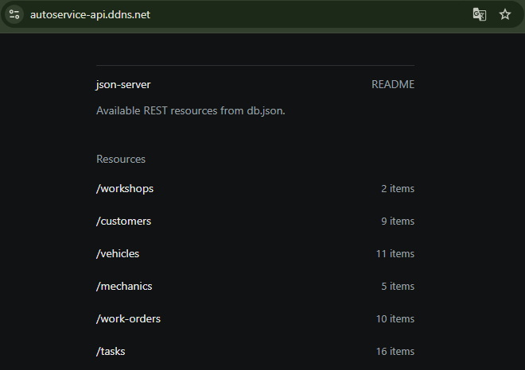

  <h5 style="margin-bottom: 0.5em;">
    Evidencia 3: Respuesta JSON de endpoint /work-orders
  </h5>

  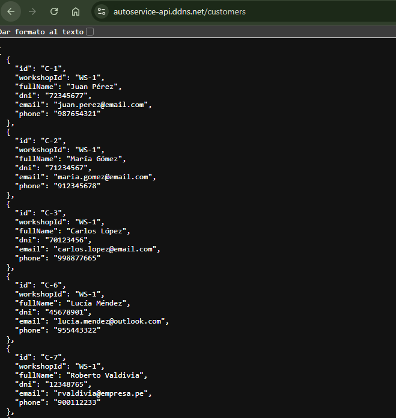

  <h5 style="margin-bottom: 0.5em;">
    Evidencia 4: Frontend Angular consumiendo datos desde la Fake API
  </h5>

  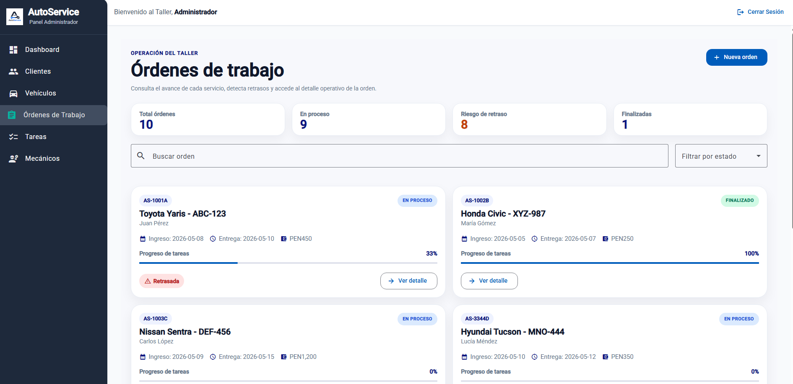

</div>

<p align="justify">
Repositorio relacionado con la implementación y consumo de Web Services:
</p>

<ul>
  <li>
    <code>https://github.com/InnovaTechStudio/AutoService-729-OS-Frontend</code>
  </li>
</ul>

<p align="justify">
Commits relevantes relacionados con integración y consumo de servicios durante el Sprint 2:
</p>

<ul>
  <li>
    <code>4439b5d</code> — refactor: replace localhost API URLs with environment config
  </li>

  <li>
    <code>6532717</code> — feat: implement operational workflow improvements
  </li>

  <li>
    <code>3bf7a27</code> — feat(customer-trust): implement responsive tracking view layout
  </li>

  <li>
    <code>3ca1fa6</code> — feat(customer-trust): implement and integrate online payment modal
  </li>

  <li>
    <code>20a83ee</code> — feat: implement task management view
  </li>

  <li>
    <code>7605c12</code> — feat: implement work order management views
  </li>
</ul>

##### 5.2.2.7. Software Deployment Evidence for Sprint Review

<p align="justify">
Durante el Sprint 2, el equipo realizó el despliegue funcional de la Web Application y de la Fake API utilizada para el consumo de datos dinámicos del sistema AutoService. A diferencia del Sprint 1, donde únicamente se desplegó la Landing Page institucional, en esta iteración se consolidó una arquitectura distribuida compuesta por un Frontend desplegado en la nube mediante Azure Static Web Apps y un servidor de datos RESTful desplegado sobre una máquina virtual Ubuntu en Google Cloud Platform (GCP).
</p>

<p align="justify">
El despliegue permitió validar exitosamente la comunicación entre el cliente Angular y la Fake API basada en JSON Server, habilitando operaciones HTTP reales para las entidades principales del sistema como talleres, clientes, vehículos, órdenes de trabajo, mecánicos y tareas. Asimismo, se verificó el correcto funcionamiento del flujo CI/CD automatizado mediante GitHub Actions para el despliegue continuo del frontend.
</p>

<p align="justify">
La arquitectura de despliegue implementada durante este Sprint se compone de los siguientes elementos:
</p>

<ol style="text-align: justify;">
  <li>
    <strong>Frontend Web Application:</strong> Aplicación desarrollada con Angular y desplegada mediante Azure Static Web Apps.
  </li>
  <li>
    <strong>Fake REST API:</strong> Servicio RESTful basado en JSON Server desplegado en una máquina virtual Ubuntu sobre Google Cloud Platform.
  </li>
  <li>
    <strong>Process Manager:</strong> Uso de PM2 para mantener la disponibilidad continua del servicio backend.
  </li>
  <li>
    <strong>CI/CD:</strong> Integración continua y despliegue automático mediante GitHub Actions conectado al repositorio oficial del proyecto.
  </li>
</ol>

<p align="justify">
Para el despliegue del frontend, se utilizó Azure Static Web Apps aprovechando su integración nativa con GitHub Actions. El proceso automatizado realiza la compilación de la aplicación Angular y publica automáticamente una nueva versión cada vez que se ejecuta un merge hacia la rama principal del repositorio.
</p>

<p align="justify">
En paralelo, la Fake API fue desplegada sobre una instancia Ubuntu en GCP utilizando Node.js y JSON Server. El servicio fue configurado para ejecutarse persistentemente mediante PM2, permitiendo que los endpoints REST permanezcan disponibles incluso tras reinicios del servidor. Además, se configuró un dominio dinámico DDNS para facilitar el acceso remoto al servicio desde el frontend desplegado en Azure.
</p>

<div align="center">

  <h5>Evidencia 1: Azure Static Web App desplegada en producción</h5>
  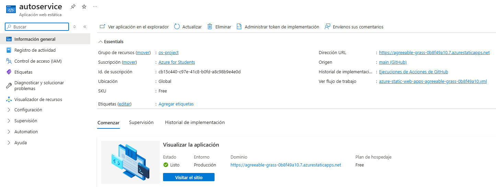

  <h5>Evidencia 2: Pipeline CI/CD ejecutado correctamente mediante GitHub Actions</h5>
  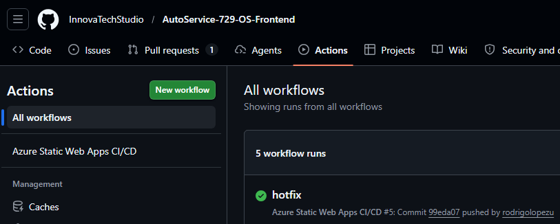

  <h5>Evidencia 3: Aplicación Angular ejecutándose en entorno productivo</h5>
  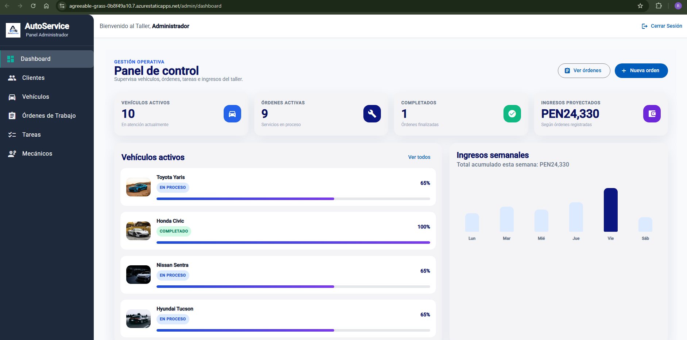

  <h5>Evidencia 4: Servicio JSON Server ejecutándose persistentemente con PM2</h5>
  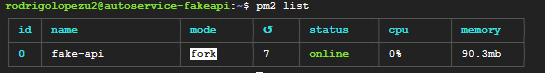

  <h5>Evidencia 5: Integración exitosa entre Frontend Angular y Fake API</h5>
  

</div>

<p align="justify">
La aplicación frontend desplegada se encuentra disponible públicamente en la siguiente URL:
</p>

<p align="center">
  <code>
    https://agreeable-grass-0b8f49a10.7.azurestaticapps.net/
  </code>
</p>

<p align="justify">
Asimismo, la Fake API RESTful desplegada mediante JSON Server se encuentra disponible en:
</p>

<p align="center">
  <code>
    https://autoservice-api.ddns.net/
  </code>
</p>

<p align="justify">
El repositorio oficial del frontend utilizado para el despliegue continuo es:
</p>

<p align="center">
  <code>
    https://github.com/InnovaTechStudio/AutoService-729-OS-Frontend
  </code>
</p>

<p align="justify">
Entre los commits más relevantes relacionados con despliegue, integración y configuración de producción para este Sprint destacan:
</p>

<table style="width: 100%; border-collapse: collapse; text-align: justify;">
  <thead>
    <tr style="background-color: #f2f2f2;">
      <th style="border: 1px solid #ddd; padding: 8px;">Commit Id</th>
      <th style="border: 1px solid #ddd; padding: 8px;">Commit Message</th>
      <th style="border: 1px solid #ddd; padding: 8px;">Descripción Técnica</th>
    </tr>
  </thead>
  <tbody>
    <tr>
      <td style="border: 1px solid #ddd; padding: 8px;">
        <code>4439b5d</code>
      </td>
      <td style="border: 1px solid #ddd; padding: 8px;">
        refactor: replace localhost API URLs with environment config
      </td>
      <td style="border: 1px solid #ddd; padding: 8px;">
        Centralización de URLs de API utilizando variables de entorno para compatibilidad con despliegue en Azure.
      </td>
    </tr>
    <tr>
      <td style="border: 1px solid #ddd; padding: 8px;">
        <code>6532717</code>
      </td>
      <td style="border: 1px solid #ddd; padding: 8px;">
        feat: implement operational workflow improvements
      </td>
      <td style="border: 1px solid #ddd; padding: 8px;">
        Integración de funcionalidades operacionales y vistas conectadas al backend RESTful.
      </td>
    </tr>
    <tr>
      <td style="border: 1px solid #ddd; padding: 8px;">
        <code>3ca1fa6</code>
      </td>
      <td style="border: 1px solid #ddd; padding: 8px;">
        feat(customer-trust): implement and integrate online payment modal
      </td>
      <td style="border: 1px solid #ddd; padding: 8px;">
        Implementación e integración de componentes frontend conectados a servicios REST.
      </td>
    </tr>
    <tr>
      <td style="border: 1px solid #ddd; padding: 8px;">
        <code>921899b</code>
      </td>
      <td style="border: 1px solid #ddd; padding: 8px;">
        feat: add components, tasks related to images, responsive design, and authentication
      </td>
      <td style="border: 1px solid #ddd; padding: 8px;">
        Incorporación de componentes visuales y lógica de autenticación para entorno productivo.
      </td>
    </tr>
    <tr>
      <td style="border: 1px solid #ddd; padding: 8px;">
        <code>78a6227</code>
      </td>
      <td style="border: 1px solid #ddd; padding: 8px;">
        Merge develop into main
      </td>
      <td style="border: 1px solid #ddd; padding: 8px;">
        Consolidación final del Sprint y despliegue automático hacia producción mediante GitHub Actions.
      </td>
    </tr>

  </tbody>
</table>

##### 5.2.1.8. Team Collaboration Insights during Sprint

<p align="justify">
Durante el Sprint 2, el equipo mantuvo un flujo de trabajo colaborativo enfocado en la implementación funcional de la Web Application de AutoService utilizando Angular y una arquitectura basada en dominios. Para garantizar la organización del desarrollo y la estabilidad del proyecto, se aplicó estrictamente la estrategia GitFlow, utilizando ramas independientes para cada funcionalidad, corrección o mejora implementada durante el Sprint.
</p>

<p align="justify">
Cada integrante trabajó sobre ramas <i>feature/*</i> y <i>hotfix/*</i>, integrando posteriormente sus avances mediante Pull Requests hacia la rama <code>develop</code>. Posteriormente, luego de las validaciones funcionales y revisiones correspondientes, los cambios fueron consolidados hacia la rama <code>main</code> para su despliegue automático en Azure Static Web Apps mediante GitHub Actions.
</p>

<p align="justify">
La colaboración del equipo se evidenció principalmente en el desarrollo conjunto de vistas administrativas, gestión de órdenes de trabajo, integración de componentes responsivos, conexión con la Fake API RESTful y configuración de entornos de producción. Asimismo, se aplicaron convenciones de versionamiento utilizando <i>Conventional Commits</i>, permitiendo mantener trazabilidad clara de cada cambio realizado durante el Sprint.
</p>

<p align="justify">
A continuación, se presentan los analíticos y evidencias extraídas directamente del repositorio frontend del proyecto, las cuales reflejan la actividad constante, integración colaborativa y organización del equipo durante el Sprint 2.
</p>

<div align="center">

  <h5>Evidencia 1: Gráfico de contribuciones por integrante del equipo</h5>
  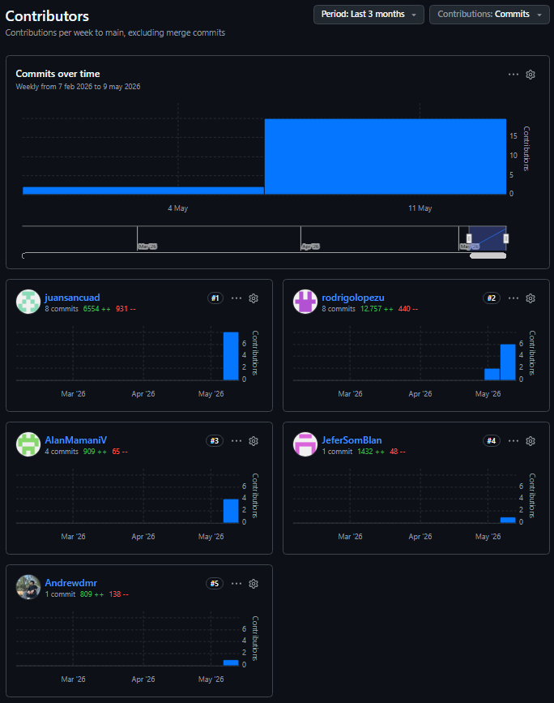

  <h5>Evidencia 2: Resumen de actividad del Sprint mediante GitHub Pulse</h5>
  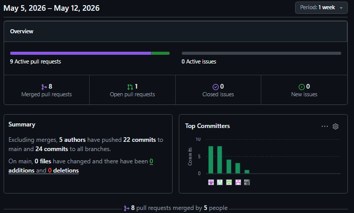

  <h5>Evidencia 3: Gestión colaborativa mediante Pull Requests y merges</h5>
  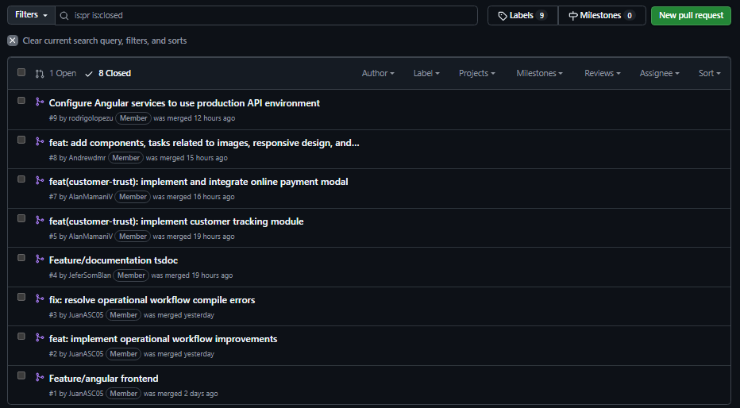

  <h5>Evidencia 4: Organización de ramas bajo estrategia GitFlow</h5>
  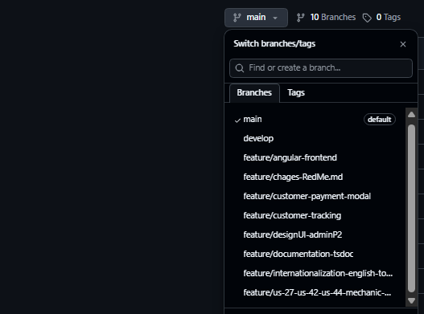

</div>

<p align="justify">
Las evidencias presentadas demuestran que el equipo mantuvo una participación activa y distribuida durante todo el Sprint, registrando commits significativos, integraciones frecuentes y despliegues continuos hacia producción. Asimismo, el uso de Pull Requests permitió centralizar la revisión de cambios y asegurar la estabilidad del proyecto antes de cada integración hacia las ramas principales del repositorio.
</p>

<p align="justify">
Entre las actividades colaborativas más relevantes realizadas durante este Sprint destacan:
</p>

<ul style="text-align: justify;">
  <li>Implementación de vistas administrativas y dashboards.</li>
  <li>Desarrollo de módulos de órdenes de trabajo y gestión de tareas.</li>
  <li>Integración de componentes responsivos para dispositivos móviles.</li>
  <li>Conexión del frontend Angular con la Fake API RESTful desplegada en GCP.</li>
  <li>Configuración de variables de entorno y despliegue productivo en Azure Static Web Apps.</li>
  <li>Corrección de errores de compilación e integración entre módulos.</li>
</ul>

<p align="justify">
El repositorio principal utilizado para el trabajo colaborativo durante este Sprint fue:
</p>

<p align="center">
  <code>
    https://github.com/InnovaTechStudio/AutoService-729-OS-Frontend
  </code>
</p>

---

#### 5.2.3. Sprint 3

##### 5.2.3.1. Sprint Planning 3

<div align="center">
  <table style="margin: auto; width: 100%; border-collapse: collapse; text-align: left;">
    <thead>
      <tr>
        <th colspan="2" style="text-align: center; background-color: #f2f2f2; font-size: 1.2em; padding: 10px; border: 1px solid #ddd;">Sprint #3</th>
      </tr>
    </thead>
    <tbody>
      <tr>
        <td colspan="2" style="background-color: #fafafa; font-weight: bold; text-align: center; padding: 10px; border: 1px solid #ddd;">Sprint Planning Background</td>
      </tr>
      <tr>
        <td style="width: 30%; font-weight: bold; padding: 10px; border: 1px solid #ddd;">Date</td>
        <td style="padding: 10px; border: 1px solid #ddd;">2026-06-03</td>
      </tr>
      <tr>
        <td style="font-weight: bold; padding: 10px; border: 1px solid #ddd;">Time</td>
        <td style="padding: 10px; border: 1px solid #ddd;">10:00 AM</td>
      </tr>
      <tr>
        <td style="font-weight: bold; padding: 10px; border: 1px solid #ddd;">Location</td>
        <td style="padding: 10px; border: 1px solid #ddd;">Reunión presencial en la UPC. (Pabellón I, piso 6, cubículo 5)</td>
      </tr>
      <tr>
        <td style="font-weight: bold; padding: 10px; border: 1px solid #ddd;">Prepared By</td>
        <td style="padding: 10px; border: 1px solid #ddd;">López Monroy, Rodrigo Alfredo</td>
      </tr>
      <tr>
        <td style="font-weight: bold; padding: 10px; border: 1px solid #ddd;">Attendees (to planning meeting)</td>
        <td style="padding: 10px; border: 1px solid #ddd;">
          Aguilar Aguayo, Jeferson Renzo / López Monroy, Rodrigo Alfredo / Luis Miranda, Diego Andres / Mamani Vilca, Alan Jaivi / Sanchez Cuadrado, Juan Antonio
        </td>
      </tr>
      <tr>
        <td style="font-weight: bold; padding: 10px; border: 1px solid #ddd;">Sprint 2 Review Summary</td>
        <td style="padding: 10px; border: 1px solid #ddd;">
          Durante el Sprint 2, el equipo logró desarrollar la aplicación web cliente (Frontend) en Angular, integrando exitosamente el consumo de datos a través de un entorno simulado (Fake REST API). Además, se configuró el flujo de integración y despliegue continuo hacia entornos de producción, logrando una versión interactiva para la gestión operativa.
        </td>
      </tr>
      <tr>
        <td style="font-weight: bold; padding: 10px; border: 1px solid #ddd;">Sprint 2 Retrospective Summary</td>
        <td style="padding: 10px; border: 1px solid #ddd;">
          El equipo destacó la eficiencia en el flujo de trabajo mediante ramas de características en GitHub. Como punto de mejora, se identificó la necesidad de definir los contratos de datos y la documentación OpenAPI antes de programar la lógica de negocio, garantizando así una conexión fluida y sin reprocesos entre el nuevo backend en Spring Boot y el frontend en Angular.
        </td>
      </tr>
      <tr>
        <td colspan="2" style="background-color: #fafafa; font-weight: bold; text-align: center; padding: 10px; border: 1px solid #ddd;">Sprint Goal & User Stories</td>
      </tr>
      <tr>
        <td style="font-weight: bold; padding: 10px; border: 1px solid #ddd;">Sprint 3 Goal</td>
        <td style="padding: 10px; border: 1px solid #ddd;">
          <strong>Our focus is on</strong> developing the backend Web Services using Java and Spring Boot, preparing the cloud deployment, and establishing a successful connection with the updated Angular frontend application.<br><br>
          <strong>We believe it delivers</strong> a fully integrated and robust software solution that manages real business logic and persistent data using JPA, effectively replacing the temporary mock API environment.<br><br>
          <strong>This will be confirmed when</strong> the frontend successfully communicates with the backend endpoints, all services are documented via Swagger, and the end-to-end functionality is verified through usability evaluation interviews.
        </td>
      </tr>
      <tr>
        <td style="font-weight: bold; padding: 10px; border: 1px solid #ddd;">Sprint 3 Velocity</td>
        <td style="padding: 10px; border: 1px solid #ddd;">37 Story Points</td>
      </tr>
      <tr>
        <td style="font-weight: bold; padding: 10px; border: 1px solid #ddd;">Sum of Story Points</td>
        <td style="padding: 10px; border: 1px solid #ddd;">
          37 Story Points (US-11: 2, US-12: 3, US-25: 3, US-26: 2, US-27: 2, TS-03: 3, TS-05: 5, TS-06: 3, TS-07: 5, TS-08: 3, TS-09: 3, TS-12: 2).
        </td>
      </tr>
    </tbody>
  </table>
</div>

##### 5.2.3.2. Aspect Leaders and Collaborators

En el presente Sprint 3, el alcance funcional y técnico se ha dividido en cuatro aspectos principales para garantizar una entrega eficiente:
1. **Backend Development:** Desarrollo de la API RESTful y lógica de negocio mediante Java y Spring Boot.
2. **Backend Deployment:** Preparación, contenerización y configuración de servicios para el despliegue del Backend.
3. **Frontend Adaptations:** Ajustes en la aplicación cliente en Angular para el consumo de los endpoints reales.
4. **Validation Interviews:** Diseño y ejecución de las entrevistas de validación y usabilidad con usuarios finales.

<div align="center">
  <table style="margin: auto; width: 100%; border-collapse: collapse; text-align: center;">
    <thead>
      <tr style="background-color: #f2f2f2;">
        <th style="padding: 10px; border: 1px solid #ddd; text-align: left;">Team Member (Last Name, First Name)</th>
        <th style="padding: 10px; border: 1px solid #ddd;">GitHub Username</th>
        <th style="padding: 10px; border: 1px solid #ddd;">Backend Development<br><small>Leader (L) / Collaborator (C)</small></th>
        <th style="padding: 10px; border: 1px solid #ddd;">Backend Deployment<br><small>Leader (L) / Collaborator (C)</small></th>
        <th style="padding: 10px; border: 1px solid #ddd;">Frontend Adaptations<br><small>Leader (L) / Collaborator (C)</small></th>
        <th style="padding: 10px; border: 1px solid #ddd;">Validation Interviews<br><small>Leader (L) / Collaborator (C)</small></th>
      </tr>
    </thead>
    <tbody>
      <tr>
        <td style="padding: 10px; border: 1px solid #ddd; text-align: left;">Aguilar Aguayo, Jeferson Renzo</td>
        <td style="padding: 10px; border: 1px solid #ddd;">JeferSomBlan</td>
        <td style="padding: 10px; border: 1px solid #ddd; color: #1976d2;">C</td>
        <td style="padding: 10px; border: 1px solid #ddd; color: #1976d2;">C</td>
        <td style="padding: 10px; border: 1px solid #ddd; color: #1976d2;">C</td>
        <td style="padding: 10px; border: 1px solid #ddd; color: #1976d2;">C</td>
      </tr>
      <tr>
        <td style="padding: 10px; border: 1px solid #ddd; text-align: left;">López Monroy, Rodrigo Alfredo</td>
        <td style="padding: 10px; border: 1px solid #ddd;">rodrigolopezu</td>
        <td style="padding: 10px; border: 1px solid #ddd; font-weight: bold; color: #2e7d32;">L</td>
        <td style="padding: 10px; border: 1px solid #ddd; color: #1976d2;">C</td>
        <td style="padding: 10px; border: 1px solid #ddd; color: #1976d2;">C</td>
        <td style="padding: 10px; border: 1px solid #ddd; color: #1976d2;">C</td>
      </tr>
      <tr>
        <td style="padding: 10px; border: 1px solid #ddd; text-align: left;">Luis Miranda, Diego Andres</td>
        <td style="padding: 10px; border: 1px solid #ddd;">Andrewdmr</td>
        <td style="padding: 10px; border: 1px solid #ddd; color: #1976d2;">C</td>
        <td style="padding: 10px; border: 1px solid #ddd; font-weight: bold; color: #2e7d32;">L</td>
        <td style="padding: 10px; border: 1px solid #ddd; color: #1976d2;">C</td>
        <td style="padding: 10px; border: 1px solid #ddd; color: #1976d2;">C</td>
      </tr>
      <tr>
        <td style="padding: 10px; border: 1px solid #ddd; text-align: left;">Mamani Vilca, Alan Jaivi</td>
        <td style="padding: 10px; border: 1px solid #ddd;">AlanMamaniV</td>
        <td style="padding: 10px; border: 1px solid #ddd; color: #1976d2;">C</td>
        <td style="padding: 10px; border: 1px solid #ddd; color: #1976d2;">C</td>
        <td style="padding: 10px; border: 1px solid #ddd; color: #1976d2;">C</td>
        <td style="padding: 10px; border: 1px solid #ddd; font-weight: bold; color: #2e7d32;">L</td>
      </tr>
      <tr>
        <td style="padding: 10px; border: 1px solid #ddd; text-align: left;">Sanchez Cuadrado, Juan Antonio</td>
        <td style="padding: 10px; border: 1px solid #ddd;">juansancuad</td>
        <td style="padding: 10px; border: 1px solid #ddd; color: #1976d2;">C</td>
        <td style="padding: 10px; border: 1px solid #ddd; color: #1976d2;">C</td>
        <td style="padding: 10px; border: 1px solid #ddd; font-weight: bold; color: #2e7d32;">L</td>
        <td style="padding: 10px; border: 1px solid #ddd; color: #1976d2;">C</td>
      </tr>
    </tbody>
  </table>
</div>

##### 5.2.3.3. Sprint Backlog 3

El presente Sprint Backlog detalla la descomposición técnica de las historias de usuario y técnicas seleccionadas para la tercera iteración. El objetivo principal es desarrollar el Backend mediante servicios RESTful en Java con Spring Boot, establecer la persistencia de datos con Spring Data JPA, conectar el Frontend actualizado con los nuevos endpoints y preparar el despliegue.

<div align="center">
  
</div>

<br>

<div align="center">
  <table style="margin: auto; width: 100%; border-collapse: collapse; text-align: left; font-size: 13px; border: 1px solid #ddd;">
    <thead>
      <tr style="background-color: #e0e0e0; font-weight: bold;">
        <th style="padding: 10px; text-align: center; border: 1px solid #ddd;">Sprint #</th>
        <th colspan="7" style="padding: 10px; text-align: left; border: 1px solid #ddd;">3</th>
      </tr>
      <tr style="background-color: #f2f2f2;">
        <th colspan="2" style="text-align: center; border: 1px solid #ddd; padding: 10px;">User Story</th>
        <th colspan="6" style="text-align: center; border: 1px solid #ddd; padding: 10px;">Work-Item / Task</th>
      </tr>
      <tr style="background-color: #fafafa; text-align: center;">
        <th style="border: 1px solid #ddd; padding: 5px; width: 6%;">Id</th>
        <th style="border: 1px solid #ddd; padding: 5px; width: 15%;">Title</th>
        <th style="border: 1px solid #ddd; padding: 5px; width: 6%;">Id</th>
        <th style="border: 1px solid #ddd; padding: 5px; width: 15%;">Title</th>
        <th style="border: 1px solid #ddd; padding: 5px; width: 30%;">Description</th>
        <th style="border: 1px solid #ddd; padding: 5px; width: 8%;">Estimation (Hours)</th>
        <th style="border: 1px solid #ddd; padding: 5px; width: 12%;">Assigned To</th>
        <th style="border: 1px solid #ddd; padding: 5px; width: 8%;">Status</th>
      </tr>
    </thead>
    <tbody>
      <tr>
        <td rowspan="2" style="border: 1px solid #ddd; padding: 8px; text-align: center; font-weight: bold;">US-11</td>
        <td rowspan="2" style="border: 1px solid #ddd; padding: 8px;">Actualizar estado del vehículo</td>
        <td style="border: 1px solid #ddd; padding: 8px; text-align: center;">WI-32</td>
        <td style="border: 1px solid #ddd; padding: 8px;">Adaptación UI de estado</td>
        <td style="border: 1px solid #ddd; padding: 8px;"><i>Actualizar componentes de Angular para enviar cambios de estado a la nueva API en Spring.</i></td>
        <td style="border: 1px solid #ddd; padding: 8px; text-align: center;">2</td>
        <td style="border: 1px solid #ddd; padding: 8px;">Luis, Diego</td>
        <td style="border: 1px solid #ddd; padding: 8px; text-align: center; color: #2aac2a; font-weight: bold;">Done</td>
      </tr>
      <tr>
        <td style="border: 1px solid #ddd; padding: 8px; text-align: center;">WI-33</td>
        <td style="border: 1px solid #ddd; padding: 8px;">Endpoint PATCH estado</td>
        <td style="border: 1px solid #ddd; padding: 8px;"><i>Crear RestController en Java para actualizar la etapa del vehículo.</i></td>
        <td style="border: 1px solid #ddd; padding: 8px; text-align: center;">2</td>
        <td style="border: 1px solid #ddd; padding: 8px;">López, Rodrigo</td>
        <td style="border: 1px solid #ddd; padding: 8px; text-align: center; color: #2aac2a; font-weight: bold;">Done</td>
      </tr>
      <tr>
        <td rowspan="2" style="border: 1px solid #ddd; padding: 8px; text-align: center; font-weight: bold;">US-12</td>
        <td rowspan="2" style="border: 1px solid #ddd; padding: 8px;">Visualizar detalle del vehículo</td>
        <td style="border: 1px solid #ddd; padding: 8px; text-align: center;">WI-34</td>
        <td style="border: 1px solid #ddd; padding: 8px;">Integración GET detalle</td>
        <td style="border: 1px solid #ddd; padding: 8px;"><i>Consumir el endpoint real para poblar la vista de detalles.</i></td>
        <td style="border: 1px solid #ddd; padding: 8px; text-align: center;">3</td>
        <td style="border: 1px solid #ddd; padding: 8px;">Aguilar, Jeferson</td>
        <td style="border: 1px solid #ddd; padding: 8px; text-align: center; color: #2aac2a; font-weight: bold;">Done</td>
      </tr>
      <tr>
        <td style="border: 1px solid #ddd; padding: 8px; text-align: center;">WI-35</td>
        <td style="border: 1px solid #ddd; padding: 8px;">Lógica de negocio detalle</td>
        <td style="border: 1px solid #ddd; padding: 8px;"><i>Implementar Service en backend que consolide datos de cliente y vehículo.</i></td>
        <td style="border: 1px solid #ddd; padding: 8px; text-align: center;">3</td>
        <td style="border: 1px solid #ddd; padding: 8px;">Sanchez, Juan</td>
        <td style="border: 1px solid #ddd; padding: 8px; text-align: center; color: #2aac2a; font-weight: bold;">Done</td>
      </tr>
      <tr>
        <td rowspan="2" style="border: 1px solid #ddd; padding: 8px; text-align: center; font-weight: bold;">US-25</td>
        <td rowspan="2" style="border: 1px solid #ddd; padding: 8px;">Visualizar tareas del vehículo</td>
        <td style="border: 1px solid #ddd; padding: 8px; text-align: center;">WI-36</td>
        <td style="border: 1px solid #ddd; padding: 8px;">Endpoint tareas por orden</td>
        <td style="border: 1px solid #ddd; padding: 8px;"><i>Exponer lista de tareas asociadas a una orden mediante JPQL/Queries.</i></td>
        <td style="border: 1px solid #ddd; padding: 8px; text-align: center;">3</td>
        <td style="border: 1px solid #ddd; padding: 8px;">Mamani, Alan</td>
        <td style="border: 1px solid #ddd; padding: 8px; text-align: center; color: #2aac2a; font-weight: bold;">Done</td>
      </tr>
      <tr>
        <td style="border: 1px solid #ddd; padding: 8px; text-align: center;">WI-37</td>
        <td style="border: 1px solid #ddd; padding: 8px;">Componente tareas cliente</td>
        <td style="border: 1px solid #ddd; padding: 8px;"><i>Desarrollar componente en Angular de solo lectura.</i></td>
        <td style="border: 1px solid #ddd; padding: 8px; text-align: center;">3</td>
        <td style="border: 1px solid #ddd; padding: 8px;">Luis, Diego</td>
        <td style="border: 1px solid #ddd; padding: 8px; text-align: center; color: #2aac2a; font-weight: bold;">Done</td>
      </tr>
      <tr>
        <td rowspan="2" style="border: 1px solid #ddd; padding: 8px; text-align: center; font-weight: bold;">US-26</td>
        <td rowspan="2" style="border: 1px solid #ddd; padding: 8px;">Visualizar fechas estimadas</td>
        <td style="border: 1px solid #ddd; padding: 8px; text-align: center;">WI-38</td>
        <td style="border: 1px solid #ddd; padding: 8px;">Cálculo de fechas API</td>
        <td style="border: 1px solid #ddd; padding: 8px;"><i>Lógica en Spring Boot para proyectar y retornar fechas de entrega.</i></td>
        <td style="border: 1px solid #ddd; padding: 8px; text-align: center;">2</td>
        <td style="border: 1px solid #ddd; padding: 8px;">López, Rodrigo</td>
        <td style="border: 1px solid #ddd; padding: 8px; text-align: center; color: #2aac2a; font-weight: bold;">Done</td>
      </tr>
      <tr>
        <td style="border: 1px solid #ddd; padding: 8px; text-align: center;">WI-39</td>
        <td style="border: 1px solid #ddd; padding: 8px;">Renderizado de fechas</td>
        <td style="border: 1px solid #ddd; padding: 8px;"><i>Formatear y mostrar fechas en el componente TypeScript.</i></td>
        <td style="border: 1px solid #ddd; padding: 8px; text-align: center;">2</td>
        <td style="border: 1px solid #ddd; padding: 8px;">Aguilar, Jeferson</td>
        <td style="border: 1px solid #ddd; padding: 8px; text-align: center; color: #2aac2a; font-weight: bold;">Done</td>
      </tr>
      <tr>
        <td rowspan="2" style="border: 1px solid #ddd; padding: 8px; text-align: center; font-weight: bold;">US-27</td>
        <td rowspan="2" style="border: 1px solid #ddd; padding: 8px;">Visualizar costos del servicio</td>
        <td style="border: 1px solid #ddd; padding: 8px; text-align: center;">WI-40</td>
        <td style="border: 1px solid #ddd; padding: 8px;">Agregación de costos</td>
        <td style="border: 1px solid #ddd; padding: 8px;"><i>Servicio Java para sumar costos de tareas planificadas.</i></td>
        <td style="border: 1px solid #ddd; padding: 8px; text-align: center;">2</td>
        <td style="border: 1px solid #ddd; padding: 8px;">Mamani, Alan</td>
        <td style="border: 1px solid #ddd; padding: 8px; text-align: center; color: #2aac2a; font-weight: bold;">Done</td>
      </tr>
      <tr>
        <td style="border: 1px solid #ddd; padding: 8px; text-align: center;">WI-41</td>
        <td style="border: 1px solid #ddd; padding: 8px;">UI desglose de costos</td>
        <td style="border: 1px solid #ddd; padding: 8px;"><i>Mostrar tabla de presupuesto y total estimado.</i></td>
        <td style="border: 1px solid #ddd; padding: 8px; text-align: center;">2</td>
        <td style="border: 1px solid #ddd; padding: 8px;">Sanchez, Juan</td>
        <td style="border: 1px solid #ddd; padding: 8px; text-align: center; color: #2aac2a; font-weight: bold;">Done</td>
      </tr>
      <tr>
        <td rowspan="2" style="border: 1px solid #ddd; padding: 8px; text-align: center; font-weight: bold;">TS-03</td>
        <td rowspan="2" style="border: 1px solid #ddd; padding: 8px;">Estructurar backend modular</td>
        <td style="border: 1px solid #ddd; padding: 8px; text-align: center;">WI-42</td>
        <td style="border: 1px solid #ddd; padding: 8px;">Arquitectura de Capas</td>
        <td style="border: 1px solid #ddd; padding: 8px;"><i>Separar el proyecto Spring en Controllers, Services, Repositories y Entities.</i></td>
        <td style="border: 1px solid #ddd; padding: 8px; text-align: center;">3</td>
        <td style="border: 1px solid #ddd; padding: 8px;">López, Rodrigo</td>
        <td style="border: 1px solid #ddd; padding: 8px; text-align: center; color: #2aac2a; font-weight: bold;">Done</td>
      </tr>
      <tr>
        <td style="border: 1px solid #ddd; padding: 8px; text-align: center;">WI-43</td>
        <td style="border: 1px solid #ddd; padding: 8px;">Inyección de Dependencias</td>
        <td style="border: 1px solid #ddd; padding: 8px;"><i>Anotar componentes con @Service, @Repository para el contenedor IoC.</i></td>
        <td style="border: 1px solid #ddd; padding: 8px; text-align: center;">3</td>
        <td style="border: 1px solid #ddd; padding: 8px;">Sanchez, Juan</td>
        <td style="border: 1px solid #ddd; padding: 8px; text-align: center; color: #2aac2a; font-weight: bold;">Done</td>
      </tr>
      <tr>
        <td rowspan="2" style="border: 1px solid #ddd; padding: 8px; text-align: center; font-weight: bold;">TS-05</td>
        <td rowspan="2" style="border: 1px solid #ddd; padding: 8px;">Implementar persistencia de datos</td>
        <td style="border: 1px solid #ddd; padding: 8px; text-align: center;">WI-44</td>
        <td style="border: 1px solid #ddd; padding: 8px;">Configuración JPA</td>
        <td style="border: 1px solid #ddd; padding: 8px;"><i>Configurar application.properties y dependencias de Spring Data JPA.</i></td>
        <td style="border: 1px solid #ddd; padding: 8px; text-align: center;">4</td>
        <td style="border: 1px solid #ddd; padding: 8px;">Mamani, Alan</td>
        <td style="border: 1px solid #ddd; padding: 8px; text-align: center; color: #2aac2a; font-weight: bold;">Done</td>
      </tr>
      <tr>
        <td style="border: 1px solid #ddd; padding: 8px; text-align: center;">WI-45</td>
        <td style="border: 1px solid #ddd; padding: 8px;">Creación de Tablas</td>
        <td style="border: 1px solid #ddd; padding: 8px;"><i>Definir propiedades de auto-generación y dialecto de base de datos.</i></td>
        <td style="border: 1px solid #ddd; padding: 8px; text-align: center;">4</td>
        <td style="border: 1px solid #ddd; padding: 8px;">López, Rodrigo</td>
        <td style="border: 1px solid #ddd; padding: 8px; text-align: center; color: #2aac2a; font-weight: bold;">Done</td>
      </tr>
      <tr>
        <td rowspan="2" style="border: 1px solid #ddd; padding: 8px; text-align: center; font-weight: bold;">TS-06</td>
        <td rowspan="2" style="border: 1px solid #ddd; padding: 8px;">Gestionar relaciones entre entidades</td>
        <td style="border: 1px solid #ddd; padding: 8px; text-align: center;">WI-46</td>
        <td style="border: 1px solid #ddd; padding: 8px;">Anotaciones Relacionales</td>
        <td style="border: 1px solid #ddd; padding: 8px;"><i>Mapear @OneToMany y @ManyToOne en las entidades de dominio.</i></td>
        <td style="border: 1px solid #ddd; padding: 8px; text-align: center;">3</td>
        <td style="border: 1px solid #ddd; padding: 8px;">Mamani, Alan</td>
        <td style="border: 1px solid #ddd; padding: 8px; text-align: center; color: #2aac2a; font-weight: bold;">Done</td>
      </tr>
      <tr>
        <td style="border: 1px solid #ddd; padding: 8px; text-align: center;">WI-47</td>
        <td style="border: 1px solid #ddd; padding: 8px;">Repositorios JpaRepository</td>
        <td style="border: 1px solid #ddd; padding: 8px;"><i>Crear interfaces extendiendo JpaRepository para acceso a datos.</i></td>
        <td style="border: 1px solid #ddd; padding: 8px; text-align: center;">3</td>
        <td style="border: 1px solid #ddd; padding: 8px;">Sanchez, Juan</td>
        <td style="border: 1px solid #ddd; padding: 8px; text-align: center; color: #2aac2a; font-weight: bold;">Done</td>
      </tr>
      <tr>
        <td rowspan="2" style="border: 1px solid #ddd; padding: 8px; text-align: center; font-weight: bold;">TS-07</td>
        <td rowspan="2" style="border: 1px solid #ddd; padding: 8px;">Consumir y Documentar APIs</td>
        <td style="border: 1px solid #ddd; padding: 8px; text-align: center;">WI-48</td>
        <td style="border: 1px solid #ddd; padding: 8px;">Manejo de CORS WebMvc</td>
        <td style="border: 1px solid #ddd; padding: 8px;"><i>Habilitar configuraciones globales de CORS en Spring.</i></td>
        <td style="border: 1px solid #ddd; padding: 8px; text-align: center;">3</td>
        <td style="border: 1px solid #ddd; padding: 8px;">López, Rodrigo</td>
        <td style="border: 1px solid #ddd; padding: 8px; text-align: center; color: #2aac2a; font-weight: bold;">Done</td>
      </tr>
      <tr>
        <td style="border: 1px solid #ddd; padding: 8px; text-align: center;">WI-49</td>
        <td style="border: 1px solid #ddd; padding: 8px;">Implementación Swagger/OpenAPI</td>
        <td style="border: 1px solid #ddd; padding: 8px;"><i>Configurar Springdoc OpenAPI para exponer la documentación de la API.</i></td>
        <td style="border: 1px solid #ddd; padding: 8px; text-align: center;">4</td>
        <td style="border: 1px solid #ddd; padding: 8px;">Aguilar, Jeferson</td>
        <td style="border: 1px solid #ddd; padding: 8px; text-align: center; color: #2aac2a; font-weight: bold;">Done</td>
      </tr>
      <tr>
        <td rowspan="2" style="border: 1px solid #ddd; padding: 8px; text-align: center; font-weight: bold;">TS-08</td>
        <td rowspan="2" style="border: 1px solid #ddd; padding: 8px;">Manejar respuestas de API</td>
        <td style="border: 1px solid #ddd; padding: 8px; text-align: center;">WI-50</td>
        <td style="border: 1px solid #ddd; padding: 8px;">Implementación de DTOs</td>
        <td style="border: 1px solid #ddd; padding: 8px;"><i>Crear clases Record/DTO para transferir datos de forma segura.</i></td>
        <td style="border: 1px solid #ddd; padding: 8px; text-align: center;">3</td>
        <td style="border: 1px solid #ddd; padding: 8px;">Luis, Diego</td>
        <td style="border: 1px solid #ddd; padding: 8px; text-align: center; color: #2aac2a; font-weight: bold;">Done</td>
      </tr>
      <tr>
        <td style="border: 1px solid #ddd; padding: 8px; text-align: center;">WI-51</td>
        <td style="border: 1px solid #ddd; padding: 8px;">Validación de Entrada</td>
        <td style="border: 1px solid #ddd; padding: 8px;"><i>Asegurar correcto parseo y uso de @Valid en los datos entrantes.</i></td>
        <td style="border: 1px solid #ddd; padding: 8px; text-align: center;">3</td>
        <td style="border: 1px solid #ddd; padding: 8px;">Mamani, Alan</td>
        <td style="border: 1px solid #ddd; padding: 8px; text-align: center; color: #2aac2a; font-weight: bold;">Done</td>
      </tr>
      <tr>
        <td rowspan="2" style="border: 1px solid #ddd; padding: 8px; text-align: center; font-weight: bold;">TS-09</td>
        <td rowspan="2" style="border: 1px solid #ddd; padding: 8px;">Implementar manejo de errores</td>
        <td style="border: 1px solid #ddd; padding: 8px; text-align: center;">WI-52</td>
        <td style="border: 1px solid #ddd; padding: 8px;">ControllerAdvice Excepciones</td>
        <td style="border: 1px solid #ddd; padding: 8px;"><i>Capturar errores con @ExceptionHandler a nivel global en la API.</i></td>
        <td style="border: 1px solid #ddd; padding: 8px; text-align: center;">3</td>
        <td style="border: 1px solid #ddd; padding: 8px;">López, Rodrigo</td>
        <td style="border: 1px solid #ddd; padding: 8px; text-align: center; color: #2aac2a; font-weight: bold;">Done</td>
      </tr>
      <tr>
        <td style="border: 1px solid #ddd; padding: 8px; text-align: center;">WI-53</td>
        <td style="border: 1px solid #ddd; padding: 8px;">Formatos de error HTTP</td>
        <td style="border: 1px solid #ddd; padding: 8px;"><i>Estandarizar ResponseEntity para 400 y 404 hacia el cliente web.</i></td>
        <td style="border: 1px solid #ddd; padding: 8px; text-align: center;">2</td>
        <td style="border: 1px solid #ddd; padding: 8px;">Sanchez, Juan</td>
        <td style="border: 1px solid #ddd; padding: 8px; text-align: center; color: #2aac2a; font-weight: bold;">Done</td>
      </tr>
      <tr>
        <td rowspan="2" style="border: 1px solid #ddd; padding: 8px; text-align: center; font-weight: bold;">TS-12</td>
        <td rowspan="2" style="border: 1px solid #ddd; padding: 8px;">Configurar hosting y dominio</td>
        <td style="border: 1px solid #ddd; padding: 8px; text-align: center;">WI-54</td>
        <td style="border: 1px solid #ddd; padding: 8px;">Preparación Dockerfile</td>
        <td style="border: 1px solid #ddd; padding: 8px;"><i>Crear contenedor para publicar la aplicación Spring Boot.</i></td>
        <td style="border: 1px solid #ddd; padding: 8px; text-align: center;">3</td>
        <td style="border: 1px solid #ddd; padding: 8px;">Luis, Diego</td>
        <td style="border: 1px solid #ddd; padding: 8px; text-align: center; color: #2aac2a; font-weight: bold;">Done</td>
      </tr>
      <tr>
        <td style="border: 1px solid #ddd; padding: 8px; text-align: center;">WI-55</td>
        <td style="border: 1px solid #ddd; padding: 8px;">Configuración de Despliegue</td>
        <td style="border: 1px solid #ddd; padding: 8px;"><i>Asegurar la conexión de red y variables de entorno productivas.</i></td>
        <td style="border: 1px solid #ddd; padding: 8px; text-align: center;">2</td>
        <td style="border: 1px solid #ddd; padding: 8px;">Aguilar, Jeferson</td>
        <td style="border: 1px solid #ddd; padding: 8px; text-align: center; color: #2aac2a; font-weight: bold;">Done</td>
      </tr>
    </tbody>
  </table>
</div>

##### 5.2.3.4. Development Evidence for Sprint Review

<p align="justify">
Durante el Sprint 3, el equipo se enfocó en la implementación funcional de los Web Services utilizando el lenguaje Java y el marco de trabajo Spring Boot, logrando reemplazar exitosamente el entorno simulado empleado en la iteración anterior. Asimismo, se consolidó la arquitectura del software basada en Domain-Driven Design (DDD), estableciendo contextos delimitados (Bounded Contexts) claros y desacoplados para la gestión operativa del taller automotriz.<br>

Entre los principales avances de este sprint se destacan la implementación de la persistencia de datos relacional mediante Spring Data JPA e Hibernate, la exposición de endpoints RESTful mediante controladores especializados para la gestión de inventario, órdenes de trabajo (Work Orders), vehículos (Fleet Management) y el sistema de tracking público. Además, se desarrollaron las pruebas de autenticación y la configuración técnica final para la sincronización entre el cliente web en Angular y los servicios en Java.<br>

En la siguiente tabla se presentan commits que representan hitos clave del desarrollo de este sprint en el repositorio del backend:
</p>

<table style="width: 100%; border-collapse: collapse; text-align: justify;">
  <thead>
    <tr style="background-color: #f2f2f2;">
      <th style="border: 1px solid #ddd; padding: 8px;">Repository</th>
      <th style="border: 1px solid #ddd; padding: 8px;">Branch</th>
      <th style="border: 1px solid #ddd; padding: 8px;">Commit Id</th>
      <th style="border: 1px solid #ddd; padding: 8px;">Commit Message</th>
      <th style="border: 1px solid #ddd; padding: 8px;">Commit Message Body</th>
      <th style="border: 1px solid #ddd; padding: 8px;">Committed on (Date)</th>
    </tr>
  </thead>

  <tbody>
    <tr>
      <td style="border: 1px solid #ddd; padding: 8px;"><code>InnovaTechStudio/AutoService-729-OS-Backend</code></td>
      <td style="border: 1px solid #ddd; padding: 8px;"><code>feature/inventory-management-context</code></td>
      <td style="border: 1px solid #ddd; padding: 8px;"><code>1cabdd2</code></td>
      <td style="border: 1px solid #ddd; padding: 8px;">feat:</td>
      <td style="border: 1px solid #ddd; padding: 8px;">add domain entity inventorymanagement</td>
      <td style="border: 1px solid #ddd; padding: 8px;">06/06/2026</td>
    </tr>
    <tr>
      <td style="border: 1px solid #ddd; padding: 8px;"><code>InnovaTechStudio/AutoService-729-OS-Backend</code></td>
      <td style="border: 1px solid #ddd; padding: 8px;"><code>feature/workshop-operations-context</code></td>
      <td style="border: 1px solid #ddd; padding: 8px;"><code>f822de2</code></td>
      <td style="border: 1px solid #ddd; padding: 8px;">feat:</td>
      <td style="border: 1px solid #ddd; padding: 8px;">add entity task and work order</td>
      <td style="border: 1px solid #ddd; padding: 8px;">07/06/2026</td>
    </tr>
    <tr>
      <td style="border: 1px solid #ddd; padding: 8px;"><code>InnovaTechStudio/AutoService-729-OS-Backend</code></td>
      <td style="border: 1px solid #ddd; padding: 8px;"><code>feature/workshop-operations-context</code></td>
      <td style="border: 1px solid #ddd; padding: 8px;"><code>878eb98</code></td>
      <td style="border: 1px solid #ddd; padding: 8px;">feat:</td>
      <td style="border: 1px solid #ddd; padding: 8px;">add controller logical resources interfaces task and work order</td>
      <td style="border: 1px solid #ddd; padding: 8px;">08/06/2026</td>
    </tr>
    <tr>
      <td style="border: 1px solid #ddd; padding: 8px;"><code>InnovaTechStudio/AutoService-729-OS-Backend</code></td>
      <td style="border: 1px solid #ddd; padding: 8px;"><code>feature/fleet-management-bounded-context</code></td>
      <td style="border: 1px solid #ddd; padding: 8px;"><code>50bead4</code></td>
      <td style="border: 1px solid #ddd; padding: 8px;">feat(fleet-management):</td>
      <td style="border: 1px solid #ddd; padding: 8px;">add Vehicle aggregate and service interfaces</td>
      <td style="border: 1px solid #ddd; padding: 8px;">09/06/2026</td>
    </tr>
    <tr>
      <td style="border: 1px solid #ddd; padding: 8px;"><code>InnovaTechStudio/AutoService-729-OS-Backend</code></td>
      <td style="border: 1px solid #ddd; padding: 8px;"><code>feature/staff-tenant-contexts</code></td>
      <td style="border: 1px solid #ddd; padding: 8px;"><code>3136a85</code></td>
      <td style="border: 1px solid #ddd; padding: 8px;">feat:</td>
      <td style="border: 1px solid #ddd; padding: 8px;">add tenant management workshop endpoints</td>
      <td style="border: 1px solid #ddd; padding: 8px;">10/06/2026</td>
    </tr>
    <tr>
      <td style="border: 1px solid #ddd; padding: 8px;"><code>InnovaTechStudio/AutoService-729-OS-Backend</code></td>
      <td style="border: 1px solid #ddd; padding: 8px;"><code>feature/staff-tenant-contexts</code></td>
      <td style="border: 1px solid #ddd; padding: 8px;"><code>a6aed30</code></td>
      <td style="border: 1px solid #ddd; padding: 8px;">feat:</td>
      <td style="border: 1px solid #ddd; padding: 8px;">add staff coordination mechanic endpoints</td>
      <td style="border: 1px solid #ddd; padding: 8px;">11/06/2026</td>
    </tr>
    <tr>
      <td style="border: 1px solid #ddd; padding: 8px;"><code>InnovaTechStudio/AutoService-729-OS-Backend</code></td>
      <td style="border: 1px solid #ddd; padding: 8px;"><code>feature/final-backend-sync</code></td>
      <td style="border: 1px solid #ddd; padding: 8px;"><code>ab530a6</code></td>
      <td style="border: 1px solid #ddd; padding: 8px;">feature:</td>
      <td style="border: 1px solid #ddd; padding: 8px;">Creation of publictracking bounded context</td>
      <td style="border: 1px solid #ddd; padding: 8px;">12/06/2026</td>
    </tr>
    <tr>
      <td style="border: 1px solid #ddd; padding: 8px;"><code>InnovaTechStudio/AutoService-729-OS-Backend</code></td>
      <td style="border: 1px solid #ddd; padding: 8px;"><code>feature/tracking-authentication-fix</code></td>
      <td style="border: 1px solid #ddd; padding: 8px;"><code>4926c2e</code></td>
      <td style="border: 1px solid #ddd; padding: 8px;">fix:</td>
      <td style="border: 1px solid #ddd; padding: 8px;">tracking authentication issues</td>
      <td style="border: 1px solid #ddd; padding: 8px;">13/06/2026</td>
    </tr>
    <tr>
      <td style="border: 1px solid #ddd; padding: 8px;"><code>InnovaTechStudio/AutoService-729-OS-Backend</code></td>
      <td style="border: 1px solid #ddd; padding: 8px;"><code>feature/final-backend-sync</code></td>
      <td style="border: 1px solid #ddd; padding: 8px;"><code>edfe3d9</code></td>
      <td style="border: 1px solid #ddd; padding: 8px;">chore:</td>
      <td style="border: 1px solid #ddd; padding: 8px;">final backend synchronization</td>
      <td style="border: 1px solid #ddd; padding: 8px;">13/06/2026</td>
    </tr>
  </tbody>
</table>

##### 5.2.3.5. Execution Evidence for Sprint Review

<p align="justify">
Durante el Sprint 3, el equipo logró exitosamente la integración completa entre el Frontend actualizado en Angular y los nuevos Web Services desarrollados en Java (Spring Boot). Se reemplazó por completo la dependencia del entorno simulado, permitiendo que la aplicación web consuma, registre y actualice datos reales alojados en una base de datos relacional. 
<br><br>
Los principales logros de ejecución incluyen la correcta visualización del detalle de los vehículos, el cálculo dinámico de costos y la capacidad de actualizar el estado operativo de los vehículos en el taller, reflejando estos cambios en tiempo real en el panel del cliente.
</p>

<div align="center">
  <h5>Captura de Integración: Vista de Datos Dinámicos en Frontend</h5>
  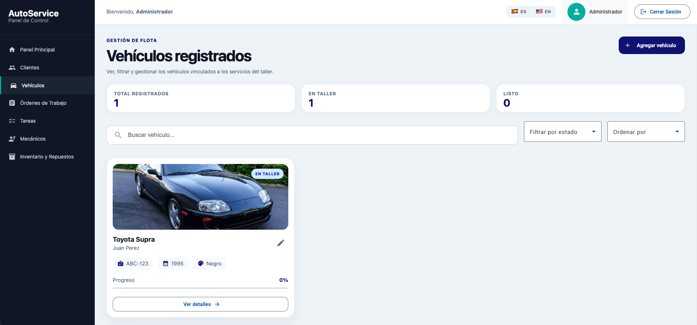
</div>

<br>

<p align="justify">
Para ilustrar la navegación y el correcto funcionamiento de estos flujos integrados, se ha preparado un video demostrativo. En el siguiente enlace se evidencia la interacción del usuario final con las nuevas funcionalidades y el consumo exitoso de los servicios integrados:
</p>

<ul>
  <li><b>Video de Ejecución (Sprint 3):</b> <a href="ENLACE_PENDIENTE_DE_YOUTUBE" target="_blank">Ver demostración de integración Front-Back</a></li>
</ul>

##### 5.2.3.6. Services Documentation Evidence for Sprint Review

<p align="justify">
Para garantizar la correcta adopción, mantenimiento y consumo de los Web Services desarrollados en el presente hito, se implementó la documentación interactiva de la API utilizando la especificación OpenAPI a través de las dependencias de Springdoc para Spring Boot. Esta interfaz permite a los desarrolladores de las aplicaciones cliente visualizar de manera transparente la estructura de las rutas, los esquemas de los recursos y los parámetros requeridos para las solicitudes HTTP.
<br><br>
A continuación, se presenta el registro detallado y completo de las acciones implementadas en la arquitectura orientada a servicios del sistema AutoService, extraídas del documento de especificación JSON:
</p>

<ul>
  <li><b>Repositorio de Web Services:</b> <a href="https://github.com/InnovaTechStudio/AutoService-729-OS-Backend" target="_blank">AutoService-729-OS-Backend</a></li>
  <li><b>Documentación Interactiva (Swagger UI):</b> <a href="http://localhost:8080/swagger-ui/index.html" target="_blank">AutoService API Documentation (Entorno Local - Despliegue en proceso)</a></li>
</ul>

<div align="center">
  <table style="margin: auto; width: 100%; border-collapse: collapse; text-align: left; font-size: 12px; border: 1px solid #ddd;">
    <thead>
      <tr style="background-color: #f2f2f2;">
        <th style="padding: 8px; border: 1px solid #ddd; text-align: center; width: 25%;">Endpoint / Verbo HTTP</th>
        <th style="padding: 8px; border: 1px solid #ddd; width: 30%;">Descripción de la Acción</th>
        <th style="padding: 8px; border: 1px solid #ddd; width: 25%;">Parámetros Requeridos</th>
        <th style="padding: 8px; border: 1px solid #ddd; width: 20%;">Respuesta Esperada (JSON)</th>
      </tr>
    </thead>
    <tbody>
      <tr style="background-color: #fafafa; font-weight: bold;"><td colspan="4" style="padding: 6px; border: 1px solid #ddd;">Módulo de Autenticación (Authentication)</td></tr>
      <tr>
        <td style="padding: 6px; border: 1px solid #ddd; text-align: center;"><strong>POST</strong><br><code>/api/v1/auth/sign-in</code></td>
        <td style="padding: 6px; border: 1px solid #ddd;">Validación de credenciales y generación de token de acceso para la plataforma.</td>
        <td style="padding: 6px; border: 1px solid #ddd;"><b>Body:</b> <code>SignInResource</code> (email, password).</td>
        <td style="padding: 6px; border: 1px solid #ddd;"><b>200 OK</b><br>Retorna confirmación y accesos.</td>
      </tr>
      <tr>
        <td style="padding: 6px; border: 1px solid #ddd; text-align: center;"><strong>POST</strong><br><code>/api/v1/auth/sign-up</code></td>
        <td style="padding: 6px; border: 1px solid #ddd;">Registra un nuevo usuario con rol asignado y asociación a un taller específico.</td>
        <td style="padding: 6px; border: 1px solid #ddd;"><b>Body:</b> <code>SignUpResource</code> (email, password, role, workshopId).</td>
        <td style="padding: 6px; border: 1px solid #ddd;"><b>200 OK</b><br>Confirmación de creación.</td>
      </tr>
      <tr>
        <td style="padding: 6px; border: 1px solid #ddd; text-align: center;"><strong>POST</strong><br><code>/api/v1/auth/register-workshop</code></td>
        <td style="padding: 6px; border: 1px solid #ddd;">Inicializa un nuevo entorno de taller (tenant) junto con su cuenta administrativa.</td>
        <td style="padding: 6px; border: 1px solid #ddd;"><b>Body:</b> <code>SignUpWorkshopResource</code> (workshopName, email, password).</td>
        <td style="padding: 6px; border: 1px solid #ddd;"><b>200 OK</b><br>Datos del taller creado.</td>
      </tr>
      <tr style="background-color: #fafafa; font-weight: bold;"><td colspan="4" style="padding: 6px; border: 1px solid #ddd;">Módulo de Seguimiento Público (Public Tracking)</td></tr>
      <tr>
        <td style="padding: 6px; border: 1px solid #ddd; text-align: center;"><strong>GET</strong><br><code>/api/v1/tracking/workorders</code></td>
        <td style="padding: 6px; border: 1px solid #ddd;">Permite la consulta pública del estado general de una orden mediante código de seguimiento.</td>
        <td style="padding: 6px; border: 1px solid #ddd;"><b>Query:</b> <code>trackingCode</code> (string).</td>
        <td style="padding: 6px; border: 1px solid #ddd;"><b>200 OK</b><br>Estado consolidado.</td>
      </tr>
      <tr>
        <td style="padding: 6px; border: 1px solid #ddd; text-align: center;"><strong>GET</strong><br><code>/api/v1/tracking/vehicles/{id}</code></td>
        <td style="padding: 6px; border: 1px solid #ddd;">Expone de forma segura la etapa actual de revisión o reparación de un vehículo.</td>
        <td style="padding: 6px; border: 1px solid #ddd;"><b>Path:</b> <code>id</code> (integer).</td>
        <td style="padding: 6px; border: 1px solid #ddd;"><b>200 OK</b><br>Ubicación y estatus.</td>
      </tr>
      <tr>
        <td style="padding: 6px; border: 1px solid #ddd; text-align: center;"><strong>GET</strong><br><code>/api/v1/tracking/tasks</code></td>
        <td style="padding: 6px; border: 1px solid #ddd;">Lista en tiempo real el progreso técnico de las tareas planificadas para el cliente.</td>
        <td style="padding: 6px; border: 1px solid #ddd;"><b>Query:</b> <code>workOrderId</code> (integer).</td>
        <td style="padding: 6px; border: 1px solid #ddd;"><b>200 OK</b><br>Colección de tareas.</td>
      </tr>
      <tr style="background-color: #fafafa; font-weight: bold;"><td colspan="4" style="padding: 6px; border: 1px solid #ddd;">Módulos Administrativos (Work Orders & Inventory)</td></tr>
      <tr>
        <td style="padding: 6px; border: 1px solid #ddd; text-align: center;"><strong>POST</strong><br><code>/api/v1/workorders</code></td>
        <td style="padding: 6px; border: 1px solid #ddd;">Genera el expediente principal vinculando vehículo, cliente y mecánico líder.</td>
        <td style="padding: 6px; border: 1px solid #ddd;"><b>Body:</b> <code>CreateWorkOrderResource</code>.</td>
        <td style="padding: 6px; border: 1px solid #ddd;"><b>200 OK</b><br>Orden registrada.</td>
      </tr>
      <tr>
        <td style="padding: 6px; border: 1px solid #ddd; text-align: center;"><strong>PUT</strong><br><code>/api/v1/workorders/{id}</code></td>
        <td style="padding: 6px; border: 1px solid #ddd;">Actualiza diagnósticos, precios calculados y estados de entrega finales.</td>
        <td style="padding: 6px; border: 1px solid #ddd;"><b>Path:</b> <code>id</code> (integer)<br><b>Body:</b> <code>UpdateWorkOrderResource</code>.</td>
        <td style="padding: 6px; border: 1px solid #ddd;"><b>200 OK</b><br>Orden modificada.</td>
      </tr>
      <tr>
        <td style="padding: 6px; border: 1px solid #ddd; text-align: center;"><strong>PATCH</strong><br><code>/api/v1/tasks/{id}</code></td>
        <td style="padding: 6px; border: 1px solid #ddd;">Aplica modificaciones parciales a diagnósticos técnicos y validaciones de tareas.</td>
        <td style="padding: 6px; border: 1px solid #ddd;"><b>Path:</b> <code>id</code> (integer)<br><b>Body:</b> <code>PatchTaskResource</code>.</td>
        <td style="padding: 6px; border: 1px solid #ddd;"><b>200 OK</b><br>Tarea actualizada.</td>
      </tr>
      <tr>
        <td style="padding: 6px; border: 1px solid #ddd; text-align: center;"><strong>GET</strong><br><code>/api/v1/inventoryitems</code></td>
        <td style="padding: 6px; border: 1px solid #ddd;">Recupera el catálogo completo de repuestos y su disponibilidad física.</td>
        <td style="padding: 6px; border: 1px solid #ddd;">Ninguno.</td>
        <td style="padding: 6px; border: 1px solid #ddd;"><b>200 OK</b><br>Lista de inventario.</td>
      </tr>
    </tbody>
  </table>
</div>

<br>

<p align="justify">
A continuación, se presentan las capturas correspondientes que evidencian la disponibilidad de la interfaz interactiva, demostrando la consistencia de los contratos de datos mapeados en el servidor Java.
</p>

<div align="center">
  <h5>Vista General de los Endpoints Documentados en Spring Boot</h5>
  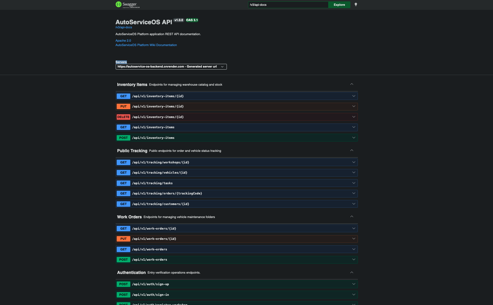
</div>

<br>

<div align="center">
  <h5>Detalle de Parámetros y Esquemas en Endpoint POST</h5>
  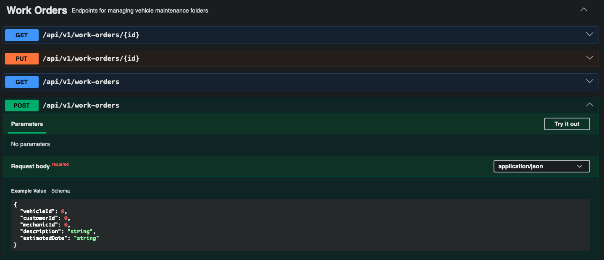
</div>

<br>

<div align="center">
  <h5>Prueba de Ejecución (Try it out) e Interacción con el API</h5>
  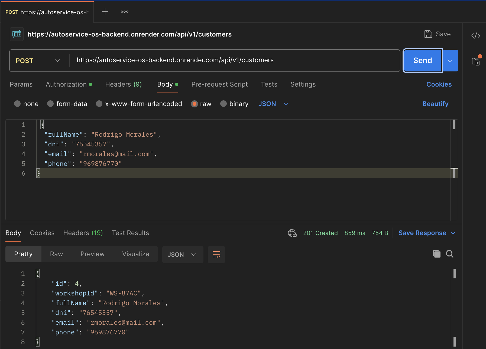
</div>

##### 5.2.3.7. Software Deployment Evidence for Sprint Review

<p align="justify">
En el presente apartado se detallan los procesos técnicos y las configuraciones ejecutadas para el despliegue de los distintos componentes de la solución de software desarrollada para el curso Open Source. Las actividades abarcaron desde la automatización de los flujos de integración continua (CI/CD) hasta la preparación del servidor Java para su publicación en la nube.
</p>

---

###### A. Componentes Desplegados y Entornos Cloud

<p align="justify">
Para garantizar el funcionamiento de la arquitectura distribuida, se gestionó la publicación de los artefactos en diferentes plataformas:
</p>

<ul>
  <li>
    <b>Landing Page (Sitio Web Estático):</b> Alojada y distribuida mediante GitHub Pages, garantizando una entrega rápida de la página promocional del producto.
    <br><b>URL:</b> <a href="https://innovatechstudio.github.io/Autoservice-landing-page-os/" target="_blank">https://innovatechstudio.github.io/Autoservice-landing-page-aw/</a>
  </li>
  <li>
    <b>Web Application (Frontend Angular):</b> Desplegada en la plataforma Microsoft Azure utilizando el servicio Azure Static Web Apps, integrado con flujos automatizados de compilación.
    <br><b>URL:</b> <a href="https://agreeable-grass-0b8f49a10.7.azurestaticapps.net/login" target="_blank">https://agreeable-grass-0b8f49a10.7.azurestaticapps.net/login</a>
  </li>
  <li>
    <b>Web Services (Backend Spring Boot):</b> Hospedados en la plataforma Cloud de Render mediante la construcción y ejecución automatizada de un contenedor aislado, exponiendo la lógica del lado del servidor desarrollada en Java con persistencia relacional.
    <br><b>URL:</b> <a href="https://autoservice-os-backend.onrender.com/swagger-ui/index.html" target="_blank">https://autoservice-os-backend.onrender.com/swagger-ui/index.html</a>
  </li>
</ul>

---

###### B. Configuración Paso a Paso del Proceso de Despliegue

<p align="justify">
A continuación, se describen de manera secuencial los pasos realizados para materializar el entorno productivo:
</p>

**Paso 1: Despliegue de la Landing Page (GitHub Pages)**
<p align="justify">
Se configuró el repositorio de la Landing Page habilitando la rama principal (main) para su compilación y exposición estática directa a través de los servidores de GitHub.
</p>

**Paso 2: Automatización del Frontend en Azure (Angular)**
<p align="justify">
Para la aplicación SPA (Single Page Application) construida en Angular, se provisionó un recurso dentro de Azure. Esto generó un flujo de GitHub Actions que intercepta los <i>Pull Requests</i> hacia la rama main, ejecutando el comando <code>ng build</code> para compilar los artefactos estáticos TypeScript a JavaScript, desplegándolos en los servidores de Azure.
</p>

**Paso 3: Contenerización y Despliegue del Backend en Render**
<p align="justify">
Se estructuró un archivo <code>Dockerfile</code> optimizado para el ecosistema Java utilizando una compilación multi-etapa (multi-stage build) con Maven y el entorno de ejecución de OpenJDK. En el panel de administración de Render, se creó un recurso de tipo <i>Web Service</i> apuntando al repositorio del backend, configurando el método de construcción basado en Docker. La plataforma automatiza el despliegue ante cada actualización en la rama principal, inyectando de forma segura las variables de entorno para la conexión con la base de datos productiva.
</p>

---

###### C. Evidencias Gráficas de Despliegue Exitoso

<div align="center">
  <h5>Evidencia 1: Flujo de Compilación y Despliegue Exitoso en Azure (Frontend Angular)</h5>
  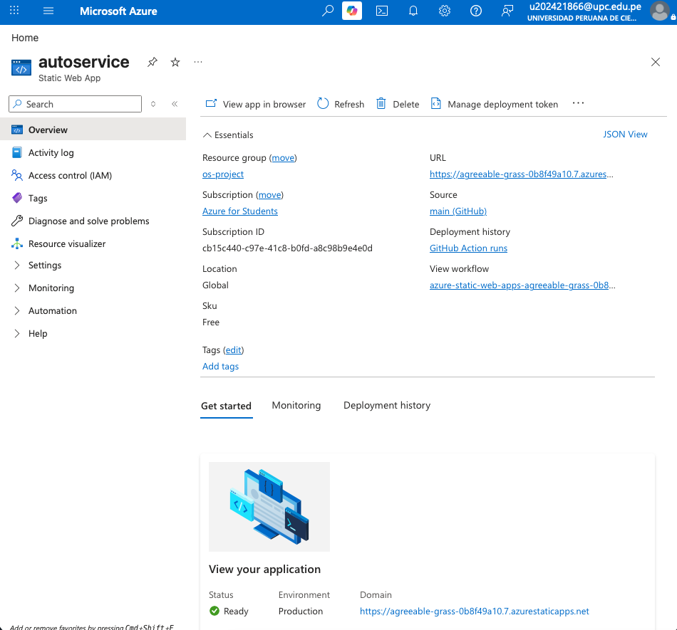
</div>

<br>

<div align="center">
  <h5>Evidencia 2: Preparación de Entorno para Servicios Spring Boot</h5>
  
</div>

##### 5.2.3.8. Team Collaboration Insights during Sprint

<p align="justify">
Durante el Sprint 3, el equipo mantuvo un flujo de trabajo colaborativo enfocado primordialmente en la consolidación de la arquitectura por capas en Java (Spring Boot) y la actualización de los módulos y componentes en Angular. Para garantizar la organización técnica, se aplicó estrictamente la estrategia GitFlow.
</p>

<p align="justify">
Cada integrante trabajó sobre ramas <i>feature/*</i> vinculadas directamente a la creación de los Bounded Contexts en el servidor, integrando posteriormente sus avances mediante Pull Requests hacia la rama <code>develop</code>. Tras las validaciones de las pruebas, los cambios se consolidaron hacia <code>main</code> para el despliegue automático del lado del cliente.
</p>

<p align="justify">
La colaboración se evidenció principalmente en la conexión de JPA Repositories con las bases de datos relacionales, la creación de DTOs para la transferencia segura de la información y la adaptación de los servicios HTTP en Angular. El uso riguroso de convenciones de versionamiento (Conventional Commits) garantizó la trazabilidad de la lógica de negocio.
</p>

<div align="center">
  <h5>Evidencia 1: Gráfico de contribuciones por integrante del equipo</h5>
  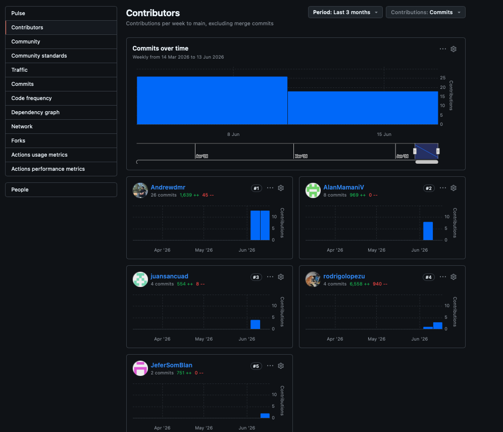

  <h5>Evidencia 2: Resumen de actividad del Sprint mediante GitHub Pulse</h5>
  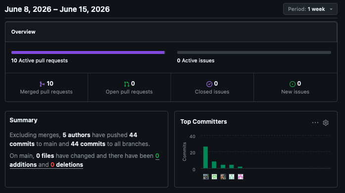

  <h5>Evidencia 3: Gestión colaborativa mediante Pull Requests y merges</h5>
  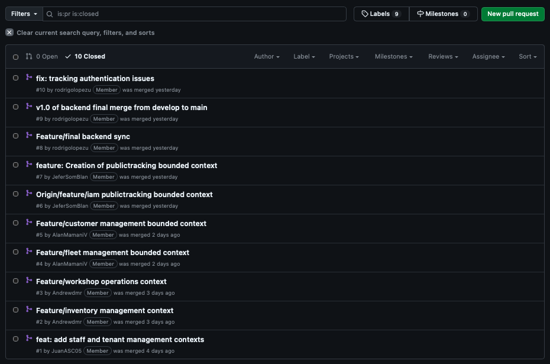

  <h5>Evidencia 4: Organización de ramas bajo estrategia GitFlow</h5>
  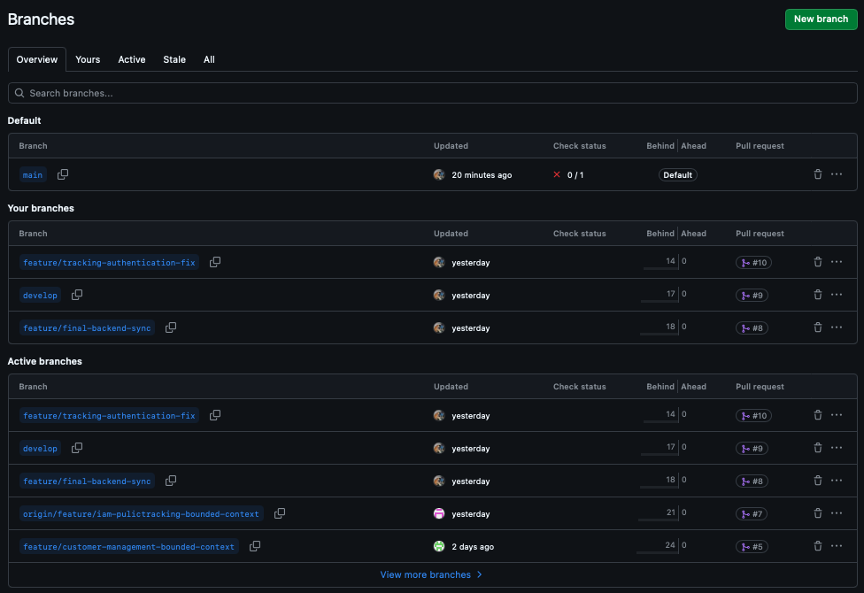
</div>

<br>

<p align="justify">
Entre las actividades colaborativas más relevantes realizadas de forma conjunta durante este Sprint destacan:
</p>

<ul style="text-align: justify;">
  <li>Estructuración del proyecto Spring Boot y definición de Entidades con anotaciones JPA (<code>@Entity</code>, <code>@OneToMany</code>).</li>
  <li>Implementación de Repositorios, Servicios y Controladores REST para los dominios de Taller y Flotas.</li>
  <li>Documentación interactiva de la API con Springdoc OpenAPI (Swagger).</li>
  <li>Consumo de APIs desde el lado del cliente utilizando RxJS y el módulo HttpClient de Angular.</li>
  <li>Configuración de flujos automatizados de despliegue continuo en Microsoft Azure para la interfaz gráfica.</li>
</ul>

<p align="justify">
Los repositorios principales utilizados para el trabajo colaborativo en este Sprint fueron:
</p>

<p align="center">
  <b>Backend:</b> <code><a href="https://github.com/InnovaTechStudio/AutoService-729-OS-Backend" target="_blank">https://github.com/InnovaTechStudio/AutoService-729-OS-Backend</a></code><br>
  <b>Frontend:</b> <code><a href="https://github.com/InnovaTechStudio/AutoService-729-OS-Frontend" target="_blank">https://github.com/InnovaTechStudio/AutoService-729-OS-Frontend</a></code>
</p>

<!--  PENDIENTE PARA ENTREGA FINAL TB2
### 5.3. Validation Interviews

#### 5.3.1. Diseño de Entrevistas
[Pendiente]

#### 5.3.2. Registro de Entrevistas
[Pendiente]

#### 5.3.3. Evaluaciones según heurísticas
[Pendiente]

### 5.4. Video About-the-Product
[Pendiente]
-->