# Documentación del Trabajo Final - 1ASI0730 <!-- omit in toc -->

<div align="center">
  
<br>
Universidad Peruana de Ciencias Aplicadas<br>
Facultad de Ingenería, Carrera de Ingeniería de Software<br>
**Ciclo:** 2026-10

**AV1 – Sprint Review**

**1ASI0730** Desarrollo de Aplicaciones Open Source<br>
**NRC:** 17952<br>
**Profesor:** Iván Robles Fernández<br>

**Nombre del startup:** InnovaTech<br>
**Nombre del producto:** AutoService<br>
Abril, 2026

#### Relación de integrantes <!-- omit in toc -->

  <table style="margin: auto;">
    <thead>
      <tr>
        <th style="text-align: left;">Código</th>
        <th style="text-align: left;">Apellidos y Nombres</th>
      </tr>
    </thead>
    <tbody>
      <tr>
        <td>U20251B991</td>
        <td>Aguilar Aguayo, Jeferson Renzo</td>
      </tr>
      <tr>
        <td>U202421866</td>
        <td>Lopez Monroy, Rodrigo Alfredo</td>
      </tr>
      <tr>
        <td>U20241D185</td>
        <td>Luis Miranda, Diego Andres</td>
      </tr>
      <tr>
        <td>U20241E299</td>
        <td>Mamani Vilca, Alan Jaivi</td>
      </tr>
      <tr>
        <td>U202319404</td>
        <td>Sanchez Cuadrado, Juan Antonio</td>
      </tr>
    </tbody>
  </table>

</div>

---

<br>
<br>
<br>
<br>
<br>
<br>
<br>
<br>

## Registro de Versiones del Informe <!-- omit in toc -->

<div align="center">
  <table style="margin: auto; text-align: center;">
    <thead>
      <tr>
        <th style="text-align: center;">Versión</th>
        <th style="text-align: center;">Fecha</th>
        <th style="text-align: center;">Autores</th>
        <th style="text-align: left;">Descripción de modificación</th>
      </tr>
    </thead>
    <tbody>
      <tr>
        <td>V1.0</td>
        <td>22/04/2026</td>
        <td>Aguilar Aguayo, Jeferson Renzo<br>Lopez Monroy, Rodrigo Alfredo<br>Luis Miranda, Diego Andres<br>Mamani Vilca, Alan Jaivi<br>Sanchez Cuadrado, Juan Antonio</td>
        <td>Elaboración de la primera entrega formal del proyecto (Capítulos I al V).<br> Incluye la definición del modelo de negocio (Lean UX),<br> levantamiento de requerimientos (Needfinding, EventStorming,<br> Product Backlog, User Stories) y el diseño del producto<br> (Arquitectura de Información, DDD, C4 Model y Wireframes UX/UI).<br> Asimismo, documenta la ejecución del Sprint 1, evidenciando<br> el despliegue de la Landing Page en GitHub Pages, la integración de<br> EmailJS y las métricas de colaboración del equipo utilizando GitFlow.</td>
      </tr>
      <!-- 
      <tr>
        <td>V2.0</td>
        <td>--/--/2026</td>
        <td>Aguilar Aguayo, Jeferson Renzo<br>Lopez Monroy, Rodrigo Alfredo<br>Luis Miranda, Diego Andres<br>Mamani Vilca, Alan Jaivi<br>Sanchez Cuadrado, Juan Antonio</td>
        <td style="text-align: left;"><i>Pendiente</i></td>
      </tr>
      <tr>
        <td>V3.0</td>
        <td>--/--/2026</td>
        <td>Aguilar Aguayo, Jeferson Renzo<br>Lopez Monroy, Rodrigo Alfredo<br>Luis Miranda, Diego Andres<br>Mamani Vilca, Alan Jaivi<br>Sanchez Cuadrado, Juan Antonio</td>
        <td style="text-align: left;"><i>Pendiente</i></td>
      </tr>
      <tr>
        <td>V4.0</td>
        <td>--/--/2026</td>
        <td>Aguilar Aguayo, Jeferson Renzo<br>Lopez Monroy, Rodrigo Alfredo<br>Luis Miranda, Diego Andres<br>Mamani Vilca, Alan Jaivi<br>Sanchez Cuadrado, Juan Antonio</td>
        <td style="text-align: left;"><i>Pendiente</i></td>
      </tr>
      -->
    </tbody>
  </table>
</div>

---

## Project Report Collaboration Insights <!-- omit in toc -->

* **URL del Repositorio de GitHub:** https://github.com/InnovaTechStudio/AutoService-729-OS
* **AV1:** - [5.2.1.8. Team Collaboration Insights during Sprint](#5218-team-collaboration-insights-during-sprint)
* **Video Exposición AV1:** 

---

## Contenido <!-- omit in toc -->

- [Student Outcome](#student-outcome)
- [Capítulo I: Introducción](#capítulo-i-introducción)
  - [1.1. Startup Profile](#11-startup-profile)
    - [1.1.1. Descripción de la Startup](#111-descripción-de-la-startup)
    - [1.1.2. Perfiles de integrantes del equipo](#112-perfiles-de-integrantes-del-equipo)
  - [1.2. Solution Profile](#12-solution-profile)
    - [1.2.1 Antecedentes y problemática](#121-antecedentes-y-problemática)
    - [1.2.2 Lean UX Process](#122-lean-ux-process)
      - [1.2.2.1. Lean UX Problem Statements](#1221-lean-ux-problem-statements)
      - [1.2.2.2. Lean UX Assumptions](#1222-lean-ux-assumptions)
      - [1.2.2.3. Lean UX Hypothesis Statements](#1223-lean-ux-hypothesis-statements)
      - [1.2.2.4. Lean UX Canvas](#1224-lean-ux-canvas)
  - [1.3. Segmentos objetivo](#13-segmentos-objetivo)
- [Capítulo II: Requirements Elicitation \& Analysis](#capítulo-ii-requirements-elicitation--analysis)
  - [2.1. Competidores](#21-competidores)
    - [2.1.1. Análisis competitivo](#211-análisis-competitivo)
  - [Competitive Analysis Landscape](#competitive-analysis-landscape)
    - [2.1.2. Estrategias y tácticas frente a competidores](#212-estrategias-y-tácticas-frente-a-competidores)
  - [2.2. Entrevistas](#22-entrevistas)
    - [2.2.1. Diseño de entrevistas](#221-diseño-de-entrevistas)
    - [2.2.2. Registro de entrevistas](#222-registro-de-entrevistas)
    - [Entrevista 1: Técnico Independiente](#entrevista-1-técnico-independiente)
    - [Entrevista 2: Técnico Independiente](#entrevista-2-técnico-independiente)
    - [Entrevista 3: Técnico Independiente](#entrevista-3-técnico-independiente)
    - [Entrevista 4: Administrador de Taller Automotriz](#entrevista-4-administrador-de-taller-automotriz)
    - [Entrevista 5: Administrador y Encargado de Logística de Taller Automotriz](#entrevista-5-administrador-y-encargado-de-logística-de-taller-automotriz)
    - [2.2.3. Análisis de entrevistas](#223-análisis-de-entrevistas)
  - [2.3. Needfinding](#23-needfinding)
    - [2.3.1. User Personas](#231-user-personas)
    - [User Persona 1: Mechanic](#user-persona-1-mechanic)
    - [User Persona 2: Workshop Manager](#user-persona-2-workshop-manager)
    - [User Persona 3: Vehicle Owner](#user-persona-3-vehicle-owner)
    - [2.3.2. User Task Matrix](#232-user-task-matrix)
    - [Análisis del User Task Matrix](#análisis-del-user-task-matrix)
    - [2.3.3. User Journey Mapping](#233-user-journey-mapping)
      - [Journey Map 1: Mechanic](#journey-map-1-mechanic)
    - [Journey Map 2: Workshop Manager](#journey-map-2-workshop-manager)
    - [Journey Map 3: Vehicle Owner](#journey-map-3-vehicle-owner)
    - [2.3.4. Empathy Mapping](#234-empathy-mapping)
    - [Empathy Map 1: Mechanic](#empathy-map-1-mechanic)
    - [Empathy Map 2: Workshop Manager](#empathy-map-2-workshop-manager)
    - [Empathy Map 3: Vehicle Owner](#empathy-map-3-vehicle-owner)
  - [2.4. Big Picture EventStorming](#24-big-picture-eventstorming)
    - [Estructura del Flujo (Timeline)](#estructura-del-flujo-timeline)
    - [Leyenda de Elementos](#leyenda-de-elementos)
    - [Hotspots y Oportunidades de Mejora](#hotspots-y-oportunidades-de-mejora)
  - [2.5. Ubiquitous Language](#25-ubiquitous-language)
- [Capítulo III: Requirements Specification](#capítulo-iii-requirements-specification)
  - [3.1. User Stories](#31-user-stories)
  - [3.4. Impact Mapping](#34-impact-mapping)
  - [3.5. Product Backlog](#35-product-backlog)
- [Capítulo IV: Product Design](#capítulo-iv-product-design)
  - [4.1. Style Guidelines](#41-style-guidelines)
    - [4.1.1. General Style Guidelines](#411-general-style-guidelines)
    - [4.1.2. Web Style Guidelines](#412-web-style-guidelines)
  - [4.2. Information Architecture](#42-information-architecture)
    - [4.2.1. Organization Systems](#421-organization-systems)
    - [4.2.2. Labeling Systems](#422-labeling-systems)
    - [4.2.3. SEO Tags and Meta Tags](#423-seo-tags-and-meta-tags)
    - [4.2.4. Searching Systems](#424-searching-systems)
    - [4.2.5. Navigation Systems](#425-navigation-systems)
  - [4.3. Landing Page UI Design](#43-landing-page-ui-design)
    - [4.3.1. Landing Page Wireframe](#431-landing-page-wireframe)
    - [4.3.2. Landing Page Mock-up](#432-landing-page-mock-up)
  - [4.4. Web Applications UX/UI Design](#44-web-applications-uxui-design)
    - [4.4.1. Web Applications Wireframes](#441-web-applications-wireframes)
    - [4.4.2. Web Applications Wireflow Diagrams](#442-web-applications-wireflow-diagrams)
    - [4.4.3. Web Applications Mock-ups](#443-web-applications-mock-ups)
    - [4.4.4. Web Applications User Flow Diagrams](#444-web-applications-user-flow-diagrams)
  - [4.5. Web Applications Prototyping](#45-web-applications-prototyping)
  - [4.6. Domain-Driven Software Architecture](#46-domain-driven-software-architecture)
    - [4.6.1. Design-Level EventStorming](#461-design-level-eventstorming)
    - [4.6.2. Software Architecture Context Diagram](#462-software-architecture-context-diagram)
    - [4.6.3. Software Architecture Container Diagrams](#463-software-architecture-container-diagrams)
    - [4.6.4. Software Architecture Components Diagrams](#464-software-architecture-components-diagrams)
  - [4.7. Software Object-Oriented Design](#47-software-object-oriented-design)
    - [4.7.1. Class Diagrams](#471-class-diagrams)
      - [Diagrama de Clases General - AutoService](#diagrama-de-clases-general---autoservice)
      - [Identity \& Profile Context](#identity--profile-context)
        - [Responsabilidades Principales](#responsabilidades-principales)
        - [Reglas de Negocio Clave](#reglas-de-negocio-clave)
      - [Workshop Operations Context (Core Domain)](#workshop-operations-context-core-domain)
        - [Responsabilidades Principales](#responsabilidades-principales-1)
        - [Reglas de Negocio Clave](#reglas-de-negocio-clave-1)
      - [Staff Management Context (Supporting Domain)](#staff-management-context-supporting-domain)
        - [Responsabilidades Principales](#responsabilidades-principales-2)
        - [Reglas de Negocio Clave](#reglas-de-negocio-clave-2)
      - [Billing \& Payment Context (Supporting Domain)](#billing--payment-context-supporting-domain)
        - [Responsabilidades Principales](#responsabilidades-principales-3)
        - [Reglas de Negocio Clave](#reglas-de-negocio-clave-3)
      - [Customer Tracking \& Notification Context (Supporting Domain)](#customer-tracking--notification-context-supporting-domain)
        - [Responsabilidades Principales](#responsabilidades-principales-4)
        - [Reglas de Negocio Clave](#reglas-de-negocio-clave-4)
      - [Reporting \& Analytics Context (Supporting Domain)](#reporting--analytics-context-supporting-domain)
        - [Responsabilidades Principales](#responsabilidades-principales-5)
        - [Regla de Negocio Clave](#regla-de-negocio-clave)
  - [4.8. Database Design](#48-database-design)
    - [Características Principales del Diseño](#características-principales-del-diseño)
    - [4.8.1. Database Diagrams](#481-database-diagrams)
      - [Diagrama de Base de Datos General - AutoService](#diagrama-de-base-de-datos-general---autoservice)
      - [Identity \& Profile Context](#identity--profile-context-1)
      - [Workshop Operations Context (Core Domain)](#workshop-operations-context-core-domain-1)
      - [Staff Management Context (Supporting Domain)](#staff-management-context-supporting-domain-1)
      - [Billing \& Payment Context (Supporting Domain)](#billing--payment-context-supporting-domain-1)
      - [Customer Tracking \& Notification Context (Supporting Domain)](#customer-tracking--notification-context-supporting-domain-1)
      - [Reporting \& Analytics Context (Supporting Domain)](#reporting--analytics-context-supporting-domain-1)
- [Capítulo V: Product Implementation, Validation \& Deployment](#capítulo-v-product-implementation-validation--deployment)
  - [5.1. Software Configuration Management](#51-software-configuration-management)
    - [5.1.2. Source Code Management](#512-source-code-management)
    - [5.1.3. Source Code Style Guide \& Conventions](#513-source-code-style-guide--conventions)
    - [5.1.4. Software Deployment Configuration](#514-software-deployment-configuration)
  - [5.2. Landing Page, Services \& Applications Implementation](#52-landing-page-services--applications-implementation)
    - [5.2.1. Sprint 1](#521-sprint-1)
      - [5.2.1.1. Sprint Planning 1](#5211-sprint-planning-1)
      - [5.2.1.2. Aspect Leaders and Collaborators](#5212-aspect-leaders-and-collaborators)
      - [5.2.1.3. Sprint Backlog 1](#5213-sprint-backlog-1)
      - [5.2.1.4. Development Evidence for Sprint Review](#5214-development-evidence-for-sprint-review)
      - [5.2.1.5. Execution Evidence for Sprint Review](#5215-execution-evidence-for-sprint-review)
      - [5.2.1.6. Services Documentation Evidence for Sprint Review](#5216-services-documentation-evidence-for-sprint-review)
      - [5.2.1.7. Software Deployment Evidence for Sprint Review](#5217-software-deployment-evidence-for-sprint-review)
      - [5.2.1.8. Team Collaboration Insights during Sprint](#5218-team-collaboration-insights-during-sprint)
- [Conclusiones](#conclusiones)
  - [Conclusiones y Recomendaciones](#conclusiones-y-recomendaciones)
- [Bibliografía](#bibliografía)
- [Anexos](#anexos)

---

## Student Outcome

<div align="center">
  <table style="margin: auto; text-align: left;">
    <thead>
      <tr>
        <th>Criterio específico</th>
        <th>Acciones realizadas</th>
        <th>Conclusiones</th>
      </tr>
    </thead>
    <tbody>
      <tr>
        <td>Comunica oralmente con efectividad a diferentes rangos de audiencia.</td>
        <td>
          <b>Aguilar Aguayo, Jeferson Renzo</b> AV1: Se realizó la gestión de configuración y del código fuente mediante la adopción del modelo GitFlow, organizando el desarrollo en ramas específicas (main, develop, feature/, hotfix/) y aplicando la convención de Conventional Commits para asegurar un proceso de trabajo ordenado, colaborativo y escalable
. Asimismo, se establecieron guías de estilo y convenciones técnicas rigurosas, redactando todo el código y documentación en inglés y aplicando arquitecturas específicas para Angular (basada en componentes) y Spring Boot (por capas), junto con el uso de Gherkin para definir criterios de aceptación que faciliten la comunicación con los interesados<br>
          <b>Lopez Monroy, Rodrigo Alfredo</b> AV1: (ACCIONES REALIZADAS)<br>
          <b>Luis Miranda, Diego Andres</b> AV1: Se realizo el proceso completo de diseño UX/UI, incluyendo la elaboración de wireframes, wireflows, mock-ups y prototipos interactivos en Figma aplicando la principios, elemntos, IA, etc. Asimismo, se explicaron los resultados obtenidos a partir de las entrevistas realizadas, tomando en cuentas las necesidades del usuarios<br>
          <b>Mamani Vilca, Alan Jaivi</b> AV1: Sustenté la arquitectura de software en el modelado del diagrama de clases y el modelo de base de datos, adaptando el lenguaje técnico para asegurar la comprensión del sistema. Además, conduje entrevistas a administradores de taller, demostrando escucha activa para extraer necesidades clave y validar supuestos del Lean UX.<br>
          <b>Sanchez Cuadrado, Juan Antonio</b> AV1: Aporte individual:
Me encargué del desarrollo del Capítulo I: Introducción, donde se definió el perfil de la startup, la descripción de la solución, el análisis del problema, los segmentos objetivo y el enfoque Lean UX del proyecto 
  AutoService.

Además, participé en el diseño del mockup de la Landing Page, orientado a presentar el producto de forma clara, atractiva y comercial para talleres automotrices. Posteriormente, apoyé en su implementación utilizando HTML, CSS y JavaScript, integrando secciones como el hero, funcionalidades principales, beneficios, precios, CTA y elementos visuales del sistema.
        </td>
        <td>AV1: Se logró comunicar de manera clara, estructurada y efectiva el proceso de diseño y las funcionalidades del sistema, facilitando la comprensión del proyecto para distintos tipos de audiencia y evidenciando dominio de los conceptos de UX/UI.</td>
      </tr>
      <tr>
        <td>Comunica por escrito con efectividad a diferentes rangos de audiencia.</td>
        <td>
          <b>Aguilar Aguayo, Jeferson Renzo</b> AV1: Se elaboró la documentación técnica y contribuí en la implementación de la gestión del código mediante GitFlow, organizando las ramas y estándares de programación en inglés para facilitar el desarrollo colaborativo y mantener coherencia con la arquitectura y el despliegue profesional de AutoService<br>
          <b>Lopez Monroy, Rodrigo Alfredo</b> AV1: (ACCIONES REALIZADAS)<br>
          <b>Luis Miranda, Diego Andres</b> AV1: Se desarrolló la documentación, incluyendo el análisis de entrevistas para el levantamiento de requerimientos, la definición de historias de usuario y la elaboración de wireframes, mock-ups y prototipos. Se redactaron secciones técnicas relacionadas con principios de diseño, arquitectura de información, diseño inclusivo y decisiones UX/UI, manteniendo un lenguaje claro, estructurado y coherente.<br>
          <b>Mamani Vilca, Alan Jaivi</b> AV1: Documenté la arquitectura, del modelo del diagrama de clases, modelo de datos y hallazgos del Needfinding (User Personas, Empathy/Journey Maps) con precisión técnica y claridad. Utilicé terminología estándar y una estructura lógica para facilitar la implementación y la colaboración efectiva entre los roles de diseño y desarrollo.<br>
          <b>Sanchez Cuadrado, Juan Antonio</b> AV1: Se elaboro documentacion y contribuí en la elaboración de la presentación final en Canva, organizando la información visualmente para facilitar la exposición del proyecto y mantener coherencia con la identidad gráfica de AutoService.
        </td>
        <td>AV1: Se logró presentar información de manera ordenada y comprensible, permitiendo que tanto usuarios técnicos como no técnicos puedan entender el proceso de diseño, las decisiones tomadas y el funcionamiento del sistema de forma clara y efectiva.</td>
      </tr>
    </tbody>
  </table>
</div>

---

## Capítulo I: Introducción

### 1.1. Startup Profile

<p align="justify"> El Startup Profile presenta una visión general del equipo y de la propuesta de valor del proyecto, describiendo el enfoque de la solución, el contexto en el que se desarrolla y las capacidades del equipo de trabajo. Esta sección permite comprender la finalidad de la startup, así como el aporte de cada integrante en el desarrollo del sistema. </p>

#### 1.1.1. Descripción de la Startup

<p align="justify"> Nuestra startup tiene como objetivo desarrollar una plataforma web orientada a la gestión integral de talleres automotrices, permitiendo optimizar los procesos operativos, mejorar la organización interna y brindar mayor transparencia al cliente final. <br><br> La solución está dirigida principalmente a mecánicos independientes y talleres automotrices (PYMES), quienes actualmente enfrentan dificultades en la gestión de clientes, vehículos, órdenes de trabajo y seguimiento de servicios. A través de este sistema, se busca centralizar la información, digitalizar procesos y facilitar la comunicación entre el taller y el cliente. <br><br> La plataforma permitirá registrar clientes y vehículos, gestionar órdenes de trabajo, realizar seguimiento del estado del servicio en tiempo real, controlar pagos y generar historiales detallados por vehículo. Además, el sistema implementa un modelo SaaS (Software as a Service), donde los talleres pagan una suscripción mensual para acceder a funcionalidades avanzadas, mientras que los clientes finales pueden acceder gratuitamente para visualizar el estado de sus servicios. <br><br> De esta manera, la startup busca aportar valor tanto al taller, mejorando su eficiencia y control, como al cliente, incrementando la confianza y transparencia en el servicio automotriz. </p>

#### 1.1.2. Perfiles de integrantes del equipo

<div align="center">
  <table style="margin: auto; width: 100%; border-collapse: collapse; border: 1px solid #ddd;">
    <tbody>
      <!-- Integrante 1 -->
      <tr>
        <td style="padding: 20px; border: 1px solid #ddd; width: 70%; vertical-align: middle; text-align: left;">
          <strong>Aguilar Aguayo, Jeferson Renzo</strong><br><br>
          <i>Estudiante del quinto ciclo de Ing. de Software. mis conocimientos sobre lenguajes de programacion se centran en JS, CSS, HTML y MySQL. Mis fortalezas como parte de un equipo son el trabajo colaborativo, responsabilidad con las entregas de las partes del trabajo y creatividad en ideas de mejoras sobre el proyecto.</i>
        </td>
        <td style="padding: 10px; border: 1px solid #ddd; width: 30%; text-align: center; vertical-align: middle;">
          
        </td>
      </tr>
      <!-- Integrante 2 -->
      <tr>
        <td style="padding: 20px; border: 1px solid #ddd; vertical-align: middle; text-align: left;">
          <strong>Lopez Monroy, Rodrigo Alfredo</strong><br><br>
          <i>Estudiante del quinto ciclo de Ing. de Software. Mis principales fortalezas son la capacidad de organización, manejo de tiempos y gestión del trabajo en equipo. Me encuentro en constante aprendizaje de distintas tecnologías y siempre busco trabajar de manera pulida y a consciencia.</i>
        </td>
        <td style="padding: 10px; border: 1px solid #ddd; text-align: center; vertical-align: middle;">
          
        </td>
      </tr>
      <!-- Integrante 3 -->
      <tr>
        <td style="padding: 20px; border: 1px solid #ddd; vertical-align: middle; text-align: left;">
          <strong>Luis Miranda, Diego Andres</strong><br><br>
          <i>Estoy cursando el quinto ciclo de mi carrera. A lo largo de mi experiencia aprendí muchas cosas como ser una persona proactiva, perseverante y responsable. Tengo conocimientos programando en diferentes leguajes C++, python, JS, CSS, HTML, SQL. En la parte de frontend me gusta diseñar para entregar un producto atractivo. Mediante mi conocimiento sé que puedo aportar más de mis capacidades para presentar un buen proyecto en equipo <br></i>
        </td>
        <td style="padding: 10px; border: 1px solid #ddd; text-align: center; vertical-align: middle;">
          
        </td>
      </tr>
      <!-- Integrante 4 -->
      <tr>
        <td style="padding: 20px; border: 1px solid #ddd; vertical-align: middle; text-align: left;">
          <strong>Mamani Vilca, Alan Jaivi</strong><br><br>
          <i>Soy estudiante de Ingeniería de Software en la UPC, con interés en machine learning y análisis de datos. Me caracterizo por mi pensamiento analítico, responsabilidad, proactividad y capacidad de trabajo en equipo. Me mantengo en constante aprendizaje, enfocado en la resolución de problemas y en aportar de manera eficiente y colaborativa en proyectos tecnológicos.</i>
        </td>
        <td style="padding: 10px; border: 1px solid #ddd; text-align: center; vertical-align: middle;">
          
        </td>
      </tr>
      <!-- Integrante 5 -->
      <tr>
        <td style="padding: 20px; border: 1px solid #ddd; vertical-align: middle; text-align: left;">
          <strong>Sanchez Cuadrado, Juan Antonio</strong><br><br>
            <i>Soy estudiante de Ingeniería de Software con conocimientos en diversos lenguajes de programación y tecnologías web, entre ellos Python, JavaScript, Java, SQL, HTML y CSS. Poseo habilidades en desarrollo de aplicaciones web, lógica de programación y manejo de bases de datos, lo que me permite contribuir en la construcción tanto del frontend como del backend del sistema. Asimismo, tengo capacidad para analizar problemas, diseñar soluciones tecnológicas y trabajar en equipo bajo metodologías de desarrollo, aportando de manera activa en la implementación y mejora continua del proyecto.</i>
        </td>
        <td style="padding: 10px; border: 1px solid #ddd; text-align: center; vertical-align: middle;">
          
        </td>
      </tr>
    </tbody>
  </table>
</div>

### 1.2. Solution Profile

<p align="justify">
El Solution Profile presenta una visión general de la solución propuesta a partir del análisis del problema identificado en el dominio de los talleres automotrices.
</p>

<p>En esta sección se aborda:</p>
<ul>
  <li><strong>Antecedentes del problema</strong></li>
  <li><strong>Problemática existente</strong></li>
  <li><strong>Aspectos clave que la solución busca resolver</strong></li>
  <li><strong>Aplicación del enfoque Lean UX</strong></li>
</ul>

<p align="justify">
Asimismo, se emplea el enfoque Lean UX para validar hipótesis centradas en el usuario, permitiendo diseñar una solución orientada a mejorar la eficiencia operativa y la experiencia del cliente.
</p>

---

#### 1.2.1 Antecedentes y problemática

 <p><strong>Who (¿Quién?)</strong></p>
<ul>
  <li>Mecánicos independientes</li>
  <li>Talleres automotrices (PYMES)</li>
  <li>Clientes finales (propietarios de vehículos)</li>
</ul>

<p align="justify">
Estos actores gestionan clientes, vehículos y servicios sin sistemas especializados. Los clientes también se ven afectados por la falta de información clara y seguimiento.
</p>

<p><strong>What (¿Qué?)</strong></p>
<ul>
  <li>Deficiente gestión de procesos</li>
  <li>Problemas en:
    <ul>
      <li>Órdenes de trabajo</li>
      <li>Control de clientes</li>
      <li>Seguimiento de vehículos</li>
      <li>Registro de servicios</li>
    </ul>
  </li>
</ul>

<p align="justify">
Esto se debe al uso de métodos manuales o herramientas no integradas, generando desorganización, pérdida de información y errores.
</p>

<p><strong>Where (¿Dónde?)</strong></p>
<ul>
  <li>Talleres automotrices pequeños y medianos</li>
</ul>

<p>Se utilizan:</p>
<ul>
  <li>Cuadernos</li>
  <li>Hojas de cálculo</li>
  <li>Aplicaciones de mensajería</li>
</ul>

<p><strong>When (¿Cuándo?)</strong></p>
<p>Ocurre de manera constante, especialmente en:</p>
<ul>
  <li>Registro de servicios</li>
  <li>Seguimiento de vehículos</li>
  <li>Comunicación con clientes</li>
</ul>

<p><strong>Why (¿Por qué?)</strong></p>
<ul>
  <li>Falta de adopción de herramientas tecnológicas</li>
  <li>Ausencia de automatización y centralización</li>
  <li>Mala planificación y control del trabajo</li>
</ul>

<p align="justify">
Según Velneo (2023), la digitalización mejora la organización y la toma de decisiones. Sin embargo, muchos talleres no implementan estas soluciones.
<br><br>
JCM Automoción (2022) señala que la falta de control genera errores, retrabajos e insatisfacción.
</p>

<p><strong>How (¿Cómo?)</strong></p>
<ul>
  <li>Desorganización interna</li>
  <li>Falta de control</li>
  <li>Ausencia de historiales estructurados</li>
  <li>Deficiente comunicación con clientes</li>
</ul>

<p align="justify">
Esto impacta directamente en la calidad del servicio y la percepción del cliente.
<br><br>
Q2B Studio (2023) destaca que el software de gestión optimiza procesos y aumenta la eficiencia.
</p>

<p><strong>How Much (¿Cuánto impacta?)</strong></p>
<ul>
  <li>Pérdida de tiempo</li>
  <li>Errores en la gestión</li>
  <li>Baja productividad</li>
  <li>Disminución de la confianza del cliente</li>
</ul>

<p align="justify">
También afecta la reputación del taller debido a la falta de transparencia.
<br><br>
Quora (2023) indica que los sistemas de gestión mejoran la satisfacción del cliente mediante mayor claridad y seguimiento.
</p>

---

#### 1.2.2 Lean UX Process

<p align="justify">
El Lean UX Process permite definir y validar la solución a partir de la comprensión del problema y las necesidades del usuario.
</p>

<p><strong>Se basa en:</strong></p>
<ul>
  <li>Formulación de hipótesis</li>
  <li>Identificación de segmentos</li>
  <li>Análisis de valor</li>
</ul>

---

##### 1.2.2.1. Lean UX Problem Statements

<p><strong>Dominio (Domain):</strong></p>
<ul>
  <li>Gestión de talleres automotrices</li>
</ul>

<p><strong>Segmentos (Customer Segments):</strong></p>
<ul>
  <li>Mecánicos independientes</li>
  <li>Talleres automotrices</li>
</ul>

<p><strong>Problemas (Pain Points):</strong></p>
<ul>
  <li>Desorganización</li>
  <li>Falta de control de órdenes</li>
  <li>Ausencia de historial estructurado</li>
  <li>Deficiente comunicación</li>
</ul>

<p><strong>Impacto (Gap):</strong></p>
<ul>
  <li>Ineficiencia operativa</li>
  <li>Errores</li>
  <li>Pérdida de información</li>
  <li>Desconfianza del cliente</li>
</ul>

<p><strong>Visión / Estrategia:</strong></p>
<ul>
  <li>Plataforma web para:
    <ul>
      <li>Centralizar información</li>
      <li>Gestionar procesos</li>
      <li>Brindar seguimiento en tiempo real</li>
    </ul>
  </li>
</ul>

<p><strong>Segmento inicial:</strong></p>
<ul>
  <li>Mecánicos independientes</li>
  <li>Pequeños talleres</li>
</ul>

---

##### 1.2.2.2. Lean UX Assumptions

<p><strong>User Assumptions</strong></p>
<ul>
  <li>Dificultad para gestionar operaciones</li>
  <li>Uso de métodos manuales</li>
  <li>Necesidad de seguimiento en tiempo real</li>
  <li>Valoración de la transparencia</li>
  <li>Preferencia por soluciones simples</li>
</ul>

<p><strong>Business Assumptions</strong></p>
<ul>
  <li>Disposición a pagar por la solución</li>
  <li>Viabilidad del modelo SaaS</li>
  <li>Interés en mejorar eficiencia</li>
  <li>Digitalización como ventaja competitiva</li>
  <li>Generación de ingresos recurrentes</li>
</ul>

<p><strong>Product Assumptions</strong></p>
<ul>
  <li>Plataforma web suficiente inicialmente</li>
  <li>Centralización mejora organización</li>
  <li>Seguimiento aumenta confianza</li>
  <li>Digitalización reduce errores</li>
  <li>Interfaz debe ser simple</li>
</ul>

<p><strong>Technical Assumptions</strong></p>
<ul>
  <li>Uso de tecnologías web (HTML, CSS, JS, APIs)</li>
  <li>Base de datos con múltiples tablas (15+)</li>
  <li>Escalabilidad futura (móvil, IoT)</li>
  <li>Integración con APIs externas</li>
</ul>

<p><strong>Supuestos Críticos</strong></p>
<ul>
  <li>Existe el problema real</li>
  <li>Hay disposición de pago</li>
  <li>Se valora la transparencia</li>
  <li>El sistema será fácil de usar</li>
  <li>Generará mejoras reales</li>
</ul>

---

##### 1.2.2.3. Lean UX Hypothesis Statements

<p><strong>Hipótesis 1 – Gestión de Órdenes</strong></p>
<ul>
  <li><strong>Creemos que:</strong> un sistema digital mejorará la organización</li>
  <li><strong>Para:</strong> mecánicos y talleres</li>
  <li><strong>Lograremos:</strong> reducir errores y mejorar eficiencia</li>
  <li><strong>Lo sabremos cuando:</strong> disminuya el tiempo de registro</li>
</ul>

<p><strong>Hipótesis 2 – Seguimiento del Cliente</strong></p>
<ul>
  <li><strong>Creemos que:</strong> el seguimiento en tiempo real aumentará la confianza</li>
  <li><strong>Para:</strong> clientes</li>
  <li><strong>Lograremos:</strong> mayor satisfacción</li>
  <li><strong>Lo sabremos cuando:</strong> aumente la interacción y bajen consultas</li>
</ul>

<p><strong>Hipótesis 3 – Modelo SaaS</strong></p>
<ul>
  <li><strong>Creemos que:</strong> la suscripción mensual será atractiva</li>
  <li><strong>Para:</strong> talleres</li>
  <li><strong>Lograremos:</strong> ingresos recurrentes</li>
  <li><strong>Lo sabremos cuando:</strong> adopten planes pagos</li>
</ul>

<p><strong>Hipótesis 4 – Centralización</strong></p>
<ul>
  <li><strong>Creemos que:</strong> centralizar datos mejorará decisiones</li>
  <li><strong>Para:</strong> administradores</li>
  <li><strong>Lograremos:</strong> mejor control</li>
  <li><strong>Lo sabremos cuando:</strong> uso frecuente del dashboard</li>
</ul>

<p><strong>Hipótesis 5 – Usabilidad</strong></p>
<ul>
  <li><strong>Creemos que:</strong> una interfaz simple facilitará el uso</li>
  <li><strong>Para:</strong> usuarios no técnicos</li>
  <li><strong>Lograremos:</strong> adopción rápida</li>
  <li><strong>Lo sabremos cuando:</strong> no requieran capacitación</li>
</ul>

<p><strong>Hipótesis 6 – Éxito del sistema</strong></p>
<ul>
  <li><strong>Creemos que:</strong> la plataforma mejorará eficiencia y confianza</li>
  <li><strong>Para:</strong> talleres y clientes</li>
  <li><strong>Lograremos:</strong> mejor experiencia</li>
  <li><strong>Lo sabremos cuando:</strong> aumente el uso y satisfacción</li>
</ul>

---

##### 1.2.2.4. Lean UX Canvas

<p align="center">
  
</p>

---

### 1.3. Segmentos objetivo

<p align="justify">
Se identifican los tipos de usuarios que interactúan con la solución.
</p>

<h4><i>Segmentos que contratan nuestro servicio (Clientes del sistema)</i></h4>

<p><strong>1. Mecánicos Independientes</strong></p>
<ul>
  <li>Trabajan de forma autónoma</li>
  <li>Manejan pocos clientes</li>
  <li>Bajo nivel de digitalización</li>
  <li>Necesitan soluciones simples y económicas</li>
</ul>

<p align="justify">
Buscan mejorar organización, control de servicios y ofrecer mayor transparencia.
</p>

<p><strong>2. Talleres Automotrices / Empresas</strong></p>
<ul>
  <li>Mayor volumen de trabajo</li>
  <li>Varios mecánicos</li>
  <li>Necesidad de control administrativo</li>
  <li>Enfoque en eficiencia y competitividad</li>
</ul>

<p align="justify">
Requieren herramientas más completas para gestionar operaciones.
</p>

<h4><i>Segmento que recibe el servicio (Usuario Final)</i></h4>

<p><strong>3. Clientes (Propietarios de Vehículos)</strong></p>
<ul>
  <li>Buscan transparencia</li>
  <li>Desean seguimiento en tiempo real</li>
  <li>No tienen conocimientos técnicos</li>
  <li>Valoran claridad y confianza</li>
</ul>

<p align="justify">
Interactúan con la plataforma para consultar el estado del servicio y costos.
</p>

---

## Capítulo II: Requirements Elicitation & Analysis

### 2.1. Competidores

#### 2.1.1. Análisis competitivo

### Competitive Analysis Landscape
<div align="center">
<table>
  <tr>
    <th colspan="6" style="text-align: center; background-color: #f2f2f2;">Competitive Analysis Landscape</th>
  </tr>
  <tr>
    <th colspan="2">¿Por qué llevar a cabo este análisis?</th>
    <td colspan="4">Tiene como objetivo identificar y comprender las características, fortalezas y debilidades de las soluciones existentes en el mercado, con el fin de detectar oportunidades de diferenciación y definir una propuesta de valor clara para AutoService.</td>
  </tr>
  <tr>
    <th colspan="2"></th>
    <th style="text-align: center;">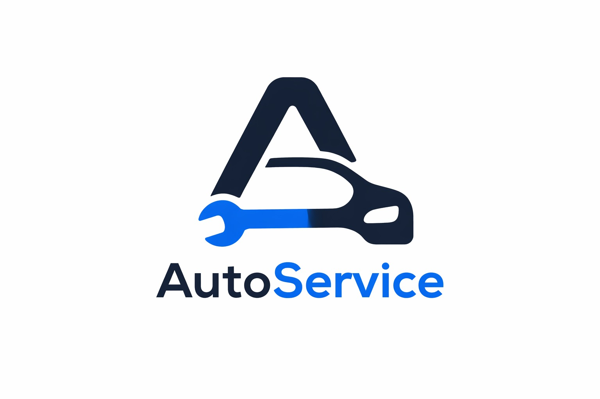</th>
    <th style="text-align: center;"></th>
    <th style="text-align: center;"></th>
    <th style="text-align: center;"></th>
  </tr>
  <tr>
    <td rowspan="2" style="vertical-align: middle; font-weight: bold;">Perfil</td>
    <td>Overview</td>
    <td><i>AutoService es una plataforma web tipo SaaS diseñada para digitalizar la gestión de talleres automotrices y mejorar la transparencia del servicio mediante el seguimiento en tiempo real del estado de los vehículos.
La plataforma permite a mecánicos y talleres gestionar clientes, vehículos, órdenes de trabajo y pagos en un entorno centralizado, mientras que el cliente final puede acceder al sistema para visualizar el progreso de su vehículo, los trabajos realizados y los costos asociados.</i></td>
    <td><i>Shopmonkey es una plataforma digital de gestión para talleres automotrices basada en la nube, diseñada para centralizar y optimizar las operaciones del negocio en un solo sistema. Permite a los talleres administrar procesos clave como la programación de citas, gestión de clientes, órdenes de trabajo, facturación, inventario y comunicación con clientes</i></td>
    <td><i>Esta plataforma permiten registrar clientes, vehículos, órdenes de trabajo, inventario y pagos, centralizando la información en un solo sistema accesible desde cualquier dispositivo. Se caracterizan por ser herramientas prácticas, enfocadas en digitalizar procesos básicos del taller y reemplazar métodos tradicionales como cuadernos o Excel.</i></td>
    <td><i>AutoLeap es un software de gestión para talleres automotrices basado en la nube que permite administrar de forma integral las operaciones del negocio, incluyendo órdenes de trabajo, clientes, inventario, facturación, comunicación y reportes</i></td>
  </tr>
  <tr>
    <td>Ventaja competitiva<br>¿Qué valor ofrece a los clientes?</td>
    <td><i>Enfoque en la transparencia y el cliente final como usuario activo<br>
      <li>Para el taller: organización total del negocio, control de órdenes y procesos,mejora en la comunicación, incremento de confianza.</li>
      <li>Para el cliente: Seguimiento en tiempo real del vehículo, transparencia en trabajos y costos, reducción de incertidumbre, mayor confianza en el servicio.</li>
      <li>Para la plataforma (negocio): Ingreso recurrente (SaaS), comisión por servicios,escalabilidad</li>
    </i></td>
    <td><i>Ofrece una solución “todo en uno” que centraliza todas las operaciones del taller en una sola plataforma. Esto significa que, a diferencia de sistemas tradicionales o herramientas separadas. 
    <li>Integra gestión, facturación, clientes y pagos</li>
    <li>Automatiza procesos operativos</li>
    <li>Reduce errores y tiempo de trabajo</i></li></td>
    <td><i>
        <li>Simplicidad y accesibilidad para talleres pequeños</li>
        <li>Fácil de usar (no requiere conocimientos técnicos)</li>
        <li>Acceso desde celular (muy importante en LATAM)</li>
        <li>Implementación rápida</li></i></td>
    <td><i>Plataforma integral con enfoque en automatización y crecimiento del negocio
        <li>Eficiencia operativa<li>
        Gestión centralizada de todo el taller
        Automatización de tareas repetitivas
        <li>Crecimiento del negocio</li>
        Herramientas de marketing integradas
        Reportes de rendimiento y rentabilidad
        <li>Mejora en servicio al cliente</li>
        Comunicación digital (SMS, email)
        Inspecciones digitales con fotos/videos
    </i></td>
  </tr>
  <tr>
    <td rowspan="2" style="vertical-align: middle; font-weight: bold;">Perfil de Marketing</td>
    <td>Mercado objetivo</td>
    <td><i>
        <li>Mecánicos independientes</li>
         Baja digitalización
        Necesidad de orden y control
        <li>Talleres automotrices PYMEs</li>
        Flujo constante de clientes
        Necesidad de gestión y control
        <li>Clientes finales (dueños de vehículos)</li>
        Buscan confianza y transparencia
    </i></td>
    <td><i>Shopmonkey está dirigido principalmente a:
      <li>Talleres automotrices medianos y grandes</li>
      <li>Negocios en crecimiento que buscan digitalizarse</li>
      <li>Talleres especializados (llantas, aceite, flotas, etc.)</li>
      Apunta a negocios formales con capacidad de pago, no tanto a mecánicos informales.</i></td>
    <td><i>
        <li>Mecánicos independientes</li>
        <li>Talleres pequeños (1–5 personas)</li>
        <li>Negocios informales o en proceso de digitalización</li>
    </i></td>
    <td><i>
        <li>Talleres automotrices medianos y grandes</li>
        <li>Negocios en crecimiento que buscan escalar</li>
        <li>Empresas con múltiples sedes o franquicias</li>
    </i></td>
  </tr>
  <tr>
    <td>Estrategias de Marketing</td>
    <td><i>
        <li>Marketing digital</li>
        <li>Enfoque en dolor real</li>
        <li>Modelo freemium</li>
        <li>Estrategia local (clave en LATAM)</li>
    </i></td>
    <td><i><li>Marketing digital (SaaS): demos online y prueba del sistema</li>
           <li>Posicionamiento como solución “todo en uno”</li>
           <li>Contenido educativo (blogs, guías, recursos)</li>
           <li>Enfoque en beneficios:
           <ul>
            <li>aumento de ingresos</li>
            <li>eficiencia</li>
            <li>satisfacción del cliente</li>
           </ul>
           </li>
          </i></td>
    <td><i>
        <li>Marketing digital básico (redes sociales, anuncios simples)<li>
        <li>Pruebas gratuitas o versiones freemium</li>
        <li>Enfoque en dolor real: Deja la libreta, Organiza tu taller</li>
        <li>Uso de WhatsApp como canal de contacto</li>
        <li>Promoción por recomendaciones (boca a boca)</li>
    </i></td>
    <td><i>
        <li>Demos personalizadas para captar clientes</li>
        <li>Enfoque en resultados: aumento de ingresos, eficiencia operativa</li>
        <li>Marketing de contenido (blogs, recursos, ROI calculators)</li>
        <li>Upselling de servicios adicionales (marketing suite, AI receptionist)</li>
    </i></td>
  </tr>
  <tr>
    <td rowspan="3" style="vertical-align: middle; font-weight: bold;">Perfil de producto</td>
    <td>Productos & Servicios</td>
    <td><i>
        <li>Gestión del taller
        Registro de clientes
        Registro de vehículos
        Órdenes de trabajo
        Historial por vehículo
        <li>Operación
        Estados del servicio (tracking)
        Asignación de tareas
        Diagnóstico y solución</li>
        <li>Experiencia del cliente:
        Acceso con código
        Seguimiento en tiempo real
        Visualización de costos
        Notificaciones
        <li>Negocio:
        Registro de pagos
        Generación de comprobantes (API)
        Reportes y dashboard</li>
        <li>Futuro (diferenciación)
        IA para explicación de trabajos
        Notificaciones automáticas
        App móvil</li>
    </i></td>
    <td><i>Gestión de clientes y vehículos, órdenes de trabajo, facturación y pagos integrados, inspecciones digitales, reportes y analítica, comunicación por SMS y email, integraciones (QuickBooks, CARFAX, etc.)</i></td>
    <td><i>
        <li>Registro de clientes y vehículos</li>
        <li>Órdenes de trabajo</li>
        <li>Cotizaciones y presupuestos</li>
        <li>Control de inventario</li>
        <li>Gestión de pagos</li>
        <li>Historial de servicios</li>
        <li>Recordatorios y notificaciones</li>
    </i></td>
    <td><i>
        <li>Órdenes de trabajo (Repair Orders)</li>
        <li>Gestión de clientes y vehículos</li>
        <li>Facturación y pagos integrados</li>
        <li>Inspecciones digitales (con fotos, videos, notas)</li>
        <li>Gestión de inventario y proveedores</li>
        <li>Reportes y dashboards en tiempo real</li>
        <li>CRM y comunicación con clientes</li>
    </i></td>
  </tr>
  <tr>
    <td>Precios & Costos</td>
    <td><i>
      <li>Free: Funcionalidades básicas, hasta cierto número de vehículos</li>
      <li>Pro (S/29–49 mensual):
        Vehículos ilimitados, historial completo, notificaciones</li>
      <li>Business (S/79–149 mensual): Gestión de staff, reportes avanzados</li>
    </i></td>
    <td><i>
    Planes aproximados:
      - Desde $179/mes (básico)
      - Hasta $400+ /mes (avanzado)
      - Costos adicionales:
      usuarios extra,
      add-ons (CRM, herramientas avanzadas)
    </i></td>
    <td><i>
        <li>Freemium (versión gratuita limitada)</li>
        <li>Planes económicos (≈ $5 – $30 USD / mes)</li>
        <li>Algunos modelos: Pago unico, Plan "fundador" o acceso inicial gratuito</li>
    </i></td>
    <td><i>Essentials: ~ $199/mes
        Pro: ~ $349/mes
        Elite: ~ $449/mes
        Enterprise: precio personalizado</i></td>
  </tr>
  <tr>
    <td>Canales de distribución<br>(Web y/o Móvil)</td>
    <td><i>
        <li>Plataforma web (principal)</li>
        <li>Acceso desde móvil y desktop</li>
        <li>Modelo de suscripción online</li>
        <li>Redes sociales y marketing digital</li>
        <li>Venta directa a talleres</li>
    </i></td>
    <td><i>
      <>Plataforma web (cloud-based)
      <li>Aplicaciones móviles (iOS y Android)</li>
      <li>Venta directa online (demo + suscripción)</li>
      <li>Soporte digital (chat, email, onboarding)</li></i></td>
    <td><i>Aplicaciones móviles (Android principalmente)
           Descarga directa o acceso online
           Canal principal:
           móvil (smartphone)</i></td>
    <td><i>
        <li>Plataforma web (cloud-based)</li>
        <li>Acceso desde desktop, tablet y móvil</li>
        <li>Venta directa online (demo + suscripción)</li>
        <li>Soporte digital (chat, email, onboarding)</li>
    </i></td>
  </tr>
  <tr>
    <td rowspan="4" style="vertical-align: middle; font-weight: bold;">Analisis SWOT</td>
    <td>Fortalezas</td>
    <td><i>
        <li>Diferenciación clara (tracking + cliente)</li>
        <li>Enfoque en confianza</li>
        <li>Modelo híbrido (SaaS + comisión)</li>
        <li>Adaptado a LATAM</li>
    </i></td>
    <td><i>
        <li>Plataforma completa (todo en uno)</li>
        <li>Automatización de procesos</li>
        <li>Integraciones con herramientas externas</li>
        <li>Mejora eficiencia y rentabilidad</li>
        <li>Enfoque en crecimiento del negocio</li></i></td>
    <td><i>
        <li>Fácil de usar</li>
        <li>Bajo costo</li>
        <li>Accesible desde celular</li>
        <li>Ideal para pequeños talleres</li>
        <li>Implementación rápida</li>
    </i></td>
    <td><i>
        <li>Plataforma completa (todo en uno)</li>
        <li>Funcionalidades avanzadas (IA, inspecciones digitales)</li>
        <li>Alta automatización</li>
        <li>Escalable (multi-sede, enterprise)</li>
    </i></td>
  </tr>
  <tr>
    <td>Debilidades</td>
    <td><i>
        <li>Marca nueva (sin posicionamiento)</li>
        <li>Recursos limitados (startup)</li>
        <li>Dependencia de adopción tecnológica</li>
        <li>Funcionalidades iniciales limitadas (MVP)</li>
    </i></td>
    <td><i>
      <li>Alto costo para pequeños talleres</li>
      <li>Curva de aprendizaje (muchas funciones)</li>
      <li>Puede ser complejo para usuarios no técnicos</li>
      <li>Dependencia de configuración inicial</li>
    </i></td>
    <td><i>
        <li>Funcionalidades limitadas</li>
        <li>Poca escalabilidad</li>
        <li>No integra procesos complejos</li>
        <li>Baja diferenciación</li>
        <li>En muchos casos, interfaz básica</li>
    </i></td>
    <td><i>
        <li>Alto costo (no accesible para pequeños talleres)</li>
        <li>Complejidad del sistema</li>
        <li>Implementación más exigente</li>
        <li>Dependencia de configuración inicial</li>
    </i></td>
  </tr>
  <tr>
    <td>Oportunidades</td>
    <td><i>
        <li>Baja digitalización en talleres LATAM</li>
        <li>Alta desconfianza del cliente (problema real)</li>
        <li>Crecimiento del SaaS</li>
        <li>Integración con IA e IoT</li>
    </i></td>
    <td><i>
      <li>Crecimiento del mercado de digitalización automotriz</li>
      <li>Expansión a nuevos países (LATAM, Asia)</li>
      <li>Integración con nuevas tecnologías (IA, IoT)</li>
      <li>Mayor demanda de soluciones en la nube</li>
    </i></td>
    <td><i>
        <li>Crecimiento de digitalización en LATAM</li>
        <li>Gran cantidad de talleres informales</li>
        <li>Integración con pagos digitales</li>
        <li>Evolución hacia plataformas más completas</li>
    </i></td>
    <td><i>
        <li>Crecimiento de digitalización del sector automotriz</li>
        <li>Expansión a mercados emergentes (LATAM)</li>
        <li>Integración con IA e IoT</li>
        <li>Mayor demanda de soluciones SaaS</li>
    </i></td>
  </tr>
  <tr>
    <td>Amenazas</td>
    <td><i>
        <li>Competidores internacionales fuertes</li>
        <li>Apps simples más baratas</li>
        <li>Resistencia al cambio</li>
        <li>Uso de métodos tradicionales (Excel, papel)</li>
    </i></td>
    <td><i>
      <li>Nuevos competidores más simples y baratos</li>
      <li>Soluciones locales adaptadas a LATAM</li>
      <li>Resistencia al cambio (talleres tradicionales)</li>
      <li>Herramientas más simples (Excel, apps básicas)</li>
    </i></td>
    <td><i>
        <li>Competidores más completos (como Shopmonkey)</li>
        <li>Nuevas startups más innovadoras</li>
        <li>Resistencia al cambio tecnológico</li>
        <li>Uso de soluciones gratuitas (Excel, papel)</li>
    </i></td>
    <td><i>
        <li>Competidores más económicos y simples</li>
        <li>Soluciones locales adaptadas a pequeños talleres</li>
        <li>Resistencia al cambio tecnológico</li>
    </i></td>
  </tr>
</table>
</div>

---

#### 2.1.2. Estrategias y tácticas frente a competidores

<p align="justify">Nuestro producto adoptará una estrategia competitiva basada en la diferenciación a través de la transparencia del servicio y la integración del cliente en el proceso, respondiendo a las limitaciones actuales del mercado, donde predominan soluciones centradas únicamente en la gestión interna.</p>
<ol>
<li>Diferenciarnos mediante la transparencia del servicio

  <p align="justify">Muchos sistemas actuales se enfocan en la gestión interna del taller, dejando de lado la experiencia del cliente y generando incertidumbre durante el proceso del servicio.
  Para aprovechar esta oportunidad, AutoService se centrará en brindar visibilidad completa al cliente sobre el estado de su vehículo.</p>
  <ul>
    <li>Implementar seguimiento en tiempo real del vehículo</li>
    <li>Mostrar estados claros del servicio (pendiente, en proceso, finalizado)</li>
    <li>Visualizar trabajos realizados y costos asociados</li>
    <li>Incorporar notificaciones automáticas al cliente</li>
  </ul>
</li>

<li>Generar una experiencia simple e intuitiva para el usuario

  <p align="justify">Algunas soluciones del mercado pueden resultar complejas o poco accesibles para usuarios con bajo nivel tecnológico, dificultando su adopción.
  AutoService prioriza la facilidad de uso para garantizar una rápida implementación y aceptación.</p>
  
  <ul>
  <li>Diseño de interfaz clara y amigable</li>
  <li>Navegación sencilla y estructurada</li>
  <li>Acceso rápido a funciones principales</li>
  <li>Optimización para dispositivos móviles</li>
  </ul>
</li>

<li>Facilitar la digitalización de talleres pequeños y medianos

  <p align="justify">Muchos talleres enfrentan barreras para adoptar herramientas digitales debido a costos o complejidad.
AutoService busca reducir estas barreras y fomentar la digitalización del sector.</p>
  
  <ul>
  <li>Plan gratuito para nuevos usuarios</li>
  <li>Planes escalables según el crecimiento del taller</li>
  <li>Capacitación básica y guías de uso</li>
  <li>Implementación rápida sin necesidad de conocimientos técnicos</li>
  </ul>
</li>


<li>Aprovechar el crecimiento de la digitalización en el sector automotriz

  <p align="justify">El mercado presenta una tendencia creciente hacia el uso de herramientas digitales para la gestión de negocios.
AutoService se posiciona como una solución moderna alineada a esta transformación.</p>
  
  <ul>
  <li>Promoción del uso de tecnología en talleres</li>
  <li>Difusión en redes sociales y canales digitales</li>
  <li>Demostraciones del sistema en entornos reales</li>
  <li>Enfoque en beneficios como eficiencia y control</li>
  </ul>
</li>


<li>Fortalecer la confianza del cliente final

  <p align="justify">Uno de los principales problemas del sector es la desconfianza del cliente debido a la falta de información.
Se busca transformar esta percepción mediante transparencia y comunicación.</p>
  
  <ul>
  <li>Acceso del cliente al sistema mediante código único</li>
  <li>Información clara y detallada del servicio</li>
  <li>Reducción de dependencia de llamadas o mensajes</li>
  <li>(Futuro) evidencia visual del trabajo realizado</li>
  </ul>
</li>

<li>Diferenciarnos por el valor ofrecido y no solo por funcionalidades

  <p align="justify">Más allá de ofrecer herramientas de gestión, AutoService se enfoca en brindar una experiencia completa tanto para el taller como para el cliente.</p>
  
  <ul>
  <li>Integración del cliente en el proceso</li>
  <li>Mejora de la comunicación entre ambas partes</li>
  <li>Enfoque en confianza y transparencia</li>
  <li>Evolución continua del sistema con nuevas funcionalidades</li>
  </ul>
</li>

<li>Aprovechamiento de la baja digitalización en LATAM

  Captar talleres que aún no usan sistemas digitales
  
  <ul>
  <li>Campañas educativas (“digitaliza tu taller”)</li>
  <li>Demostraciones prácticas</li>
  <li>Uso de redes sociales y WhatsApp</li>

  </ul>
</li>

</ol>

---

### 2.2. Entrevistas

#### 2.2.1. Diseño de entrevistas

<strong>SEGMENTO 1: Mecánicos Independientes</strong>
<ol>
  <li>¿Cuánto tiempo llevas trabajando como mecánico? ¿Podrías contarme cómo es un día típico en tu trabajo dentro del taller?</li>
  <li>¿Cómo registras actualmente la información de tus clientes, vehículos y trabajos?</li>
  <li>¿Cuáles son los principales problemas que enfrentas al gestionar los trabajos del taller?</li>
  <li>¿Cómo informas a tus clientes sobre el estado de sus vehículos?</li>
  <li>¿Qué tan seguido te llaman o escriben clientes para preguntar por el estado de su auto?</li>
  <li>¿Crees que tus clientes confían en el servicio que brindas? ¿Por qué?</li>
  <li>¿Llevas un historial de los trabajos realizados por vehículo o cliente?</li>
  <li>Si existiera una plataforma que te ayude a organizar tus trabajos y mostrar el progreso al cliente, ¿la usarías? ¿Por qué?</li>
  <li>¿Qué funcionalidad te sería más útil en una herramienta digital para tu trabajo diario?</li>
</ol>

<strong>SEGMENTO 2: Talleres Automotrices - Empresas</strong>
<ol>
  <li>¿Cuántas personas trabajan en su taller y cómo están organizadas sus funciones?</li>
  <li>¿Cómo gestionan actualmente los clientes, vehículos y órdenes de trabajo?</li>
  <li>¿Qué problemas tienen al coordinar el trabajo entre mecánicos o áreas?</li>
  <li>¿Cómo hacen seguimiento al estado de cada vehículo en reparación?</li>
  <li>¿Tienen algún sistema para medir ingresos, servicios realizados o rendimiento del taller?</li>
  <li>¿Cómo se comunican con los clientes sobre el avance del servicio?</li>
  <li>¿Han tenido problemas de desconfianza o reclamos por parte de clientes?</li>
  <li>Si existiera un sistema que te permita gestionar tu taller y mostrar a tus clientes el progreso en tiempo real, ¿lo usarías?</li>
  <li>¿Qué funcionalidades consideras indispensables en un sistema de gestión para talleres?</li>
</ol>

<strong>SEGMENTO 3: Clientes - Propietarios de vehículos</strong>
<ol>
  <li>¿Podrías contarme sobre la última vez que llevaste tu vehículo a un taller? ¿Qué servicio necesitabas?</li>
  <li>Durante el servicio, ¿cómo te informaban sobre el estado de tu vehículo?</li>
  <li>¿Tuviste alguna duda o preocupación mientras tu auto estaba en el taller? ¿Cuál fue?</li>
  <li>¿Alguna vez has sentido desconfianza hacia un taller? ¿Qué situación generó eso?</li>
  <li>¿Te gustaría poder ver el progreso de la reparación de tu auto en tiempo real desde tu celular o computadora? ¿Por qué?</li>
  <li>¿Qué tipo de información te gustaría ver mientras tu vehículo está en el taller?</li>
  <li>¿Qué tan cómodo te sientes usando plataformas digitales o aplicaciones para consultar información de servicios?</li>
  <li>Si existiera una plataforma que te permita ver el estado de tu vehículo, costos y trabajos realizados, ¿la usarías? ¿Qué te gustaría que incluya?</li>
</ol>


#### 2.2.2. Registro de entrevistas

#### Entrevista 1: Técnico Independiente

- **Nombre:** Fray Diaz Palomino
- **Edad:** 38
- **Residencia:** Ayacucho, Huamanga 
- **Ocupación:** Técnico Mecánico Automotriz  

- **Inicio:** 0:33  
- **Duración:** 8:30  

**Link:**  
[Ver video]()

---
**Resumen:**

El entrevistado Gurmecindo de 55 años con aproximadamente 35 años de experiencia, residente en San Juan Bautista, Ayacucho. Su trabajo se centra en la reparación de motores y mantenimiento general de vehículos. En su día a día, realiza diversas tareas mecánicas dependiendo de las fallas que presentan los autos. Actualmente, gestiona la información de sus clientes y vehículos de forma manual, utilizando cuadernos y actas de control donde registra datos como la hora de ingreso, la placa y el tipo de trabajo. En cuanto a la comunicación, suele llamar a los clientes cuando el vehículo está listo o también recibe llamadas de ellos para consultar el estado. Señala que sus clientes confían en su servicio debido a la garantía y puntualidad que ofrece, y sí mantiene un historial de trabajos de manera escrita. Frente a la propuesta de una plataforma digital, muestra una actitud positiva y considera que es necesaria en la actualidad para mejorar la gestión, destacando como funcionalidad importante la incorporación de herramientas como escáner automotriz para diagnosticar fallas electrónicas, lo que facilitaría y modernizaría su trabajo diario.

---

**Evidencia:**

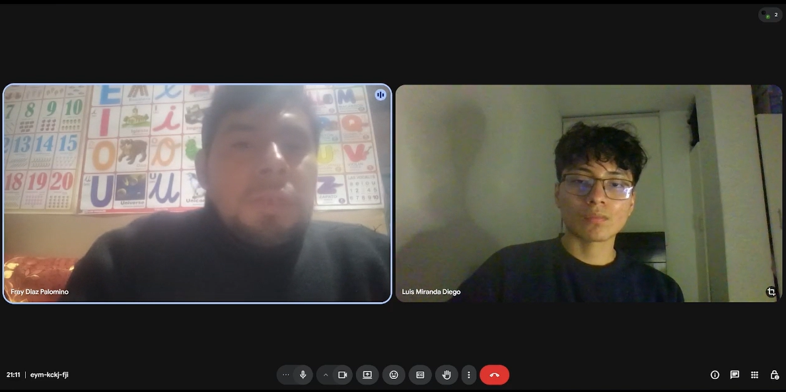

#### Entrevista 2: Técnico Independiente

- **Nombre:** Gurmencindo Ventura
- **Edad:** 55
- **Residencia:** Ayaacucho, Huamanga - San Juan Bautista
- **Ocupación:** Técnico Automotriz  

- **Inicio:** 0:38  
- **Duración:** 5:29  

**Link:**  
[Ver video](https://upcedupe-my.sharepoint.com/:v:/g/personal/u20241d185_upc_edu_pe/IQC3R-wNkI7tQZ07-wGLrqBvAUckZJvae4x3Gvydyx-kgVk?e=MSpswt)

---
**Resumen:**

El entrevistado Gurmecindo de 55 años con aproximadamente 35 años de experiencia, residente en San Juan Bautista, Ayacucho. Su trabajo se centra en la reparación de motores y mantenimiento general de vehículos. En su día a día, realiza diversas tareas mecánicas dependiendo de las fallas que presentan los autos. Actualmente, gestiona la información de sus clientes y vehículos de forma manual, utilizando cuadernos y actas de control donde registra datos como la hora de ingreso, la placa y el tipo de trabajo. En cuanto a la comunicación, suele llamar a los clientes cuando el vehículo está listo o también recibe llamadas de ellos para consultar el estado. Señala que sus clientes confían en su servicio debido a la garantía y puntualidad que ofrece, y sí mantiene un historial de trabajos de manera escrita. Frente a la propuesta de una plataforma digital, muestra una actitud positiva y considera que es necesaria en la actualidad para mejorar la gestión, destacando como funcionalidad importante la incorporación de herramientas como escáner automotriz para diagnosticar fallas electrónicas, lo que facilitaría y modernizaría su trabajo diario.

---

**Evidencia:**


#### Entrevista 3: Técnico Independiente

- **Nombre:** Antenor Ayala 
- **Edad:** 33
- **Residencia:** Ayacucho, Huamanga  
- **Ocupación:** Técnico Mecánico Automotriz  

- **Inicio:** 0:25  
- **Duración:** 9:11  

**Link:**  
[Ver video](https://upcedupe-my.sharepoint.com/:v:/g/personal/u20241d185_upc_edu_pe/IQCxbUZ3D94sQa4L_R0U-pTLAeS4IIX60VMV6GW0RGncMMA?e=mN7UdR)

---
**Resumen:**

El entrevistado Antenor Ayala, un mecánico automotriz de 33 años residente en Huamanga, con aproximadamente 5 años de experiencia en el rubro. Describe que su trabajo diario varía entre resolver fallas simples y complejas, comenzando con la recepción del cliente y el diagnóstico del problema, el cual a veces difiere de lo que el cliente cree. Lleva el registro de los trabajos de forma manual en un cuaderno, lo que puede generar desorganización. Señala que uno de los principales problemas que enfrenta es la gestión de clientes, ya que existen diferentes tipos de comportamientos y expectativas, además de que reconoce que en ocasiones pueden ocurrir errores humanos debido al cansancio o problemas personales. En cuanto a la comunicación, indica que antes tenía dificultades por no informar adecuadamente los cambios realizados, lo que generaba desconfianza, pero ahora busca mejorar avisando previamente o mostrando evidencias como fotos o videos. También menciona que algunos clientes llaman con mucha frecuencia mientras que otros son más independientes. Finalmente, muestra una actitud muy positiva hacia la implementación de una plataforma digital, ya que considera que le ayudaría a organizar mejor sus tareas, mejorar la comunicación, aumentar la confianza con los clientes y gestionar aspectos como horarios, inventario e historial de trabajos, lo que optimizaría su desempeño diario.

---

**Evidencia:**

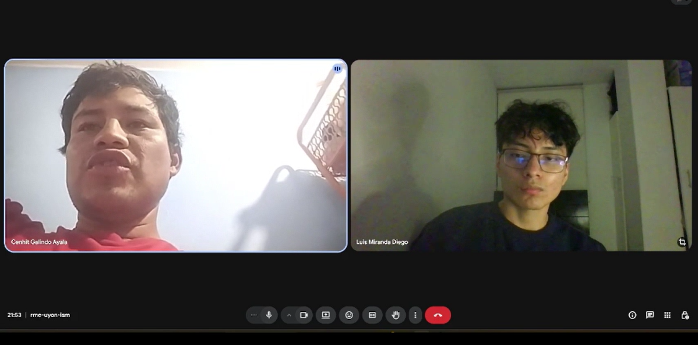


#### Entrevista 4: Administrador de Taller Automotriz

- **Nombre:** Juan Calisaya  
- **Edad:** 30  
- **Residencia:** Santa Anita, Lima  
- **Ocupación:** Propietario y Administrador de Taller Automotriz  

- **Inicio:** 0:05  
- **Duración:** 14:07  

**Link:**  
[Ver video](https://upcedupe-my.sharepoint.com/:v:/g/personal/u20241e299_upc_edu_pe/IQBuwdmTZaBDQ6FwqgTBqd_zAZXoZxFYUA9sZBDB-I4bGyw?e=WVr7u3)

---
**Resumen:**
<p style="text-align: justify;">
El entrevistado Juan Calisaya, de 30 años, es propietario y administrador de un taller automotriz en Santa Anita con más de 5 años de experiencia. Su negocio cuenta con un equipo de 4 trabajadores, donde existen roles diferenciados como mecánicos y personal de apoyo, aunque la distribución de tareas no está completamente formalizada y depende en gran medida de su supervisión directa. Actualmente, la gestión del taller se realiza mediante métodos manuales, principalmente cuadernos y registros en papel, lo que genera desorganización y dificultad para acceder a información histórica. La asignación de trabajos se realiza de manera verbal, lo que ocasiona falta de claridad en las responsabilidades y dependencia constante del administrador. Uno de los principales problemas es la falta de visibilidad sobre el estado de los vehículos en reparación. El seguimiento se realiza consultando directamente a los mecánicos, generando interrupciones frecuentes y retrasos en la atención, además de presión constante por parte de los clientes. En cuanto a la comunicación, el taller utiliza llamadas telefónicas y WhatsApp, lo que obliga al administrador a actuar como intermediario, generando demoras y sobrecarga de trabajo. A nivel administrativo, no cuentan con herramientas digitales para controlar ingresos, egresos ni inventario, lo que dificulta la trazabilidad de gastos y puede generar desbalances. Asimismo, la rotación de funciones entre trabajadores por necesidades operativas provoca desorganización interna, aunque el equipo es competente. El entrevistado presenta un nivel básico de adopción tecnológica, valorando herramientas simples como WhatsApp y Yape. Finalmente, muestra una actitud positiva hacia la implementación de un sistema digital que incluya registro de clientes, historial de servicios, asignación de tareas, seguimiento en tiempo real, control financiero e inventario, con el objetivo de mejorar la organización, optimizar el tiempo y fortalecer la confianza con los clientes.
</p>

---

**Evidencia:**


#### Entrevista 5: Administrador y Encargado de Logística de Taller Automotriz

- **Nombre:** Sebastián Rojas  
- **Edad:** 24  
- **Residencia:** Villa El Salvador, Lima  
- **Ocupación:** Administrador y Encargado de Logística de Taller Automotriz  

- **Inicio:** 0:04  
- **Duración:** 10:55  

**Link:**  
[Ver video](https://upcedupe-my.sharepoint.com/:v:/g/personal/u20241e299_upc_edu_pe/IQAn-6pC1Ur6TbGWsrSbHCfUATVeVUjKORt507XsjZzhAKU?e=zj8iCk)

---

**Resumen:**
<p style="text-align: justify;">
El entrevistado Sebastián Rojas, de 24 años, se desempeña como administrador y encargado de logística en un taller automotriz con un equipo de 6 personas, donde las funciones están distribuidas según especialidad. La gestión actual combina registros en papel y Excel, lo que permite cierto orden, pero resulta limitado ante el crecimiento del volumen de trabajo. Uno de los principales problemas es la falta de coordinación entre áreas, especialmente entre mecánicos y almacén, generando cuellos de botella y dependencia del administrador para validar procesos. El seguimiento de los vehículos se realiza mediante un pizarrón físico, pero al no actualizarse constantemente, se requiere comunicación directa frecuente, lo que reduce la eficiencia. La comunicación con los clientes se da principalmente por llamadas y WhatsApp, enviando ocasionalmente fotos, pero esto genera desconfianza cuando no hay claridad en los avances o cambios en los costos. Además, el control de ingresos e inventario es básico, lo que limita el análisis del rendimiento del negocio. El entrevistado muestra interés en implementar un sistema digital que permita gestionar órdenes de trabajo, controlar inventario, visualizar el estado de los vehículos en tiempo real y generar reportes, con el objetivo de mejorar la organización, optimizar el tiempo y aumentar la transparencia con los clientes.
</p>

---a

**Evidencia:**


#### 2.2.3. Análisis de entrevistas

<p align="justify">
A partir de las entrevistas realizadas a los segmentos objetivo (mecánicos independientes y administradores/encargados de logística en talleres automotrices), se han identificado patrones clave, puntos de dolor recurrentes y necesidades que validan la propuesta de valor de <b>AutoService</b>:
</p>

<ul style="text-align: justify; margin-top: 0.5em; margin-bottom: 1.5em; padding-left: 1.5em;">
  <li style="margin-bottom: 0.8em;">
    <strong>Gestión operativa manual y descentralizada:</strong> La totalidad de los entrevistados depende parcial o totalmente de métodos tradicionales (cuadernos, pizarras físicas, hojas de papel o Excel básico) para registrar ingresos de vehículos, datos de clientes y órdenes de trabajo. Esto provoca desorganización, dificultad para rastrear historiales y cuellos de botella en la operación diaria.
  </li>
  <li style="margin-bottom: 0.8em;">
    <strong>Fricción constante en la comunicación y seguimiento:</strong> El flujo de información actual es ineficiente. Los clientes llaman o escriben frecuentemente (vía WhatsApp) para conocer el estado de sus vehículos, lo que interrumpe el trabajo técnico de los mecánicos. En talleres con más personal, el administrador se convierte en un intermediario saturado entre el técnico y el cliente.
  </li>
  <li style="margin-bottom: 0.8em;">
    <strong>Falta de visibilidad interna en tiempo real:</strong> Los administradores y encargados de logística carecen de un panorama actualizado sobre el progreso de las reparaciones. Para conocer el estado de un vehículo, deben interrumpir a los mecánicos y consultarles verbalmente, lo que retrasa la atención y genera descoordinación entre áreas (ej. taller y almacén de repuestos).
  </li>
  <li style="margin-bottom: 0.8em;">
    <strong>Desconfianza originada por falta de transparencia:</strong> La incapacidad de comunicar de forma estructurada los diagnósticos, avances y posibles cambios en los costos genera incertidumbre en el cliente final. Aunque los mecánicos intentan mitigar esto enviando fotos o videos de forma manual, reconocen que es un proceso tedioso que necesita optimización.
  </li>
  <li style="margin-bottom: 0.8em;">
    <strong>Deficiencia en el control administrativo y logístico:</strong> La mayoría de los talleres entrevistados carece de herramientas especializadas para controlar el inventario, registrar ingresos/egresos de forma detallada o medir la productividad del personal, limitando su capacidad de crecimiento y análisis de rentabilidad.
  </li>
  <li style="margin-bottom: 0.8em;">
    <strong>Alta disposición hacia la digitalización:</strong> A pesar de manejar procesos tradicionales, todos los entrevistados mostraron una actitud sumamente receptiva hacia la adopción de un sistema digital. Identifican como indispensable contar con historiales de vehículos, asignación clara de tareas, seguimiento de estados en tiempo real y automatización de la comunicación para modernizar sus talleres y fortalecer la confianza de sus clientes.
  </li>
</ul>

---

### 2.3. Needfinding

#### 2.3.1. User Personas

#### User Persona 1: Mechanic

Perfil de un mecánico que trabaja en talleres automotrices y requiere una gestión eficiente de órdenes de servicio.

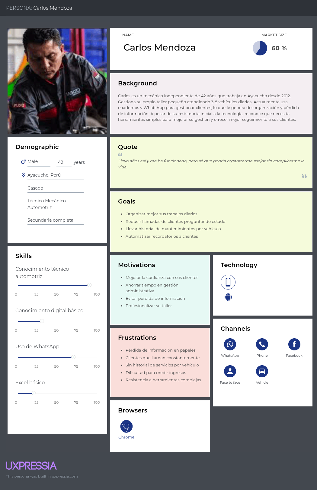


#### User Persona 2: Workshop Manager

Perfil de un administrador de taller que gestiona operaciones, personal y flujo de trabajo.

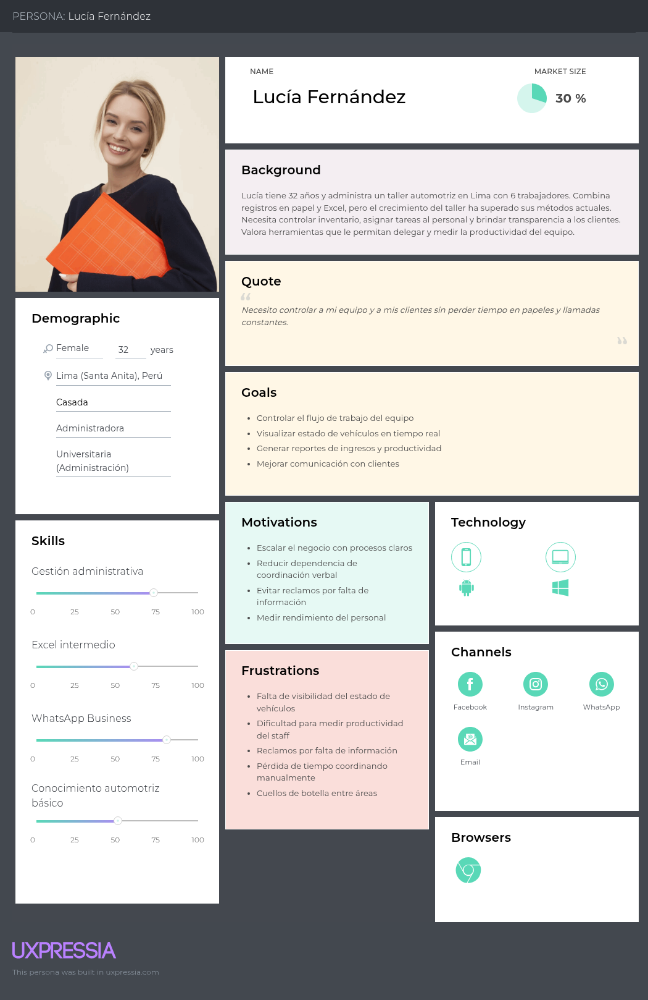


#### User Persona 3: Vehicle Owner

Perfil de un cliente que busca servicios automotrices rápidos, confiables y con seguimiento.

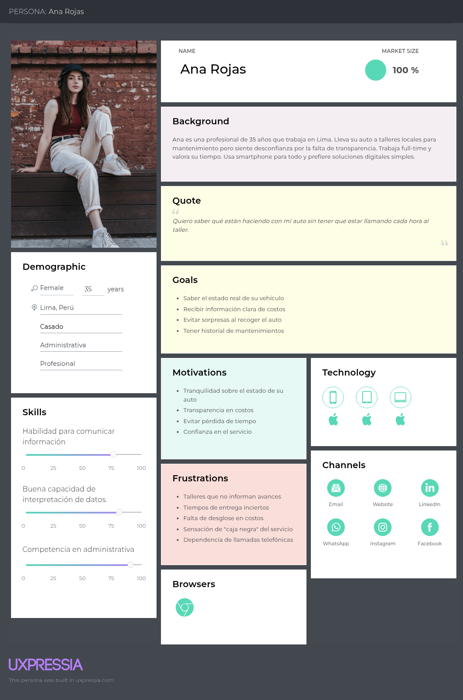

#### 2.3.2. User Task Matrix


<p style="text-align: justify;">
El User Task Matrix presenta de manera consolidada las tareas que realizan los tres User Personas identificados para el proyecto AutoService: Carlos Mendoza (Mecánico Independiente), Lucía Fernández (Administradora de Taller) y Ana Rojas (Cliente/Propietaria de vehículo).
</p>

<p style="text-align: justify;">
Es importante destacar que las tareas descritas en esta matriz representan actividades que los segmentos realizan actualmente en su operación diaria (usando cuadernos, Excel, WhatsApp o llamados telefónicos), independientemente de la existencia de nuestra solución de software. Estas tareas son la base para identificar oportunidades de mejora mediante la digitalización.
</p>

<table>
  <thead>
    <tr>
      <th rowspan="2" style="text-align: center; vertical-align: middle;">User Task<br>(Tarea del Usuario)</th>
      <th colspan="2" style="text-align: center; ">Carlos Mendoza<br>(Mecánico)</th>
      <th colspan="2" style="text-align: center; ">Lucía Fernández<br>(Administradora)</th>
      <th colspan="2" style="text-align: center; ">Ana Rojas<br>(Cliente)</th>
    </tr>
    <tr>
      <th style="text-align: center;">Frecuencia</th>
      <th style="text-align: center;">Importancia</th>
      <th style="text-align: center;">Frecuencia</th>
      <th style="text-align: center;">Importancia</th>
      <th style="text-align: center;">Frecuencia</th>
      <th style="text-align: center;">Importancia</th>
    </tr>
  </thead>
  <tbody>
    <tr><td>Diagnosticar fallas del vehículo</td><td style="text-align:center">Alta</td><td style="text-align:center">Crítica</td><td style="text-align:center">Baja</td><td style="text-align:center">Media</td><td style="text-align:center">Baja</td><td style="text-align:center">Crítica</td></tr>
    <tr><td>Registrar información de clientes y vehículos</td><td style="text-align:center">Alta</td><td style="text-align:center">Crítica</td><td style="text-align:center">Alta</td><td style="text-align:center">Crítica</td><td style="text-align:center">Baja</td><td style="text-align:center">Media</td></tr>
    <tr><td>Gestionar y coordinar tareas del personal</td><td style="text-align:center">Media</td><td style="text-align:center">Alta</td><td style="text-align:center">Alta</td><td style="text-align:center">Crítica</td><td style="text-align:center">N/A</td><td style="text-align:center">N/A</td></tr>
    <tr><td>Comunicar el estado de la reparación al cliente</td><td style="text-align:center">Alta</td><td style="text-align:center">Crítica</td><td style="text-align:center">Alta</td><td style="text-align:center">Crítica</td><td style="text-align:center">Media</td><td style="text-align:center">Alta</td></tr>
    <tr><td>Realizar seguimiento al progreso del servicio</td><td style="text-align:center">Alta</td><td style="text-align:center">Crítica</td><td style="text-align:center">Alta</td><td style="text-align:center">Crítica</td><td style="text-align:center">Alta</td><td style="text-align:center">Crítica</td></tr>
    <tr><td>Gestionar pagos y facturación</td><td style="text-align:center">Alta</td><td style="text-align:center">Crítica</td><td style="text-align:center">Alta</td><td style="text-align:center">Crítica</td><td style="text-align:center">Baja</td><td style="text-align:center">Crítica</td></tr>
    <tr><td>Programar citas y recepción de vehículos</td><td style="text-align:center">Alta</td><td style="text-align:center">Alta</td><td style="text-align:center">Alta</td><td style="text-align:center">Crítica</td><td style="text-align:center">Baja</td><td style="text-align:center">Alta</td></tr>
    <tr><td>Consultar historial de mantenimientos</td><td style="text-align:center">Media</td><td style="text-align:center">Alta</td><td style="text-align:center">Alta</td><td style="text-align:center">Alta</td><td style="text-align:center">Baja</td><td style="text-align:center">Alta</td></tr>
  </tbody>
</table>

#### Análisis del User Task Matrix

<p style="text-align: justify;">
Al analizar la matriz, se identifican patrones significativos y puntos de dolor compartidos entre los segmentos:</p>

**1. Coincidencias (Puntos Críticos):**
<p style="text-align: justify;">
La tarea de <strong>"Realizar seguimiento al progreso del servicio"</strong> es crítica y de alta frecuencia tanto para Carlos y Lucía (quienes deben gestionarlo) como para Ana (quien necesita saberlo). Actualmente, esta tarea genera fricción: el mecánico pierde tiempo respondiendo llamadas y el cliente siente desconfianza por falta de información. Esto representa una oportunidad central para AutoService: automatizar este seguimiento para reducir la carga administrativa y aumentar la transparencia.</p>

**2. Diferencias por Segmento:**
<ul style="text-align: justify; margin-top: 0.5em; margin-bottom: 1.5em; padding-left: 1.5em;">
  <li><strong>Carlos Mendoza (Operativo):</strong> Sus tareas de mayor importancia giran en torno al diagnóstico técnico y la comunicación directa. Su frecuencia en tareas administrativas complejas (como reportes detallados) es menor, pero su necesidad de simplicidad es máxima para no entorpecer su trabajo manual.</li>
  <li><strong>Lucía Fernández (Gestión):</strong> Tiene una carga crítica en la <strong>coordinación de personal</strong> y la gestión de la información general. A diferencia de Carlos, ella necesita una visión panorámica del taller para delegar tareas, lo cual es un punto de dolor actual debido a la falta de herramientas de control.</li>
  <li><strong>Ana Rojas (Cliente):</strong> Su interacción es más esporádica en frecuencia (lleva el auto ocasionalmente), pero la importancia es crítica. Su principal frustración es la dependencia de llamadas telefónicas para enterarse del estado de su vehículo.</li>
</ul>

**3. Oportunidades para la Solución:**
<p style="text-align: justify;">
Existe una clara oportunidad para digitalizar la <strong>"Comunicación del estado"</strong>. Actualmente, esta tarea consume recursos del taller (tiempo de Carlos y Lucía) y genera insatisfacción en Ana. Al transformar esta tarea manual en una funcionalidad de consulta autónoma (Dashboard para clientes), se reduce la carga operativa para el taller y se satisface la necesidad de transparencia del cliente.</p>


#### 2.3.3. User Journey Mapping


##### Journey Map 1: Mechanic

Representa el flujo de trabajo del mecánico desde la recepción del vehículo hasta la finalización del servicio.

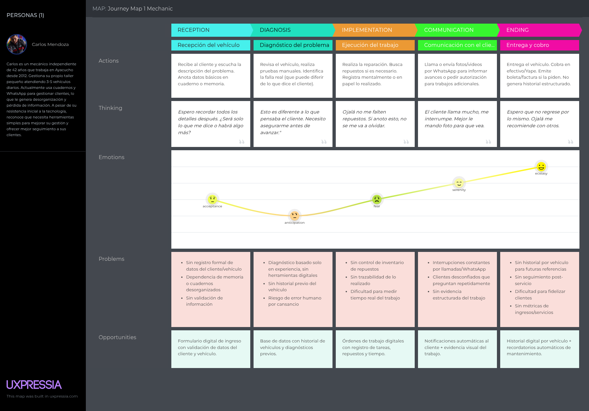


#### Journey Map 2: Workshop Manager

Describe la gestión operativa del administrador del taller y la supervisión de procesos.

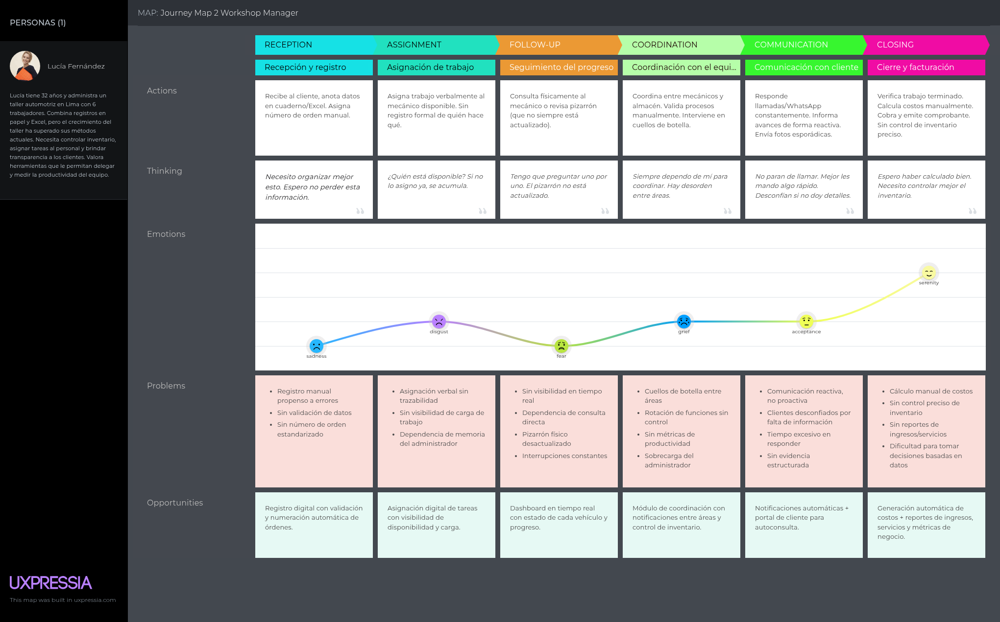


#### Journey Map 3: Vehicle Owner

Muestra la experiencia del cliente al solicitar, seguir y recibir un servicio automotriz.

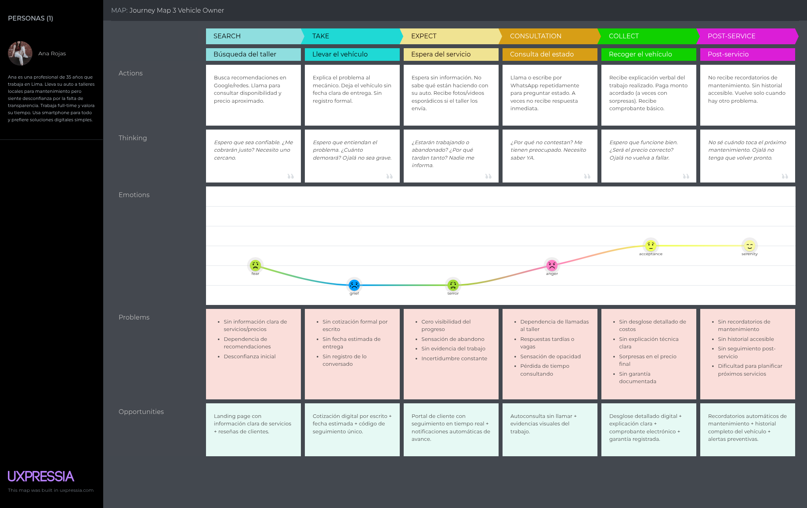


#### 2.3.4. Empathy Mapping


#### Empathy Map 1: Mechanic

Identifica pensamientos, emociones y necesidades del mecánico durante su trabajo.

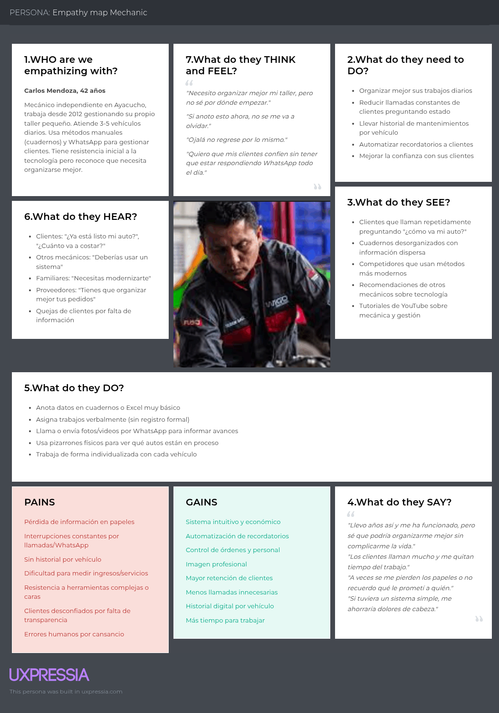


#### Empathy Map 2: Workshop Manager

Refleja las preocupaciones, objetivos y frustraciones del administrador del taller.

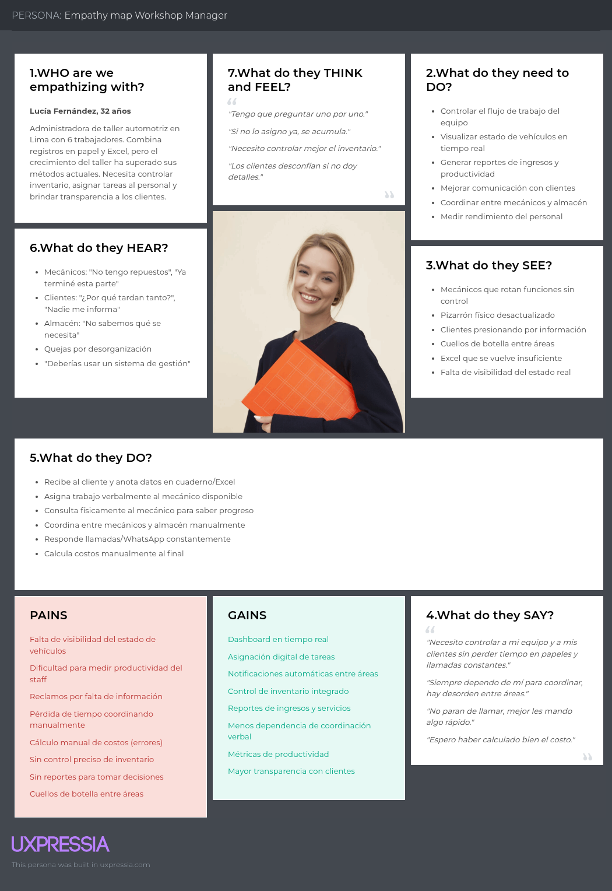


#### Empathy Map 3: Vehicle Owner

Muestra las expectativas, emociones y percepciones del cliente.

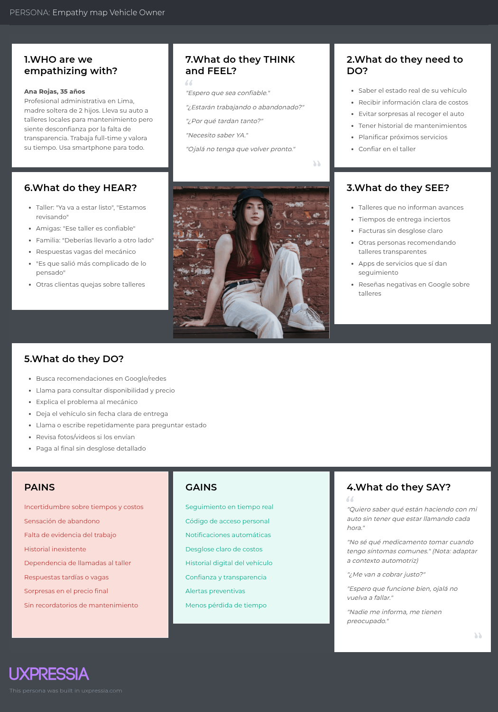


---

### 2.4. Big Picture EventStorming


<p style="text-align: justify;">
En esta sección se presenta el **Big Picture EventStorming**, una técnica colaborativa utilizada para explorar el dominio del negocio de manera visual y de alto nivel. A través de una línea de tiempo horizontal, el equipo ha identificado los eventos significativos (naranjas) que ocurren en el flujo de trabajo de un taller automotriz, las acciones que los desencadenan (comandos azules), los actores involucrados (amarillos) y las reglas de negocio automatizadas (políticas moradas).
</p>

<p style="text-align: justify;">
Este artefacto nos permite comprender la secuencia natural de los procesos, desde la configuración inicial del taller hasta el cierre financiero y la generación de reportes, exponiendo oportunidades de automatización y **"Hotspots"** (puntos de dolor) críticos en la comunicación entre el taller y el cliente.
</p>

> **Nota:** El diagrama a continuación representa la interacción entre los User Personas (Carlos, Lucía y Ana) y el sistema propuesto, siguiendo una línea de tiempo de izquierda a derecha.

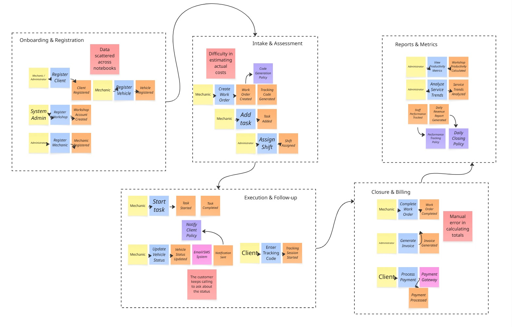

#### Estructura del Flujo (Timeline)

<div style="text-align: justify; line-height: 1.6; margin-top: 1em; margin-bottom: 1.5em;">
<p>Para facilitar la comprensión del modelo, el Event Storming se ha organizado en <strong>5 bloques lógicos</strong> que representan las fases del ciclo de vida del servicio:</p>

<ol style="padding-left: 1.5em; margin-bottom: 1.5em;">
  <li><strong>Onboarding & Registration (Izquierda):</strong><br>
  Inicia con el <strong>System Admin</strong> registrando el taller (<code>Register Workshop</code> → <code>Workshop Account Created</code>). Se registran los actores clave: el <strong>Administrator</strong> o <strong>Mechanic</strong> registran clientes (<code>Client Registered</code>) y el <strong>Mechanic</strong> registra los vehículos (<code>Vehicle Registered</code>).<br>
  <em>Hotspot identificado:</em> <code>Data scattered across notebooks</code> (Datos dispersos en cuadernos), reflejando la desorganización actual.</li>

  <li><strong>Intake & Assessment (Centro-Superior):</strong><br>
  El <strong>Mechanic</strong> crea la orden de trabajo (<code>Create Work Order</code> → <code>Work Order Created</code>). Se aplica una política automática: <code>Code Generation Policy</code> que genera un código de seguimiento (<code>Tracking Code Generated</code>). El mecánico detalla las tareas (<code>Add task</code> → <code>Task Added</code>) y el administrador asigna turnos (<code>Assign Shift</code>).<br>
  <em>Hotspot identificado:</em> <code>Difficulty in estimating actual costs</code> (Dificultad para estimar costos reales), un problema que la digitalización busca resolver.</li>

  <li><strong>Execution & Follow-up (Centro-Inferior):</strong><br>
  El <strong>Mechanic</strong> inicia las tareas (<code>Start task</code> → <code>Task Started</code> → <code>Task Completed</code>). Se actualiza el estado del vehículo (<code>Update Vehicle Status</code> → <code>Vehicle Status Updated</code>).<br>
  <strong>Punto Clave:</strong> Aquí interviene la política <code>Notify Client Policy</code>. Al cambiar el estado, el sistema envía una notificación (<code>Email/SMS System</code> → <code>Notification Sent</code>), manteniendo al cliente informado sin llamadas manuales.<br>
  El <strong>Client</strong> puede consultar el estado ingresando su código (<code>Enter Tracking Code</code> → <code>Tracking Session Started</code>).<br>
  <em>Hotspot identificado:</em> <code>The customer keeps calling to ask about the status</code> (El cliente llama constantemente), resolviendo la frustración de Ana.</li>

  <li><strong>Closure & Billing (Derecha-Inferior):</strong><br>
  El <strong>Mechanic</strong> completa la orden (<code>Complete Work Order</code> → <code>Work Order Completed</code>). El <strong>Administrator</strong> genera la factura (<code>Generate Invoice</code> → <code>Invoice Generated</code>). El <strong>Client</strong> procesa el pago (<code>Process Payment</code> → <code>Payment Processed</code>), interactuando con la <code>Payment Gateway</code>.<br>
  <em>Hotspot identificado:</em> <code>Manual error in calculating totals</code> (Error manual en el cálculo de totales).</li>

  <li><strong>Reports & Metrics (Derecha-Superior):</strong><br>
  El <strong>Administrator</strong> visualiza métricas de productividad (<code>View Productivity Metrics</code> → <code>Workshop Productivity Calculated</code>). Se analizan tendencias de servicio (<code>Analyze Service Trends</code> → <code>Service Trends Analyzed</code>). Se generan reportes diarios de ingresos bajo la <code>Daily Closing Policy</code>.</li>
</ol>

#### Leyenda de Elementos

<p>Para la correcta interpretación del diagrama, se han utilizado los estándares visuales de EventStorming:</p>
<ul style="padding-left: 1.5em; margin-bottom: 1.5em;">
  <li>🟧 <strong>Domain Events (Naranja):</strong> Hechos relevantes que ya ocurrieron en el negocio (ej. <code>Vehicle Status Updated</code>, <code>Invoice Generated</code>).</li>
  <li>🟦 <strong>Commands (Azul):</strong> Acciones o decisiones que inician un proceso (ej. <code>Create Work Order</code>, <code>Process Payment</code>).</li>
  <li>🟨 <strong>Actors (Amarillo):</strong> Usuarios o sistemas que ejecutan los comandos (System Admin, Mechanic, Administrator, Client).</li>
  <li>🟪 <strong>Policies (Morado):</strong> Reglas de negocio o automatizaciones (ej. <code>Notify Client Policy</code>, <code>Code Generation Policy</code>).</li>
  <li>🟥 <strong>External Systems (Rosa fuerte):</strong> Servicios de terceros integrados (Email/SMS System, Payment Gateway).</li>
  <li>🔴 <strong>Hotspots (Rojo claro):</strong> Puntos de dolor o problemas identificados en el proceso actual.</li>
</ul>

#### Hotspots y Oportunidades de Mejora

<p>Durante el modelado, detectamos áreas problemáticas en el proceso actual que justifican la existencia de nuestra solución <strong>AutoService</strong>:</p>
<ol style="padding-left: 1.5em; margin-bottom: 1em;">
  <li><strong>Falta de Transparencia (Bloque Execution):</strong><br>
  <em>Problema:</em> El evento <code>Vehicle Status Updated</code> no llegaba al cliente, generando llamadas constantes.<br>
  <em>Solución:</em> La política <code>Notify Client Policy</code> automatiza la comunicación.</li>

  <li><strong>Desorganización Operativa (Bloque Onboarding/Intake):</strong><br>
  <em>Problema:</em> Datos dispersos en cuadernos y dificultad para estimar costos.<br>
  <em>Solución:</em> Centralización digital y cálculo automático basado en tareas registradas.</li>

  <li><strong>Errores Administrativos (Bloque Closure):</strong><br>
  <em>Problema:</em> Errores manuales al calcular totales de facturas.<br>
  <em>Solución:</em> Generación automática de invoices basada en los servicios completados.</li>
</ol>
</div>


### 2.5. Ubiquitous Language

<p style="text-align: justify;">
Para garantizar una comunicación clara y sin ambigüedades entre los miembros del equipo de desarrollo y los stakeholders del negocio, se ha definido el siguiente glosario de términos (Ubiquitous Language). Estos términos representan los conceptos fundamentales del dominio de la gestión de talleres automotrices.
</p>

<table>
  <thead>
    <tr>
      <th style="text-align: center; vertical-align: middle; ">Término<br>(Inglés)</th>
      <th style="text-align: center; vertical-align: middle; ">Equivalente<br>(Español)</th>
      <th style="text-align: left; vertical-align: middle; ">Definición</th>
    </tr>
  </thead>
  <tbody>
    <tr>
      <td style="text-align: center;"><strong>Work Order</strong></td>
      <td style="text-align: center;">Orden de Trabajo</td>
      <td>Documento digital que registra la solicitud de servicio de un vehículo, incluyendo los trabajos a realizar, los costos estimados y el estado actual del proceso.</td>
    </tr>
    <tr>
      <td style="text-align: center;"><strong>Service Request</strong></td>
      <td style="text-align: center;">Solicitud de Servicio</td>
      <td>Petición inicial realizada por el cliente para el mantenimiento o reparación de su vehículo.</td>
    </tr>
    <tr>
      <td style="text-align: center;"><strong>Mechanic / Technician</strong></td>
      <td style="text-align: center;">Mecánico / Técnico</td>
      <td>Usuario del sistema encargado de ejecutar las tareas técnicas de reparación y diagnóstico en los vehículos.</td>
    </tr>
    <tr>
      <td style="text-align: center;"><strong>Workshop Administrator</strong></td>
      <td style="text-align: center;">Administrador del Taller</td>
      <td>Usuario responsable de gestionar las órdenes de trabajo, asignar tareas al personal, controlar inventarios y gestionar la facturación.</td>
    </tr>
    <tr>
      <td style="text-align: center;"><strong>Vehicle</strong></td>
      <td style="text-align: center;">Vehículo</td>
      <td>El objeto físico (auto, moto, camión) que ingresa al taller para recibir servicio. Se asocia a un cliente específico.</td>
    </tr>
    <tr>
      <td style="text-align: center;"><strong>Diagnostic</strong></td>
      <td style="text-align: center;">Diagnóstico</td>
      <td>Evaluación técnica realizada por el mecánico para identificar fallas o necesidades de mantenimiento en el vehículo.</td>
    </tr>
    <tr>
      <td style="text-align: center;"><strong>Quote / Budget</strong></td>
      <td style="text-align: center;">Cotización / Presupuesto</td>
      <td>Estimación de costos detallada que se presenta al cliente antes de iniciar la reparación.</td>
    </tr>
    <tr>
      <td style="text-align: center;"><strong>Maintenance History</strong></td>
      <td style="text-align: center;">Historial de Mantenimiento</td>
      <td>Registro cronológico de todos los servicios, reparaciones y cambios de piezas realizados a un vehículo a lo largo del tiempo.</td>
    </tr>
    <tr>
      <td style="text-align: center;"><strong>Status</strong></td>
      <td style="text-align: center;">Estado</td>
      <td>Indicador del progreso de una Orden de Trabajo (ej. Pendiente, En Proceso, Listo, Entregado).</td>
    </tr>
    <tr>
      <td style="text-align: center;"><strong>Spare Part</strong></td>
      <td style="text-align: center;">Repuesto</td>
      <td>Pieza o componente de inventario que se utiliza para reemplazar piezas dañadas durante la reparación.</td>
    </tr>
    <tr>
      <td style="text-align: center;"><strong>Client / Customer</strong></td>
      <td style="text-align: center;">Cliente</td>
      <td>Usuario final propietario del vehículo que contrata los servicios del taller.</td>
    </tr>
    <tr>
      <td style="text-align: center;"><strong>Staff</strong></td>
      <td style="text-align: center;">Personal</td>
      <td>Conjunto de mecánicos y personal de apoyo que labora en el taller.</td>
    </tr>
  </tbody>
</table>

---

## Capítulo III: Requirements Specification

En la presente sección se definen los requerimientos del sistema a partir de un enfoque ágil, utilizando artefactos como historias de usuario, historias técnicas, impact mapping y el product backlog. Estos elementos permiten estructurar las necesidades del producto, alinearlas con los objetivos del negocio y establecer una base clara para la planificación y desarrollo iterativo del sistema.

### 3.1. User Stories

En la presente sección se definen los requisitos del sistema consolidados junto con el conjunto de Epics, User Stories y Technical Stories identificados para el proyecto. Este cuadro permite visualizar claramente la jerarquía y relación entre los bloques funcionales de alto nivel (Epics), las funcionalidades descritas desde la perspectiva de los distintos actores del sistema (User Stories) y los requerimientos fundamentales de arquitectura, integración y despliegue (Technical Stories). Asimismo, cada historia incluye sus respectivos Criterios de Aceptación. Siguiendo los estándares de la industria y las exigencias del proyecto, estos criterios han sido redactados en formato Gherkin (Given-When-Then). A continuación, se presenta la tabla detallada:

<div align="center">
<table style="margin: auto; text-align: left; width: 100%;">
<thead>
  <tr>
    <th style="width: 10%;">Epic / Story ID</th>
    <th style="width: 20%;">Título</th>
    <th style="width: 30%;">Descripción</th>
    <th style="width: 30%;">Criterios de Aceptación</th>
    <th style="width: 10%;">Relacionado con (Epic ID)</th>
  </tr>
    </thead>
    <tbody>
    <!-- EPICS -->
  <tr>
    <td>EP-01</td>
    <td>Landing Page y presencia web</td>
    <td>Como usuario potencial, quiero visualizar una landing page informativa del producto, para conocer sus beneficios, funcionalidades y acceder a la plataforma.</td>
    <td><b>Given</b> que un usuario potencial accede al identificador web del sistema, <b>When</b> el sistema procesa la solicitud, <b>Then</b> el sistema muestra la información del producto y sus respectivos llamados a la acción de manera adaptable al dispositivo.</td>
    <td>-</td>
  </tr>
    <tr>
    <td>EP-02</td>
    <td>Gestión de usuarios y autenticación</td>
    <td>Como usuario del sistema, quiero iniciar sesión y acceder según mi rol, para utilizar las funcionalidades correspondientes.</td>
    <td><b>Given</b> que un usuario se encuentra registrado en el sistema, <b>When</b> el usuario envía sus credenciales de acceso, <b>Then</b> el sistema valida la identidad y concede los permisos asociados a su rol específico (administrador o mecánico).</td>
    <td>-</td>
    </tr>
    <tr>
    <td>EP-03</td>
    <td>Gestión de vehículos y órdenes</td>
    <td>Como administrador, quiero registrar vehículos y gestionar órdenes de trabajo, para organizar los servicios del taller.</td>
    <td><b>Given</b> que un administrador gestiona el flujo del taller, <b>When</b> el administrador ingresa los datos de un vehículo y un servicio, <b>Then</b> el sistema registra el vehículo, crea la orden de trabajo correspondiente y le asigna un estado inicial.</td>
    <td>-</td>
    </tr>
    <tr>
    <td>EP-04</td>
    <td>Gestión de tareas y flujo de trabajo</td>
    <td>Como administrador, quiero definir tareas y gestionar su progreso, para controlar el avance de los servicios.</td>
    <td><b>Given</b> que un administrador administra una orden de trabajo, <b>When</b> el administrador define actividades asociadas a un vehículo, <b>Then</b> el sistema registra las tareas, sus estados y calcula el progreso global del servicio.</td>
    <td>-</td>
    </tr>
    <tr>
    <td>EP-05</td>
    <td>Gestión de personal (staff)</td>
    <td>Como administrador, quiero gestionar el personal mecánico, para asignar tareas y visualizar su desempeño.</td>
    <td><b>Given</b> que el administrador gestiona el talento humano, <b>When</b> el administrador asigna cargas de trabajo a los registros de mecánicos, <b>Then</b> el sistema asocia las tareas al personal y expone el nivel de ocupación de cada uno.</td>
    <td>-</td>
    </tr>
    <tr>
    <td>EP-06</td>
    <td>Seguimiento del vehículo (cliente)</td>
    <td>Como cliente, quiero consultar el estado de mi vehículo mediante un código, para conocer el progreso del servicio.</td>
    <td><b>Given</b> que un cliente posee un código de seguimiento válido, <b>When</b> el cliente somete el código al sistema, <b>Then</b> el sistema expone el progreso del vehículo, las tareas asociadas y las fechas estimadas de entrega.</td>
    <td>-</td>
    </tr>
    <tr>
    <td>EP-07</td>
    <td>Reportes e indicadores</td>
    <td>Como administrador, quiero visualizar métricas del taller, para tomar decisiones informadas.</td>
    <td><b>Given</b> que el administrador requiere información de negocio, <b>When</b> el administrador solicita las métricas operativas, <b>Then</b> el sistema procesa los datos y presenta los ingresos, servicios realizados e indicadores generales.</td>
    <td>-</td>
    </tr>
    <tr>
    <td>EP-08</td>
    <td>Diseño UX/UI del sistema</td>
    <td>Como usuario, quiero interactuar con una interfaz clara y usable, para tener una buena experiencia en la aplicación.</td>
    <td><b>Given</b> que cualquier usuario interactúa con la plataforma, <b>When</b> el usuario navega por las distintas vistas, <b>Then</b> el sistema presenta la información de forma jerarquizada, responsiva y manteniendo consistencia gráfica.</td>
    <td>-</td>
    </tr>
    <tr>
    <td>EP-09</td>
    <td>Arquitectura y backend del sistema</td>
    <td>Como sistema, quiero contar con una arquitectura basada en servicios, para garantizar escalabilidad y mantenimiento.</td>
    <td><b>Given</b> que el sistema atiende peticiones de clientes, <b>When</b> se realizan interacciones de negocio, <b>Then</b> el sistema procesa la lógica en una API REST modularizada y separada de la capa de presentación.</td>
    <td>-</td>
    </tr>
    <tr>
    <td>EP-10</td>
    <td>Base de datos y persistencia</td>
    <td>Como sistema, quiero almacenar la información de manera estructurada, para garantizar consistencia y acceso a los datos.</td>
    <td><b>Given</b> que el sistema genera y modifica registros operativos, <b>When</b> el sistema ejecuta transacciones de almacenamiento, <b>Then</b> el sistema persiste los datos conservando la integridad referencial y las relaciones del modelo.</td>
    <td>-</td>
    </tr>
    <tr>
    <td>EP-11</td>
    <td>Integraciones y servicios externos</td>
    <td>Como sistema, quiero integrarme con APIs externas, para ampliar funcionalidades como notificaciones y generación de comprobantes.</td>
    <td><b>Given</b> que el sistema requiere procesar operaciones delegadas, <b>When</b> el sistema contacta a un proveedor externo, <b>Then</b> el sistema envía la solicitud, parsea la respuesta y maneja posibles escenarios de error.</td>
    <td>-</td>
    </tr>
    <tr>
    <td>EP-12</td>
    <td>Despliegue y configuración</td>
    <td>Como developer, quiero desplegar el sistema en la nube, para que sea accesible y funcional para los usuarios.</td>
    <td><b>Given</b> que el equipo requiere disponibilizar la aplicación, <b>When</b> el entorno de producción se encuentra configurado, <b>Then</b> el sistema opera de forma pública y responde a las peticiones externas.</td>
    <td>-</td>
    </tr>
<!-- USER STORIES (US) -->
  <tr>
    <td>US-01</td>
    <td>Visualizar landing page</td>
    <td>Como usuario potencial, quiero acceder a la landing page, para conocer el producto y sus beneficios.</td>
    <td><b>Given</b> que un usuario potencial navega a la URL pública, <b>When</b> el sistema procesa la solicitud, <b>Then</b> el sistema presenta el contenido informativo del producto dividido en secciones estructuradas.</td>
    <td>EP-01</td>
  </tr>
  <tr>
    <td>US-02</td>
    <td>Visualizar beneficios del sistema</td>
    <td>Como usuario potencial, quiero ver los beneficios del sistema, para entender su valor.</td>
    <td><b>Given</b> que el usuario potencial examina la información pública, <b>When</b> el sistema carga el contenido, <b>Then</b> el sistema expone una lista clara y comprensible con los beneficios clave del producto.</td>
    <td>EP-01</td>
  </tr>
  <tr>
    <td>US-03</td>
    <td>Acceder a la plataforma desde CTA</td>
    <td>Como usuario potencial, quiero hacer clic en un botón de acción, para acceder al sistema.</td>
    <td><b>Given</b> que el usuario potencial requiere ingresar a las funcionalidades operativas, <b>When</b> el usuario activa un llamado a la acción (CTA), <b>Then</b> el sistema redirige la navegación hacia las pantallas de autenticación o seguimiento.</td>
    <td>EP-01</td>
  </tr>
  <tr>
    <td>US-04</td>
    <td>Visualizar landing responsive</td>
    <td>Como usuario, quiero que la landing sea responsive, para poder verla desde mi celular.</td>
    <td><b>Given</b> que el usuario accede desde un dispositivo con pantalla reducida, <b>When</b> el sistema renderiza el entorno gráfico, <b>Then</b> el sistema adapta los elementos fluidamente sin alterar su legibilidad ni quebrar la navegación.</td>
    <td>EP-01</td>
  </tr>
  <tr>
    <td>US-05</td>
    <td>Iniciar sesión</td>
    <td>Como usuario del sistema, quiero iniciar sesión, para acceder a mis funcionalidades.</td>
    <td><b>Given</b> que un usuario proporciona credenciales válidas, <b>When</b> el usuario somete la solicitud de autenticación, <b>Then</b> el sistema autoriza el ingreso y redirige al panel de control correspondiente.</td>
    <td>EP-02</td>
  </tr>
  <tr>
    <td>US-06</td>
    <td>Acceso según rol</td>
    <td>Como usuario, quiero ver funcionalidades según mi rol, para usar el sistema correctamente.</td>
    <td><b>Given</b> que un usuario autenticado posee un rol específico, <b>When</b> el usuario intenta acceder a distintas vistas, <b>Then</b> el sistema habilita el panel completo para administradores y limita la vista a tareas asignadas para mecánicos.</td>
    <td>EP-02</td>
  </tr>
  <tr>
    <td>US-07</td>
    <td>Cerrar sesión</td>
    <td>Como usuario, quiero cerrar sesión, para proteger mi cuenta.</td>
    <td><b>Given</b> que un usuario activo decide terminar su actividad, <b>When</b> el usuario invoca la acción de cierre de sesión, <b>Then</b> el sistema invalida la sesión actual y redirige a la vista de autenticación.</td>
    <td>EP-02</td>
  </tr>
  <tr>
    <td>US-08</td>
    <td>Registrar vehículo</td>
    <td>Como administrador, quiero registrar un vehículo, para gestionar su servicio.</td>
    <td><b>Given</b> que un administrador posee los datos de un cliente y su vehículo, <b>When</b> el administrador ingresa y confirma la información, <b>Then</b> el sistema almacena permanentemente la relación entre el cliente y el vehículo.</td>
    <td>EP-03</td>
  </tr>
  <tr>
    <td>US-09</td>
    <td>Crear orden de trabajo</td>
    <td>Como administrador, quiero crear una orden de trabajo, para iniciar un servicio.</td>
    <td><b>Given</b> que existe un vehículo registrado, <b>When</b> el administrador genera un nuevo servicio para el vehículo, <b>Then</b> el sistema crea la orden, asocia el vehículo y estampa la fecha de ingreso.</td>
    <td>EP-03</td>
  </tr>
  <tr>
    <td>US-10</td>
    <td>Visualizar vehículos en el taller</td>
    <td>Como administrador, quiero ver los vehículos activos, para conocer el estado del taller.</td>
    <td><b>Given</b> que existen vehículos procesándose, <b>When</b> el administrador solicita visualizar el inventario activo, <b>Then</b> el sistema retorna una lista con la identificación de cada vehículo y su estado actual.</td>
    <td>EP-03</td>
  </tr>
  <tr>
    <td>US-11</td>
    <td>Actualizar estado del vehículo</td>
    <td>Como administrador, quiero actualizar el estado de un vehículo, para reflejar su progreso.</td>
    <td><b>Given</b> que un vehículo se encuentra asociado a una orden, <b>When</b> el administrador modifica la etapa del vehículo, <b>Then</b> el sistema persiste el nuevo estado (pendiente, en proceso o listo) y actualiza su visualización general.</td>
    <td>EP-03</td>
  </tr>
  <tr>
    <td>US-12</td>
    <td>Visualizar detalle del vehículo</td>
    <td>Como administrador, quiero ver el detalle de un vehículo, para revisar información completa.</td>
    <td><b>Given</b> que un administrador selecciona un vehículo específico, <b>When</b> el sistema procesa la consulta, <b>Then</b> el sistema expone conjuntamente los datos del cliente, características del vehículo y el detalle de la orden.</td>
    <td>EP-03</td>
  </tr>
  <tr>
    <td>US-13</td>
    <td>Crear tareas para vehículo</td>
    <td>Como administrador, quiero crear tareas para un vehículo, para definir los trabajos a realizar.</td>
    <td><b>Given</b> que una orden de trabajo se encuentra activa, <b>When</b> el administrador ingresa descripciones de actividades, <b>Then</b> el sistema vincula y almacena dichas tareas con el vehículo correspondiente.</td>
    <td>EP-04</td>
  </tr>
  <tr>
    <td>US-14</td>
    <td>Asignar estado a tarea</td>
    <td>Como administrador, quiero definir el estado de una tarea, para controlar su progreso.</td>
    <td><b>Given</b> que una tarea pertenece a un vehículo, <b>When</b> el administrador reporta un cambio de avance, <b>Then</b> el sistema actualiza la tarea a un estado válido (pendiente, en proceso o completado).</td>
    <td>EP-04</td>
  </tr>
  <tr>
    <td>US-15</td>
    <td>Visualizar progreso por vehículo</td>
    <td>Como administrador, quiero ver el progreso de un vehículo, para conocer el avance del servicio.</td>
    <td><b>Given</b> que un vehículo tiene un conjunto de tareas asignadas, <b>When</b> el administrador visualiza el vehículo, <b>Then</b> el sistema calcula y muestra el porcentaje de avance basado en las tareas completadas.</td>
    <td>EP-04</td>
  </tr>
  <tr>
    <td>US-16</td>
    <td>Editar tareas</td>
    <td>Como administrador, quiero editar tareas, para actualizar información del servicio.</td>
    <td><b>Given</b> que existe una tarea registrada, <b>When</b> el administrador provee nueva información para dicha tarea, <b>Then</b> el sistema sobrescribe los datos anteriores y persiste los cambios correctamente.</td>
    <td>EP-04</td>
  </tr>
  <tr>
    <td>US-17</td>
    <td>Eliminar tareas</td>
    <td>Como administrador, quiero eliminar tareas, para corregir errores o cambios en el servicio.</td>
    <td><b>Given</b> que una tarea ya no es requerida, <b>When</b> el administrador emite la orden de supresión, <b>Then</b> el sistema remueve la tarea del registro sin afectar el resto de las actividades de la orden.</td>
    <td>EP-04</td>
  </tr>
  <tr>
    <td>US-18</td>
    <td>Registrar mecánico</td>
    <td>Como administrador, quiero registrar un mecánico, para gestionar el personal del taller.</td>
    <td><b>Given</b> que el administrador cuenta con la información del talento, <b>When</b> el administrador ingresa el nombre y especialidad, <b>Then</b> el sistema crea el registro del personal e incluyé al mecánico en el padrón activo.</td>
    <td>EP-05</td>
  </tr>
  <tr>
    <td>US-19</td>
    <td>Visualizar lista de mecánicos</td>
    <td>Como administrador, quiero ver todos los mecánicos registrados, para gestionar el equipo.</td>
    <td><b>Given</b> que existen profesionales registrados, <b>When</b> el administrador requiere observar el staff, <b>Then</b> el sistema lista la información básica de cada mecánico permitiendo el acceso a sus detalles individuales.</td>
    <td>EP-05</td>
  </tr>
  <tr>
    <td>US-20</td>
    <td>Asignar tareas a mecánico</td>
    <td>Como administrador, quiero asignar tareas a mecánicos, para distribuir el trabajo.</td>
    <td><b>Given</b> que existe una tarea libre y un mecánico disponible, <b>When</b> el administrador asocia ambos registros, <b>Then</b> el sistema vincula la actividad al mecánico y la refleja en su lista personal de pendientes.</td>
    <td>EP-05</td>
  </tr>
  <tr>
    <td>US-21</td>
    <td>Visualizar carga de trabajo</td>
    <td>Como administrador, quiero ver la carga de trabajo de cada mecánico, para equilibrar tareas.</td>
    <td><b>Given</b> que los mecánicos tienen actividades en curso, <b>When</b> el administrador consulta el nivel de ocupación, <b>Then</b> el sistema expone la cantidad y detalle de tareas vigentes por cada profesional.</td>
    <td>EP-05</td>
  </tr>
  <tr>
    <td>US-22</td>
    <td>Ver detalle de mecánico</td>
    <td>Como administrador, quiero ver el detalle de un mecánico, para conocer su desempeño.</td>
    <td><b>Given</b> que el administrador inspecciona a un mecánico en particular, <b>When</b> el sistema procesa la petición, <b>Then</b> el sistema muestra su información personal, especialidad y el historial de tareas completadas.</td>
    <td>EP-05</td>
  </tr>
  <tr>
    <td>US-23</td>
    <td>Ingresar código de seguimiento</td>
    <td>Como cliente, quiero ingresar un código, para consultar mi vehículo.</td>
    <td><b>Given</b> que un cliente requiere información externa, <b>When</b> el cliente ingresa un identificador válido provisto por el taller, <b>Then</b> el sistema autentica el código y habilita la vista de progreso asociada a dicho identificador.</td>
    <td>EP-06</td>
  </tr>
  <tr>
    <td>US-24</td>
    <td>Visualizar estado del vehículo</td>
    <td>Como cliente, quiero ver el estado del vehículo, para conocer su progreso.</td>
    <td><b>Given</b> que un cliente valida su acceso con el código, <b>When</b> el sistema entrega el panel de cliente, <b>Then</b> el sistema muestra en tiempo real la etapa global de procesamiento del vehículo (pendiente, proceso o listo).</td>
    <td>EP-06</td>
  </tr>
  <tr>
    <td>US-25</td>
    <td>Visualizar tareas del vehículo</td>
    <td>Como cliente, quiero ver las tareas realizadas, para entender el trabajo.</td>
    <td><b>Given</b> que el cliente explora el detalle de su servicio, <b>When</b> el sistema expone los datos, <b>Then</b> el sistema lista las tareas declaradas para su orden mostrando el estado individual de cada una.</td>
    <td>EP-06</td>
  </tr>
  <tr>
    <td>US-26</td>
    <td>Visualizar fechas estimadas</td>
    <td>Como cliente, quiero ver fechas estimadas, para saber cuándo estará listo.</td>
    <td><b>Given</b> que una orden tiene un estimado de conclusión proyectado, <b>When</b> el cliente visualiza el seguimiento, <b>Then</b> el sistema expone la fecha proyectada de finalización en un formato de fácil lectura.</td>
    <td>EP-06</td>
  </tr>
  <tr>
    <td>US-27</td>
    <td>Visualizar costos del servicio</td>
    <td>Como cliente, quiero ver el costo estimado, para conocer el precio del servicio.</td>
    <td><b>Given</b> que la orden de trabajo posee valores monetarios tasados, <b>When</b> el cliente revisa la información de seguimiento, <b>Then</b> el sistema presenta el costo económico relacionado a las tareas planificadas.</td>
    <td>EP-06</td>
  </tr>
  <tr>
    <td>US-28</td>
    <td>Visualizar ingresos</td>
    <td>Como administrador, quiero ver los ingresos del taller, para evaluar rendimiento.</td>
    <td><b>Given</b> que existen órdenes facturadas en el sistema, <b>When</b> el administrador accede al panel de métricas, <b>Then</b> el sistema calcula y muestra de forma actualizada la sumatoria total de los montos percibidos.</td>
    <td>EP-07</td>
  </tr>
  <tr>
    <td>US-29</td>
    <td>Visualizar servicios realizados</td>
    <td>Como administrador, quiero ver los servicios realizados, para analizar actividad.</td>
    <td><b>Given</b> que existen órdenes con estado completado, <b>When</b> el administrador solicita el reporte operativo, <b>Then</b> el sistema extrae y enlista históricamente los servicios procesados detallando los vehículos involucrados.</td>
    <td>EP-07</td>
  </tr>
  <tr>
    <td>US-30</td>
    <td>Identificar trabajos frecuentes</td>
    <td>Como administrador, quiero identificar trabajos frecuentes, para optimizar servicios.</td>
    <td><b>Given</b> que el sistema posee un volumen de tareas históricas, <b>When</b> el administrador demanda tendencias operativas, <b>Then</b> el sistema agrupa y ordena las tareas listando aquellas de mayor incidencia en las órdenes.</td>
    <td>EP-07</td>
  </tr>
  <tr>
    <td>US-31</td>
    <td>Visualizar métricas del sistema</td>
    <td>Como administrador, quiero ver métricas generales, para tomar decisiones.</td>
    <td><b>Given</b> que el sistema registra la trazabilidad del negocio, <b>When</b> el administrador visualiza el dashboard principal, <b>Then</b> el sistema consolida la información en resúmenes estadísticos de sencilla interpretación.</td>
    <td>EP-07</td>
  </tr>
  <tr>
    <td>US-32</td>
    <td>Navegar interfaz intuitiva</td>
    <td>Como usuario, quiero una interfaz clara, para usar el sistema fácilmente.</td>
    <td><b>Given</b> que un usuario explora la plataforma, <b>When</b> el usuario transita entre distintos módulos, <b>Then</b> el sistema proporciona un ruteo simple evitando flujos confusos y presentando opciones evidentes de navegación.</td>
    <td>EP-08</td>
  </tr>
  <tr>
    <td>US-33</td>
    <td>Visualizar diseño consistente</td>
    <td>Como usuario, quiero consistencia visual, para tener mejor experiencia.</td>
    <td><b>Given</b> que el sistema renderiza diferentes componentes, <b>When</b> un usuario visualiza múltiples vistas, <b>Then</b> el sistema aplica estrictamente un estándar uniforme de colores, tipografías y proporciones en toda la herramienta.</td>
    <td>EP-08</td>
  </tr>
  <tr>
    <td>US-34</td>
    <td>Usar sistema en móvil</td>
    <td>Como usuario, quiero usar el sistema en mi celular, para acceder desde cualquier lugar.</td>
    <td><b>Given</b> que un usuario interactúa mediante la pantalla de un smartphone, <b>When</b> se solicita información de las vistas, <b>Then</b> el sistema reorganiza los componentes manteniendo la operatividad y sin perder interacciones primarias.</td>
    <td>EP-08</td>
  </tr>
  <tr>
    <td>US-35</td>
    <td>Visualizar información clara</td>
    <td>Como usuario, quiero ver la información organizada, para entender rápidamente.</td>
    <td><b>Given</b> que un usuario lee agrupaciones de datos, <b>When</b> el sistema plasma listas o reportes, <b>Then</b> el sistema utiliza estructuras jerárquicas como tarjetas que favorecen la lectura escaneable de los contenidos.</td>
    <td>EP-08</td>
  </tr>

  <!-- TECHNICAL STORIES (TS) -->
  <tr>
    <td>TS-01</td>
    <td>Definir arquitectura del sistema</td>
    <td>Como developer, quiero definir la arquitectura del sistema, para asegurar escalabilidad y mantenimiento.</td>
    <td><b>Given</b> que el equipo técnico diseña la solución base, <b>When</b> se consolida la documentación arquitectónica, <b>Then</b> el diseño refleja una separación de capas nítida que independiza el desarrollo frontend del backend.</td>
    <td>EP-09</td>
  </tr>
  <tr>
    <td>TS-02</td>
    <td>Implementar API REST</td>
    <td>Como sistema, quiero exponer una API REST, para permitir comunicación con el frontend.</td>
    <td><b>Given</b> que el cliente envía peticiones al servidor, <b>When</b> los endpoints son consumidos con métodos HTTP válidos, <b>Then</b> el sistema procesa la lógica y retorna las estructuras de respuesta estrictamente en formato JSON.</td>
    <td>EP-09</td>
  </tr>
  <tr>
    <td>TS-03</td>
    <td>Estructurar backend modular</td>
    <td>Como developer, quiero organizar el backend en módulos, para mejorar mantenibilidad.</td>
    <td><b>Given</b> que el código del backend es desplegado o revisado, <b>When</b> se inspecciona la base de código, <b>Then</b> los repositorios denotan una segregación funcional basada en controladores, servicios y modelos que fomenta la reutilización.</td>
    <td>EP-09</td>
  </tr>
  <tr>
    <td>TS-04</td>
    <td>Diseñar modelo de base de datos</td>
    <td>Como developer, quiero definir el modelo de datos, para estructurar la información del sistema.</td>
    <td><b>Given</b> que el sistema requiere soporte para persistencia, <b>When</b> el esquema es evaluado, <b>Then</b> el diseño expone entidades concretas con tipos de datos correctos y constricciones válidas para el negocio.</td>
    <td>EP-10</td>
  </tr>
  <tr>
    <td>TS-05</td>
    <td>Implementar persistencia de datos</td>
    <td>Como sistema, quiero guardar la información, para mantener registros permanentes.</td>
    <td><b>Given</b> que el sistema recibe operaciones de escritura, actualización o borrado, <b>When</b> la lógica negocia con la capa de datos, <b>Then</b> el motor de base de datos ejecuta la transacción reflejando el cambio sin romper la integridad.</td>
    <td>EP-10</td>
  </tr>
  <tr>
    <td>TS-06</td>
    <td>Gestionar relaciones entre entidades</td>
    <td>Como sistema, quiero manejar relaciones entre entidades, para garantizar consistencia de datos.</td>
    <td><b>Given</b> que existen objetos de negocio interdependientes (ej. Vehículo y Órdenes), <b>When</b> se realizan consultas cruzadas o modificaciones asimétricas, <b>Then</b> el sistema respeta las llaves foráneas y mantiene la congruencia de los datos.</td>
    <td>EP-10</td>
  </tr>
  <tr>
    <td>TS-07</td>
    <td>Consumir APIs externas</td>
    <td>Como sistema, quiero consumir APIs externas, para extender funcionalidades.</td>
    <td><b>Given</b> que una operación requiere el servicio de un tercero, <b>When</b> el backend formula una petición saliente autorizada, <b>Then</b> el sistema establece la comunicación y capta con éxito el flujo de retorno del servicio externo.</td>
    <td>EP-11</td>
  </tr>
  <tr>
    <td>TS-08</td>
    <td>Manejar respuestas de API</td>
    <td>Como sistema, quiero procesar respuestas de APIs, para utilizarlas correctamente.</td>
    <td><b>Given</b> que el sistema obtiene paquetes de datos crudos de terceros, <b>When</b> la información ingresa a la capa de integración, <b>Then</b> el sistema serializa y adapta la información para que sea digerible por el ecosistema local.</td>
    <td>EP-11</td>
  </tr>
  <tr>
    <td>TS-09</td>
    <td>Implementar manejo de errores</td>
    <td>Como sistema, quiero manejar errores de integración, para evitar fallos críticos.</td>
    <td><b>Given</b> que un servicio de terceros falla o tarda excesivamente, <b>When</b> la petición encuentra un obstáculo, <b>Then</b> el sistema captura la excepción de red, previene la interrupción global y retorna un código de error controlado al usuario.</td>
    <td>EP-11</td>
  </tr>
  <tr>
    <td>TS-10</td>
    <td>Configurar entorno de desarrollo</td>
    <td>Como developer, quiero configurar el entorno, para trabajar de forma consistente.</td>
    <td><b>Given</b> que un ingeniero ingresa al ciclo de desarrollo, <b>When</b> el ingeniero sincroniza los repositorios, <b>Then</b> el sistema expone variables de entorno claras y documentación que permiten alzar la aplicación localmente sin conflictos.</td>
    <td>EP-12</td>
  </tr>
  <tr>
    <td>TS-11</td>
    <td>Desplegar aplicación</td>
    <td>Como developer, quiero desplegar la aplicación, para que sea accesible.</td>
    <td><b>Given</b> que el código ha superado la etapa de integración, <b>When</b> se activa la cadena de despliegue, <b>Then</b> el sistema compila y distribuye los artefactos en los servidores en la nube sin requerir paradas críticas forzadas.</td>
    <td>EP-12</td>
  </tr>
  <tr>
    <td>TS-12</td>
    <td>Configurar hosting y dominio</td>
    <td>Como developer, quiero configurar el hosting, para asegurar disponibilidad del sistema.</td>
    <td><b>Given</b> que la infraestructura en la nube está activa, <b>When</b> una petición HTTP ingresa por la URL de producción, <b>Then</b> los servicios de resolución de nombres y servidores dirigen la comunicación correctamente hacia la aplicación.</td>
    <td>EP-12</td>
  </tr>
</tbody>
</table>
</div>

### 3.4. Impact Mapping

En esta sección se desarrolla el impact mapping, una técnica que permite visualizar la relación entre los objetivos del negocio, los actores involucrados, los impactos esperados y las funcionalidades del sistema. Esto facilita la alineación entre el desarrollo del producto y el valor que se busca generar. Se realiza en la plataforma UXPressia, acorde a las indicaciones del TF.


### 3.5. Product Backlog

A continuación, se presenta el Product Backlog del proyecto. Las historias han sido priorizadas en función de su valor estratégico para el negocio, asegurando que los requerimientos de captación (Landing Page) y cimientos arquitectónicos encabecen la lista para ser abordados en el primer Sprint. Asimismo, y de acuerdo con checkolas buenas prácticas evaluadas, las historias vinculadas a la autenticación y seguridad han sido relegadas a un nivel posterior, garantizando la entrega temprana de funcionalidades del core business.

<div align="center">
  <table style="margin: auto; text-align: left; width: 100%;">
    <thead>
      <tr>
        <th style="text-align: left; width: 5%;"># Orden</th>
        <th style="text-align: left; width: 7%;">Story Id</th>
        <th style="width: 25%;">Título</th>
        <th style="width: 505%;">Descripción</th>
        <th style="text-align: left; width: 8%;">Story Points</th>
      </tr>
    </thead>
    <tbody>
      <tr>
        <td style="text-align: left;">1</td>
        <td style="text-align: left;">US-01</td>
        <td>Visualizar landing page</td>
        <td>Como usuario potencial, quiero acceder a la landing page, para conocer el producto y sus beneficios.</td>
        <td style="text-align: left;">3</td>
      </tr>
      <tr>
        <td style="text-align: left;">2</td>
        <td style="text-align: left;">US-02</td>
        <td>Visualizar beneficios del sistema</td>
        <td>Como usuario potencial, quiero ver los beneficios del sistema, para entender su valor.</td>
        <td style="text-align: left;">2</td>
      </tr>
      <tr>
        <td style="text-align: left;">3</td>
        <td style="text-align: left;">US-03</td>
        <td>Acceder a la plataforma desde CTA</td>
        <td>Como usuario potencial, quiero hacer clic en un botón de acción, para acceder al sistema.</td>
        <td style="text-align: left;">1</td>
      </tr>
      <tr>
        <td style="text-align: left;">4</td>
        <td style="text-align: left;">US-04</td>
        <td>Visualizar landing responsive</td>
        <td>Como usuario, quiero que la landing sea responsive, para poder verla desde mi celular.</td>
        <td style="text-align: left;">3</td>
      </tr>
      <tr>
        <td style="text-align: left;">5</td>
        <td style="text-align: left;">TS-01</td>
        <td>Definir arquitectura del sistema</td>
        <td>Como developer, quiero definir la arquitectura del sistema, para asegurar escalabilidad y mantenimiento.</td>
        <td style="text-align: left;">5</td>
      </tr>
      <tr>
        <td style="text-align: left;">6</td>
        <td style="text-align: left;">TS-04</td>
        <td>Diseñar modelo de base de datos</td>
        <td>Como developer, quiero definir el modelo de datos, para estructurar la información del sistema.</td>
        <td style="text-align: left;">3</td>
      </tr>
      <tr>
        <td style="text-align: left;">7</td>
        <td style="text-align: left;">TS-10</td>
        <td>Configurar entorno de desarrollo</td>
        <td>Como developer, quiero configurar el entorno, para trabajar de forma consistente.</td>
        <td style="text-align: left;">3</td>
      </tr>
      <tr>
        <td style="text-align: left;">8</td>
        <td style="text-align: left;">TS-11</td>
        <td>Desplegar aplicación</td>
        <td>Como developer, quiero desplegar la aplicación, para que sea accesible.</td>
        <td style="text-align: left;">5</td>
      </tr>
      <tr>
        <td style="text-align: left;">9</td>
        <td style="text-align: left;">US-08</td>
        <td>Registrar vehículo</td>
        <td>Como administrador, quiero registrar un vehículo, para gestionar su servicio.</td>
        <td style="text-align: left;">3</td>
      </tr>
      <tr>
        <td style="text-align: left;">10</td>
        <td style="text-align: left;">US-09</td>
        <td>Crear orden de trabajo</td>
        <td>Como administrador, quiero crear una orden de trabajo, para iniciar un servicio.</td>
        <td style="text-align: left;">5</td>
      </tr>
      <tr>
        <td style="text-align: left;">11</td>
        <td style="text-align: left;">US-10</td>
        <td>Visualizar vehículos en el taller</td>
        <td>Como administrador, quiero ver los vehículos activos, para conocer el estado del taller.</td>
        <td style="text-align: left;">2</td>
      </tr>
      <tr>
        <td style="text-align: left;">12</td>
        <td style="text-align: left;">US-23</td>
        <td>Ingresar código de seguimiento</td>
        <td>Como cliente, quiero ingresar un código, para consultar mi vehículo.</td>
        <td style="text-align: left;">3</td>
      </tr>
      <tr>
        <td style="text-align: left;">13</td>
        <td style="text-align: left;">US-24</td>
        <td>Visualizar estado del vehículo</td>
        <td>Como cliente, quiero ver el estado del vehículo, para conocer su progreso.</td>
        <td style="text-align: left;">3</td>
      </tr>
      <tr>
        <td style="text-align: left;">14</td>
        <td style="text-align: left;">US-11</td>
        <td>Actualizar estado del vehículo</td>
        <td>Como administrador, quiero actualizar el estado de un vehículo, para reflejar su progreso.</td>
        <td style="text-align: left;">2</td>
      </tr>
      <tr>
        <td style="text-align: left;">15</td>
        <td style="text-align: left;">US-12</td>
        <td>Visualizar detalle del vehículo</td>
        <td>Como administrador, quiero ver el detalle de un vehículo, para revisar información completa.</td>
        <td style="text-align: left;">3</td>
      </tr>
      <tr>
        <td style="text-align: left;">16</td>
        <td style="text-align: left;">US-25</td>
        <td>Visualizar tareas del vehículo</td>
        <td>Como cliente, quiero ver las tareas realizadas, para entender el trabajo.</td>
        <td style="text-align: left;">3</td>
      </tr>
      <tr>
        <td style="text-align: left;">17</td>
        <td style="text-align: left;">US-26</td>
        <td>Visualizar fechas estimadas</td>
        <td>Como cliente, quiero ver fechas estimadas, para saber cuándo estará listo.</td>
        <td style="text-align: left;">2</td>
      </tr>
      <tr>
        <td style="text-align: left;">18</td>
        <td style="text-align: left;">US-27</td>
        <td>Visualizar costos del servicio</td>
        <td>Como cliente, quiero ver el costo estimado, para conocer el precio del servicio.</td>
        <td style="text-align: left;">2</td>
      </tr>
      <tr>
        <td style="text-align: left;">19</td>
        <td style="text-align: left;">US-05</td>
        <td>Iniciar sesión</td>
        <td>Como usuario del sistema, quiero iniciar sesión, para acceder a mis funcionalidades.</td>
        <td style="text-align: left;">5</td>
      </tr>
      <tr>
        <td style="text-align: left;">20</td>
        <td style="text-align: left;">US-06</td>
        <td>Acceso según rol</td>
        <td>Como usuario, quiero ver funcionalidades según mi rol, para usar el sistema correctamente.</td>
        <td style="text-align: left;">5</td>
      </tr>
      <tr>
        <td style="text-align: left;">21</td>
        <td style="text-align: left;">US-07</td>
        <td>Cerrar sesión</td>
        <td>Como usuario, quiero cerrar sesión, para proteger mi cuenta.</td>
        <td style="text-align: left;">1</td>
      </tr>
      <tr>
        <td style="text-align: left;">22</td>
        <td style="text-align: left;">US-13</td>
        <td>Crear tareas para vehículo</td>
        <td>Como administrador, quiero crear tareas para un vehículo, para definir los trabajos a realizar.</td>
        <td style="text-align: left;">3</td>
      </tr>
      <tr>
        <td style="text-align: left;">23</td>
        <td style="text-align: left;">US-14</td>
        <td>Asignar estado a tarea</td>
        <td>Como administrador, quiero definir el estado de una tarea, para controlar su progreso.</td>
        <td style="text-align: left;">2</td>
      </tr>
      <tr>
        <td style="text-align: left;">24</td>
        <td style="text-align: left;">US-15</td>
        <td>Visualizar progreso por vehículo</td>
        <td>Como administrador, quiero ver el progreso de un vehículo, para conocer el avance del servicio.</td>
        <td style="text-align: left;">5</td>
      </tr>
      <tr>
        <td style="text-align: left;">25</td>
        <td style="text-align: left;">US-16</td>
        <td>Editar tareas</td>
        <td>Como administrador, quiero editar tareas, para actualizar información del servicio.</td>
        <td style="text-align: left;">2</td>
      </tr>
      <tr>
        <td style="text-align: left;">26</td>
        <td style="text-align: left;">US-17</td>
        <td>Eliminar tareas</td>
        <td>Como administrador, quiero eliminar tareas, para corregir errores o cambios en el servicio.</td>
        <td style="text-align: left;">1</td>
      </tr>
      <tr>
        <td style="text-align: left;">27</td>
        <td style="text-align: left;">US-18</td>
        <td>Registrar mecánico</td>
        <td>Como administrador, quiero registrar un mecánico, para gestionar el personal del taller.</td>
        <td style="text-align: left;">3</td>
      </tr>
      <tr>
        <td style="text-align: left;">28</td>
        <td style="text-align: left;">US-19</td>
        <td>Visualizar lista de mecánicos</td>
        <td>Como administrador, quiero ver todos los mecánicos registrados, para gestionar el equipo.</td>
        <td style="text-align: left;">2</td>
      </tr>
      <tr>
        <td style="text-align: left;">29</td>
        <td style="text-align: left;">US-20</td>
        <td>Asignar tareas a mecánico</td>
        <td>Como administrador, quiero asignar tareas a mecánicos, para distribuir el trabajo.</td>
        <td style="text-align: left;">3</td>
      </tr>
      <tr>
        <td style="text-align: left;">30</td>
        <td style="text-align: left;">US-21</td>
        <td>Visualizar carga de trabajo</td>
        <td>Como administrador, quiero ver la carga de trabajo de cada mecánico, para equilibrar tareas.</td>
        <td style="text-align: left;">3</td>
      </tr>
      <tr>
        <td style="text-align: left;">31</td>
        <td style="text-align: left;">US-22</td>
        <td>Ver detalle de mecánico</td>
        <td>Como administrador, quiero ver el detalle de un mecánico, para conocer su desempeño.</td>
        <td style="text-align: left;">2</td>
      </tr>
      <tr>
        <td style="text-align: left;">32</td>
        <td style="text-align: left;">US-28</td>
        <td>Visualizar ingresos</td>
        <td>Como administrador, quiero ver los ingresos del taller, para evaluar rendimiento.</td>
        <td style="text-align: left;">5</td>
      </tr>
      <tr>
        <td style="text-align: left;">33</td>
        <td style="text-align: left;">US-29</td>
        <td>Visualizar servicios realizados</td>
        <td>Como administrador, quiero ver los servicios realizados, para analizar actividad.</td>
        <td style="text-align: left;">3</td>
      </tr>
      <tr>
        <td style="text-align: left;">34</td>
        <td style="text-align: left;">US-30</td>
        <td>Identificar trabajos frecuentes</td>
        <td>Como administrador, quiero identificar trabajos frecuentes, para optimizar servicios.</td>
        <td style="text-align: left;">5</td>
      </tr>
      <tr>
        <td style="text-align: left;">35</td>
        <td style="text-align: left;">US-31</td>
        <td>Visualizar métricas del sistema</td>
        <td>Como administrador, quiero ver métricas generales, para tomar decisiones.</td>
        <td style="text-align: left;">5</td>
      </tr>
      <tr>
        <td style="text-align: left;">36</td>
        <td style="text-align: left;">US-32</td>
        <td>Navegar interfaz intuitiva</td>
        <td>Como usuario, quiero una interfaz clara, para usar el sistema fácilmente.</td>
        <td style="text-align: left;">2</td>
      </tr>
      <tr>
        <td style="text-align: left;">37</td>
        <td style="text-align: left;">US-33</td>
        <td>Visualizar diseño consistente</td>
        <td>Como usuario, quiero consistencia visual, para tener mejor experiencia.</td>
        <td style="text-align: left;">3</td>
      </tr>
      <tr>
        <td style="text-align: left;">38</td>
        <td style="text-align: left;">US-34</td>
        <td>Usar sistema en móvil</td>
        <td>Como usuario, quiero usar el sistema en mi celular, para acceder desde cualquier lugar.</td>
        <td style="text-align: left;">5</td>
      </tr>
      <tr>
        <td style="text-align: left;">39</td>
        <td style="text-align: left;">US-35</td>
        <td>Visualizar información clara</td>
        <td>Como usuario, quiero ver la información organizada, para entender rápidamente.</td>
        <td style="text-align: left;">2</td>
      </tr>
      <tr>
        <td style="text-align: left;">40</td>
        <td style="text-align: left;">TS-02</td>
        <td>Implementar API REST</td>
        <td>Como sistema, quiero exponer una API REST, para permitir comunicación con el frontend.</td>
        <td style="text-align: left;">5</td>
      </tr>
      <tr>
        <td style="text-align: left;">41</td>
        <td style="text-align: left;">TS-03</td>
        <td>Estructurar backend modular</td>
        <td>Como developer, quiero organizar el backend en módulos, para mejorar mantenibilidad.</td>
        <td style="text-align: left;">3</td>
      </tr>
      <tr>
        <td style="text-align: left;">42</td>
        <td style="text-align: left;">TS-05</td>
        <td>Implementar persistencia de datos</td>
        <td>Como sistema, quiero guardar la información, para mantener registros permanentes.</td>
        <td style="text-align: left;">5</td>
      </tr>
      <tr>
        <td style="text-align: left;">43</td>
        <td style="text-align: left;">TS-06</td>
        <td>Gestionar relaciones entre entidades</td>
        <td>Como sistema, quiero manejar relaciones entre entidades, para garantizar consistencia de datos.</td>
        <td style="text-align: left;">3</td>
      </tr>
      <tr>
        <td style="text-align: left;">44</td>
        <td style="text-align: left;">TS-07</td>
        <td>Consumir APIs externas</td>
        <td>Como sistema, quiero consumir APIs externas, para extender funcionalidades.</td>
        <td style="text-align: left;">5</td>
      </tr>
      <tr>
        <td style="text-align: left;">45</td>
        <td style="text-align: left;">TS-08</td>
        <td>Manejar respuestas de API</td>
        <td>Como sistema, quiero procesar respuestas de APIs, para utilizarlas correctamente.</td>
        <td style="text-align: left;">3</td>
      </tr>
      <tr>
        <td style="text-align: left;">46</td>
        <td style="text-align: left;">TS-09</td>
        <td>Implementar manejo de errores</td>
        <td>Como sistema, quiero manejar errores de integración, para evitar fallos críticos.</td>
        <td style="text-align: left;">3</td>
      </tr>
      <tr>
        <td style="text-align: left;">47</td>
        <td style="text-align: left;">TS-12</td>
        <td>Configurar hosting y dominio</td>
        <td>Como developer, quiero configurar el hosting, para asegurar disponibilidad del sistema.</td>
        <td style="text-align: left;">2</td>
      </tr>
    </tbody>
  </table>
</div>

<br>

Para complementar la especificación detallada del Product Backlog y evidenciar su correcta trazabilidad en nuestra herramienta de gestión, a continuación se presenta la captura de pantalla del entorno de Jira Software. En dicha evidencia se aprecia el listado completo de las historias configuradas y listas para ser abordadas en sus respectivos ciclos de desarrollo, manteniendo el estricto orden de prioridad de negocio establecido y sus correspondientes estimaciones en Story Points.

<div align="center">

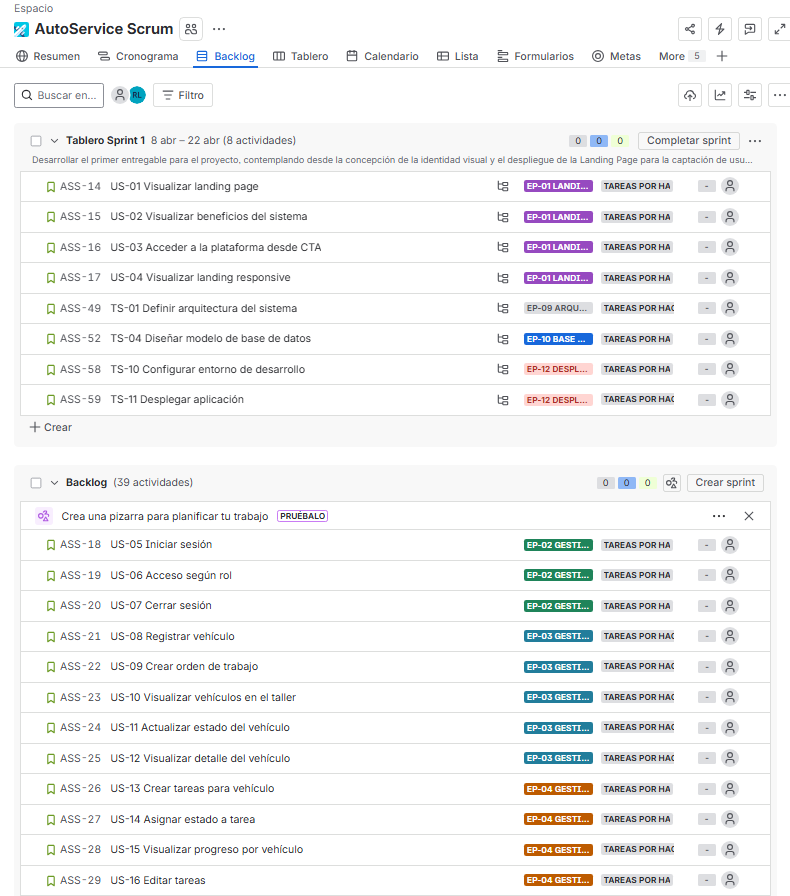
</div>

URL del tablero completo en Jira: https://innovatechstudio.atlassian.net/jira/software/projects/ASS/boards/1/backlog

---

## Capítulo IV: Product Design

### 4.1. Style Guidelines

<p align="justify">
En la siguiente sección se establecen las directrices de estilo que garantizan una presentación visual consistente y profesional en todos los artefactos del proyecto. Para lograrlo, el equipo ha creado un repositorio central de diseño dentro de la organización de GitHub.
</p>
<p align="justify">
Para lograrlo, el equipo ha creado un repositorio central de diseño dentro de la organización de GitHub bajo la carpeta:
</p>
<p align="justify">
/design-system/
</p>
<p align="justify">
Este repositorio contiene la paleta de colores oficial, tipografías, iconos, componentes UI reutilizables, guías de espaciado, assets gráficos y documentación de uso. El objetivo principal es mantener una experiencia unificada entre la Landing Page, la Web Application (Panel de Control) y la experiencia móvil, facilitando el trabajo colaborativo y asegurando que tanto los mecánicos/administradores como los clientes finales perciban la misma calidad, confianza y profesionalismo en la marca.
</p>

#### 4.1.1. General Style Guidelines

<p align="justify"> Las decisiones generales de estilo se basan en los valores de marca de AutoService: confianza, profesionalismo, transparencia y modernidad tecnológica aplicada al sector automotriz. </p>
Branding y tono de comunicación
<p align="justify"> • Tono: Profesional, claro, cercano y orientado a soluciones. Se evita lenguaje técnico excesivo para el cliente final, pero se mantiene rigor y precisión en la interfaz del taller.<br> • Personalidad de marca: Confiable, ordenada, moderna y empática.<br> • Valores visuales: Orden, claridad visual, jerarquía y un toque de dinamismo controlado que transmite progreso y control del servicio. </p>

<div align="center">
  <table style="margin: auto; width: 100%; border-collapse: collapse; border: 1px solid #ddd;">
    <thead>
      <tr style="background-color: #f2f2f2;">
        <th style="padding: 12px; border: 1px solid #ddd; text-align: left;">Color</th>
        <th style="padding: 12px; border: 1px solid #ddd; text-align: center;">Hex</th>
        <th style="padding: 12px; border: 1px solid #ddd; text-align: left;">Significado y Justificación</th>
        <th style="padding: 12px; border: 1px solid #ddd; text-align: left;">Ejemplo de uso en la interfaz</th>
        <th style="padding: 12px; border: 1px solid #ddd; text-align: center;">Imagen</th>
      </tr>
    </thead>
    <tbody>
      <tr>
        <td style="padding: 12px; border: 1px solid #ddd; font-weight: bold;">Primary Blue</td>
        <td style="padding: 12px; border: 1px solid #ddd; font-family: monospace; text-align: center;">#0A2540</td>
        <td style="padding: 12px; border: 1px solid #ddd;">Representa confianza, profesionalismo y autoridad. Azul profundo que transmite estabilidad y seriedad, cualidades esenciales en un servicio técnico automotriz. Genera sensación de seguridad tanto para mecánicos como para clientes.</td>
        <td style="padding: 12px; border: 1px solid #ddd;">Sidebar izquierdo, navbar, botones principales (CTA), encabezados del Panel de Control.</td>
        <td style="padding: 12px; border: 1px solid #ddd; text-align: center;"></td>
      </tr>
      <tr>
        <td style="padding: 12px; border: 1px solid #ddd; font-weight: bold;">Secondary Teal</td>
        <td style="padding: 12px; border: 1px solid #ddd; font-family: monospace; text-align: center;">#00BFA5</td>
        <td style="padding: 12px; border: 1px solid #ddd;">Simboliza progreso, eficiencia y modernidad. El turquesa verdoso evoca movimiento positivo y finalización exitosa. Ideal para indicar avance y estados positivos.</td>
        <td style="padding: 12px; border: 1px solid #ddd;">Barra de progreso, badges “En curso”, indicadores de avance en tareas.</td>
        <td style="padding: 12px; border: 1px solid #ddd; text-align: center;"></td>
      </tr>
      <tr>
        <td style="padding: 12px; border: 1px solid #ddd; font-weight: bold;">Accent Orange</td>
        <td style="padding: 12px; border: 1px solid #ddd; font-family: monospace; text-align: center;">#FF6B00</td>
        <td style="padding: 12px; border: 1px solid #ddd;">Representa atención y urgencia. Color energético que capta la atención sin generar ansiedad. Reservado para elementos que requieren acción inmediata.</td>
        <td style="padding: 12px; border: 1px solid #ddd;">Notificaciones de alta prioridad, alertas</td>
        <td style="padding: 12px; border: 1px solid #ddd; text-align: center;"></td>
      </tr>
      <tr>
        <td style="padding: 12px; border: 1px solid #ddd; font-weight: bold;">Neutral Gray</td>
        <td style="padding: 12px; border: 1px solid #ddd; font-family: monospace; text-align: center;">#F4F4F5</td>
        <td style="padding: 12px; border: 1px solid #ddd;">Proporciona calma, orden y fondo limpio. Reduce la fatiga visual y permite que los elementos importantes resalten.</td>
        <td style="padding: 12px; border: 1px solid #ddd;">Fondo general del dashboard, tarjetas KPI y contenedores secundarios.</td>
        <td style="padding: 12px; border: 1px solid #ddd; text-align: center;"></td>
      </tr>
      <tr>
        <td style="padding: 12px; border: 1px solid #ddd; font-weight: bold;">Dark Gray</td>
        <td style="padding: 12px; border: 1px solid #ddd; font-family: monospace; text-align: center;">#1F2937</td>
        <td style="padding: 12px; border: 1px solid #ddd;">Color para texto secundario. Ofrece alto contraste con fondos claros garantizando excelente legibilidad.</td>
        <td style="padding: 12px; border: 1px solid #ddd;">Cuerpo de texto, descripciones y etiquetas secundarias.</td>
        <td style="padding: 12px; border: 1px solid #ddd; text-align: center;"></td>
      </tr>
      <tr>
        <td style="padding: 12px; border: 1px solid #ddd; font-weight: bold;">Success Green</td>
        <td style="padding: 12px; border: 1px solid #ddd; font-family: monospace; text-align: center;">#10B981</td>
        <td style="padding: 12px; border: 1px solid #ddd;">Transmite éxito y completitud. Verde moderno que refuerza la sensación de logro al finalizar un servicio.</td>
        <td style="padding: 12px; border: 1px solid #ddd;">Badges “Completado” y confirmaciones exitosas.</td>
        <td style="padding: 12px; border: 1px solid #ddd; text-align: center;"></td>
      </tr>
      <tr>
        <td style="padding: 12px; border: 1px solid #ddd; font-weight: bold;">White</td>
        <td style="padding: 12px; border: 1px solid #ddd; font-family: monospace; text-align: center;">#FFFFFF</td>
        <td style="padding: 12px; border: 1px solid #ddd;">Representa claridad y espacio. Se usa como fondo principal de tarjetas y modales para maximizar legibilidad y dar sensación de orden.</td>
        <td style="padding: 12px; border: 1px solid #ddd;">Tarjetas KPI, modales y secciones principales.</td>
        <td style="padding: 12px; border: 1px solid #ddd; text-align: center;"></td>
      </tr>
    </tbody>
  </table>
</div>
<br>
Tipografía
<p align="justify"> El sistema tipográfico se basa en dos familias principales con una escala tipográfica coherente (Base Value: 16 px, Scale: 1.25): </p>
<p align="justify"> Heading (títulos): Poppins (Semi-Bold / Bold)
<br> • h1 - Título: 61 px (3.813 rem)<br> • h2– Subtítulo: 49 px (3.063 rem)<br> • h3 – Base Título: 39 px (2.438 rem)<br>•	h4: 31 px (1.938 rem)<br> • h5: 25 px<br><br>

Espaciado e iconografía
<p align="justify"> • Sistema de espaciado basado en múltiplos de 8 px (8, 16, 24, 32, 40, 48, 64 px, etc.).<br> • Bordes redondeados: 8 px y 16 px.<br> • Sombras suaves para profundidad visual.<br> • Iconografía: Librería Lucide Icons (24 px base). </p>

#### 4.1.2. Web Style Guidelines

<p align="justify"> Estas directrices definen los estándares visuales y de interacción específicos para las interfaces web (Landing Page y Web Application). Se han aplicado de forma consistente en el Panel de Control (versión desktop) y en todas las vistas administrativas. </p>

Layout y estructura
<p align="justify"> • Sistema de grid de 12 columnas con contenedor máximo de 1280 px.<br> • Sidebar fijo a la izquierda (240 px) para navegación principal.<br> • Área de contenido principal con padding lateral de 24 px.<br> • Tarjetas con fondo blanco, borde de 1 px (#E5E7EB), border-radius de 16 px y shadow sutil. </p>

Componentes principales
<p align="justify">
• Botones primarios: Fondo #0A2540, texto blanco, hover más oscuro, border-radius 8 px, altura mínima 48 px.<br> • Botones secundarios: Borde #0A2540, fondo transparente, texto oscuro.<br> • Tarjetas de métricas (KPI): Fondo blanco, ícono grande en la parte superior, números destacados en Poppins Bold.<br> • Tablas de vehículos: Encabezados con fondo #F8FAFC, filas con hover #F1F5F9, progress bars con color Secondary Teal.<br> • Estados de vehículos: Badges con border-radius completo, padding 4 px / 12 px y colores según estado (En proceso → teal, Pendiente → naranja, Completado → verde).<br> • Search bar: Fondo #F8FAFC, borde redondeado, ícono de lupa a la izquierda.<br> •	Usuario / Avatar: Círculo en la esquina superior derecha con foto y nombre. </p>
Tipografía en web
<p align="justify">
• Títulos de sección: Poppins Semi-Bold (h1–h3).<br> • Texto de tarjetas y tablas: Inter Regular 16 px.<br> • Todos los tamaños se expresan en rem para mantener accesibilidad y escalabilidad.
</p>
Consistencia visual
<p align="justify">
Todos los componentes siguen estrictamente el Design System alojado en /design-system/. La paleta, tipografía y espaciados se mantienen idénticos en todas las vistas web, garantizando una experiencia unificada entre la Landing Page y la Web Application.
</p>

### 4.2. Information Architecture

<p align="justify">
Esta sección detalla cómo se organiza, etiqueta y estructura la información dentro de la plataforma AutoService para garantizar que los diferentes segmentos de usuario puedan navegar intuitivamente. El objetivo es minimizar el esfuerzo cognitivo tanto del personal del taller al gestionar operaciones como del cliente final al consultar el estado de su vehículo.
</p>
<p align="justify">
Para AutoService, se han implementado diversos sistemas de organización que responden a las necesidades operativas y de consulta del negocio:
</p>

#### 4.2.1. Organization Systems

<p style="text-align: justify;">
  <ul>
    <li>
      <strong>Jerarquía Visual (Visual Hierarchy):</strong> Se aplica principalmente en el Dashboard Administrativo, donde los indicadores críticos (KPIs) como el número de vehículos en proceso, ingresos del día y órdenes pendientes se presentan en la parte superior con un diseño destacado para una rápida interpretación.
    </li>
    <li>
      <strong>Organización Secuencial (Step-by-step):</strong> Se utiliza estrictamente en el flujo de creación de una Orden de Trabajo y en el registro de servicios. El sistema guía al mecánico a través de pasos lógicos: Información del cliente &gt; Datos del vehículo &gt; Diagnóstico inicial &gt; Asignación de tareas y costos.
    </li>
    <li>
      <strong>Esquema Cronológico:</strong> Se emplea en el Historial de Servicios de cada vehículo. Los registros se organizan del más reciente al más antiguo, permitiendo que tanto el taller como el dueño del auto visualicen la evolución del mantenimiento en el tiempo.
    </li>
    <li>
      <strong>Categorización según Audiencia:</strong> La estructura se divide en dos grandes rutas de acceso:
      <ul>
        <li><strong>Panel Operativo (B2B):</strong> Orientado a mecánicos y administradores para la gestión de flota, personal y facturación.</li>
        <li><strong>Portal de Seguimiento (B2C):</strong> Una interfaz simplificada para el propietario del vehículo, centrada únicamente en el progreso y transparencia del servicio actual.</li>
      </ul>
    </li>
  </ul>
</p>

#### 4.2.2. Labeling Systems

<p style="text-align: justify;">
  El sistema de etiquetado utiliza términos técnicos automotrices estandarizados en inglés para mantener la consistencia con las convenciones de desarrollo del proyecto.
</p>

<ul style="text-align: justify;">
  <li>
    <strong>Etiquetas de Navegación (Sidebar/Navbar):</strong>
    <ul>
      <li>Dashboard: Vista general de métricas.</li>
      <li>Vehicles: Listado y gestión de unidades.</li>
      <li>Work Orders: Control de servicios activos.</li>
      <li>Staff: Gestión del personal mecánico.</li>
      <li>Billing: Generación de comprobantes y pagos.</li>
    </ul>
  </li>

  <li>
    <strong>Etiquetas de Acción (Botones/CTAs):</strong>
    <ul>
      <li>Register Vehicle: Iniciar registro de unidad.</li>
      <li>Update Status: Cambiar etapa del servicio (Pending, In Process, Ready).</li>
      <li>Generate Invoice: Crear comprobante de pago.</li>
      <li>Track My Vehicle: Acceso para el cliente final.</li>
    </ul>
  </li>

  <li>
    <strong>Etiquetas de Estado:</strong>
    <ul>
      <li>Diagnostic: Etapa de revisión inicial.</li>
      <li>In Repair: Ejecución de tareas mecánicas.</li>
      <li>Ready for Pickup: Vehículo listo para entrega.</li>
    </ul>
  </li>
</ul>

#### 4.2.3. SEO Tags and Meta Tags

<p style="text-align: justify;">
  A continuación, se definen los metadatos estratégicos para el posicionamiento y la identidad de la plataforma tanto en la Landing Page como en la Aplicación Web:
</p>

<table style="width: 100%; border-collapse: collapse; text-align: justify;">
  <thead>
    <tr style="background-color: #f2f2f2;">
      <th style="border: 1px solid #ddd; padding: 8px;">Página</th>
      <th style="border: 1px solid #ddd; padding: 8px;">Title Tag</th>
      <th style="border: 1px solid #ddd; padding: 8px;">Meta Description</th>
      <th style="border: 1px solid #ddd; padding: 8px;">Keywords</th>
      <th style="border: 1px solid #ddd; padding: 8px;">Author</th>
    </tr>
  </thead>
  <tbody>
    <tr>
      <td style="border: 1px solid #ddd; padding: 8px;">Landing Page</td>
      <td style="border: 1px solid #ddd; padding: 8px;">AutoService - Digital Management for Workshops</td>
      <td style="border: 1px solid #ddd; padding: 8px;">
        Optimiza tu taller mecánico con seguimiento en tiempo real, gestión de órdenes y transparencia para el cliente.
      </td>
      <td style="border: 1px solid #ddd; padding: 8px;">
        workshop software, mechanic SaaS, vehicle tracking, taller digital, gestión automotriz
      </td>
      <td style="border: 1px solid #ddd; padding: 8px;">InnovaTech Studio</td>
    </tr>
    <tr>
      <td style="border: 1px solid #ddd; padding: 8px;">Web Application (Dashboard)</td>
      <td style="border: 1px solid #ddd; padding: 8px;">AutoService</td>
      <td style="border: 1px solid #ddd; padding: 8px;">
        Panel de control operativo para gestión integral de servicios automotrices.
      </td>
      <td style="border: 1px solid #ddd; padding: 8px;">app, workshop, management, ERP, automotive.</td>
      <td style="border: 1px solid #ddd; padding: 8px;">InnovaTech Studio</td>
    </tr>
  </tbody>
</table>

#### 4.2.4. Searching Systems

<p style="text-align: justify;">
  Para evitar que los usuarios se pierdan ante grandes volúmenes de datos, se han definido los siguientes mecanismos de búsqueda y filtrado:
</p>

<ul style="text-align: justify;">
  <li>
    <strong>Búsqueda Global por Placa (License Plate):</strong> El buscador principal permite localizar rápidamente cualquier vehículo en el sistema ingresando el número de placa, lo cual redirige al detalle de su Orden de Trabajo activa.
  </li>
  <li>
    <strong>Filtros de Estado en Tiempo Real:</strong> En el listado de órdenes, el usuario puede filtrar por "Pending", "In Process" o "Completed" para priorizar las tareas del día.
  </li>
  <li>
    <strong>Filtros por Rango de Fechas:</strong> Aplicable en la sección de reportes financieros y de productividad para analizar el desempeño del taller en periodos específicos.
  </li>
  <li>
    <strong>Presentación de Resultados:</strong> Los datos se muestran en formato de tarjetas (cards) o tablas interactivas con resaltado de sintaxis para los estados críticos.
  </li>
</ul>

#### 4.2.5. Navigation Systems

<p style="text-align: justify;">
  El sistema de navegación está diseñado para ser consistente entre la Landing Page y la Aplicación, guiando al usuario hacia sus objetivos finales:
</p>

<ul style="text-align: justify;">
  <li>
    <strong>Navegación Global (Navbar):</strong> Presente en la Landing Page para dirigir a los usuarios potenciales a las secciones de beneficios, precios y el acceso al sistema (Login).
  </li>
  <li>
    <strong>Navegación Vertical (Sidebar):</strong> Menú lateral persistente en la Web Application que permite el tránsito rápido entre los módulos operativos (Vehicles, Staff, Orders).
  </li>
  <li>
    <strong>Breadcrumbs (Migas de Pan):</strong> Utilizadas en las vistas de detalle (ej: Work Orders &gt; Order #1234 &gt; Task Update) para que el usuario siempre sepa en qué nivel de la jerarquía se encuentra.
  </li>
  <li>
    <strong>Navegación Contextual (CTAs):</strong> Enlaces directos desde el Dashboard hacia las acciones más frecuentes, como "Add New Vehicle" o "View Pending Tasks".
  </li>
</ul>

### 4.3. Landing Page UI Design

#### 4.3.1. Landing Page Wireframe

<div align= center>


</div>

#### 4.3.2. Landing Page Mock-up

<div align= center>


</div>

### 4.4. Web Applications UX/UI Design

#### 4.4.1. Web Applications Wireframes

En esta sección se presentan los wireframes desarrollados para AutoService, los cuales representan la estructura base de las interfaces antes de la aplicación del diseño visual final. Estos wireframes permiten definir la organización del contenido, la jerarquía de la información y los flujos de navegación, asegurando una experiencia de usuario clara y eficiente.

Se desarrollaron wireframes tanto para el flujo del administrador como para el cliente, considerando sus diferentes objetivos dentro del sistema.

<div align= center></div>

<p>Trabajo hecho en figma - link: <a href="https://www.figma.com/design/rOJ6k8HLfI85lI8Xsik6TN/AUTOSERVICE-AW?node-id=2562-14849&t=wWO9xK4PqrC4tToK-1">https://www.figma.com/design/rOJ6k8HLfI85lI8Xsik6TN/AUTOSERVICE-AW?node-id=2562-14849&t=wWO9xK4PqrC4tToK-1</a><p>

1. Principios de Diseño

Contraste:
Aunque los wireframes no incluyen color, se utilizó contraste mediante tamaños, pesos visuales y jerarquía de elementos para destacar acciones principales como botones y títulos.

Repetición:
Se mantuvo consistencia en la disposición de componentes como formularios, listas y botones, permitiendo que el usuario reconozca patrones de interacción a lo largo de las distintas pantallas.
<div align= center></div>

Alineación:
Los elementos fueron organizados siguiendo estructuras de grilla, garantizando orden y facilitando la lectura. Esto es evidente en pantallas como el dashboard y los formularios de registro.
<div align= center></div>

Proximidad:
Se agruparon elementos relacionados, como campos de formularios o información del vehículo, para mejorar la comprensión y reducir la carga cognitiva del usuario.
<div align= center></div>

2. Elementos de Diseño Utilizados
- Formularios estructurados (registro de vehículo, datos del cliente)
- Tablas y listas (vehículos, órdenes de trabajo)
- Botones de acción (primarios y secundarios)
- Contenedores o secciones (cards)
- Menú de navegación lateral (sidebar)
- Indicadores de progreso y estados

Estos elementos fueron definidos de manera genérica para posteriormente ser estilizados en los mock-ups.

3. Diseño Inclusivo
- Distribución clara de elementos para facilitar la comprensión
- Formularios simples con campos bien organizados
- Navegación predecible y consistente
- Reducción de pasos innecesarios en los flujos

Esto permite que el sistema sea fácil de usar incluso para usuarios con poca experiencia digital.

4. Arquitectura de Información

Los wireframes evidencian una arquitectura clara basada en los flujos del sistema:

Panel Administrador:
- Dashboard como punto de entrada
- Navegación lateral persistente
- Módulos organizados por funcionalidad (vehículos, órdenes, tareas, personal, reportes)

<div align= center></div>
Flujo de Registro de Vehículo:
- Proceso dividido en pasos (stepper)
- Separación de datos del cliente y del vehículo

Panel Cliente:
- Interfaz simplificada con acciones principales
- Flujo directo para consultar estado o agendar cita
<div align= center></div>

Los wireframes sirvieron como base estructural para el desarrollo de los mock-ups, donde posteriormente se incorporaron elementos visuales como color, tipografía e identidad gráfica. Gracias a esta fase previa, se logró validar la organización de la información y los flujos antes de avanzar al diseño de alta fidelidad.

#### 4.4.2. Web Applications Wireflow Diagrams

<table>
  <tr>
    <td class="header">User Persona</td>
    <td>Cliente - dueño del vehículo</td>
    <td class="header">Número</td>
    <td>1</td>
  </tr>
  <tr>
    <td class="header">User Goal</td>
    <td colspan="3" class="italic bold">
      Ingresar al sistema, visualizar y consultar el estado de mi vehículo mediante un código de seguimiento, para conocer el progreso del servicio, el diagnóstico y la fecha estimada de entrega sin necesidad de contactar directamente al taller.
    </td>
  </tr>
  <tr>
    <td class="header">Happy path</td>
    <td colspan="3">
      El usuario accede a la plataforma del taller e inicia sesión desde la pantalla de login ingresando sus credenciales. Tras una autenticación exitosa, es dirigido al panel principal del cliente, donde puede visualizar las opciones disponibles.

Desde el panel, el usuario selecciona la opción “Consultar estado del vehículo”, lo que lo redirige a la pantalla de consulta. En esta vista, el usuario ingresa el código de seguimiento o identificador del servicio asociado a su vehículo.
Una vez ingresado el código, el usuario hace clic en “Consultar estado”. El sistema valida la información y, si es correcta, muestra la pantalla de estado del vehículo.

En esta pantalla, el usuario puede visualizar el detalle completo del servicio, incluyendo:
<li>Estado actual del mantenimiento (por ejemplo, en proceso)</li>
<li>Lista de tareas realizadas o pendientes</li>
<li>Tiempo estimado de entrega</li>
<li>Costo estimado total</li>
<li>Información adicional relevante del servicio</li>

Con esta información, el usuario obtiene visibilidad clara y en tiempo real sobre el progreso de su vehículo sin necesidad de hacer llamada directa con el taller.
    </td>
  </tr>
</table>

<div align="center">


Wireflow Diagram - 1<br><br>

</div>

<table>
  <tr>
    <td class="header">User Persona</td>
    <td>Cliente - dueño del vehículo</td>
    <td class="header">Número</td>
    <td>2</td>
  </tr>
  <tr>
    <td class="header">User Goal</td>
    <td colspan="3" class="italic bold">
     Agendar cita de mantenimiento para un vehículo, para seleccionar una fecha y hora disponible de manera rápida y asegurar la atención en el taller sin necesidad de coordinación manual
    </td>
  </tr>
  <tr>
    <td class="header">Happy path</td>
    <td colspan="3">
    El usuario accede a la plataforma del taller e inicia sesión desde la pantalla de login ingresando sus credenciales. Una vez autenticado correctamente, es redirigido al panel principal del cliente, donde visualiza las opciones disponibles.

Desde este panel, el usuario selecciona la opción “Agendar cita”, lo que lo lleva al flujo de programación. En la siguiente pantalla, el usuario elige el tipo de servicio requerido (por ejemplo, cambio de aceite, diagnóstico o mantenimiento general). Luego, selecciona una fecha disponible en el calendario y una hora dentro de los horarios habilitados. Tras completar esta selección, hace clic en “Siguiente”.

En el siguiente paso, el usuario visualiza el formulario de agendamiento de citas, donde se muestran o completa sus datos personales y la información del vehículo. Revisa que toda la información sea correcta y continúa seleccionando “Siguiente”.

Finalmente, el sistema procesa la solicitud y muestra una pantalla de confirmación exitosa, indicando que la cita ha sido agendada correctamente, junto con el detalle de la fecha y hora seleccionadas. Con esto, el usuario asegura su atención en el taller sin necesidad de coordinación manual adicional.
    </td>
  </tr>
</table>

<div align="center">


Wireflow Diagram - 2<br><br>

</div>

<table>
  <tr>
    <td class="header">User Persona</td>
    <td>Administrador - dueño del taller</td>
    <td class="header">Número</td>
    <td>3</td>
  </tr>
  <tr>
    <td class="header">User Goal</td>
    <td colspan="3" class="italic bold">
     Registro y gestion de tareas de servicio para los vehículos, asignando mecánicos y manteniendo el control del estado de los trabajos en curso.
    </td>
  </tr>
  <tr>
    <td class="header">Happy path</td>
    <td colspan="3">
<ol>
<li>Inicio de sesión: 
El administrador ingresa sus credenciales en la pantalla de login.</li>
<li>Acceso al dashboard: 
El sistema valida la información y lo redirige al dashboard principal.</li>
<li>Navegación a gestión de tareas: 
El administrador accede a la sección “Gestión de Tareas” desde el menú o accesos directos.</li>
<li>Visualización del listado de tareas
El sistema muestra las tareas existentes con sus estados y detalles relevantes.</li>
<li>Inicio de creación de tarea: 
El administrador hace clic en el botón “Crear tarea”.</li>
<li>Despliegue del modal de creación: 
El sistema muestra una ventana modal con el formulario para registrar la nueva tarea.</li>
<li>Ingreso de información: 
El administrador completa los campos requeridos, por ejemplo:
Nombre o descripción de la tarea
Vehículo asociado, 
Prioridad, 
Posible asignación (mecánico o responsable), </li>
<li>Confirmación de creación: 
El administrador hace clic en “Crear tarea”.</li>
<li>Procesamiento de la solicitud: 
El sistema valida los datos y registra la nueva tarea en la base de datos.</li>
<li>Feedback de éxito: 
Se muestra un mensaje/modal indicando que la tarea fue creada correctamente.</li>
<li>Actualización del listado: 
El sistema regresa a la vista de tareas y actualiza la lista mostrando la nueva tarea creada.</li>
</ol>
    </td>
  </tr>
</table>

<div align="center">


Wireflow Diagram - 3<br><br>

</div>

<table>
  <tr>
    <td class="header">User Persona</td>
    <td>Administrador - dueño del taller</td>
    <td class="header">Número</td>
    <td>4</td>
  </tr>
  <tr>
    <td class="header">User Goal</td>
    <td colspan="3" class="italic bold">
   Registrar un vehículo nuevo en el sistema de manera rápida y sin errores, asegurando que la información ingresada sea válida y quede almacenada correctamente.
    </td>
  </tr>
  <tr>
    <td class="header">Happy path</td>
    <td colspan="3">
<ol>
<li>Inicio de sesión: 
El administrador accede al sistema ingresando sus credenciales desde la pantalla de login.</li>
<li>Acceso al dashboard: 
Tras autenticarse, el sistema lo redirige al dashboard donde visualiza el estado general del taller.</li>
<li>Navegación a vehículos: 
El administrador accede a la sección “Vehículos en el taller”.</li>
<li>Inicio de registro: 
Hace clic en la acción “Registrar vehículo” para iniciar el proceso.</li>
<li>Ingreso de datos del cliente: 
El sistema muestra el formulario correspondiente.
El administrador completa la información del cliente (nombre, contacto, etc.) y continúa.</li>
<li>Ingreso de datos del vehículo: 
El sistema presenta el siguiente paso del formulario.
El administrador ingresa los datos del vehículo (marca, modelo, año, placa, etc.) y avanza.</li>
<li>Revisión y confirmación: 
El sistema muestra una pantalla de resumen con toda la información ingresada (cliente + vehículo).
El administrador valida que los datos sean correctos.</li>
<li>Confirmación del registro: 
El administrador hace clic en “Registrar vehículo”.</li>
<li>Procesamiento de la información: 
El sistema guarda los datos en la base de datos de forma segura.</li>
<li>Feedback de éxito: 
Se muestra una pantalla de confirmación indicando que el vehículo fue registrado correctamente.</li>
<li>Continuidad de flujo: 
El administrador puede optar por:
Registrar otro vehículo, 
Volver al listado de vehículos</li>
</ol>
    </td>
  </tr>
</table>

<div align="center">


Wireflow Diagram - 4<br><br>

</div>


<table>
  <tr>
    <td class="header">User Persona</td>
    <td>Administrador - dueño del taller</td>
    <td class="header">Número</td>
    <td>5</td>
  </tr>
  <tr>
    <td class="header">User Goal</td>
    <td colspan="3" class="italic bold">
   Eliminar una tarea registrada en el sistema de forma segura, asegurando que el usuario confirme la acción antes de que la información sea eliminada definitivamente.
    </td>
  </tr>
  <tr>
    <td class="header">Happy path</td>
    <td colspan="3">
    <ol>
<li>Inicio de sesión
El administrador accede al sistema ingresando sus credenciales válidas desde la pantalla de login.
<li>Acceso al dashboard</li>
Tras autenticarse correctamente, el sistema lo redirige al dashboard principal, donde puede visualizar un resumen general del estado del taller.</li>
<li>Navegación a gestión de tareas
El administrador selecciona la opción “Gestión de Tareas” desde el menú lateral o desde un acceso directo en el dashboard.</li>
<li>Visualización del listado de tareas
El sistema muestra la lista de tareas registradas con información relevante (vehículo, estado, prioridad, etc.).</li>
<li>Selección de tarea a eliminar
El administrador identifica la tarea que desea eliminar y hace clic en el icono o acción de “Eliminar” correspondiente.</li>
<li>Despliegue de modal de confirmación
El sistema presenta una ventana modal solicitando confirmación, indicando que la acción es irreversible.</li>
<li>Confirmación de la acción
El administrador confirma la eliminación haciendo clic en el botón de “Eliminar”.</li>
<li>Procesamiento de la solicitud
El sistema elimina la tarea de forma segura de la base de datos.</li>
<li>Feedback al usuario
El sistema muestra un mensaje de éxito indicando que la tarea fue eliminada correctamente.</li>
<li>Actualización del listado
La lista de tareas se actualiza automáticamente, reflejando la eliminación sin necesidad de recargar la página.</li>
</ol>
    </td>
  </tr>
</table>

<div align="center">


Wireflow Diagram - 5<br><br>

</div>


<table>
  <tr>
    <td class="header">User Persona</td>
    <td>Administrador - dueño del taller</td>
    <td class="header">Número</td>
    <td>6</td>
  </tr>
  <tr>
    <td class="header">User Goal</td>
    <td colspan="3" class="italic bold">
    Registrar un nuevo mecánico en el sistema, asegurando que sus datos sean ingresados correctamente para su posterior asignación a tareas dentro del taller.
    </td>
  </tr>
  <tr>
    <td class="header">Happy path</td>
    <td colspan="3">
   El usuario ingresa al sistema desde la pantalla de login proporcionando sus credenciales. El sistema valida la información y, al ser correcta, le permite acceder al dashboard principal, donde puede visualizar métricas generales del taller como carga de trabajo, vehículos en proceso y actividad reciente.
Desde el menú lateral, el administrador navega a la sección de “Gestión de personal”. En esta vista se muestra un listado de mecánicos con información resumida como nombre, especialidad y estado. Esto le permite tener una visión rápida del equipo disponible.
El administrador decide agregar un nuevo mecánico y selecciona la opción correspondiente. El sistema lo dirige a una pantalla con un formulario de registro. Allí, el administrador completa los campos requeridos, incluyendo datos personales, información de contacto y especialidades técnicas.
Una vez que todos los campos obligatorios están completos, el administrador confirma el registro. El sistema procesa la información, valida los datos y guarda correctamente el nuevo mecánico en la base de datos.
Finalmente, el administrador es redirigido nuevamente al listado de personal, donde puede ver al nuevo mecánico agregado. Con esto, el flujo concluye al haber incorporado exitosamente un nuevo miembro al equipo del taller.
    </td>
  </tr>
</table>

<div align="center">


Wireflow Diagram - 6<br><br>

</div>


<table>
  <tr>
    <td class="header">User Persona</td>
    <td>Administrador - dueño del taller</td>
    <td class="header">Número</td>
    <td>7</td>
  </tr>
  <tr>
    <td class="header">User Goal</td>
    <td colspan="3" class="italic bold">
     Visualizar y consultar el detalle de los vehículos registrados en el sistema para dar seguimiento a su estado y gestionar la operación del taller.
    </td>
  </tr>
  <tr>
    <td class="header">Happy path</td>
    <td colspan="3">
    El usuario ingresa al sistema desde la pantalla de login introduciendo sus credenciales válidas. Al autenticarse correctamente, accede al dashboard donde puede ver un resumen general de la operación del taller.
Desde el menú principal, navega a la sección “Vehículos en el taller”, donde se muestra un listado con todos los vehículos registrados y su estado actual. El administrador revisa la lista y selecciona un vehículo específico para consultar más información.
Al hacer clic, se abre el detalle del vehículo, donde puede visualizar datos relevantes como cliente, diagnóstico, estado del servicio y progreso del trabajo. Desde esta vista, el administrador puede tomar acciones como generar una orden de trabajo o continuar con la gestión del vehículo.
El flujo finaliza cuando el administrador obtiene la información necesaria y realiza la acción deseada para dar seguimiento al vehículo.
    </td>
  </tr>
</table>

<div align="center">


<p>Wireflow Diagram - 7</p><br><br>

</div>

#### 4.4.3. Web Applications Mock-ups

El diseño de la aplicación se ha desarrollado bajo un enfoque desktop, considerando una resolución base de 1440px claramente incluido el responsive. Se ha priorizado la claridad visual, la eficiencia en la interacción y la reducción de la carga cognitiva del usuario.

Asimismo, se han diferenciado claramente dos tipos de usuarios: Administrador (staff del taller): enfocado en gestión operativa y el cliente: enfocado en consulta rápida y acciones simples.
Esta segmentación permitió diseñar experiencias específicas según las necesidades de cada tipo de usuario.


URL del trabajo en Figma: 
[Link del trabajo](https://www.figma.com/design/rOJ6k8HLfI85lI8Xsik6TN/AUTOSERVICE-AW?node-id=2084-72&t=apoFHJV5bqtx999h-1)

1. Principios de Diseño

Durante el desarrollo de los mock-ups se aplicaron los siguientes principios fundamentales:

<table>
  <tr>
    <td>
      <strong>Contraste:</strong><br>
      El contraste fue utilizado para guiar la atención del usuario hacia los elementos más importantes de cada interfaz. Por ejemplo, los botones de acción primaria, como “Registrar vehículo”, “Crear orden” o “Consultar estado”, emplean un gradiente azul (#004AC6 – #2563EB), diferenciándose claramente de los elementos secundarios. Asimismo, los estados del sistema (Pendiente, En proceso, Completado) se representan mediante colores diferenciados acompañados de etiquetas textuales, lo que permite identificar rápidamente el estado sin depender únicamente del color. Esto mejora tanto la legibilidad como la accesibilidad.<br>
      <div align="center"></div>
    </td>
  </tr>

  <tr>
    <td>
      <strong>Repetición:</strong><br>
      La repetición se utilizó para generar consistencia visual y familiaridad a lo largo de toda la aplicación. Componentes como botones, tarjetas (cards), tablas, etiquetas de estado, barras de progreso y modales mantienen el mismo estilo, tamaño y comportamiento en todas las vistas. Por ejemplo, el mismo estilo de botones y etiquetas de estado se reutiliza en los módulos de Vehículos, Órdenes de trabajo, Tareas y Personal, permitiendo que el usuario reconozca patrones de interacción sin necesidad de reaprender. Además, se mantiene un único sistema de íconos con el mismo estilo visual (línea, grosor, tamaño), reforzando la coherencia del diseño.<br>
      <div align="center"></div>
    </td>
  </tr>

  <tr>
    <td>
      <strong>Alineación:</strong><br>
      La alineación fue aplicada mediante el uso de estructuras basadas en grid en el figma, garantizando orden y organización visual. Los elementos se distribuyen de manera consistente, ya sea en layouts con sidebar (panel administrador) o en layouts centrados (panel cliente). En pantallas como la Lista de vehículos o Órdenes de trabajo, las tablas presentan una alineación clara de columnas, lo que facilita la lectura de datos. En formularios, los campos están alineados verticalmente, permitiendo un flujo de lectura natural. Esta alineación contribuye a una interfaz más limpia, profesional y fácil de usar<br>
      <div align="center"></div>
    </td>
  </tr>

  <tr>
    <td>
      <strong>Proximidad:</strong><br>
      El principio de proximidad se utilizó para agrupar elementos relacionados y separar aquellos que cumplen funciones distintas. Esto reduce la carga cognitiva y mejora la comprensión de la interfaz. Por ejemplo, en la pantalla de Detalle del vehículo, la información se organiza en secciones claras: datos del cliente, datos del vehículo, orden de trabajo, tareas y progreso. Cada grupo está contenido en tarjetas (cards), lo que facilita la identificación de cada bloque de información. En el caso del cliente, en el Panel principal, los botones de acción (“Consultar estado” y “Agendar cita”) se agrupan visualmente, permitiendo una toma de decisión rápida
      <div align="center"></div>
    </td>
  </tr>
</table>
2. Elementos de Diseño

Los mock-ups incorporan elementos de diseño modernos y reutilizables, propios de aplicaciones web tipo SaaS, los cuales fueron seleccionados para mejorar la interacción y la claridad visual:

- Botones: utilizados para acciones primarias y secundarias, con estados visuales (hover, focus, disabled) que brindan retroalimentación inmediata al usuario.
<div align= center></div>

- Tarjetas (Cards): empleadas para agrupar información relacionada, especialmente en informacion de tecnicos, dashboards y vistas de detalle.
<div align= center></div>

- Tablas: utilizadas para mostrar grandes volúmenes de datos estructurados (vehículos, órdenes, tareas), optimizando la escaneabilidad.
- Etiquetas de estado (Tags): permiten identificar rápidamente el estado de procesos (pendiente, en proceso, completado).
Barras de progreso: representan visualmente el avance de un servicio o conjunto de tareas.
<div align= center></div>

- Modales: utilizados para acciones rápidas como crear, editar o confirmar eliminación, evitando cambios de contexto innecesarios.
<div align= center></div>


3. Diseño Inclusivo

El sistema fue desarrollado considerando principios de accesibilidad e inclusión:
Uso de texto claro y no técnico, especialmente en el módulo cliente
No dependencia exclusiva del color (uso de íconos + etiquetas)
Tamaños adecuados de botones y campos para facilitar la interacción
Contrastes adecuados para garantizar legibilidad
Formularios con etiquetas visibles y validaciones claras

Esto permite que la aplicación sea usable por un público amplio, incluyendo usuarios no técnicos.

4. Information Architecture
<table>
<tr>
<td>
Se definió una arquitectura clara y jerárquica basada en los flujos de usuario:
Panel Administrador:
- Dashboard
- Vehículos
- Órdenes de trabajo
- Tareas
- Personal
- Reportes
</td>
<td> <div align="center"></div></td>
</tr>

<tr>
<td>
Esta estructura permite una navegación lógica y eficiente para la gestión del taller.

Panel Cliente:
Panel principal (hub de acciones)
- Consulta de estado del vehículo
- Agendamiento de citas

Se priorizó una arquitectura minimalista, reduciendo opciones para facilitar la toma de decisiones.
</td>
<td></td>
</tr>
<table>

5. Design System

Se estableció un Design System consistente que incluye:

- Paleta de colores con énfasis en azul (#004AC6, #2563EB)
- Tipografía jerarquizada (títulos, subtítulos, cuerpo)
- Sistema de espaciado basado en múltiplos de 8px
- Componentes reutilizables (botones, inputs, cards, tablas)
- Uso consistente de un único set de íconos

Este sistema garantiza coherencia visual, escalabilidad y mantenibilidad del producto.

6. Heuristicas de Usabilidad

- Visibilidad del estado del sistema: El sistema mantiene informado al usuario sobre lo que está ocurriendo en todo momento.
En el Dashboard, se muestran métricas en tiempo real (vehículos en proceso, tareas pendientes).
En el Detalle del vehículo, se presenta el progreso mediante barras y estados visibles.
En el módulo cliente, el estado del vehículo (Pendiente, En proceso, Listo) se muestra de forma clara e inmediata.
<div align="center"></div>

- Correspondencia entre el sistema y el mundo real: Se utiliza lenguaje comprensible y cercano al usuario.

Términos como “Vehículo”, “Tareas”, “Mecánico” y “Orden de trabajo” reflejan el contexto real de un taller.
En el módulo cliente, se evita el uso de lenguaje técnico, facilitando la comprensión.
<div align="center"></div>

- Control y libertad del usuario: El usuario puede deshacer o cancelar acciones fácilmente.
En formularios como “Registrar vehículo” o “Crear orden”, se incluye el botón “Cancelar”.
En la eliminación de tareas, se implementa un modal de confirmación para evitar errores.

- Prevencio de errores: Se diseñaron mecanismos para evitar errores antes de que ocurran.
Validaciones en formularios (campos obligatorios, formatos correctos).
Confirmación antes de eliminar tareas (HU-17).
Restricción de acciones sin datos completos (ej. no crear orden sin vehículo).
<div align="center"></div>
<div align="center"></div>

Los mock-ups desarrollados para reflejan una aplicación coherente, usable y alineada a estándares profesionales de diseño UX/UI. Se evidencia la correcta integración entre funcionalidad, estética y experiencia de usuario, logrando una solución clara tanto para la gestión interna del taller como para la interacción con clientes.

#### 4.4.4. Web Applications User Flow Diagrams

<table>
  <tr>
    <td class="header">User Persona</td>
    <td>Cliente - propietario del vehículo</td>
    <td class="header">Número</td>
    <td>1</td>
  </tr>
  <tr>
    <td class="header">User Goal</td>
    <td colspan="3" class="italic bold">
    Ingresar al sistema, visualizar y consultar el estado de mi vehículo mediante un código de seguimiento, para conocer el progreso del servicio, el diagnóstico y la fecha estimada de entrega sin necesidad de contactar directamente al taller.
    </td>
  </tr>
  <tr>
    <td class="header">Happy path</td>
    <td colspan="3">
    El usuario accede a la pantalla de inicio de sesión de la aplicación AutoService. Ingresa sus credenciales y presiona el botón “Login” para autenticarse en el sistema.
    Una vez dentro, el usuario es dirigido a la pantalla principal (dashboard), donde se le presentan distintas opciones. Para cumplir su objetivo, selecciona la opción “Consultar estado del vehículo”.
    El sistema lo redirige a la pantalla de consulta, donde se le solicita ingresar un código único asociado a su servicio. El usuario introduce el código y presiona el botón “Consultar estado”.
    Finalmente, el sistema muestra la pantalla de resultados, donde el usuario puede visualizar en tiempo real el estado de su vehículo, incluyendo detalles de las tareas realizadas, el progreso del servicio, costos asociados y tiempos estimados.
    </td>
  </tr>
  <tr>
    <td class="header">Unhappy Paths</td>
    <td colspan="3">
    Si el usuario ingresa credenciales incorrectas en la pantalla de inicio de sesión, el sistema muestra un mensaje de error y solicita reintentar el acceso.
    En la pantalla de consulta, si el usuario ingresa un código inválido o inexistente, el sistema despliega una notificación indicando que el código no es válido y permite volver a intentarlo.
    Si ocurre un problema de conexión o el sistema no puede recuperar la información, se muestra un mensaje de error indicando la imposibilidad de obtener el estado del vehículo en ese momento, sugiriendo intentar más tarde.<br>
    Consideraciones:
    <ul>
    <li>El usuario debe estar previamente registrado para poder acceder al sistema.</li>
    <li>El código de consulta debe ser válido y estar asociado a un servicio activo.</li>
    <li>La información mostrada depende de la disponibilidad y actualización en tiempo real del sistema.</li></ul>
    </td>
  </tr>
</table>
<p align="center">User flow - 1</p><br>
<div></div>

<table>
  <tr>
    <td class="header">User Persona</td>
    <td>Cliente - propietario del vehículo</td>
    <td class="header">Número</td>
    <td>2</td>
  </tr>
  <tr>
    <td class="header">User Goal</td>
    <td colspan="3" class="italic bold">
      Agendar una cita para el servicio de su vehículo de manera rápida y sencilla, seleccionando fecha, hora y proporcionando sus datos personales.
    </td>
  </tr>
  <tr>
    <td class="header">Happy path</td>
    <td colspan="3">
    El usuario accede a la pantalla de inicio de sesión de la plataforma AutoService. Ingresa sus credenciales y presiona el botón “Login” para acceder al sistema.
Una vez autenticado, el usuario es dirigido al dashboard principal, donde visualiza distintas opciones disponibles. Para cumplir su objetivo, selecciona la opción “Agendar cita”.
El sistema lo redirige a la pantalla de agendamiento, donde el usuario debe completar un formulario inicial seleccionando información clave como la fecha, la hora y el tipo de servicio requerido. Una vez completados estos campos, presiona el botón “Siguiente”.
En la siguiente pantalla, el usuario ingresa sus datos personales, incluyendo nombre, teléfono, correo electrónico y la información del vehículo (placa, marca y modelo). Luego de completar el formulario, presiona nuevamente el botón “Siguiente”.
Finalmente, el sistema muestra una pantalla de confirmación indicando que la cita ha sido agendada correctamente, junto con un resumen de los datos ingresados (fecha y hora). El usuario puede optar por consultar el estado del servicio o volver al inicio.
    </td>
  </tr>
  <tr>
    <td class="header">Unhappy Paths</td>
    <td colspan="3">
    Si el usuario ingresa credenciales incorrectas al iniciar sesión, el sistema muestra un mensaje de error y solicita reintentar.
Si el usuario no completa los campos obligatorios en el formulario de agendamiento (fecha, hora o tipo de servicio), el sistema impide avanzar y resalta los campos faltantes.
En caso de seleccionar una fecha u horario no disponible, el sistema notifica al usuario y le solicita elegir otra opción válida.
Si el uszario deja incompletos los datos personales o ingresa información inválida (por ejemplo, correo con formato incorrecto), el sistema muestra mensajes de validación antes de permitir continuar.
Si ocurre un error en el sistema al momento de confirmar la cita, se muestra un mensaje indicando que no fue posible completar la operación y se sugiere intentar nuevamente.
    </td>
  </tr>
</table>
<p align="center">User flow - 2</p><br>
<div align="center"></div>


<table>
  <tr>
    <td class="header">User Persona</td>
    <td>Administrador - dueño del taller</td>
    <td class="header">Número</td>
    <td>3</td>
  </tr>
  <tr>
    <td class="header">User Goal</td>
    <td colspan="3" class="italic bold">
      Registro y gestion de tareas de servicio para los vehículos, asignando mecánicos y manteniendo el control del estado de los trabajos en curso.
    </td>
  </tr>
  <tr>
    <td class="header">Happy path</td>
    <td colspan="3">
El flujo inicia cuando el administrador accede a la plataforma AutoService mediante la pantalla de inicio de sesión. Ingresa sus credenciales y presiona el botón “Login” para acceder al sistema.
Una vez autenticado, es dirigido al dashboard principal, donde puede visualizar un resumen de la operación del taller, incluyendo métricas, vehículos en proceso y estado general de los servicios.
Desde el menú de navegación, el administrador selecciona la opción de “Tareas” para acceder al panel de gestión. En esta sección se muestra un listado con todas las tareas registradas, junto con información relevante como vehículo asociado, mecánico asignado, estado y progreso.
Para crear una nueva tarea, el administrador presiona el botón “Crear tarea”. El sistema despliega un formulario donde debe ingresar los detalles de la tarea, como el tipo de servicio, descripción, vehículo asociado y el mecánico responsable.
Una vez completado el formulario, el administrador confirma la acción presionando nuevamente el botón “Crear tarea”. Finalmente, el sistema muestra un mensaje de confirmación indicando que la tarea ha sido creada correctamente, y esta pasa a formar parte del listado de tareas activas.
    </td>
  </tr>
  <tr>
    <td class="header">Unhappy Paths</td>
    <td colspan="3">
    Si el administrador ingresa credenciales incorrectas al iniciar sesión, el sistema muestra un mensaje de error y solicita reintentar el acceso.
Si intenta crear una tarea sin completar los campos obligatorios del formulario, el sistema resalta los campos faltantes e impide continuar hasta que la información sea válida.
En caso de seleccionar un vehículo o mecánico no disponible o no registrado en el sistema, se muestra un mensaje indicando el problema y se solicita corregir la información.
Si ocurre un error del sistema al momento de guardar la tarea, se notifica al usuario que la acción no pudo completarse y se sugiere intentar nuevamente.
    </td>
  </tr>
</table>
<p align="center">User flow - 3</p><br>
<div align="center"></div>


<table>
  <tr>
    <td class="header">User Persona</td>
    <td>Administrador - dueño del taller</td>
    <td class="header">Número</td>
    <td>4</td>
  </tr>
  <tr>
    <td class="header">User Goal</td>
    <td colspan="3" class="italic bold">
      Registrar un vehículo nuevo en el sistema de manera rápida y sin errores, asegurando que la información ingresada sea válida y quede almacenada correctamente.
    </td>
  </tr>
  <tr>
    <td class="header">Happy path</td>
    <td colspan="3">
     El usuario accede a la plataforma e ingresa sus credenciales en la pantalla de inicio de sesión. Una vez autenticado, es redirigido al dashboard principal, donde puede visualizar un resumen general del sistema.
Desde el dashboard, el usuario selecciona el módulo de vehículos, lo que despliega el panel con el listado de vehículos registrados. En esta vista, el usuario identifica y presiona el botón de “Registrar vehículo” para iniciar el proceso de registro.
A continuación, el sistema muestra un formulario donde el usuario debe ingresar la información básica del vehículo (por ejemplo, VIN, marca, modelo, año, entre otros). Una vez completados los campos requeridos, el usuario presiona el botón “Siguiente”.
En la siguiente pantalla, el usuario revisa y complementa los datos del vehículo, incluyendo información adicional y visual (como una imagen referencial). Posteriormente, vuelve a presionar “Siguiente” para avanzar.
El sistema presenta una pantalla de confirmación donde el usuario puede validar toda la información ingresada. Si los datos son correctos, el usuario presiona el botón “Registrar vehículo”.
Finalmente, el sistema procesa la solicitud y muestra un mensaje de confirmación indicando que el vehículo ha sido registrado correctamente.
    </td>
  </tr>
  <tr>
    <td class="header">Unhappy Paths</td>
    <td colspan="3">
Si el usuario ingresa datos inválidos al iniciar sesión, el sistema muestra un mensaje de error y solicita corregirlos.
Durante el registro, si el usuario omite información requerida o ingresa datos incorrectos (por ejemplo, un VIN inválido), el sistema resalta los campos con error e impide avanzar hasta corregirlos.
Si existe inconsistencia en la información ingresada, el sistema muestra mensajes de validación antes de permitir continuar.
El usuario puede abandonar el flujo antes de finalizar el registro, regresando al listado de vehículos sin guardar cambios.
    </td>
  </tr>
</table>
<p align="center">User flow - 4</p><br>
<div align="center"></div>

<table>
  <tr>
    <td class="header">User Persona</td>
    <td>Administrador - dueño del taller</td>
    <td class="header">Número</td>
    <td>5</td>
  </tr>
  <tr>
    <td class="header">User Goal</td>
    <td colspan="3" class="italic bold">
    Eliminar una tarea registrada en el sistema de forma segura, asegurando que el usuario confirme la acción antes de que la información sea eliminada definitivamente.
    </td>
  </tr>
  <tr>
    <td class="header">Happy path</td>
    <td colspan="3">
    El usuario accede a la plataforma e inicia sesión con sus credenciales. Tras una autenticación exitosa, es dirigido al dashboard principal, donde puede visualizar un resumen de la actividad del sistema.
Desde el menú lateral, el usuario selecciona el módulo de tareas, lo que lo lleva a la pantalla de gestión de tareas. En esta vista se presenta un listado con las tareas registradas, incluyendo información relevante como nombre de la tarea, vehículo asociado, mecánico asignado y estado actual.
El usuario identifica la tarea que desea eliminar y selecciona el ícono de eliminación (representado por un basurero). Esta acción activa un modal de confirmación que solicita validar la intención de eliminar la tarea.
Si el usuario confirma la acción presionando el botón “Eliminar”, el sistema procesa la solicitud y elimina la tarea del listado. Finalmente, se muestra un mensaje de confirmación (toast) en la interfaz indicando que la eliminación se realizó correctamente.
    </td>
  </tr>
  <tr>
    <td class="header">Unhappy Paths</td>
    <td colspan="3">
    Si el usuario falla al iniciar sesión, el sistema muestra un error y solicita corregir los datos.
Si el usuario decide no eliminar la tarea y cierra el modal o presiona “Cancelar”, el sistema mantiene la tarea sin cambios.
Si ocurre un problema técnico durante la eliminación, el sistema muestra un mensaje de error y la tarea permanece en el listado.
    </td>
  </tr>
</table>
<p align="center">User flow - 5</p><br>
<div align="center"></div>


<table>
  <tr>
    <td class="header">User Persona</td>
    <td>Administrador - dueño del taller</td>
    <td class="header">Número</td>
    <td>6</td>
  </tr>
  <tr>
    <td class="header">User Goal</td>
    <td colspan="3" class="italic bold">
    Registrar un nuevo mecánico en el sistema, asegurando que sus datos sean ingresados correctamente para su posterior asignación a tareas dentro del taller.
    </td>
  </tr>
  <tr>
    <td class="header">Happy path</td>
    <td colspan="3">
    El flujo inicia cuando el usuario accede a la plataforma e ingresa sus credenciales en la pantalla de inicio de sesión. Tras una autenticación exitosa, el sistema lo redirige al dashboard principal, donde se muestra un resumen general de la operación.
Desde el menú lateral, el usuario selecciona el módulo de personal. Esta acción despliega el panel de gestión de personal, donde se visualiza el listado de mecánicos registrados en el taller, incluyendo información relevante de cada uno.
En esta pantalla, el usuario presiona el botón “Registrar mecánico” para iniciar el proceso de registro. A continuación, el sistema muestra un formulario en el que el usuario debe ingresar los datos correspondientes del nuevo mecánico, tales como información personal, datos de contacto y otros campos requeridos.
Una vez completado el formulario, el usuario procede a registrar al mecánico en el sistema. El sistema valida la información ingresada y, si todo es correcto, completa el registro, incorporando al nuevo mecánico dentro del listado de personal disponible.
    </td>
  </tr>
  <tr>
    <td class="header">Unhappy Paths</td>
    <td colspan="3">
    Credenciales incorrectas:
Si el usuario no logra iniciar sesión, el sistema muestra un mensaje de error solicitando la corrección de los datos.
<li>Campos obligatorios incompletos:</li>
  Si el usuario omite información requerida en el formulario, el sistema resalta los campos faltantes e impide continuar.
<li>Datos inválidos:</li>
  Si se ingresan datos incorrectos (por ejemplo, formato inválido en correo o teléfono), el sistema muestra mensajes de validación.
<li>Cancelación del proceso:</li>
  El usuario puede abandonar el registro antes de completarlo, regresando al listado sin guardar cambios.
<li>Error del sistema al registrar:</li>
  Si ocurre un fallo durante el registro, el sistema notifica el error y permite reintentar la acción.
    </td>
  </tr>
</table>
<p align="center">User flow - 6</p><br>
<div align="center"></div>

<table>
  <tr>
    <td class="header">User Persona</td>
    <td>Administrador - dueño del taller</td>
    <td class="header">Número</td>
    <td>7</td>
  </tr>
  <tr>
    <td class="header">User Goal</td>
    <td colspan="3" class="italic bold">
    El administrador desea visualizar y consultar el detalle de los vehículos registrados en el sistema para dar seguimiento a su estado y gestionar la operación del taller.
    </td>
  </tr>
  <tr>
    <td class="header">Happy path</td>
    <td colspan="3">
    El usuario accede al sistema a través de la pantalla de inicio de sesión. El administrador ingresa sus credenciales y presiona el botón “Login” para autenticarse correctamente.
Una vez dentro, el sistema muestra el Dashboard principal, donde el usuario puede visualizar un resumen general de la operación del taller. Desde esta vista, el administrador selecciona el ícono o sección de “Vehículos”.
Al ingresar, se despliega el panel de vehículos registrados, donde se presenta una lista con información relevante (cliente, modelo, estado, etc.). El usuario puede explorar esta lista y seleccionar un vehículo específico presionando el botón “Ver detalle”.
Finalmente, el sistema muestra la vista de detalle del vehículo, donde el administrador puede consultar información completa, como datos del cliente, estado del servicio y acciones disponibles (por ejemplo, impresión de orden de trabajo o envío de reporte).
    </td>
  </tr>
  <tr>
    <td class="header">Unhappy Paths</td>
    <td colspan="3">
<li>Credenciales incorrectas: Si el usuario ingresa datos inválidos en el login, el sistema muestra un mensaje de error y solicita reintentar.</li>
<li>Sin vehículos registrados: Si no existen vehículos en el sistema, se muestra un estado vacío con un mensaje informativo y una posible acción para registrar un nuevo vehículo.</li>
<li>Error de carga de datos: Si ocurre un fallo al cargar la lista o el detalle de vehículos, el sistema notifica el error y permite reintentar la acción.</li>
<li>Acceso no autorizado: Si el usuario no cuenta con permisos adecuados, el sistema restringe el acceso a ciertas funcionalidades o vistas.</li>
    </td>
  </tr>
</table>
<p align="center">User flow - 7</p><br>
<div align="center"></div>

<p>URL de trabajo para los User Flow en miro: 
[URL_aqui](https://miro.com/welcomeonboard/OE91Y1ZRRmR2R3lrOVJQZCtSRWZGL0d0NEduaC9SMHZYbWNQYjlpYjlzMXRiMHNaZ2JIaGVCMzE0bmw3U1N4MVRoaXhhd0FMUjJERzlUZVgvYXl4RXpSa0pvV09sVWYzaHkvMnNmemc4MWZGVVpoL3RiTWJXbms5UzhsdnQ1Y0p3VHhHVHd5UWtSM1BidUtUYmxycDRnPT0hdjE=?share_link_id=686324343058)</p>


### 4.5. Web Applications Prototyping

<p style="text-align: justify;">En esta sección se presenta el prototipo interactivo de la aplicación web AutoService, desarrollado para entornos desktop y mobile, el cual simula la navegación y las principales interacciones del sistema. El prototipo permite evidenciar los flujos definidos en los User Flow Diagrams, así como la correcta implementación de la arquitectura de información y el sistema de navegación propuesto.

Se han considerado criterios clave de interacción, como la claridad en la navegación, la reducción de la carga cognitiva, el uso de retroalimentación inmediata y la consistencia en los componentes. Asimismo, se diferencian dos experiencias de usuario: el panel administrador, con navegación estructurada y orientada a la gestión operativa, y el flujo del cliente, diseñado de forma minimalista para facilitar acciones específicas como la consulta del estado del vehículo y el agendamiento de citas.

El video adjunto demuestra los principales flujos de interacción, evidenciando cómo los usuarios navegan por el sistema, ejecutan tareas clave y reciben retroalimentación del sistema, validando así la usabilidad y coherencia del diseño propuesto.</p>

<div align="center">

<strong>Web Applications Prototyping</strong>


</div>

<p>Url de video: <a href="https://upcedupe-my.sharepoint.com/:v:/g/personal/u20241d185_upc_edu_pe/IQA1Ayp44N2tTZ3f8Qg06ivwAWceAwrAwbUt4oEaa1BBGXw?e=EAr9YX">https://upcedupe-my.sharepoint.com/:v:/g/personal/u20241d185_upc_edu_pe/IQA1Ayp44N2tTZ3f8Qg06ivwAWceAwrAwbUt4oEaa1BBGXw?e=EAr9YX</a></p>


<div align="center">

<strong>Mobile Applications Prototyping</strong>


</div>

<p>Url de video: <a href="https://upcedupe-my.sharepoint.com/:v:/g/personal/u20241d185_upc_edu_pe/IQAkMAYXAVMXRqIAboIE6jKsAUqumaok8m0tsxRc5iGhvkY?e=MmRJh3">https://upcedupe-my.sharepoint.com/:v:/g/personal/u20241d185_upc_edu_pe/IQAkMAYXAVMXRqIAboIE6jKsAUqumaok8m0tsxRc5iGhvkY?e=MmRJh3</a></p>

### 4.6. Domain-Driven Software Architecture

<p align="justify">
La arquitectura de software de AutoService se fundamenta en los principios de Domain-Driven Design (DDD), permitiendo una traducción directa entre las necesidades operativas del negocio automotriz y la estructura del sistema técnico. Mediante la aplicación del Modelo C4, representamos la arquitectura en distintos niveles de abstracción, asegurando que la solución sea escalable, mantenible y esté estrictamente alineada con los contextos delimitados identificados durante el proceso de EventStorming.
</p>

#### 4.6.1. Design-Level EventStorming

<p align="justify">
Para profundizar en la lógica de AutoService<, realizamos una sesión de Design-Level Event Storming. Esta técnica nos permitió transitar desde una visión general del negocio hacia un modelo técnico detallado, identificando los procesos críticos, las reglas de negocio y los límites de los módulos que compondrán nuestra arquitectura orientada a servicios.
</p>

<b>Step 1: Collect Domain Events (Big Picture)</b>
<p align="justify">
En esta fase inicial, realizamos una lluvia de ideas para identificar todos los Domain Events relevantes en el ciclo de vida del taller, desde el registro de la cuenta hasta el procesamiento de comprobantes. Los eventos se redactaron en tiempo pasado, enfocándonos exclusivamente en hechos significativos para el negocio sin preocuparnos por el orden cronológico.
</p>

<div align="center">


</div>

<b>Step 2: Refine Domain Events</b>
<p align="justify">
Organizamos los eventos identificados en una línea de tiempo horizontal para establecer el flujo lógico de la plataforma. Durante este proceso, refinamos la secuencia y detectamos eventos faltantes, como la generación automática de códigos de seguimiento y el disparo de notificaciones, asegurando una narrativa coherente de la experiencia del usuario.
</p>

<div align="center">


</div>

<b>Step 3: Track Causes (Process Modelling)</b>
<p align="justify">
En este paso, modelamos la causalidad de cada evento introduciendo <b>Actors</b> (quién realiza la acción), <b>Commands</b> (la acción ejecutada), <b>External Systems</b> y <b>Policies</b> (reglas automáticas). Esto nos permitió visualizar cómo interactúan los mecánicos y clientes con el sistema y qué procesos se disparan automáticamente tras un cambio de estado.
</p>

<div align="center">


</div>

<b>Step 4: Find Aggregates & Bounded Contexts (Software Modelling)</b>
<p align="justify">
Finalmente, agrupamos los comandos y eventos alrededor de sus <b>Aggregates</b> (entidades principales de datos) para definir los <b>Bounded Contexts</b>. Esta segmentación estratégica establece los límites de responsabilidad para nuestro API RESTful, identificando módulos clave como <i>Workshop Operations</i>, <i>Staff Management</i> y <i>Billing</i>.
</p>

<div align="center">


</div>

#### 4.6.2. Software Architecture Context Diagram

<p align="justify">
El diagrama de contexto representa el nivel más alto de abstracción de la solución AutoService Platform. Este diagrama permite visualizar cómo el sistema interactúa con su entorno, identificando a los actores principales: el Mecánico/Administrador, quien gestiona las operaciones del taller, y el Cliente Final, quien realiza el seguimiento de sus vehículos. Asimismo, se muestra la interacción con sistemas externos esenciales como el Messaging Service, encargado del envío automatizado de notificaciones de estado y comprobantes electrónicos de pago.
</p>

<div align="center">


</div>

#### 4.6.3. Software Architecture Container Diagrams

<p align="justify">
A nivel de contenedores, la solución se descompone en aplicaciones independientes que colaboran para ofrecer la funcionalidad completa de la plataforma. Siguiendo un enfoque de arquitectura desacoplada, se han definido los siguientes contenedores:
</p>

<ul style="text-align: justify;">
<li><strong>Landing Page:</strong> Desarrollada con HTML5, CSS3 y JavaScript, se encarga de proveer información del producto y captar nuevos talleres hacia el modelo SaaS.</li>
<li><strong>Web Application (SPA):</strong> Construida con Angular y TypeScript, actúa como la interfaz principal donde los administradores gestionan el taller y los clientes finales consultan el progreso de sus reparaciones.</li>
<li><strong>API RESTful:</strong> Constituye el núcleo de la lógica de negocio, implementado con Java y el framework Spring Boot. Centraliza todas las reglas de dominio y expone servicios web mediante el intercambio de JSON.</li>
<li><strong>Database:</strong> Una instancia de PostgreSQL encargada de la persistencia segura y relacional de la información de clientes, vehículos, órdenes, staff y facturación.</li>
</ul>

<div align="center">


</div>

#### 4.6.4. Software Architecture Components Diagrams

<p align="justify">
Este diagrama profundiza en el contenedor API RESTful para exponer los bloques estructurales internos que implementan los casos de uso definidos en el dominio. La lógica interna se organiza a través de componentes especializados:
</p>

<ul style="text-align: justify;">
<li><strong>IAM Component:</strong> Basado en Spring Security, este componente gestiona la identidad, autenticación y autorización mediante tokens JWT, protegiendo el acceso a los recursos del sistema.</li>
<li><strong>Workshop Service:</strong> Componente encargado de la orquestación de servicios de taller, incluyendo la gestión de flota, registro de vehículos y el control de las órdenes de trabajo.</li>
<li><strong>Tracking Service:</strong> Servicio dedicado a procesar y proveer la información de seguimiento en tiempo real, permitiendo a los clientes visualizar el avance de sus reparaciones.</li>
<li><strong>Billing Service:</strong> Gestiona la lógica de facturación para la generación de boletas y facturas electrónicas, integrándose con el servicio de mensajería para el envío de comprobantes.</li>
<li><strong>Reporting Service:</strong> Componente analítico que procesa los datos operativos para calcular métricas de productividad del staff y generar reportes financieros detallados para los administradores.</li>
</ul>

<div align="center">


</div>

### 4.7. Software Object-Oriented Design

<p align="justify">
  En esta sección se presenta el diseño orientado a objetos del sistema <strong>AutoService</strong>, 
  alineado con los principios de <strong>Domain-Driven Design (DDD)</strong> y 
  <strong>Clean Architecture</strong>.
</p>

<p align="justify">
  Los diagramas de clases modelan la estructura estática de cada 
  <strong>Bounded Context</strong> identificado en el <strong>Event Storming</strong>, 
  asegurando una clara separación de responsabilidades, alta cohesión y bajo acoplamiento.
</p>

<table>
  <thead>
    <tr>
      <th>Característica</th>
      <th>Descripción</th>
    </tr>
  </thead>
  <tbody>
    <tr>
      <td>Notación UML Estándar</td>
      <td align="justify">Se utiliza la sintaxis oficial de diagramas de clases.</td>
    </tr>
    <tr>
      <td>Visibilidad (Scope)</td>
      <td align="justify">- private, + public, # protected – encapsulamiento.</td>
    </tr>
    <tr>
      <td>Tipos de Datos Java</td>
      <td align="justify">UUID, String, LocalDateTime, BigDecimal, boolean, int, enum – tipado nativo Java.</td>
    </tr>
    <tr>
      <td>Relaciones Explícitas</td>
      <td align="justify">Nombre de rol, dirección de navegación y multiplicidad (1, 0..1, *).</td>
    </tr>
    <tr>
      <td>Optimización para Persistencia</td>
      <td align="justify">Entidades consolidadas para mapeo directo al modelo relacional de 16 tablas (JPA/Hibernate).</td>
    </tr>
    <tr>
      <td>Patrones y Principios</td>
      <td align="justify">SOLID (SRP, DIP), Repository, Factory, Strategy, Domain Events.</td>
    </tr>
  </tbody>
</table>


#### 4.7.1. Class Diagrams

##### Diagrama de Clases General - AutoService

<div align="center">

</div>


##### Identity & Profile Context

###### Responsabilidades Principales
- Autenticación de usuarios mediante credenciales seguras (hash de contraseñas)
- Gestión de roles y asignación a usuarios
- Control de acceso multi-tenant mediante **WorkshopId**
- Auditoría de asignación de roles (fecha de asignación)

###### Reglas de Negocio Clave
- Cada usuario pertenece a un único taller (**WorkshopId**), asegurando aislamiento multi-tenant
- Los roles disponibles son: **Admin**, **Mechanic**, **Client**
- Un usuario puede tener múltiples roles simultáneamente
- La asignación de roles registra la fecha para trazabilidad
- Solo usuarios activos (**IsActive = true**) pueden autenticarse

<div align="center">

</div>


##### Workshop Operations Context (Core Domain)

###### Responsabilidades Principales
- Gestión del ciclo de vida completo de las órdenes de trabajo
- Registro y mantenimiento de información de clientes y vehículos
- Desglose operativo de servicios en tareas asignables a mecánicos
- Seguimiento del estado de servicios y auditoría de cambios
- Generación de códigos de seguimiento para transparencia al cliente

###### Reglas de Negocio Clave
- Cada orden de trabajo debe estar asociada a un vehículo y un taller
- Los vehículos deben tener un único propietario (cliente) registrado
- El estado de la orden sigue un flujo definido: **PENDING → IN_PROGRESS → COMPLETED → DELIVERED** (con soporte para **CANCELLED**)
- Cada cambio de estado se registra en **StatusHistory** para auditoría
- Cada orden genera un código de seguimiento único para consulta del cliente
- El monto total de la orden se calcula a partir de los costos de sus tareas

<div align="center">

</div>


##### Staff Management Context (Supporting Domain)

###### Responsabilidades Principales
- Registro y gestión de información laboral de mecánicos
- Asignación y control de turnos de trabajo
- Validación de conflictos de horarios
- Cálculo de métricas laborales (ingresos semanales)
- Verificación de disponibilidad del personal técnico

###### Reglas de Negocio Clave
- Cada mecánico está asociado a un usuario del sistema (**UserId**) para autenticación
- Un mecánico pertenece a un único taller (**WorkshopId**)
- Los turnos de un mismo mecánico no pueden superponerse en el tiempo (**IsOverlapping()**)
- El estado **IsActive** determina si el mecánico está disponible para asignación
- Los tipos de turno son: **MORNING**, **AFTERNOON**, **NIGHT**, **OVERTIME**

<div align="center">

</div>


##### Billing & Payment Context (Supporting Domain)

###### Responsabilidades Principales
- Generación de facturas y comprobantes fiscales
- Cálculo de subtotales, impuestos y totales
- Gestión de ítems detallados por factura
- Registro de pagos con múltiples métodos
- Procesamiento y seguimiento de transacciones
- Soporte para cancelación y reembolsos

###### Reglas de Negocio Clave
- Cada factura puede estar asociada a una orden de trabajo (relación opcional **0..1**)
- Los totales se calculan automáticamente a partir de los ítems y la tasa de impuesto
- Una factura puede recibir un solo pago (relación **0..1**), simplificando el modelo
- Se soportan múltiples métodos de pago: **efectivo**, **tarjeta crédito/débito**, **transferencia**
- Los pagos tienen un ciclo de vida: **PENDING → PROCESSING → COMPLETED / FAILED**
- Las facturas pueden estar en estado: **DRAFT**, **ISSUED**, **PAID**, **CANCELLED** o **OVERDUE**

<div align="center">

</div>


##### Customer Tracking & Notification Context (Supporting Domain)

###### Responsabilidades Principales
- Registro de notificaciones enviadas a clientes
- Envío de notificaciones a través de múltiples canales (Email, SMS, Push, WhatsApp)
- Seguimiento del estado de entrega de notificaciones
- Trazabilidad completa de la comunicación por cliente y orden de trabajo
- Soporte para notificaciones automáticas basadas en eventos del sistema

###### Reglas de Negocio Clave
- Cada notificación se registra antes de ser enviada, garantizando trazabilidad
- Las notificaciones se vinculan al cliente destinatario (**ClientId**)
- Opcionalmente, una notificación puede asociarse a una orden de trabajo (**WorkOrderId**)
- Los tipos de notificación incluyen: **actualización de estado**, **orden completada**, **pago recibido** y **recordatorios**
- El sistema soporta múltiples canales: **Email**, **SMS**, **Push Notification** y **WhatsApp**
- El ciclo de vida de una notificación es: **PENDING → SENT → DELIVERED / FAILED**

<div align="center">

</div>


##### Reporting & Analytics Context (Supporting Domain)

###### Responsabilidades Principales
- Generación de reportes bajo demanda o programada
- Almacenamiento de metadata de reportes generados (tipo, rango de fechas, URL del archivo)
- Exportación de reportes en múltiples formatos (PDF, Excel)
- Trazabilidad de quién generó cada reporte y cuándo

###### Regla de Negocio Clave
- Los reportes pueden generarse por rango de fechas personalizado
- Cada reporte está asociado a un taller específico (**WorkshopId**)
- Los tipos de reporte disponibles son: ingresos diarios, productividad semanal, resumen mensual y desempeño de mecánicos
- Los reportes generados se almacenan como archivos (PDF/Excel) con una URL de acceso
- La lógica de cálculo de métricas se ejecuta al momento de generar el reporte, consultando datos en vivo

<div align="center">

</div>


### 4.8. Database Design

<p align="justify">
En esta sección se presenta el diseño de la base de datos relacional para el <strong>AutoService</strong>, alineado con los <strong>Bounded Contexts</strong> identificados en el análisis de <strong>Domain-Driven Design (DDD)</strong> y optimizado para cumplir con el alcance del proyecto.
</p>


#### Características Principales del Diseño


<div style="overflow-x: auto;">
  <table>
    <thead>
      <tr>
        <th scope="col">Característica</th>
        <th scope="col">Descripción</th>
      </tr>
    </thead>
    <tbody>
      <tr>
        <td>Motor de Base de Datos</td>
        <td style="text-align: justify;">
          PostgreSQL 15+ / SQL Server 2019+ (según configuración del entorno).
        </td>
      </tr>
      <tr>
        <td>Normalización</td>
        <td style="text-align: justify;">
          Tercera Forma Normal (3NF) para eliminar redundancias y garantizar integridad referencial.
        </td>
      </tr>
      <tr>
        <td>Claves Primarias</td>
        <td style="text-align: justify;">
          Todas las tablas utilizan Guid/UUID como clave primaria para escalabilidad distribuida y evitar conflictos en entornos multi-tenant.
        </td>
      </tr>
      <tr>
        <td>Claves Foráneas</td>
        <td style="text-align: justify;">
          Relaciones explícitas con restricciones ON DELETE CASCADE o ON DELETE RESTRICT según la lógica de negocio y preservación de datos históricos.
        </td>
      </tr>
      <tr>
        <td>Índices</td>
        <td style="text-align: justify;">
          Índices en columnas de búsqueda frecuente (Plate, Email, OrderNumber, StatusEnum, WorkshopId) para optimizar consultas.
        </td>
      </tr>
      <tr>
        <td>Soft Delete</td>
        <td style="text-align: justify;">
          Columna IsActive o IsArchived en entidades críticas para preservación histórica sin eliminación física.
        </td>
      </tr>
      <tr>
        <td>Auditoría Básica</td>
        <td style="text-align: justify;">
          Columnas CreatedAt, UpdatedAt en tablas transaccionales para trazabilidad temporal.
        </td>
      </tr>
      <tr>
        <td>Enumeraciones</td>
        <td style="text-align: justify;">
          Campos INT con valores controlados para estados (WorkOrderStatus, PaymentStatus) garantizando consistencia de datos a nivel de aplicación.
        </td>
      </tr>
      <tr>
        <td>Multi-tenancy</td>
        <td style="text-align: justify;">
          Columna WorkshopId en tablas operativas para aislamiento lógico entre talleres (modelo SaaS), con políticas de Row-Level Security (RLS) opcionales.
        </td>
      </tr>
    </tbody>
  </table>
</div>


#### 4.8.1. Database Diagrams

##### Diagrama de Base de Datos General - AutoService

<div align="center">


</div>


##### Identity & Profile Context
Este contexto gestiona la autenticación, autorización y configuración multi-tenant del sistema.

<div align="center">

</div>


##### Workshop Operations Context (Core Domain)
El núcleo del negocio: gestión de órdenes de trabajo, tareas y seguimiento.

<div align="center">

</div>


##### Staff Management Context (Supporting Domain)
Administra el personal técnico, sus turnos y disponibilidad operativa.

<div align="center">

</div>


##### Billing & Payment Context (Supporting Domain)
Gestiona la facturación, comprobantes y registro de transacciones económicas.

<div align="center">

</div>


##### Customer Tracking & Notification Context (Supporting Domain)
Facilita la comunicación proactiva con el cliente final y el seguimiento externo.

<div align="center">

</div>


##### Reporting & Analytics Context (Supporting Domain)
El contexto de Reporting se alimenta de las siguientes tablas operativas distribuidas en otros Bounded Contexts como Customer & Assets Context
Gestiona la información de clientes propietarios y sus vehículos registrados.

<div align="center">

</div>

---

## Capítulo V: Product Implementation, Validation & Deployment

### 5.1. Software Configuration Management

<p align="justify">
  La siguiente tabla presenta las herramientas, plataformas y guías empleadas para la configuración del entorno de desarrollo del proyecto <strong>AutoService</strong>, el cual tiene como objetivo digitalizar y optimizar la gestión de talleres automotrices mediante una solución web basada en arquitectura distribuida.
  
  Cada herramienta ha sido seleccionada considerando su compatibilidad con tecnologías open-source, su capacidad de integración y su uso en entornos profesionales de desarrollo de software.
</p>

<table>
  <thead>
    <tr>
      <th>Proceso</th>
      <th>Recurso o plataforma</th>
      <th>Finalidad</th>
      <th>Medio de acceso o Enlace</th>
    </tr>
  </thead>
  <tbody>
    <tr>
      <td>Especificación de requisitos</td>
      <td>Convenciones Gherkin</td>
      <td>Definir criterios de aceptación claros para funcionalidades del sistema</td>
      <td><a href="https://cucumber.io/docs/gherkin/" target="_blank">Guía Gherkin</a></td>
    </tr>
    <tr>
      <td>Frontend Web Application</td>
      <td>Angular Framework</td>
      <td>Desarrollar la interfaz web dinámica del sistema AutoService</td>
      <td><a href="https://angular.io/" target="_blank">Angular</a></td>
    </tr>
    <tr>
      <td>Backend REST API</td>
      <td>Spring Boot</td>
      <td>Implementar servicios RESTful para la gestión de citas, clientes y servicios automotrices</td>
      <td><a href="https://spring.io/projects/spring-boot" target="_blank">Spring Boot</a></td>
    </tr>
    <tr>
      <td>Desarrollo Landing Page</td>
      <td>Visual Studio Code</td>
      <td>Editar y programar el código del Landing Page y frontend</td>
      <td><a href="https://code.visualstudio.com/" target="_blank">Visual Studio Code</a></td>
    </tr>
    <tr>
      <td>Control de versiones</td>
      <td>Git & GitHub</td>
      <td>Gestionar versiones y colaboración del equipo</td>
      <td><a href="https://github.com/" target="_blank">GitHub</a></td>
    </tr>
    <tr>
      <td>Diseño UX/UI</td>
      <td>Figma</td>
      <td>Diseñar wireframes, mockups y prototipos del sistema</td>
      <td><a href="https://figma.com" target="_blank">Figma</a></td>
    </tr>
    <tr>
      <td>Gestión del proyecto</td>
      <td>Trello</td>
      <td>Organizar backlog, tareas y seguimiento de sprints</td>
      <td><a href="https://trello.com" target="_blank">Trello</a></td>
    </tr>
    <tr>
      <td>Documentación API</td>
      <td>Swagger (OpenAPI)</td>
      <td>Documentar endpoints REST del sistema</td>
      <td><a href="https://swagger.io/" target="_blank">Swagger</a></td>
    </tr>
    <tr>
      <td>Modelado UX</td>
      <td>UXPressia</td>
      <td>Construir User Personas, Journey Maps y análisis UX</td>
      <td><a href="https://uxpressia.com/" target="_blank">UXPressia</a></td>
    </tr>
  </tbody>
</table>


#### 5.1.2. Source Code Management
<p align="justify">
  Para el desarrollo del proyecto AutoService, el equipo utiliza GitHub como plataforma principal de control de versiones, permitiendo gestionar de manera eficiente el código fuente tanto del Landing Page, como de la Web Application (Angular) y los Web Services (Spring Boot).
  
  Se ha adoptado el modelo GitFlow como estrategia principal de trabajo, lo que permite estructurar el desarrollo de manera ordenada y escalable. Este enfoque resulta especialmente adecuado para el proyecto, ya que involucra múltiples componentes (frontend, backend y landing page) que evolucionan en paralelo.
  
  La estructura de ramas implementada incluye:
</p>

- **main**: contiene la versión estable y desplegada del sistema AutoService  
- **develop**: integra los avances en desarrollo antes de pasar a producción  
- **feature/**: desarrollo de funcionalidades específicas (ej. gestión de citas, autenticación)  
- **hotfix/**: correcciones urgentes en producción  

<p align="justify">
  Cada funcionalidad es desarrollada en una rama independiente, lo que permite mantener el aislamiento de cambios y evitar conflictos. La integración se realiza mediante Pull Requests, los cuales son revisados por el equipo antes de ser fusionados.
  
  Adicionalmente, se implementa la convención de Conventional Commits para estandarizar los mensajes de confirmación:
</p>

- **feat**: nuevas funcionalidades (ej. creación de citas)  
- **fix**: corrección de errores  
- **docs**: cambios en documentación  
- **refactor**: mejoras internas sin alterar funcionalidad  
- **style**: cambios de formato  
- **test**: pruebas  

<p align="justify">
  Asimismo, se utiliza versionado semántico (Semantic Versioning) bajo el esquema MAJOR.MINOR.PATCH, lo cual permite gestionar de manera clara la evolución del sistema.
  
  Este enfoque garantiza una gestión organizada, colaborativa y escalable del proyecto AutoService.
</p>

#### 5.1.3. Source Code Style Guide & Conventions
<p align="justify">
  Con el propósito de garantizar la calidad, mantenibilidad y escalabilidad del sistema AutoService, se han establecido lineamientos de codificación aplicables a todos los componentes del proyecto, incluyendo el Landing Page (HTML, CSS, JavaScript), la Web Application (Angular) y el Backend (Spring Boot).
  
  Estos lineamientos permiten mantener consistencia en el desarrollo colaborativo, facilitar la lectura del código y asegurar su evolución a lo largo del tiempo. Como estándar general, todo el código fuente, nombres de variables, clases, métodos, archivos y documentación técnica se redacta en idioma inglés, alineándose con prácticas internacionales de desarrollo de software.
</p>

  **HTML Conventions**

<p align="justify">
Para la estructura del frontend se empleará HTML5 semántico, que prioriza la correcta organización del contenido y la accesibilidad.
</p>

<p align="justify">
Las principales convenciones adoptadas son:
</p>

- Uso de etiquetas semánticas como &lt;header&gt;, &lt;nav&gt;, &lt;main&gt;, &lt;section&gt; y &lt;footer&gt;
- Nombres de etiquetas y atributos en minúsculas
- Inclusión obligatoria del atributo alt en imágenes
- Uso de metadatos esenciales (&lt;title&gt;, &lt;meta&gt;)
- Evitar estilos inline

Ejemplo:

```html
<section class="hero-section">
  
</section>
  ```

  **CSS Conventions**

<p align="justify">
  Para la hoja de estilos se seguirá una estructura modular y escalable, enfocada en la reutilización de componentes.
  - Uso de nomenclatura kebab-case.
  - Aplicación de metodología BEM.
  - Diseño responsive (mobile-first).
  - Uso de variables CSS en :root.
  - Uso de unidades relativas (rem, %, vh, vw).

  ``` CSS
  :root {
  --primary-color: #1e3a8a;
  --secondary-color: #64748b;
  }

  .main-header {
    padding: 1rem;
    background-color: var(--primary-color);
  }
  ```

  **JavaScript Conventions**

  Para la lógica del lado del cliente se adoptarán lineamientos orientados a la claridad, reutilización y mantenimiento del código.
  Se aplicarán las siguientes convenciones:
  - Uso de camelCase para variables y funciones.
  - Declaración con const y let (evitando var).
  - Código separado por módulos.
  - Uso de addEventListener().

  Ejemplo:
  ``` JavaScript
  const contactButton = document.querySelector("#contact-button");

  function handleContactClick() {
    console.log("Contact button clicked");
  }

  contactButton.addEventListener("click", handleContactClick);
  ```

  **Angular Conventions**

  Se utiliza como el framework principal para el desarrollo de la Web Application, es decir, la interfaz con la que interactúan los usuarios del sistema, como administradores de talleres y clientes. Su función es permitir la construcción de una aplicación web dinámica, moderna y altamente interactiva, capaz de consumir los servicios proporcionados por el backend desarrollado en Spring Boot.

  Se aplicarán las siguientes convenciones:

  - Uso de TypeScript.
  - Arquitectura basada en componentes.
  - Separación en modules, services y models.
  - camelCase para variables y métodos.
  - PascalCase para clases.
    
  Ejemplo:
  ``` angular
  export class AppointmentService {

    getAppointments() {
      return [];
    }
  }
  ```

  **Spring Boot Conventions**

  Para la definición de criterios de aceptación y pruebas funcionales se utilizará el lenguaje Gherkin, que sigue una estructura orientada al negocio.
  Las convenciones definidas son:
  - Uso de PascalCase para clases.
  - Uso de camelCase para variables y métodos.
  - Arquitectura en capas: Controllers, Services, Repositories, Models.
  - Uso de anotaciones REST.

  Ejemplo:

  ``` sprint boot
  @RestController
  @RequestMapping("/api/appointments")
  public class AppointmentController {

      @GetMapping
      public List<Appointment> getAllAppointments() {
          return new ArrayList<>();
      }
  }
  ```

  **Gherkin Conventions (User Stories & Testing)**

  Se utiliza como un lenguaje estructurado para definir las funcionalidades del sistema desde la perspectiva del usuario, permitiendo describir de manera clara y comprensible los comportamientos esperados de la aplicación. Su uso se integra principalmente en la redacción de User Stories y criterios de aceptación, facilitando la comunicación entre los miembros del equipo técnico y los stakeholders no técnicos, como usuarios finales o evaluadores del proyecto.

    - Uso de Given - When - Then.
    - Lenguaje entendible para negocio.
    - Escenarios claros.

  Ejemplo:

  ``` gherkin
  Feature: Appointment Management

  Escenario: Creación de cita exitosa
    Dado que el usuario ha iniciado sesión en AutoService, 
    cuando el usuario programa una nueva cita de servicio, 
    entonces el sistema guarda la cita correctamente.
  ```

  **Coding Principles Adopted**

  De manera transversal, el equipo aplicará los siguientes principios:
  - Readbility First: código fácil de leer y entender.
  - Consistency: mantener el mismo estilo en toda la solución.
  - Modularity: separación clara de responsabilidades.
  - Scalability: estructura preparada para crecimiento futuro.
  - Maintainability: facilidad para futuras modificaciones.
</p>


#### 5.1.4. Software Deployment Configuration
<p align="justify">
Para la configuración del despliegue del sistema AutoService, se ha definido una estrategia que contempla la publicación independiente de cada uno de sus componentes: el Landing Page, la Web Application desarrollada en Angular y el Backend basado en servicios REST con Spring Boot. Esta separación responde a la arquitectura distribuida del proyecto, permitiendo una mayor escalabilidad, mantenibilidad y facilidad de integración entre las distintas capas del sistema.
</p>

**Landing Page Deployment - HTML, CSS and JavaScript**

**Source Repository Setup**
<p align="justify">
  En el caso específico del Landing Page, se utilizará un repositorio remoto alojado en GitHub, en el cual se almacenarán todos los archivos fuente correspondientes a la interfaz web estática. Este componente cumple la función de presentar la propuesta de valor de AutoService y servir como punto de entrada para los usuarios hacia la plataforma.
  
  Dado que el Landing Page ha sido desarrollado con HTML, CSS y JavaScript, es indispensable que el archivo principal <strong>index.html</strong> permanezca en la raíz del repositorio, ya que este será utilizado como punto de inicio durante el proceso de despliegue. Asimismo, los archivos complementarios como hojas de estilo, scripts e imágenes se organizarán en directorios específicos, con el fin de mantener una estructura clara, facilitar el mantenimiento del código y permitir futuras actualizaciones del sistema.
  
  Ejemplo:
  ```
  /
  |---index.html
  |---css/
  |    |__ styles.css
  |---js/
  |    |__ main.js
  |---assets/
        |__ images/
  ```
</p>

**Deployment Process (GitHub Pages)**
<p align="justify">
  La publicación del sitio se realizará mediante el servicio GitHub Pages, el cual permite desplegar sitios estáticos directamente desde el repositorio.
  Para habilitar el despliegue, se seguirán los siguientes pasos:
  - Acceder al repositorio del proyecto en GitHub
  - Ingresar a la sección Settings
  - Seleccionar la opción Pages
  - Configurar la rama main como fuente de despliegue
  - Definir la carpeta raíz (root) como directorio de publicación
  - Guardar la configuración
  Una vez configurado, GitHub Pages generará automáticamente el sitio web.
</p>

**Published Access**
<p align="justify">
  El Landing Page estará disponible mediante una URL pública con la siguiente estructura:
  
  ```
  https://<usernanme>.github.io/<repository-name>/
  ```

  Este enlace corresponderá a la versión oficial publicada del producto.
</p>

**Frontend Deployment (Angular)**
<p align="justify">
  La aplicación web desarrollada en Angular será desplegada en plataformas cloud como Firebase Hosting o Vercel, permitiendo alta disponibilidad y tiempos de respuesta óptimos.

  Proceso:
  - Generación de build de producción:

  ```
  ng build --prod
  ```

  - Despliegue en plataforma cloud seleccionada
</p>

**Backend Deployment (Spring Boot)**

<p align="justify">
  El backend del sistema será desplegado en servicios cloud como Render, Railway o AWS, permitiendo la ejecución continua de la API REST.

  Proceso:

  - Compilación del proyecto y generación del archivo .jar
  - Configuración de variables de entorno
  - Despliegue en servidor cloud

</p>

**System Integration**

<p align="justify">
  La Web Application se comunica con el backend mediante peticiones HTTP a través de una API REST, permitiendo la gestión de citas, clientes y servicios automotrices en tiempo real.

  Ejemplo:

  **Request:**

  ```
    GET /api/appointments
  ```

  **Respuesta (JSON):**

  ```
    json
    [
      {
        "id": 1,
        "clientName": "Juan Perez",
        "service": "Cambio de aceite",
        "date": "2026-04-20"
      }
    ]
  ```
</p>

**Updates System**

<p align="justify">
  Cada modificación realizada en el repositorio principal genera una nueva versión del sistema. Al actualizar la rama principal, los cambios pueden ser desplegados automáticamente o de forma manual, garantizando que la versión publicada se mantenga sincronizada con el código fuente más reciente.
</p>

### 5.2. Landing Page, Services & Applications Implementation

#### 5.2.1. Sprint 1

##### 5.2.1.1. Sprint Planning 1

<div align="center">
  <table style="margin: auto; width: 100%; border-collapse: collapse; text-align: left;">
    <thead>
      <tr>
        <th colspan="2" style="text-align: center; background-color: #f2f2f2; font-size: 1.2em; padding: 10px; border: 1px solid #ddd;">Sprint #1</th>
      </tr>
    </thead>
    <tbody>
      <tr>
        <td colspan="2" style="background-color: #fafafa; font-weight: bold; text-align: center; padding: 10px; border: 1px solid #ddd;">Sprint Planning Background</td>
      </tr>
      <tr>
        <td style="width: 30%; font-weight: bold; padding: 10px; border: 1px solid #ddd;">Date</td>
        <td style="padding: 10px; border: 1px solid #ddd;">2026-04-08</td>
      </tr>
      <tr>
        <td style="font-weight: bold; padding: 10px; border: 1px solid #ddd;">Time</td>
        <td style="padding: 10px; border: 1px solid #ddd;">10:00 AM</td>
      </tr>
      <tr>
        <td style="font-weight: bold; padding: 10px; border: 1px solid #ddd;">Location</td>
        <td style="padding: 10px; border: 1px solid #ddd;">Reunión presencial en la UPC. (Pabellón L, piso 4, cubículo 11)</td>
      </tr>
      <tr>
        <td style="font-weight: bold; padding: 10px; border: 1px solid #ddd;">Prepared By</td>
        <td style="padding: 10px; border: 1px solid #ddd;">Sanchez Cuadrado, Juan Antonio</td>
      </tr>
      <tr>
        <td style="font-weight: bold; padding: 10px; border: 1px solid #ddd;">Attendees (to planning meeting)</td>
        <td style="padding: 10px; border: 1px solid #ddd;">Aguilar Aguayo, Jeferson Renzo / López Monroy, Rodrigo Alfredo / Luis Miranda, Diego Andres / Mamani Vilca, Alan Jaivi / Sanchez Cuadrado, Juan Antonio</td>
      </tr>
      <tr>
        <td style="font-weight: bold; padding: 10px; border: 1px solid #ddd;">Sprint 0 Review Summary</td>
        <td style="padding: 10px; border: 1px solid #ddd;">Al ser la iteración inicial del proyecto, no existe un Sprint previo para revisar. El equipo se enfocó en el setup inicial de herramientas, creación de la organización en GitHub y configuración del espacio de trabajo en Jira Software.</td>
      </tr>
      <tr>
        <td style="font-weight: bold; padding: 10px; border: 1px solid #ddd;">Sprint 0 Retrospective Summary</td>
        <td style="padding: 10px; border: 1px solid #ddd;">Al ser el primer ciclo, no hay retrospectiva previa. Sin embargo, el equipo acordó como norma de trabajo el uso estricto de Feature Branching para el control de versiones y la comunicación constante ante bloqueos técnicos.</td>
      </tr>
      <tr>
        <td colspan="2" style="background-color: #fafafa; font-weight: bold; text-align: center; padding: 10px; border: 1px solid #ddd;">Sprint Goal & User Stories</td>
      </tr>
      <tr>
        <td style="font-weight: bold; padding: 10px; border: 1px solid #ddd;">Sprint 1 Goal</td>
        <td style="padding: 10px; border: 1px solid #ddd;">
          <strong>Our focus is on</strong> deploying the official Landing Page and establishing the core software architecture and database design.<br><br>
          <strong>We believe it delivers</strong> a solid online presence for early user acquisition and a reliable technical foundation for the development team.<br><br>
          <strong>This will be confirmed when</strong> the Landing Page is publicly accessible via a web link with responsive design, and the C4 Model diagrams along with the Database Entity-Relationship diagram are fully documented and approved.
        </td>
      </tr>
      <tr>
        <td style="font-weight: bold; padding: 10px; border: 1px solid #ddd;">Sprint 1 Velocity</td>
        <td style="padding: 10px; border: 1px solid #ddd;">27 Story Points</td>
      </tr>
      <tr>
        <td style="font-weight: bold; padding: 10px; border: 1px solid #ddd;">Sum of Story Points</td>
        <td style="padding: 10px; border: 1px solid #ddd;">27 Story Points (US-01: 3, US-02: 2, US-03: 1, US-04: 3, TS-01: 5, TS-04: 3, TS-10: 5, TS-11: 5).</td>
      </tr>
    </tbody>
  </table>
</div>

##### 5.2.1.2. Aspect Leaders and Collaborators

En el presente Sprint 1, el alcance funcional y técnico se ha dividido en tres aspectos principales para garantizar una entrega eficiente:
1. Landing Page (Frontend): Desarrollo de la interfaz gráfica e identidad visual.
2. Architecture & Database: Diseño de diagramas C4 y modelado relacional de la base de datos.
3. DevOps & Deployment: Configuración de repositorios, CI/CD básico y hosting estático.

<div align="center">
  <table style="margin: auto; width: 100%; border-collapse: collapse; text-align: center;">
    <thead>
      <tr style="background-color: #f2f2f2;">
        <th style="padding: 10px; border: 1px solid #ddd; text-align: left;">Team Member (Last Name, First Name)</th>
        <th style="padding: 10px; border: 1px solid #ddd;">GitHub Username</th>
        <th style="padding: 10px; border: 1px solid #ddd;">Landing Page (Frontend)<br><small>Leader (L) / Collaborator (C)</small></th>
        <th style="padding: 10px; border: 1px solid #ddd;">Architecture & Database<br><small>Leader (L) / Collaborator (C)</small></th>
        <th style="padding: 10px; border: 1px solid #ddd;">DevOps & Deployment<br><small>Leader (L) / Collaborator (C)</small></th>
      </tr>
    </thead>
    <tbody>
      <tr>
        <td style="padding: 10px; border: 1px solid #ddd; text-align: left;">Aguilar Aguayo, Jeferson Renzo</td>
        <td style="padding: 10px; border: 1px solid #ddd;">jefersomblan</td>
        <td style="padding: 10px; border: 1px solid #ddd; color: #1976d2;">C</td>
        <td style="padding: 10px; border: 1px solid #ddd; color: #1976d2;">C</td>
        <td style="padding: 10px; border: 1px solid #ddd; color: #1976d2;">C</td>
      </tr>
      <tr>
        <td style="padding: 10px; border: 1px solid #ddd; text-align: left;">López Monroy, Rodrigo Alfredo</td>
        <td style="padding: 10px; border: 1px solid #ddd;">rodrigolopezu</td>
        <td style="padding: 10px; border: 1px solid #ddd; color: #1976d2;">C</td>
        <td style="padding: 10px; border: 1px solid #ddd; color: #1976d2;">C</td>
        <td style="padding: 10px; border: 1px solid #ddd; font-weight: bold; color: #2e7d32;">L</td>
      </tr>
      <tr>
        <td style="padding: 10px; border: 1px solid #ddd; text-align: left;">Luis Miranda, Diego Andres</td>
        <td style="padding: 10px; border: 1px solid #ddd;">andrewdmr</td>
        <td style="padding: 10px; border: 1px solid #ddd; font-weight: bold; color: #2e7d32;">L</td>
        <td style="padding: 10px; border: 1px solid #ddd; color: #1976d2;">C</td>
        <td style="padding: 10px; border: 1px solid #ddd; color: #1976d2;">C</td>
      </tr>
      <tr>
        <td style="padding: 10px; border: 1px solid #ddd; text-align: left;">Mamani Vilca, Alan Jaivi</td>
        <td style="padding: 10px; border: 1px solid #ddd;">alanmamaniv</td>
        <td style="padding: 10px; border: 1px solid #ddd; color: #1976d2;">C</td>
        <td style="padding: 10px; border: 1px solid #ddd; font-weight: bold; color: #2e7d32;">L</td>
        <td style="padding: 10px; border: 1px solid #ddd; color: #1976d2;">C</td>
      </tr>
      <tr>
        <td style="padding: 10px; border: 1px solid #ddd; text-align: left;">Sanchez Cuadrado, Juan Antonio</td>
        <td style="padding: 10px; border: 1px solid #ddd;">juanasc05</td>
        <td style="padding: 10px; border: 1px solid #ddd; color: #1976d2;">C</td>
        <td style="padding: 10px; border: 1px solid #ddd; font-weight: bold; color: #2e7d32;">L</td>
        <td style="padding: 10px; border: 1px solid #ddd; color: #1976d2;">C</td>
      </tr>
    </tbody>
  </table>
</div>

##### 5.2.1.3. Sprint Backlog 1

El presente Sprint Backlog detalla la descomposición técnica de las historias de usuario y técnicas seleccionadas para la primera iteración. El objetivo principal de este Sprint es establecer la presencia web inicial mediante la Landing Page y sentar las bases arquitectónicas del sistema. A continuación, se presenta la captura de nuestro tablero en Jira Software, seguida de la tabla de control de estado con la distribución de los Work-Items.

<div align="center">


</div>

<div align="center">
  <table style="margin: auto; width: 100%; border-collapse: collapse; text-align: left; font-size: 13px; border: 1px solid #ddd;">
    <thead>
      <tr style="background-color: #e0e0e0; font-weight: bold;">
        <th style="padding: 10px; text-align: center; border: 1px solid #ddd;">Sprint #</th>
        <th colspan="7" style="padding: 10px; text-align: left; border: 1px solid #ddd;">1</th>
      </tr>
      <tr style="background-color: #f2f2f2;">
        <th colspan="2" style="text-align: center; border: 1px solid #ddd; padding: 10px;">User Story</th>
        <th colspan="6" style="text-align: center; border: 1px solid #ddd; padding: 10px;">Work-Item / Task</th>
      </tr>
      <tr style="background-color: #fafafa; text-align: center;">
        <th style="border: 1px solid #ddd; padding: 5px; width: 6%;">Id</th>
        <th style="border: 1px solid #ddd; padding: 5px; width: 15%;">Title</th>
        <th style="border: 1px solid #ddd; padding: 5px; width: 6%;">Id</th>
        <th style="border: 1px solid #ddd; padding: 5px; width: 15%;">Title</th>
        <th style="border: 1px solid #ddd; padding: 5px; width: 30%;">Description</th>
        <th style="border: 1px solid #ddd; padding: 5px; width: 8%;">Estimation (Hours)</th>
        <th style="border: 1px solid #ddd; padding: 5px; width: 12%;">Assigned To</th>
        <th style="border: 1px solid #ddd; padding: 5px; width: 8%;">Status</th>
      </tr>
    </thead>
    <tbody>
      <tr>
        <td rowspan="2" style="border: 1px solid #ddd; padding: 8px; vertical-align: middle; text-align: center; font-weight: bold;">US-01</td>
        <td rowspan="2" style="border: 1px solid #ddd; padding: 8px; vertical-align: middle;">Visualizar landing page</td>
        <td style="border: 1px solid #ddd; padding: 8px; text-align: center;">WI-01</td>
        <td style="border: 1px solid #ddd; padding: 8px;">Diseño inicial</td>
        <td style="border: 1px solid #ddd; padding: 8px;"><i>Diseñar wireframes y mockup inicial de la estructura web.</i></td>
        <td style="border: 1px solid #ddd; padding: 8px; text-align: center;">4</td>
        <td style="border: 1px solid #ddd; padding: 8px;">Luis, Diego</td>
        <td style="border: 1px solid #ddd; padding: 8px; text-align: center; font-weight: bold; color: #2aac2a;">Done</td>
      </tr>
      <tr>
        <td style="border: 1px solid #ddd; padding: 8px; text-align: center;">WI-02</td>
        <td style="border: 1px solid #ddd; padding: 8px;">Setup Frontend</td>
        <td style="border: 1px solid #ddd; padding: 8px;"><i>Configurar proyecto base utilizando React y Tailwind CSS.</i></td>
        <td style="border: 1px solid #ddd; padding: 8px; text-align: center;">3</td>
        <td style="border: 1px solid #ddd; padding: 8px;">López, Rodrigo</td>
        <td style="border: 1px solid #ddd; padding: 8px; text-align: center; font-weight: bold; color: #2aac2a;">Done</td>
      </tr>
      <tr>
        <td rowspan="2" style="border: 1px solid #ddd; padding: 8px; vertical-align: middle; text-align: center; font-weight: bold;">US-02</td>
        <td rowspan="2" style="border: 1px solid #ddd; padding: 8px; vertical-align: middle;">Visualizar beneficios del sistema</td>
        <td style="border: 1px solid #ddd; padding: 8px; text-align: center;">WI-03</td>
        <td style="border: 1px solid #ddd; padding: 8px;">Redacción Copy</td>
        <td style="border: 1px solid #ddd; padding: 8px;"><i>Redactar y estructurar el contenido (copy) explicativo.</i></td>
        <td style="border: 1px solid #ddd; padding: 8px; text-align: center;">2</td>
        <td style="border: 1px solid #ddd; padding: 8px;">Sanchez, Juan</td>
        <td style="border: 1px solid #ddd; padding: 8px; text-align: center; font-weight: bold; color: #2aac2a;">Done</td>
      </tr>
      <tr>
        <td style="border: 1px solid #ddd; padding: 8px; text-align: center;">WI-04</td>
        <td style="border: 1px solid #ddd; padding: 8px;">Componente Cards</td>
        <td style="border: 1px solid #ddd; padding: 8px;"><i>Desarrollar los componentes de tarjetas para beneficios.</i></td>
        <td style="border: 1px solid #ddd; padding: 8px; text-align: center;">4</td>
        <td style="border: 1px solid #ddd; padding: 8px;">Mamani, Alan</td>
        <td style="border: 1px solid #ddd; padding: 8px; text-align: center; font-weight: bold; color: #2aac2a;">Done</td>
      </tr>
      <tr>
        <td rowspan="2" style="border: 1px solid #ddd; padding: 8px; vertical-align: middle; text-align: center; font-weight: bold;">US-03</td>
        <td rowspan="2" style="border: 1px solid #ddd; padding: 8px; vertical-align: middle;">Acceder a la plataforma desde CTA</td>
        <td style="border: 1px solid #ddd; padding: 8px; text-align: center;">WI-05</td>
        <td style="border: 1px solid #ddd; padding: 8px;">Botones CTA</td>
        <td style="border: 1px solid #ddd; padding: 8px;"><i>Maquetar los botones de llamado a la acción.</i></td>
        <td style="border: 1px solid #ddd; padding: 8px; text-align: center;">2</td>
        <td style="border: 1px solid #ddd; padding: 8px;">Luis, Diego</td>
        <td style="border: 1px solid #ddd; padding: 8px; text-align: center; font-weight: bold; color: #2aac2a;">Done</td>
      </tr>
      <tr>
        <td style="border: 1px solid #ddd; padding: 8px; text-align: center;">WI-06</td>
        <td style="border: 1px solid #ddd; padding: 8px;">Enrutamiento React</td>
        <td style="border: 1px solid #ddd; padding: 8px;"><i>Configurar el enrutamiento base hacia vistas futuras.</i></td>
        <td style="border: 1px solid #ddd; padding: 8px; text-align: center;">3</td>
        <td style="border: 1px solid #ddd; padding: 8px;">Aguilar, Jeferson</td>
        <td style="border: 1px solid #ddd; padding: 8px; text-align: center; font-weight: bold; color: #2aac2a;">Done</td>
      </tr>
      <tr>
        <td rowspan="2" style="border: 1px solid #ddd; padding: 8px; vertical-align: middle; text-align: center; font-weight: bold;">US-04</td>
        <td rowspan="2" style="border: 1px solid #ddd; padding: 8px; vertical-align: middle;">Visualizar landing responsive</td>
        <td style="border: 1px solid #ddd; padding: 8px; text-align: center;">WI-07</td>
        <td style="border: 1px solid #ddd; padding: 8px;">Media Queries</td>
        <td style="border: 1px solid #ddd; padding: 8px;"><i>Aplicar clases utilitarias para ajuste a móviles y tablets.</i></td>
        <td style="border: 1px solid #ddd; padding: 8px; text-align: center;">4</td>
        <td style="border: 1px solid #ddd; padding: 8px;">Aguilar, Jeferson</td>
        <td style="border: 1px solid #ddd; padding: 8px; text-align: center; font-weight: bold; color: #2aac2a;">Done</td>
      </tr>
      <tr>
        <td style="border: 1px solid #ddd; padding: 8px; text-align: center;">WI-08</td>
        <td style="border: 1px solid #ddd; padding: 8px;">Testing UI</td>
        <td style="border: 1px solid #ddd; padding: 8px;"><i>Realizar validaciones de renderizado en pantallas.</i></td>
        <td style="border: 1px solid #ddd; padding: 8px; text-align: center;">2</td>
        <td style="border: 1px solid #ddd; padding: 8px;">Aguilar, Jeferson</td>
        <td style="border: 1px solid #ddd; padding: 8px; text-align: center; font-weight: bold; color: #2aac2a;">Done</td>
      </tr>
      <tr>
        <td rowspan="3" style="border: 1px solid #ddd; padding: 8px; vertical-align: middle; text-align: center; font-weight: bold;">TS-01</td>
        <td rowspan="3" style="border: 1px solid #ddd; padding: 8px; vertical-align: middle;">Definir arquitectura del sistema</td>
        <td style="border: 1px solid #ddd; padding: 8px; text-align: center;">WI-09</td>
        <td style="border: 1px solid #ddd; padding: 8px;">Context Diagram</td>
        <td style="border: 1px solid #ddd; padding: 8px;"><i>Diseñar Context Diagram bajo el modelo C4.</i></td>
        <td style="border: 1px solid #ddd; padding: 8px; text-align: center;">3</td>
        <td style="border: 1px solid #ddd; padding: 8px;">Mamani, Alan</td>
        <td style="border: 1px solid #ddd; padding: 8px; text-align: center; font-weight: bold; color: #2aac2a;">Done</td>
      </tr>
      <tr>
        <td style="border: 1px solid #ddd; padding: 8px; text-align: center;">WI-10</td>
        <td style="border: 1px solid #ddd; padding: 8px;">Container Diagram</td>
        <td style="border: 1px solid #ddd; padding: 8px;"><i>Diseñar Container Diagram bajo el modelo C4.</i></td>
        <td style="border: 1px solid #ddd; padding: 8px; text-align: center;">4</td>
        <td style="border: 1px solid #ddd; padding: 8px;">Sanchez, Juan</td>
        <td style="border: 1px solid #ddd; padding: 8px; text-align: center; font-weight: bold; color: #2aac2a;">Done</td>
      </tr>
      <tr>
        <td style="border: 1px solid #ddd; padding: 8px; text-align: center;">WI-11</td>
        <td style="border: 1px solid #ddd; padding: 8px;">Event Storming</td>
        <td style="border: 1px solid #ddd; padding: 8px;"><i>Elaborar el Design-Level Event Storming.</i></td>
        <td style="border: 1px solid #ddd; padding: 8px; text-align: center;">4</td>
        <td style="border: 1px solid #ddd; padding: 8px;">Mamani, Alan</td>
        <td style="border: 1px solid #ddd; padding: 8px; text-align: center; font-weight: bold; color: #2aac2a;">Done</td>
      </tr>
      <tr>
        <td rowspan="2" style="border: 1px solid #ddd; padding: 8px; vertical-align: middle; text-align: center; font-weight: bold;">TS-04</td>
        <td rowspan="2" style="border: 1px solid #ddd; padding: 8px; vertical-align: middle;">Diseñar modelo de base de datos</td>
        <td style="border: 1px solid #ddd; padding: 8px; text-align: center;">WI-12</td>
        <td style="border: 1px solid #ddd; padding: 8px;">Modelo Conceptual</td>
        <td style="border: 1px solid #ddd; padding: 8px;"><i>Identificar entidades y relaciones de negocio.</i></td>
        <td style="border: 1px solid #ddd; padding: 8px; text-align: center;">3</td>
        <td style="border: 1px solid #ddd; padding: 8px;">Sanchez, Juan</td>
        <td style="border: 1px solid #ddd; padding: 8px; text-align: center; font-weight: bold; color: #2aac2a;">Done</td>
      </tr>
      <tr>
        <td style="border: 1px solid #ddd; padding: 8px; text-align: center;">WI-13</td>
        <td style="border: 1px solid #ddd; padding: 8px;">Diagrama Lógico ER</td>
        <td style="border: 1px solid #ddd; padding: 8px;"><i>Elaborar el Diagrama Entidad-Relación de la BD.</i></td>
        <td style="border: 1px solid #ddd; padding: 8px; text-align: center;">5</td>
        <td style="border: 1px solid #ddd; padding: 8px;">Mamani, Alan</td>
        <td style="border: 1px solid #ddd; padding: 8px; text-align: center; font-weight: bold; color: #2aac2a;">Done</td>
      </tr>
      <tr>
        <td rowspan="2" style="border: 1px solid #ddd; padding: 8px; vertical-align: middle; text-align: center; font-weight: bold;">TS-10</td>
        <td rowspan="2" style="border: 1px solid #ddd; padding: 8px; vertical-align: middle;">Configurar entorno de desarrollo</td>
        <td style="border: 1px solid #ddd; padding: 8px; text-align: center;">WI-14</td>
        <td style="border: 1px solid #ddd; padding: 8px;">Configuración Git</td>
        <td style="border: 1px solid #ddd; padding: 8px;"><i>Definir estructura de repositorio y flujo de ramas.</i></td>
        <td style="border: 1px solid #ddd; padding: 8px; text-align: center;">3</td>
        <td style="border: 1px solid #ddd; padding: 8px;">López, Rodrigo</td>
        <td style="border: 1px solid #ddd; padding: 8px; text-align: center; font-weight: bold; color: #2aac2a;">Done</td>
      </tr>
      <tr>
        <td style="border: 1px solid #ddd; padding: 8px; text-align: center;">WI-15</td>
        <td style="border: 1px solid #ddd; padding: 8px;">Definir guía de estilos de código</td>
        <td style="border: 1px solid #ddd; padding: 8px;"><i>Code style guide and conventions.</i></td>
        <td style="border: 1px solid #ddd; padding: 8px; text-align: center;">5</td>
        <td style="border: 1px solid #ddd; padding: 8px;">Aguilar, Jeferson</td>
        <td style="border: 1px solid #ddd; padding: 8px; text-align: center; font-weight: bold; color: #2aac2a;">Done</td>
      </tr>
      <tr>
        <td rowspan="2" style="border: 1px solid #ddd; padding: 8px; vertical-align: middle; text-align: center; font-weight: bold;">TS-11</td>
        <td rowspan="2" style="border: 1px solid #ddd; padding: 8px; vertical-align: middle;">Desplegar aplicación</td>
        <td style="border: 1px solid #ddd; padding: 8px; text-align: center;">WI-16</td>
        <td style="border: 1px solid #ddd; padding: 8px;">Hosting de la landing page</td>
        <td style="border: 1px solid #ddd; padding: 8px;"><i>Configurar el servicio de hosting estático para la Landing Page.</i></td>
        <td style="border: 1px solid #ddd; padding: 8px; text-align: center;">4</td>
        <td style="border: 1px solid #ddd; padding: 8px;">López, Rodrigo</td>
        <td style="border: 1px solid #ddd; padding: 8px; text-align: center; font-weight: bold; color: #2aac2a;">Done</td>
      </tr>
      <tr>
        <td style="border: 1px solid #ddd; padding: 8px; text-align: center;">WI-17</td>
        <td style="border: 1px solid #ddd; padding: 8px;">Pruebas de acceso</td>
        <td style="border: 1px solid #ddd; padding: 8px;"><i>Verificar el acceso público al enlace.</i></td>
        <td style="border: 1px solid #ddd; padding: 8px; text-align: center;">2</td>
        <td style="border: 1px solid #ddd; padding: 8px;">Aguilar, Jeferson</td>
        <td style="border: 1px solid #ddd; padding: 8px; text-align: center; font-weight: bold; color: #2aac2a;">Done</td>
      </tr>
    </tbody>
  </table>
</div>

##### 5.2.1.4. Development Evidence for Sprint Review

<p align="justify">
Durante el Sprint 1, el equipo completó la base estratégica y técnica del proyecto, abarcando desde la definición del perfil de la startup hasta el diseño detallado del producto en los Capítulos I al IV. En cuanto a la implementación técnica, los esfuerzos se centraron en el diseño de mockups de alta fidelidad, el despliegue de la versión inicial de la Landing Page y la configuración de los entornos de desarrollo para la implementación de la Web Application y el RESTful API en los siguientes sprints.<br><br>
En la siguiente tabla se presentan commits que representan hitos clave del desarrollo de este sprint:
</p>

<table style="width: 100%; border-collapse: collapse; text-align: justify;">
  <thead>
    <tr style="background-color: #f2f2f2;">
      <th style="border: 1px solid #ddd; padding: 8px;">Repository</th>
      <th style="border: 1px solid #ddd; padding: 8px;">Branch</th>
      <th style="border: 1px solid #ddd; padding: 8px;">Commit Id</th>
      <th style="border: 1px solid #ddd; padding: 8px;">Commit Message</th>
      <th style="border: 1px solid #ddd; padding: 8px;">Commit Message Body</th>
      <th style="border: 1px solid #ddd; padding: 8px;">Commited on (Date)</th>
    </tr>
  </thead>
  <tbody>
    <tr>
      <td style="border: 1px solid #ddd; padding: 8px;"><code>InnovaTechStudio/AutoService-729-OS</code></td>
      <td style="border: 1px solid #ddd; padding: 8px;"><code>main</code></td>
      <td style="border: 1px solid #ddd; padding: 8px;"><code>43a3a61</code></td>
      <td style="border: 1px solid #ddd; padding: 8px;">chore:</td>
      <td style="border: 1px solid #ddd; padding: 8px;">initial project setup</td>
      <td style="border: 1px solid #ddd; padding: 8px;">12/04/2026</td>
    </tr>
    <tr>
      <td style="border: 1px solid #ddd; padding: 8px;"><code>InnovaTechStudio/AutoService-729-OS</code></td>
      <td style="border: 1px solid #ddd; padding: 8px;"><code>feature/capitulo-1</code></td>
      <td style="border: 1px solid #ddd; padding: 8px;"><code>a8c043e</code></td>
      <td style="border: 1px solid #ddd; padding: 8px;">docs:</td>
      <td style="border: 1px solid #ddd; padding: 8px;">add solution profile</td>
      <td style="border: 1px solid #ddd; padding: 8px;">12/04/2026</td>
    </tr>
    <tr>
      <td style="border: 1px solid #ddd; padding: 8px;"><code>InnovaTechStudio/AutoService-729-OS</code></td>
      <td style="border: 1px solid #ddd; padding: 8px;"><code>feature/chapter-3</code></td>
      <td style="border: 1px solid #ddd; padding: 8px;"><code>25b600f</code></td>
      <td style="border: 1px solid #ddd; padding: 8px;">docs:</td>
      <td style="border: 1px solid #ddd; padding: 8px;">add product backlog table and jira evidence</td>
      <td style="border: 1px solid #ddd; padding: 8px;">12/04/2026</td>
    </tr>
    <tr>
      <td style="border: 1px solid #ddd; padding: 8px;"><code>InnovaTechStudio/AutoService-729-OS</code></td>
      <td style="border: 1px solid #ddd; padding: 8px;"><code>feature/chapter-5</code></td>
      <td style="border: 1px solid #ddd; padding: 8px;"><code>3815e12</code></td>
      <td style="border: 1px solid #ddd; padding: 8px;">docs:</td>
      <td style="border: 1px solid #ddd; padding: 8px;">add sprint 1 backlog table</td>
      <td style="border: 1px solid #ddd; padding: 8px;">12/04/2026</td>
    </tr>
    <tr>
      <td style="border: 1px solid #ddd; padding: 8px;"><code>InnovaTechStudio/AutoService-729-OS</code></td>
      <td style="border: 1px solid #ddd; padding: 8px;"><code>feature/chapter-2/interview-struct</code></td>
      <td style="border: 1px solid #ddd; padding: 8px;"><code>e262f08</code></td>
      <td style="border: 1px solid #ddd; padding: 8px;">docs:</td>
      <td style="border: 1px solid #ddd; padding: 8px;">add chapter-2 intervier record,1,2,3 and interview design</td>
      <td style="border: 1px solid #ddd; padding: 8px;">14/04/2026</td>
    </tr>
    <tr>
      <td style="border: 1px solid #ddd; padding: 8px;"><code>InnovaTechStudio/AutoService-729-OS</code></td>
      <td style="border: 1px solid #ddd; padding: 8px;"><code>feature/information-architecture-and-ddd</code></td>
      <td style="border: 1px solid #ddd; padding: 8px;"><code>d1e9556</code></td>
      <td style="border: 1px solid #ddd; padding: 8px;">docs:</td>
      <td style="border: 1px solid #ddd; padding: 8px;">add event storming section and c4 diagrams</td>
      <td style="border: 1px solid #ddd; padding: 8px;">16/04/2026</td>
    </tr>
    <tr>
      <td style="border: 1px solid #ddd; padding: 8px;"><code>InnovaTechStudio/AutoService-729-OS</code></td>
      <td style="border: 1px solid #ddd; padding: 8px;"><code>feature/chapter-2-requirements-analysis</code></td>
      <td style="border: 1px solid #ddd; padding: 8px;"><code>03e330c</code></td>
      <td style="border: 1px solid #ddd; padding: 8px;">docs:</td>
      <td style="border: 1px solid #ddd; padding: 8px;">add user task matrix for Chapter 2 needfinding section</td>
      <td style="border: 1px solid #ddd; padding: 8px;">17/04/2026</td>
    </tr>
    <tr>
      <td style="border: 1px solid #ddd; padding: 8px;"><code>InnovaTechStudio/AutoService-729-OS</code></td>
      <td style="border: 1px solid #ddd; padding: 8px;"><code>feature/chapter-4-design-diagrams</code></td>
      <td style="border: 1px solid #ddd; padding: 8px;"><code>a1e4b4f</code></td>
      <td style="border: 1px solid #ddd; padding: 8px;">docs:</td>
      <td style="border: 1px solid #ddd; padding: 8px;">add database design diagram for Chapter 4</td>
      <td style="border: 1px solid #ddd; padding: 8px;">19/04/2026</td>
    </tr>
    <tr>
      <td style="border: 1px solid #ddd; padding: 8px;"><code>InnovaTechStudio/AutoService-729-OS</code></td>
      <td style="border: 1px solid #ddd; padding: 8px;"><code>feature/chapter-4-design-diagrams</code></td>
      <td style="border: 1px solid #ddd; padding: 8px;"><code>0f7718c</code></td>
      <td style="border: 1px solid #ddd; padding: 8px;">docs:</td>
      <td style="border: 1px solid #ddd; padding: 8px;">add class diagrams for Chapter 4 object-oriented design</td>
      <td style="border: 1px solid #ddd; padding: 8px;">19/04/2026</td>
    </tr>
    <tr>
      <td style="border: 1px solid #ddd; padding: 8px;"><code>InnovaTechStudio/AutoService-landing</code></td>
      <td style="border: 1px solid #ddd; padding: 8px;"><code>feature/landing-base</code></td>
      <td style="border: 1px solid #ddd; padding: 8px;"><code>5c2cdfa</code></td>
      <td style="border: 1px solid #ddd; padding: 8px;">feat:</td>
      <td style="border: 1px solid #ddd; padding: 8px;">redesign landing page visual system</td>
      <td style="border: 1px solid #ddd; padding: 8px;">19/04/2026</td>
    </tr>
  </tbody>
</table>

##### 5.2.1.5. Execution Evidence for Sprint Review

<p align="justify">
En esta sección se presenta la evidencia de la ejecución del producto lograda durante el Sprint 1. El resultado principal de esta iteración es la primera versión funcional de la Landing Page de AutoService, desarrollada con HTML5, CSS3 y JavaScript. Esta interfaz presenta de forma clara el modelo de negocio, las herramientas principales de la plataforma y los planes de suscripción disponibles. Se ha verificado que la navegación interactiva (scroll suave y menú hamburguesa) sea fluida y que el diseño sea completamente adaptable (responsive web design) para garantizar una correcta experiencia de usuario tanto en navegadores de escritorio como en dispositivos móviles.
</p>

<div align="center">
  <h5>Vista Principal de la Landing Page (Hero Section y Navegación)</h5>
  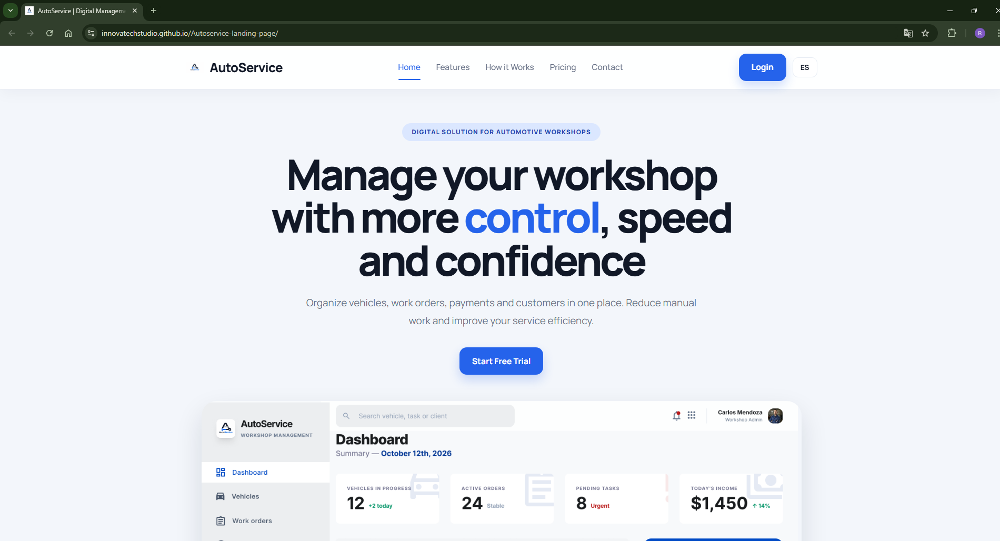
  
  <h5>Sección de Características y Planes de Suscripción</h5>
  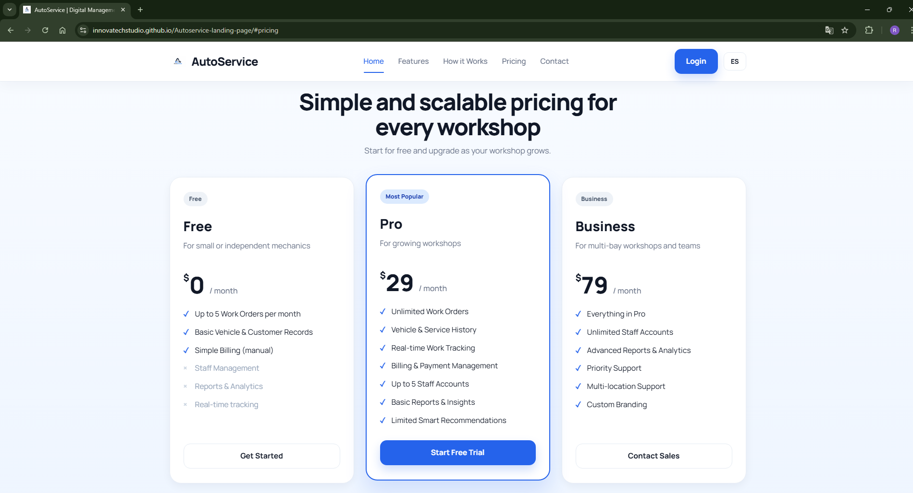

  <h5>Video de presentación y ejecución de la Landing Page</h5>
  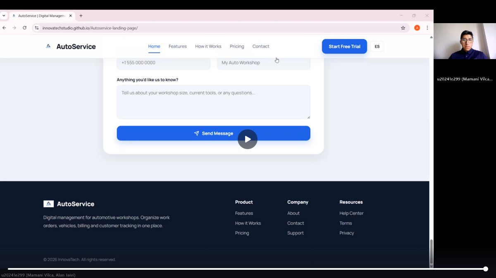
  
</div>

<p align="justify">
Para ilustrar la visualización y las interacciones logradas en este Sprint, se adjunta el enlace a un video demostrativo. En este registro se evidencia el funcionamiento de los componentes clave, la adaptabilidad del diseño en distintas resoluciones y la coherencia visual con los lineamientos de UI establecidos en el Capítulo IV del proyecto. 
</p>

URL video de ejecución de la Landing Page: <code>https://upcedupe-my.sharepoint.com/personal/u202421866_upc_edu_pe/_layouts/15/stream.aspx?id=%2Fpersonal%2Fu202421866%5Fupc%5Fedu%5Fpe%2FDocuments%2Flanding%2Devidence%2Emp4&nav=eyJyZWZlcnJhbEluZm8iOnsicmVmZXJyYWxBcHAiOiJPbmVEcml2ZUZvckJ1c2luZXNzIiwicmVmZXJyYWxBcHBQbGF0Zm9ybSI6IldlYiIsInJlZmVycmFsTW9kZSI6InZpZXciLCJyZWZlcnJhbFZpZXciOiJNeUZpbGVzTGlua0NvcHkifX0&ga=1&referrer=StreamWebApp%2EWeb&referrerScenario=AddressBarCopied%2Eview%2E1a416f63%2D5442%2D4400%2Db740%2D7fb6621fa42f</code>.

---

##### 5.2.1.6. Services Documentation Evidence for Sprint Review

<p align="justify">
Durante el Sprint 1, la implementación del contenedor central <b>API RESTful</b> (Backend) de AutoService fue programada estratégicamente para el siguiente sprint. Sin embargo, como parte del alcance funcional y técnico de este primer entregable, se integró y documentó el uso de un Web Service de terceros para habilitar la interactividad de la Landing Page.
</p>

<p align="justify">
Se implementó <b>EmailJS</b>, un servicio basado en la nube que permite el envío de correos electrónicos transaccionales mediante peticiones HTTP directamente desde el cliente (Client-side). Esto permite conectar el formulario de contacto de la Landing Page con la bandeja de entrada del equipo, asegurando la comunicación inmediata sin necesidad de desplegar un servidor intermedio.
</p>

<table style="width: 100%; border-collapse: collapse; text-align: justify; margin-bottom: 1.5em;">
  <thead>
    <tr style="background-color: #f2f2f2;">
      <th style="border: 1px solid #ddd; padding: 8px; text-align: center;">Servicio (Endpoint)</th>
      <th style="border: 1px solid #ddd; padding: 8px; text-align: center;">Método</th>
      <th style="border: 1px solid #ddd; padding: 8px; text-align: center;">Descripción</th>
      <th style="border: 1px solid #ddd; padding: 8px; text-align: center;">Payload / Parámetros</th>
    </tr>
  </thead>
  <tbody>
    <tr>
      <td style="border: 1px solid #ddd; padding: 8px; text-align: center;"><code>https://api.emailjs.com/api/v1.0/email/send</code></td>
      <td style="border: 1px solid #ddd; padding: 8px; text-align: center;"><strong>POST</strong></td>
      <td style="border: 1px solid #ddd; padding: 8px;">Procesa y envía los datos del formulario de contacto hacia el correo electrónico configurado por el equipo.</td>
      <td style="border: 1px solid #ddd; padding: 8px;"><code>service_id</code>, <code>template_id</code>, <code>user_id</code> (Public Key), <code>template_params</code> (nombre, email, mensaje)</td>
    </tr>
  </tbody>
</table>

<p align="justify">
A continuación, se adjunta la evidencia visual de la configuración de este servicio y la interacción exitosa utilizando datos de muestra enviados desde el formulario en producción:
</p>

<div align="center">
  <h5 style="margin-bottom: 0.5em;">Evidencia 1: Configuración del Servicio y Template en EmailJS</h5>
  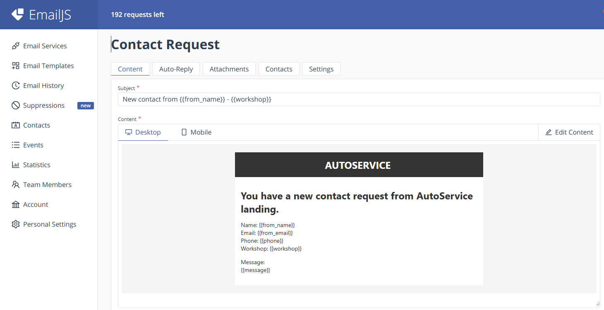
  
  <h5 style="margin-bottom: 0.5em;">Evidencia 2: Interacción exitosa (Correo de prueba recibido)</h5>
  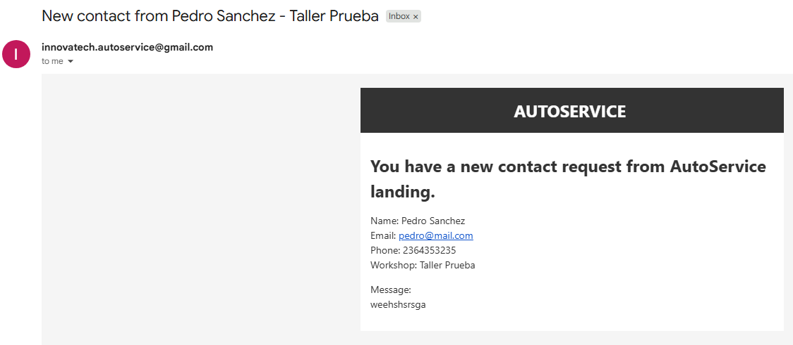
</div>

---

##### 5.2.1.7. Software Deployment Evidence for Sprint Review

<p align="justify">
En esta sección se detallan los procesos realizados para el despliegue de la solución durante el Sprint 1. El objetivo principal fue poner en producción la versión inicial de la Landing Page, permitiendo que el modelo de negocio de AutoService sea accesible para los interesados y potenciales clientes desde cualquier navegador.
</p>

<p align="justify">
Para el despliegue, se utilizó <b>GitHub Pages</b>, aprovechando su integración nativa con el repositorio de código fuente. El proceso consistió en los siguientes pasos estratégicos:
</p>

<ol style="text-align: justify;">
  <li><strong>Configuración del Entorno:</strong> Se configuró el repositorio específico para la Landing Page, asegurando que el archivo <code>index.html</code> se encuentre en la raíz para su correcto reconocimiento.</li>
  <li><strong>Activación del Servicio:</strong> Se habilitó GitHub Pages desde los ajustes del repositorio, seleccionando la rama <code>main</code> como fuente de despliegue.</li>
  <li><strong>Automatización (CI/CD):</strong> Se validó el flujo de trabajo automático mediante GitHub Actions, el cual dispara un nuevo despliegue cada vez que se realiza un merge a la rama principal.</li>
</ol>

<div align="center">

  <h5>Evidencia 1: Configuración de GitHub Pages en el Repositorio</h5>
    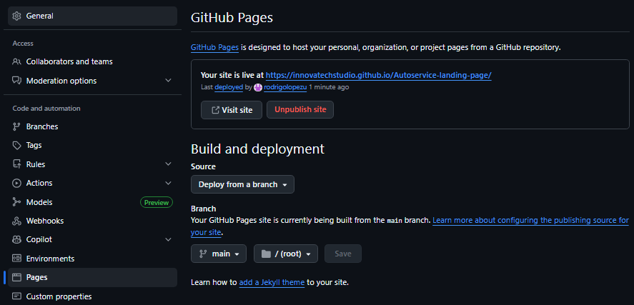
  <h5>Evidencia 2: Workflow para la Landing Page</h5>
    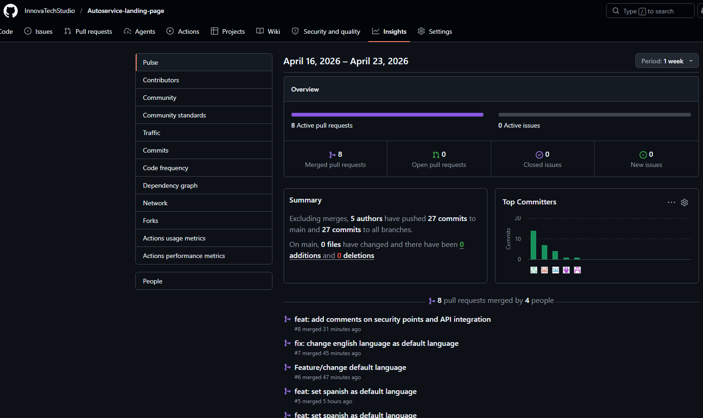
  <h5>Evidencia 3: Visualización de la Landing Page en Producción</h5>
    

</div><p align="justify">

La Landing Page se encuentra actualmente operativa en la siguiente URL: <code>https://innovatechstudio.github.io/Autoservice-landing-page/</code>.
</p>

---

##### 5.2.1.8. Team Collaboration Insights during Sprint

<p align="justify">
Durante el Sprint 1, el equipo mantuvo un flujo de trabajo altamente colaborativo y organizado, aplicando estrictamente la estrategia de control de versiones GitFlow. Para asegurar la calidad y revisión por pares, todo el desarrollo de la arquitectura, investigación de UX/UI y codificación de la Landing Page se trabajó en ramas independientes (<i>feature branches</i>). La integración del trabajo se realizó exclusivamente mediante <b>Pull Requests</b> hacia la rama <code>develop</code>, lo que fomentó la comunicación y revisión conjunta antes de consolidar los avances.
</p>

<p align="justify">
A continuación, se presentan los analíticos extraídos de GitHub (Insights) que evidencian la participación equitativa y constante de todos los miembros del equipo (<i>Aspect Leaders</i> y <i>Collaborators</i>) tanto en el repositorio principal de documentación como en el de la Landing Page.
</p>

<div align="center">
  <h5>Evidencia 1: Gráfico de Contribuciones por Miembro del Equipo</h5>
  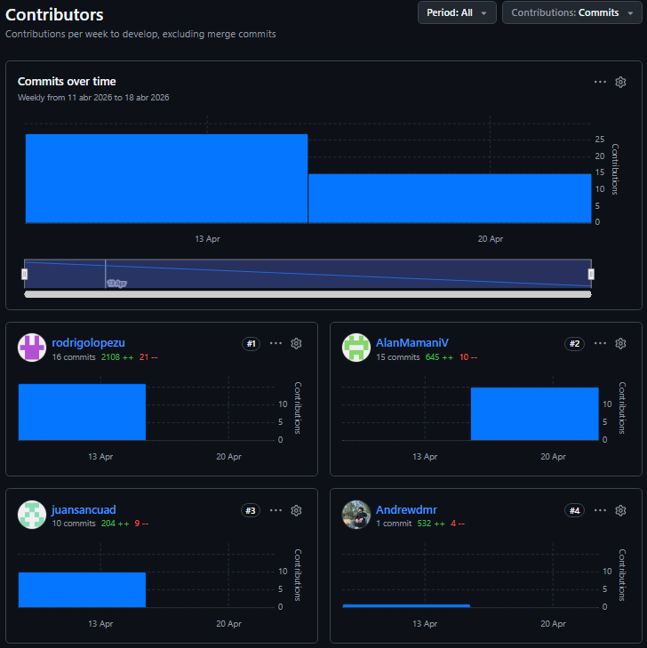
  
  <h5>Evidencia 2: Resumen de Actividad del Sprint (GitHub Pulse)</h5>
  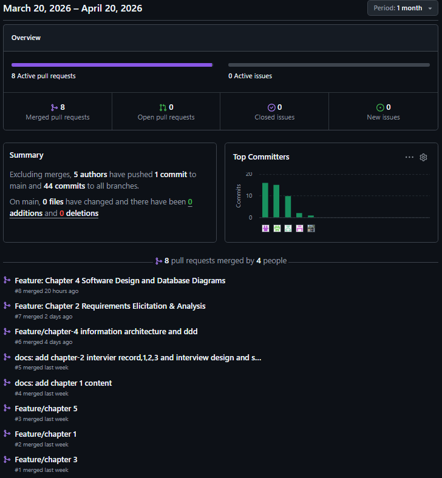

  <h5>Evidencia 3: Gestión Colaborativa mediante Pull Requests</h5>
  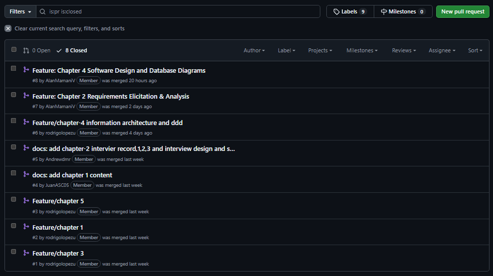
</div>

<p align="justify">
Como demuestran las gráficas y el resumen de actividad, la carga de trabajo se distribuyó de manera eficiente, logrando que el 100% de los integrantes registre commits significativos (alineados a <i>Conventional Commits</i>), gestione integraciones (Merges) y participe activamente en las fases de análisis, diseño e implementación temprana del producto.
</p>

---

## Conclusiones

### Conclusiones y Recomendaciones

<p align="justify">
A continuación, se presentan las conclusiones derivadas del desarrollo de los primeros cinco capítulos del proyecto AutoService, así como las recomendaciones estratégicas para la continuidad de los siguientes Sprints:
</p>

<p align="justify"><b>Conclusiones:</b></p>
<ul style="text-align: justify; margin-top: 0.5em; margin-bottom: 1.5em; padding-left: 1.5em;">
  <li style="margin-bottom: 0.8em;">
    <strong>Validación del modelo de negocio:</strong> La aplicación de la metodología Lean UX y el proceso de Needfinding permitió corroborar una necesidad crítica en el sector de mantenimiento automotriz: la falta de transparencia y la ineficiencia en la comunicación entre los talleres y los propietarios de vehículos. AutoService se perfila como una solución viable y centrada en el usuario para resolver este "pain point" identificado en los segmentos objetivo.
  </li>
  <li style="margin-bottom: 0.8em;">
    <strong>Solidez Arquitectónica:</strong> La utilización conjunta del EventStorming y el enfoque Domain-Driven Design (DDD) facilitó una transición estructurada desde la lógica de negocio hacia una arquitectura de software orientada a servicios (C4 Model). Esto asegura que el sistema sea escalable, mantenible y modular desde su concepción técnica inicial.
  </li>
  <li style="margin-bottom: 0.8em;">
    <strong>Eficacia en el Desarrollo Ágil:</strong> La ejecución exitosa del Sprint 1, evidenciada en el despliegue automático de la Landing Page mediante GitHub Pages y la integración de EmailJS, demuestra una correcta adopción de prácticas de Software Configuration Management, control de versiones con GitFlow y entrega continua por parte del equipo.
  </li>
  <li style="margin-bottom: 0.8em;">
    <strong>Gestion de Configuración robusta:</strong> La implementación de una gestión de configuración estructurada y estándares técnicos rigurosos permitió consolidar una base profesional para el desarrollo de AutoService. La adopción de la metodología GitFlow y arquitecturas modulares asegura que el proyecto sea una solución técnica viable y escalable, resolviendo la complejidad de integrar múltiples componentes bajo principios fundamentales de mantenibilidad y legibilidad internacional.
  </li>
</ul>

<p align="justify"><b>Recomendaciones:</b></p>
<ul style="text-align: justify; margin-top: 0.5em; margin-bottom: 1.5em; padding-left: 1.5em;">
  <li style="margin-bottom: 0.8em;">
    <strong>Mantenimiento de Estándares:</strong> Se recomienda mantener la rigurosidad en las ceremonias ágiles y en la revisión de Pull Requests para los siguientes sprints, garantizando que el código de la Web Application (Angular) y el Backend (Spring Boot) mantengan los estándares de calidad y convenciones definidos en la guía de estilos.
  </li>
  <li style="margin-bottom: 0.8em;">
    <strong>Validación Temprana:</strong> Realizar pruebas de usabilidad tempranas utilizando el prototipo interactivo en Figma y la Landing Page desplegada para recolectar retroalimentación de usuarios reales antes de iniciar la programación masiva de los módulos operativos del Core Domain.
  </li>
  <li style="margin-bottom: 0.8em;">
    <strong>Priorización Técnica:</strong> Se sugiere priorizar la implementación de la capa de seguridad (IAM Context) y la configuración de la persistencia de datos en el inicio del Sprint 2, para establecer las bases de autenticación requeridas por los distintos actores (Administrador, Mecánico y Cliente) de la plataforma.
  </li>
</ul>

---

## Bibliografía

<p align="justify" style="margin-left: 2em; text-indent: -2em; margin-bottom: 0.8em;">
  Angular Team. (2024). <i>Angular Documentation</i>. Google. <a href="https://angular.io/docs" target="_blank">https://angular.io/docs</a>
</p>

<p align="justify" style="margin-left: 2em; text-indent: -2em; margin-bottom: 0.8em;">
  Brandolini, A. (2021). <i>Introducing EventStorming: An act of deliberate collective learning</i>. Leanpub. <a href="https://leanpub.com/introducing_eventstorming" target="_blank">https://leanpub.com/introducing_eventstorming</a>
</p>

<p align="justify" style="margin-left: 2em; text-indent: -2em; margin-bottom: 0.8em;">
  Brown, S. (2020). <i>The C4 model for visualising software architecture</i>. C4 Model. <a href="https://c4model.com/" target="_blank">https://c4model.com/</a>
</p>

<p align="justify" style="margin-left: 2em; text-indent: -2em; margin-bottom: 0.8em;">
  Cucumber. (s.f.). <i>Gherkin Reference: Syntax and Keywords</i>. <a href="https://cucumber.io/docs/gherkin/" target="_blank">https://cucumber.io/docs/gherkin/</a>
</p>

<p align="justify" style="margin-left: 2em; text-indent: -2em; margin-bottom: 0.8em;">
  EmailJS. (2024). <i>EmailJS Official Documentation</i>. <a href="https://www.emailjs.com/docs/" target="_blank">https://www.emailjs.com/docs/</a>
</p>

<p align="justify" style="margin-left: 2em; text-indent: -2em; margin-bottom: 0.8em;">
  Evans, E. (2003). <i>Domain-Driven Design: Tackling Complexity in the Heart of Software</i>. Addison-Wesley Professional. <a href="https://www.oreilly.com/library/view/domain-driven-design-tackling/0321125215/" target="_blank">https://www.oreilly.com/library/view/domain-driven-design-tackling/0321125215/</a>
</p>

<p align="justify" style="margin-left: 2em; text-indent: -2em; margin-bottom: 0.8em;">
  GitHub. (2024). <i>GitHub Actions and GitHub Pages Documentation</i>. <a href="https://docs.github.com/" target="_blank">https://docs.github.com/</a>
</p>

<p align="justify" style="margin-left: 2em; text-indent: -2em; margin-bottom: 0.8em;">
  Gothelf, J., & Seiden, J. (2021). <i>Lean UX: Designing Great Products with Agile Teams</i> (3.ª ed.). O'Reilly Media. <a href="https://www.oreilly.com/library/view/lean-ux-3rd/9781492048596/" target="_blank">https://www.oreilly.com/library/view/lean-ux-3rd/9781492048596/</a>
</p>

<p align="justify" style="margin-left: 2em; text-indent: -2em; margin-bottom: 0.8em;">
  Spring Framework. (2024). <i>Spring Boot Reference Guide</i>. VMware. <a href="https://docs.spring.io/spring-boot/docs/current/reference/htmlsingle/" target="_blank">https://docs.spring.io/spring-boot/docs/current/reference/htmlsingle/</a>
</p>

<p align="justify" style="margin-left: 2em; text-indent: -2em; margin-bottom: 0.8em;">
  Swagger. (s.f.). <i>OpenAPI Specification and Documentation Tools</i>. <a href="https://swagger.io/" target="_blank">https://swagger.io/</a>
</p>

<p align="justify" style="margin-left: 2em; text-indent: -2em; margin-bottom: 0.8em;">
  Velneo. (2023). <i>Por qué usar un software de gestión ERP en talleres mecánicos</i>. <a href="https://velneo.com/blog/software-gestion-erp-talleres-mecanicos/" target="_blank">https://velneo.com/blog/software-gestion-erp-talleres-mecanicos/</a>
</p>

---

## Anexos

<div align="center">
  <h3 style="border-bottom: none;">Anexo A: Guía de Entrevistas por Segmento</h3>
</div>

<p align="justify">
A continuación, se presentan las guías de preguntas estructuradas utilizadas durante el proceso de <i>Requirements Elicitation</i> para los tres segmentos objetivo del proyecto. Estas preguntas fueron diseñadas para identificar puntos de dolor, procesos actuales y expectativas de los usuarios.
</p>

<p><strong>Segmento 1: Mecánicos Independientes</strong></p>
<table style="width: 100%; border-collapse: collapse; margin-bottom: 1.5em;">
  <thead>
    <tr style="background-color: #f2f2f2;">
      <th style="border: 1px solid #ddd; padding: 8px;">#</th>
      <th style="border: 1px solid #ddd; padding: 8px;">Pregunta de Entrevista</th>
    </tr>
  </thead>
  <tbody>
    <tr><td style="border: 1px solid #ddd; padding: 8px; text-align: center;">1</td><td style="border: 1px solid #ddd; padding: 8px;">¿Cuánto tiempo llevas trabajando como mecánico? ¿Podrías contarme cómo es un día típico en tu trabajo dentro del taller?</td></tr>
    <tr><td style="border: 1px solid #ddd; padding: 8px; text-align: center;">2</td><td style="border: 1px solid #ddd; padding: 8px;">¿Cómo registras actualmente la información de tus clientes, vehículos y trabajos?</td></tr>
    <tr><td style="border: 1px solid #ddd; padding: 8px; text-align: center;">3</td><td style="border: 1px solid #ddd; padding: 8px;">¿Cuáles son los principales problemas que enfrentas al gestionar los trabajos del taller?</td></tr>
    <tr><td style="border: 1px solid #ddd; padding: 8px; text-align: center;">4</td><td style="border: 1px solid #ddd; padding: 8px;">¿Cómo informas a tus clientes sobre el estado de sus vehículos?</td></tr>
    <tr><td style="border: 1px solid #ddd; padding: 8px; text-align: center;">5</td><td style="border: 1px solid #ddd; padding: 8px;">¿Qué tan seguido te llaman o escriben clientes para preguntar por el estado de su auto?</td></tr>
    <tr><td style="border: 1px solid #ddd; padding: 8px; text-align: center;">6</td><td style="border: 1px solid #ddd; padding: 8px;">¿Crees que tus clientes confían en el servicio que brindas? ¿Por qué?</td></tr>
    <tr><td style="border: 1px solid #ddd; padding: 8px; text-align: center;">7</td><td style="border: 1px solid #ddd; padding: 8px;">¿Llevas un historial de los trabajos realizados por vehículo o cliente?</td></tr>
    <tr><td style="border: 1px solid #ddd; padding: 8px; text-align: center;">8</td><td style="border: 1px solid #ddd; padding: 8px;">Si existiera una plataforma que te ayude a organizar tus trabajos y mostrar el progreso al cliente, ¿la usarías? ¿Por qué?</td></tr>
    <tr><td style="border: 1px solid #ddd; padding: 8px; text-align: center;">9</td><td style="border: 1px solid #ddd; padding: 8px;">¿Qué funcionalidad te sería más útil en una herramienta digital para tu trabajo diario?</td></tr>
  </tbody>
</table>

<p><strong>Segmento 2: Talleres Automotrices - Empresas</strong></p>
<table style="width: 100%; border-collapse: collapse; margin-bottom: 1.5em;">
  <thead>
    <tr style="background-color: #f2f2f2;">
      <th style="border: 1px solid #ddd; padding: 8px;">#</th>
      <th style="border: 1px solid #ddd; padding: 8px;">Pregunta de Entrevista</th>
    </tr>
  </thead>
  <tbody>
    <tr><td style="border: 1px solid #ddd; padding: 8px; text-align: center;">1</td><td style="border: 1px solid #ddd; padding: 8px;">¿Cuántas personas trabajan en su taller y cómo están organizadas sus funciones?</td></tr>
    <tr><td style="border: 1px solid #ddd; padding: 8px; text-align: center;">2</td><td style="border: 1px solid #ddd; padding: 8px;">¿Cómo gestionan actualmente los clientes, vehículos y órdenes de trabajo?</td></tr>
    <tr><td style="border: 1px solid #ddd; padding: 8px; text-align: center;">3</td><td style="border: 1px solid #ddd; padding: 8px;">¿Qué problemas tienen al coordinar el trabajo entre mecánicos o áreas?</td></tr>
    <tr><td style="border: 1px solid #ddd; padding: 8px; text-align: center;">4</td><td style="border: 1px solid #ddd; padding: 8px;">¿Cómo hacen seguimiento al estado de cada vehículo en reparación?</td></tr>
    <tr><td style="border: 1px solid #ddd; padding: 8px; text-align: center;">5</td><td style="border: 1px solid #ddd; padding: 8px;">¿Tienen algún sistema para medir ingresos, servicios realizados o rendimiento del taller?</td></tr>
    <tr><td style="border: 1px solid #ddd; padding: 8px; text-align: center;">6</td><td style="border: 1px solid #ddd; padding: 8px;">¿Cómo se comunican con los clientes sobre el avance del servicio?</td></tr>
    <tr><td style="border: 1px solid #ddd; padding: 8px; text-align: center;">7</td><td style="border: 1px solid #ddd; padding: 8px;">¿Han tenido problemas de desconfianza o reclamos por parte de clientes?</td></tr>
    <tr><td style="border: 1px solid #ddd; padding: 8px; text-align: center;">8</td><td style="border: 1px solid #ddd; padding: 8px;">Si existiera un sistema que te permita gestionar tu taller y mostrar a tus clientes el progreso en tiempo real, ¿lo usarías?</td></tr>
    <tr><td style="border: 1px solid #ddd; padding: 8px; text-align: center;">9</td><td style="border: 1px solid #ddd; padding: 8px;">¿Qué funcionalidades consideras indispensables en un sistema de gestión para talleres?</td></tr>
  </tbody>
</table>

<p><strong>Segmento 3: Clientes - Propietarios de vehículos</strong></p>
<table style="width: 100%; border-collapse: collapse; margin-bottom: 1.5em;">
  <thead>
    <tr style="background-color: #f2f2f2;">
      <th style="border: 1px solid #ddd; padding: 8px;">#</th>
      <th style="border: 1px solid #ddd; padding: 8px;">Pregunta de Entrevista</th>
    </tr>
  </thead>
  <tbody>
    <tr><td style="border: 1px solid #ddd; padding: 8px; text-align: center;">1</td><td style="border: 1px solid #ddd; padding: 8px;">¿Podrías contarme sobre la última vez que llevaste tu vehículo a un taller? ¿Qué servicio necesitabas?</td></tr>
    <tr><td style="border: 1px solid #ddd; padding: 8px; text-align: center;">2</td><td style="border: 1px solid #ddd; padding: 8px;">Durante el servicio, ¿cómo te informaban sobre el estado de tu vehículo?</td></tr>
    <tr><td style="border: 1px solid #ddd; padding: 8px; text-align: center;">3</td><td style="border: 1px solid #ddd; padding: 8px;">¿Tuviste alguna duda o preocupación mientras tu auto estaba en el taller? ¿Cuál fue?</td></tr>
    <tr><td style="border: 1px solid #ddd; padding: 8px; text-align: center;">4</td><td style="border: 1px solid #ddd; padding: 8px;">¿Alguna vez has sentido desconfianza hacia un taller? ¿Qué situación generó eso?</td></tr>
    <tr><td style="border: 1px solid #ddd; padding: 8px; text-align: center;">5</td><td style="border: 1px solid #ddd; padding: 8px;">¿Te gustaría poder ver el progreso de la reparación de tu auto en tiempo real desde tu celular o computadora? ¿Por qué?</td></tr>
    <tr><td style="border: 1px solid #ddd; padding: 8px; text-align: center;">6</td><td style="border: 1px solid #ddd; padding: 8px;">¿Qué tipo de información te gustaría ver mientras tu vehículo está en el taller?</td></tr>
    <tr><td style="border: 1px solid #ddd; padding: 8px; text-align: center;">7</td><td style="border: 1px solid #ddd; padding: 8px;">¿Qué tan cómodo te sientes usando plataformas digitales o aplicaciones para consultar información de servicios?</td></tr>
    <tr><td style="border: 1px solid #ddd; padding: 8px; text-align: center;">8</td><td style="border: 1px solid #ddd; padding: 8px;">Si existiera una plataforma que te permita ver el estado de tu vehículo, costos y trabajos realizados, ¿la usarías? ¿Qué te gustaría que incluya?</td></tr>
  </tbody>
</table>

<div align="center">
  <h3 style="border-bottom: none;">Anexo B: Gestión del Product Backlog en Jira Software</h3>
</div>

<p align="justify">
<b>Referencia:</b> InnovaTech Studio. (2026). <i>Product Backlog de AutoService</i>. Atlassian Jira Software. <a href="https://innovatechstudio.atlassian.net/jira/software/projects/ASS/boards/1" target="_blank">https://innovatechstudio.atlassian.net/jira/software/projects/ASS/boards/1</a>
</p>

<p align="justify">
Se presenta la gestión de historias de usuario, épicas y tareas técnicas mediante la herramienta Jira Software. El tablero refleja la priorización de los ítems del backlog y el estado de avance de las tareas planificadas para el Sprint 1.
</p>

<div align="center">
  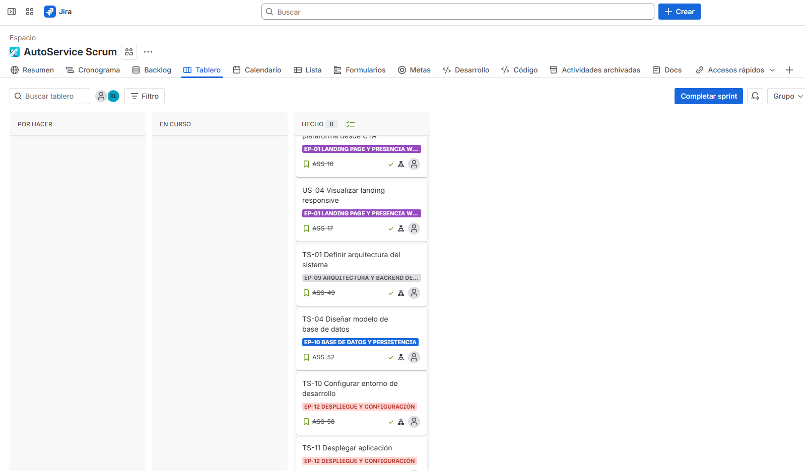
</div>

<br>

<div align="center">
  <h3 style="border-bottom: none;">Anexo C: Prototipado y Diseño de Interfaces en Figma</h3>
</div>

<p align="justify">
<b>Referencia:</b> InnovaTech Studio. (2026). <i>Design System y Mockups de AutoService</i>. Figma. <a href="https://www.figma.com/design/rOJ6k8HLfI85lI8Xsik6TN/AUTOSERVICE-AW?node-id=1-2&t=aYBkJzt0CQrAU6qH-1" target="_blank">https://www.figma.com/design/rOJ6k8HLfI85lI8Xsik6TN/AUTOSERVICE-AW</a>
</p>

<p align="justify">
Se adjunta el diseño de alta fidelidad de la plataforma, incluyendo el Design System (colores, tipografías y componentes), los wireframes y los mockups interactivos que definen la experiencia de usuario (UX) y la interfaz (UI) de AutoService.
</p>

<div align="center">
  <h5>Captura del Diseño de Interfaces - Figma</h5>
  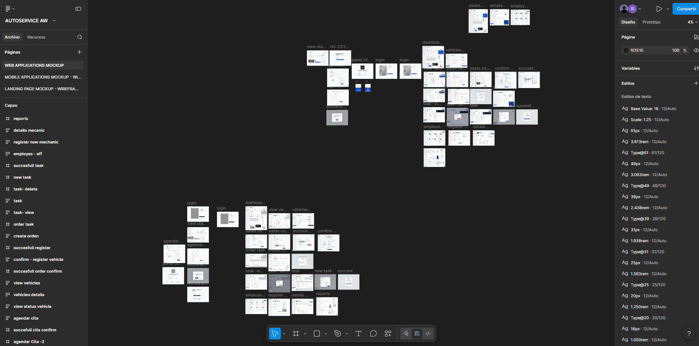
</div>

<br>

<div align="center">
  <h3 style="border-bottom: none;">Anexo D: Modelado de Dominio y Flujos en Miro</h3>
</div>

<p align="justify">
<b>Referencia:</b> InnovaTech Studio. (2026). <i>EventStorming y User Flows de AutoService</i>. Miro. <a href="https://miro.com/welcomeonboard/ME8rSzFiTWh0M3k1SC80N0RZelVpKzBCdk5LNTZsTzhDSEJORE4ybE5ta25rUVd1ZFVNZndDS1ExZm0xSkdNVHFuc3E3QTN1QzQrcFFzYnUrYzN1NE5HTFdLQ1ZtbnNpYUN3cWJiblZ5dVdCQS9rY3dnSjlBdnNPSDh4Tk41alBnbHpza3F6REdEcmNpNEFOMmJXWXBBPT0hdjE=?share_link_id=615806054520" target="_blank">Enlace al tablero interactivo en Miro</a>
</p>

<p align="justify">
Se presenta el modelado colaborativo del dominio del negocio mediante la técnica de EventStorming, así como los diagramas de flujo de usuario (User Flows) que detallan la navegación lógica para los distintos actores del sistema.
</p>

<div align="center">
  <h5>Captura del Tablero de Modelado - Miro</h5>
  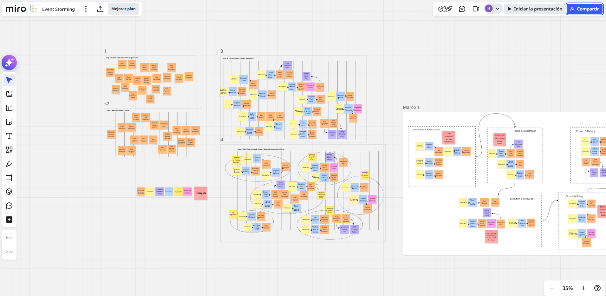
</div>
